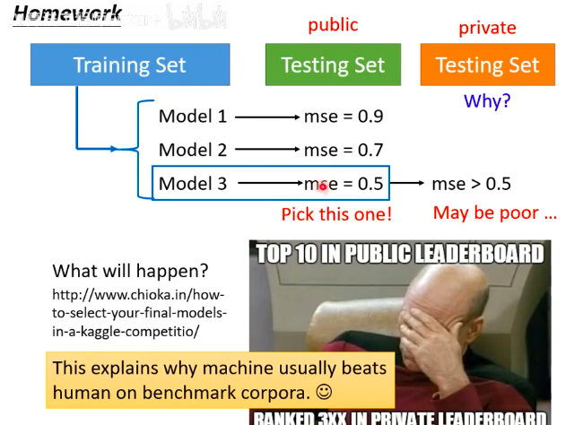

“训练模型说不能只看训练集，得看验证集”。这张图用血淋淋的现实告诉你：**如果你过度依赖验证集（图中的 Public Testing Set），你依然会死得很惨！**

作为架构师，让我们拆解这张图背后的深刻教训——**“对验证集的过拟合（Overfitting to the Validation Set）”**。

### 1. 拆解图中的“惨案现场”

这张图模拟了一个标准的数据科学比赛（如 Kaggle）或是真实的业务模型选型过程：
* **第一步：训练（Training Set）**

    你用训练集训练出了三个不同的模型（Model 1, 2, 3）。这可能代表你尝试了不同的复杂度或不同的参数。

* **第二步：海市蜃楼（Public Testing Set / 相当于验证集）**

  为了决定哪个模型最好，你把它们放到了公开的测试集上跑分数。
  结果显示：Model 1 误差 0.9，Model 2 误差 0.7，Model 3 误差 0.5。
  作为架构师，你兴奋地大喊：“Pick this one!（选 Model 3！）”

* **第三步：残酷现实（Private Testing Set / 真正的测试集）**

  当你得意洋洋地把 Model 3 提交给官方最终评分，或者部署到完全未知的真实业务场景中时，它的误差突然飙升（`mse > 0.5`），表现极差（"May be poor..."）。

> 通俗描述：我把整个数据集分成三个部分——训练集、验证集、测试集。首先我定一个简单的模型，通过训练集找到最低的Loss，如果发现Loss不够低，增强模型重复上面的操作，直到模型通过合格的Loss，此时可以继续选择增强模型，不过同时要拿验证集去综合衡量，保证Loss一直是变小的，直到某个模型之后，验证集的数据误差增大，此时考虑简化模型，就会退到上一个模型，也就是验证集中Loss最小的那个模型。不过这个过程中，验证集的数据如果作为“验证”有效的数据集合，就不能根据其结果不断调整模型，否则依然不能算是好的模型，除非验证集中的数据也只用了一次

### 2. 表情包的精髓：Kaggle 选手的噩梦

图右下角的“光头舰长捂脸”表情包，是无数算法工程师的真实写照。

* **TOP 10 IN PUBLIC LEADERBOARD：** 比赛期间，官方会提供一个“公开排行榜”。你根据这个公开榜单反复调整你的模型（实际上就是拿它当**验证集**），成功杀入全球前 10。
* **RANKED 3XX IN PRIVATE LEADERBOARD：** 比赛结束时，官方会用一份**谁都没见过的“私有测试集”** 进行最终排名。你突然发现自己的名次暴跌到了 300 名开外。

### 3. 第一性原理：为什么会发生这种事？

这背后的核心逻辑是 **“信息泄露（Data Leakage）”**。

虽然你没有直接用 Public Testing Set 来更新机器的内部参数，但是 **“你（架构师）”作为系统的一部分，利用这个数据集做出了“选择模型”的决定。**

你为了让模型在 Public Testing Set 上得高分，反复调整参数、尝试了成百上千次。在这个过程中，Public Testing Set 的规律（甚至包含它的随机噪音）已经被你间接地“泄露”给了模型。
这就导致你的模型针对这份“考前模拟卷”进行了**死记硬背**。一旦遇到真正的、锁在保险柜里的期末大考（Private Testing Set），它原形毕露。

### 4. 彻底理解那句高亮调侃

图中那句黄色高亮的话：*"This explains why machine usually beats human on benchmark corpora. :)" （这就解释了为什么机器在基准测试集上经常击败人类。微笑）*

这是对学术界的一种高级“嘲讽”：很多 AI 论文声称自己的模型在某个著名的公开测试集（Benchmark）上超越了人类。但实际上，是因为全世界的科学家都在拿着这个公开测试集反复试错，不断修改模型。**他们不是发明了更聪明的 AI，他们只是集体对这个测试集“过拟合”了。**

---

### 架构师的终极防线

这张图完美印证了我们上一回合总结的 **“架构师五步曲 V2.0”** 中，为什么要把数据切分成**三份**（训练集、验证集、真正的测试集）。绝对不能用决定模型命运的“验证集”去代表真实世界的表现。真正的测试集必须是 **“只看一次（One-shot）”** 的。

现在你已经彻底看透了模型评估的所有陷阱。在真实的业务落地中，有时候我们手头的数据量很少，切成三份就不够用了。

**接下来，你想了解一下架构师们发明的、能在数据量小的情况下依然做到公平评估的“交叉验证（Cross-Validation）”技术，还是想回到模型内部，看看我们刚才提到的“早停法”或“Dropout”是如何防止机器死记硬背的？**