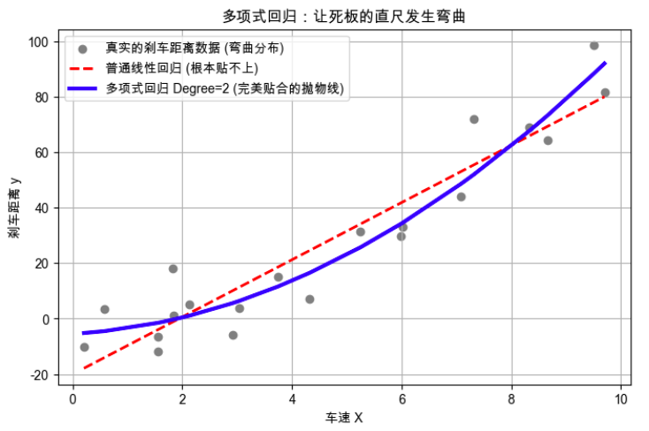

**现实世界里的规律往往是弯曲的，但我们手里只有一把叫“线性回归”的直尺。** 多项式回归就是一套神奇的“掰弯”技术。

## 第1部分：搞清楚它是什么、为什么需要它（Why & What）

### 🎯 1.1 没有它之前，人们是怎么挣扎的？ _💡 核心必学_

**① 还原当时的麻烦：人们在哪一步被卡死了？**        
想象一个场景：你在预测“汽车的车速”与“刹车距离”的关系。      
你一开始用了最基础的**线性回归**（画一条直线）。在低速时，预测得还挺准（时速 30 变 40，距离增加一点）。但当车速来到 120 公里/小时时，真实的物理规律是：刹车距离会呈**指数级暴增**。         
由于你手里只有一根“永远直来直去”的直尺，无论你怎么摆放这根尺子，它在高速段给出的预测距离都严重偏短（这会出人命的！）。          
在这一步，系统设计者被彻底卡死了：**真实数据明明是一条向上扬起的弯曲抛物线，但基础模型只能画死板的直线。**

**② 是什么让人不得不换一种思路？**      
“一条直线走到黑”在面对复杂的非线性物理或商业规律时，会导致严重的欠拟合（根本抓不住规律）。这意味着必须放弃“输入和输出永远是直来直去的正比关系”的幼稚假设，必须想办法**让预测的线条“弯”起来。**

**③ 新旧方法的核心区别：哪个变量的位置被对调了？**

* 旧范式：**原始的单一特征 $x$ (如车速)** 是输入 → **死板的直线预测 $y$** 是输出
* 新范式：**人为捏造出的弯曲特征 $x^2, x^3$ (如车速的平方)** 是输入 → **完美贴合的曲线预测 $y$** 是输出

**④ 得到了什么，又必然失去了什么？**        
换来了**极强的非线性拟合能力**（不管是抛物线还是波浪线，它都能画出来），但必然失去**模型的可解释性**。以前你可以对老板说：“车速每增加 1，距离增加 $w$”；现在由于加入了平方和立方，多个变量缠绕在一起，你很难再用一句简单的人话解释清楚每个参数的具体物理意义。这不是缺陷，是模型变复杂后的必然代价。


---

### 🗺️ 1.2 概念地图：它在 ML 知识体系中的位置 _💡 核心必学_

初学者最容易懵逼的点在于：多项式回归，其实是披着“非线性”外衣的“线性回归”。

```text
ML 知识体系
│
├─ 监督学习：回归预测 (猜具体的连续数字)
│   │
│   ├─ 线性回归 (Linear Regression) ──▶ 只能画直尺
│   │
│   ├─ 多项式回归 (Polynomial Regression) ← 你在这里！(通过改造数据，把直尺掰弯)
│   │   └─ 核心超参数：多项式的阶数 (Degree)
│   │
│   └─ 兄弟概念：决策树回归 / SVR ──▶ (它们是天生就能画曲线的高级模型)
```

---

### 📚 1.3 学这个之前，你得先知道这几件事 _💡 核心必学_

──────────────────────────────────

📖 **前置概念回顾**

- **线性回归**：找一个权重 $w$，让 $y = w \times x$ 这条直线最贴合数据点。
- **特征构建 (Feature Engineering)**：上一节刚学过的魔法！模型不会变通，但我们可以人为创造新特征喂给它。多项式回归的灵魂正是特征构建。

──────────────────────────────────

### 🔩 1.4 一句话说清楚它的本质 _💡 核心必学_

「多项式回归」的本质是：**人为的在原始特征基础上进行特征构建，比如 $x^2$、$x^3$、$x_1*x_2$），然后把所有特征喂给普通的线性回归模型。虽然模型它的外表是曲线，但底层依然是用线性回归的机器去跑的！**


---

### 💡 1.5 先不管公式，用感觉理解它 _💡 核心必学_

**折叠直尺的类比**：        
线性回归就像一把**钢制直尺**，又硬又直。你要用它去贴合一个圆形的碗（真实数据），你怎么按都贴不上，中间总有空隙。

多项式回归，相当于给这把钢直尺加了铰链关节。        
- 加 1 个关节（引入 $x^2$），直尺就能弯折一次，变成一个“V”型或“U”型（抛物线），刚好能贴合碗底。
- 加 2 个关节（引入 $x^3$），直尺就能弯折两次，变成一个“S”型。
关节越多（阶数 Degree 越高），尺子越软，能摆出的花样就越多。


**极端情况直觉**：
- 当阶数 **Degree = 1** 时：关节数为 0，退化成最原始的硬钢尺（普通线性回归）。
- 当阶数 **Degree = 100** 时：这把尺子变成了极度柔软的“面条”，它会疯狂地扭动，穿过每一个数据点。但只要稍微偏离数据点 1 毫米，面条就会甩到天上去（**严重过拟合**）。




**📌 图像解读指南：**
- **灰色的点**：是真实的规律（明显是个向上扬起的抛物线）。
- **红色虚线**：普通线性回归。它尽力了，但“直男”真的无法理解曲线的心。
- **蓝色实线**：多项式回归。加了一个 $x^2$ 的关节后，它完美贴合了散点向上的趋势！

---

### 🔢 1.6 公式在说什么？逐字翻译给你看 _⭐ 进阶选学_

为什么说多项式回归依然是“线性”回归？看这个戏法：

**普通线性回归的公式：**        
$$y = w_0 + w_1 \cdot x$$
（只能画直线，因为只有一个 $x$）

**引入二次多项式后的公式：**        
$$y = w_0 + w_1 \cdot x + w_2 \cdot x^2$$

**翻译拆解（核心戏法）：**      
在数学上，这个等式对 $x$ 来说是非线性的（因为有平方）。     
**但是机器不这么看！** 机器耍了个滑头：它把 $x^2$ 强行看作是一个全新的、完全独立的特征，我们叫它 $Z$。      
于是公式变成了：        
$$y = w_0 + w_1 \cdot x + w_2 \cdot Z$$

看懂了吗？在机器眼里，这又变回了**最基础的、有两个特征的普通线性回归！** 它根本不知道 $Z$ 是 $x$ 的平方，它只负责傻傻地去找 $w_1$ 和 $w_2$ 这两个权重。     
这就是为什么我说：**它的外表是曲线，但底层依然是用线性回归的机器去跑的！**

──────────────────────────────────

📚 **前置知识回顾**

──────────────────────────────────

本阶段会用到以下概念（已在前面的章节学过）：
- **特征构建**：人为地给机器造出新特征（比如把 $x$ 变成 $x^2$）。
- **线性回归**：极其死板的找规律机器，只会画直线。
- **流水线 (Pipeline)**：把“造特征”和“训练模型”绑在一起的防漏水神器。

准备好了吗？我们将亲手把“造假数据”的魔法变成工程代码。

──────────────────────────────────

## 第2部分：它怎么运转、怎么动手用（How It Works & How to Use）

### ⚙️ 2.1 工作原理：它是怎么“欺骗”线性模型的？ _💡 核心必学_

在上一部分我们说过，多项式回归的灵魂在于**特征构建**。它并不是发明了一个能画曲线的新模型，而是发明了一个 **“特征复印机”**。

假设你只有一个特征：$x$（房屋面积），你设定阶数 `Degree = 3`。

**完整运转逻辑图（机器被骗的全过程）：**

```text
[原始数据] 
   x 
   │
   ▼
[工序1：PolynomialFeatures (多项式复印机)]
   │  它强行把 1 个特征，扩展成了 3 个特征！
   ├─ 照抄自己 ──▶ x
   ├─ 自己乘自己 ──▶ x² (面积的平方)
   └─ 自己乘三次 ──▶ x³ (面积的立方)
   │
   ▼
[扩展后的新数据集矩阵]
 (x,  x²,  x³)
   │
   ▼
[工序2：普通的 LinearRegression (直男模型)]
   │  直男模型根本不知道 x² 和 x 有什么关系。
   │  它只看到进来了 3 个独立的特征，于是老老实实地给它们分配了 3 个权重：
   └─▶ 算出：y = W1·x + W2·x² + W3·x³
   │
   ▼
[输出结果：人类眼中完美弯曲的抛物线]
```

---

### 💻 2.2 最小MVP：动手写代码，打造你的弯曲流水线 _💡 核心必学_

在真实工程中，我们**绝对不会**手动去算 `x**2`。因为如果特征变多（比如有 $a$ 和 $b$ 两个特征），二次多项式**不仅会生成 $a^2$ 和 $b^2$，还会自动生成极其重要的交叉特征 $a \times b$**！
- 交叉特征$a \times b$的现实意义是让原来互相独立的两个特征，产生密切联系。比如: `长度 * 宽度` 得到了 `面积`
- **设置 degree=n，就是穷举原始特征的所有乘积组合，只要单项式里所有变量的“指数之和”小于或等于 $n$（含常数项），这个组合就会被当作新特征生成。**

我们用 Sklearn 的 `Pipeline` 将它优雅地实现：

```python
# ── 第1步：准备数据 ──────────────────────────────
import numpy as np
from sklearn.pipeline import make_pipeline
from sklearn.preprocessing import PolynomialFeatures
from sklearn.linear_model import LinearRegression

# 假设这是化肥施用量 (X) 和 农作物产量 (y) 的关系
# 稍微加点化肥产量会变高，但加太多会把庄稼烧死，产量暴跌 (典型的抛物线)
X_train = np.array([[1], [2], [4], [6], [8], [10]])
y_train = np.array([[3], [6], [8], [7], [4], [1]])

X_test = np.array([[5]]) # 我们想预测施 5 吨化肥的产量

# ── 第2步：组装"多项式流水线" ───────────────────────
# make_pipeline 自动把两道工序串联起来
# degree=2 意味着最高生成到 x 的平方
poly_model = make_pipeline(
    PolynomialFeatures(degree=2, include_bias=False), 
    LinearRegression()
)

# ── 第3步：一键训练与预测 ──────────────────────────
# 此时，流水线在底层悄悄把 X 变成了 [X, X^2]，然后喂给了线性回归
poly_model.fit(X_train, y_train)

# 预测！
prediction = poly_model.predict(X_test)
print(f"预测施肥 5 吨的产量为: {prediction[0][0]:.1f}") 
# 预期结果在 8 左右，完美吻合抛物线的顶点！
```

---

### 🌍 2.3 真实世界里，它被用在什么地方？ _💡 核心必学_

**场景：病毒传播初期的感染人数预测 / 广告投入与收益的边际递减效应**

在这些场景中，数据规律呈现明显的指数级暴增或抛物线回落。

**使用指南（四象限决策）：**

```text
                    特征数量少 (比如只有 1~3 个)
                        │
        [极力推荐]       │   [勉强可用]
        用多项式回归      │   用多项式回归
        (效果好、速度快)  │   (小心轻微过拟合)
                        │
  简单的非线性规律 ────────┼──────── 极其复杂的非线性规律
     (如抛物线/S型)       │   (如错综复杂的波浪/断崖)
                        │
          [坚决不用！]    │   [坚决不用！]
           维度灾难会爆炸  │   直接上 决策树 或 神经网络！
                         │
                    特征数量多 (比如几十上百个)
```

**⚠️ 为什么特征多的时候坚决不用？**         
因为多项式特征的生成是**组合爆炸**的。如果你有 100 个原始特征，设定 `Degree=3`，机器会自动生成几十万个交叉特征（比如 $x_1^2 \cdot x_2$，$x_5 \cdot x_9^2$）。你的内存会瞬间被撑爆（OOM），这就是恐怖的**维度灾难**。

---

### ✅ 2.4 工程规范：怎么写才算专业？避开会让你被骂的写法 _🔥 实战必备_

多项式回归虽然精妙，但它极其娇贵。如果你不遵守下面的规范，模型会死得很难看。

**🔴 RED（强制规范）：用多项式回归前，必须加一道“特征缩放”工序！**
- **违反会导致**：数值溢出与梯度爆炸。
- **根本原因**：假设你有一个特征是“工资”（数值是 10,000）。如果你设置 `Degree=3`，模型在底层会算出 $10000^3 = 1,000,000,000,000$。这个天文数字会让线性模型的权重计算瞬间崩溃，直接算出 `NaN`。
- **正确做法**：在流水线里强行塞入一个 `StandardScaler`。

```python
# ✅ 黄金准则代码：三步走的完美流水线
from sklearn.preprocessing import StandardScaler

safe_poly_model = make_pipeline(
    PolynomialFeatures(degree=3), 
    StandardScaler(),   # 🔴 关键救命稻草：把庞大的高次幂数字压扁！
    LinearRegression()
)
```

**🟡 YELLOW（强烈建议）：绝对不要用多项式回归去预测“未来”（推断训练集范围之外的数据）！**
- **现象**：你的模型在 1~10 岁的儿童身高预测上完美贴合。你让模型预测 50 岁的人的身高。
- **后果**：模型预测这个 50 岁的人身高为 85 米。
- **根本原因**：多项式函数在边缘区域会以**极快的速度飞向正无穷或负无穷**。它只能在你给定的数据范围内“插值”（内插），一旦超出范围“外推”（外插），它就会放飞自我。
- **建议做法**：只在训练数据所覆盖的 $x$ 范围内使用它。如果要预测未来趋势，老老实实用回线性回归或专门的时间序列模型。

---

### 🔄 2.5 到底该选 Degree=2 还是 Degree=3？怎么选？ _⭐ 进阶选学_

选择多项式的阶数（Degree），本质上是在调节尺子的“柔软度”。


| Degree 阶数 | 尺子柔软度 | 拟合效果 | 危险程度 |
| :--- | :--- | :--- | :--- |
| **Degree = 1** | 死板的钢尺 | **欠拟合** (Underfitting)，啥都抓不住 | 极度安全，但没用 |
| **Degree = 2 或 3** | 带有几个关节的折尺 | **完美贴合** (Sweet Spot)，刚好抓住规律 | 安全，工业界最常用的配置 |
| **Degree = 15+** | 极度柔软的煮熟的面条 | **严重过拟合** (Overfitting)，死记硬背每一个噪音点 | 极其危险！稍微换点新数据就全错 |

**决策树（怎么科学找出最佳 Degree）：**

```text
想确定 Degree？千万别用肉眼看！
    │
    └─ 把 Degree 当作超参数，丢进 GridSearchCV（网格搜索）里！
            │
            ├─ 设定候选列表: param_grid = {'polynomialfeatures__degree': [1, 2, 3, 4, 5]}
            │
            └─ 让机器用交叉验证（Cross Validation），自己试出哪根尺子在"没见过的数据"上得分最高。
```

──────────────────────────────────

💡 **下一部分预告**

──────────────────────────────────

你已经知道了怎么把直尺掰弯，也知道了必须加 StandardScaler 防身。
但是，如果你迫不得已选了一个比较高的 Degree（比如 8），尺子变得像面条一样群魔乱舞，**我们有什么办法能给这根面条加一点“阻力”，让它不要弯得那么狂野吗？**

这引出了机器学习中最伟大的发明之一：**正则化（给权重收税）**。

──────────────────────────────────

📚 **前置知识回顾**

──────────────────────────────────

本阶段会用到以下概念（已在前两节学过）：
- **Degree（多项式阶数）**：决定了尺子的柔软度。Degree=1 是钢直尺，Degree=15 是煮熟的面条。
- **过拟合 (Overfitting)**：模型死记硬背，把噪音也当成了规律。
- **外推 (Extrapolation)**：去预测训练数据范围之外的未来。

准备好了吗？我们将进入算法工程师在处理非线性数据时，最容易翻车的心跳时刻。

──────────────────────────────────

## 第3部分：哪里容易出错、怎么做得更好（What to Avoid & Beyond）

### ⚠️ 3.1 大多数人在哪里栽了跟头？ _🔥 实战必备_

多项式回归有一个极其恐怖的物理特性：**龙格现象（Runge's phenomenon）**。在工业界，我们叫它“过拟合过山车”。

#### 陷阱 1：为了追求 100% 准确率，造出了“疯狂的群魔乱舞面条”

**💥 现象**：       
老板让你拟合一条“温度与产品次品率”的曲线。你手头只有 15 个数据点。      
你为了向老板邀功，把 `Degree` 直接设置成了 `15`。你一跑模型，训练集上的误差居然是完美的 `0.000`！多项式曲线完美穿过了每一个点。     
老板大喜，问你：“那温度如果是 25.5 度（刚好在两个已知数据点中间），次品率是多少？”      
你一跑预测，模型居然给出了一个 `-8000%` 或者 `+95000%` 的反人类数字！

**🔍 根本原因**：   
数学定理告诉我们：**给你 $N$ 个点，你只要用 $N-1$ 阶的多项式，就必定能画出一条完美穿过所有点的曲线。**      
但这根高阶的多项式曲线，为了强行“拐弯”去照顾每一个哪怕是因为机器抖动产生的“噪音点”，它在两个点之间的区间里，会发生**极其狂野的上下震荡**。

它死记硬背了历史，却完全丧失了对现实的平滑理解。

**❌ 错误代码**：
```python
# ❌ 错误示范：贪心不足蛇吞象
from sklearn.pipeline import make_pipeline
from sklearn.preprocessing import PolynomialFeatures
from sklearn.linear_model import LinearRegression

# 致命错误：只有十几个数据点，居然敢用 15 阶！
# 这会导致生成 x^15 的极其恐怖的特征，曲线在点与点之间剧烈震荡
death_pipeline = make_pipeline(
    PolynomialFeatures(degree=15), 
    LinearRegression()
)
```

**✅ 修复方案**：       
老老实实把 `Degree` 降回 2 或 3。宁可让曲线在训练点上有一点点误差（哪怕不穿过中心），也要保持曲线整体的**平滑与克制**。

---

### 🧪 3.2 模型出问题了，怎么一步步找原因？ _🔥 实战必备_

当你的多项式流水线吐出诡异结果时，用这张决策树保命：

```text
多项式回归排雷诊断树
    │
    ├─ 报错：`NaN` 或 `Infinity` (计算出无穷大)？
    │       └─ 💊 诊断：高次幂爆炸。比如 x=100，Degree=5，底层算出了 100 亿，梯度彻底崩盘。
    │           👉 处方：必须在 Pipeline 里插入 `StandardScaler()`！
    │
    ├─ 现象：训练集评分 99%，测试集评分是极其可怕的负数（如 -5000%）？
    │       └─ 💊 诊断：严重的过拟合。你的尺子太软了，变成了面条。
    │           👉 处方：调低 Degree。如果业务实在需要高阶组合，那就必须引入“正则化”（看下一节）。
    │
    └─ 现象：想预测明天的趋势，结果曲线直接像火箭一样射向了外太空？
            └─ 💊 诊断：你做了“外推 (Extrapolation)”。
                👉 处方：多项式回归【绝对禁止】预测训练集范围之外的边缘数据。换时间序列模型。
```

---

### 🚀 3.3 如果要用在真实项目里，该怎么做？ _⭐ 进阶选学_

这就是我们在上一节结尾留下的悬念：**如果业务极其复杂，我被迫用了高阶的多项式（生成了成百上千个交叉特征），我怎么防止它群魔乱舞？**      

系统设计者想出了一个绝妙的办法：**正则化（Regularization）**。

* **直觉类比**：多项式特征就像是给直尺装上了无数个“灵活的铰链”。正则化，就是给这些铰链上**涂上极其黏稠的强力胶（施加阻力惩罚）**。
* **运转逻辑**：模型在训练时，既要努力贴合数据点，又要尽量**避免使用那些太复杂的铰链（高次幂的权重 $w$ 会被强行压制到接近 0）**。除非某个高次幂特征真的对预测极其重要，否则强力胶会把它死死锁住。

在工程上，带强力胶的线性回归叫做 **岭回归（Ridge Regression）**。       
这是大厂里跑多项式特征的**绝对标准写法**：      

```python
from sklearn.pipeline import make_pipeline
from sklearn.preprocessing import PolynomialFeatures, StandardScaler
from sklearn.linear_model import Ridge  # 🌟 换掉裸奔的 LinearRegression，换上带强力胶的 Ridge！

# 生产级黄金流水线：
# 1. PolynomialFeatures 造出复杂的铰链
# 2. StandardScaler 压扁大数字防崩溃
# 3. Ridge(alpha=10) 给铰链涂上强力胶！alpha 越大，胶水越黏，曲线越平滑！
pro_pipeline = make_pipeline(
    PolynomialFeatures(degree=5), 
    StandardScaler(),
    Ridge(alpha=10.0) 
)

# 有了 Ridge 的保护，即使 Degree=5，曲线也会极其丝滑，绝不震荡！
pro_pipeline.fit(X_train, y_train)
```

---

──────────────────────────────────

🎓 **实战挑战：来试试看自己解决一个真实问题**

──────────────────────────────────

你正在一家新能源车企工作，老板让你做一个“电池衰减预测模型”。        
你有过去 10 个月的数据（X 是月份 1~10，y 是电池健康度 100%~95%）。      
新来的实习生写了下面这段代码，并信誓旦旦地说：“老大，我预测出第 15 个月（未来）的电池健康度了，而且模型在历史数据上 0 误差！”

**请你作为系统设计者，审查这段代码，找出里面会导致严重工程事故的 2 个致命错误。**

```python
import numpy as np
from sklearn.preprocessing import PolynomialFeatures
from sklearn.linear_model import LinearRegression
from sklearn.pipeline import make_pipeline

# 1. 历史数据：过去 10 个月 (1到10)
X_train = np.array([[1], [2], [3], [4], [5], [6], [7], [8], [9], [10]])
y_train = np.array([100, 99.5, 99.0, 98.4, 97.9, 97.2, 96.5, 96.0, 95.5, 95.0])

# 2. 实习生为了追求"0误差"，极其粗暴地组装了流水线
# ⚠️ 注意看他的参数配置和模型选择
bad_pipeline = make_pipeline(
    PolynomialFeatures(degree=10, include_bias=False),
    LinearRegression()
)

# 训练模型
bad_pipeline.fit(X_train, y_train)

# 3. 实习生拿它去预测 5 个月后的未来
# ⚠️ 注意他要预测的 X 范围
future_X = np.array([[15]]) 
future_health = bad_pipeline.predict(future_X)

print(f"老板！预测出第 15 个月的电池健康度为：{future_health[0]:.2f}%")
# 结果打印出来居然是：-45000000.00% ！！！
```

📝 **请在回复中提交你的答案：**
1. **错误 1（关于 Degree 的选择）**：他只有 10 个数据点，却把 Degree 设成了 10，还用了毫无保护措施的 `LinearRegression`。这在数学上叫什么现象？会导致这根曲线的形状变成什么样？
2. **错误 2（关于预测范围）**：用只见过 1~10 的多项式模型，去强行预测 15 的做法犯了什么大忌？结合多项式曲线的边缘特性，解释一下为什么打印出来的数字会是极其荒谬的 `-45000000.00%`？

提交你的答案，我会为你进行最终的代码评审！