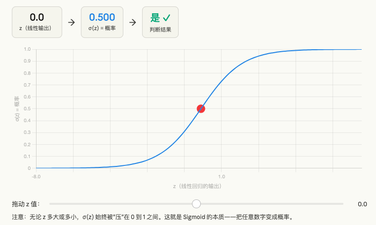
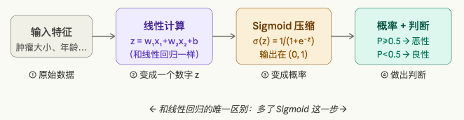
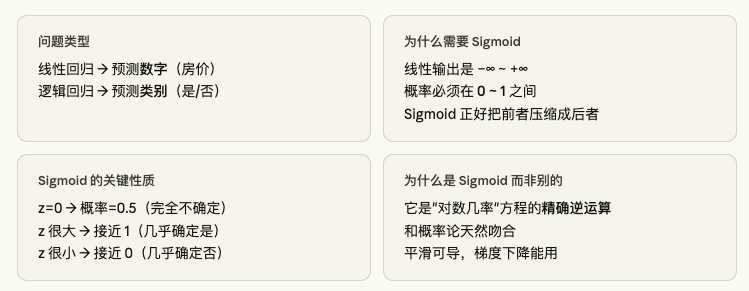

## 第一步：先搞清楚问题是什么

你学的线性回归，是在预测一个**连续的数值**，比如：

> 根据房子面积 → 预测房价（可以是 50万、80万、120万……）

但现实中有一类完全不同的问题：

> 根据邮件内容 → 判断是不是垃圾邮件（**只有两个答案：是 或 否**）
> 根据肿瘤大小 → 判断是不是恶性（**是 或 否**）

这类问题叫**分类问题**。输出需要的不是一个连续数字，而是一个**类别**。

---

## 第二步：为什么不能直接用线性回归来分类？

假设我们强行用线性回归来做"判断肿瘤是否恶性"：

- 我们把"恶性"标记为 `1`，"良性"标记为 `0`
- 线性回归会拟合出一条直线，输出一个数字

但问题来了：

```
线性回归可能输出：-0.3、0.5、1.7、3.2……
```

- 输出可以小于 0，也可以大于 1，甚至是 100
- **这个数字没有任何现实意义**
- 你不知道输出 `0.6` 代表什么，`1.7` 又代表什么
- **如果出现极端值，整个直线会被带偏，出现大量分类错误**

我们真正想要的输出是：

> **"这个肿瘤有多大概率是恶性的？"**

换句话说，输出**必须在 0 到 1 之间**。

这就是核心矛盾：**线性回归的输出范围是负无穷到正无穷，但概率的范围是 0 到 1。**

---

## 第三步：我们需要一个"压缩器"

现在问题变成了：

> 线性回归能算出一个任意大小的数字 $z$（比如 -5, 0, 3, 100……）
> 我们需要把这个 $z$ **压缩**进 `[0, 1]` 的范围内，让它变成一个概率

我们需要一个函数，它的性质必须是：

| 性质 | 原因 |
|---|---|
| 输入任意实数，输出在 (0, 1) 之间 | 概率必须在0到1之间 |
| 输入越大，输出越接近 1 | z越大，越倾向于"是" |
| 输入越小，输出越接近 0 | z越小，越倾向于"否" |
| 输入为 0 时，输出恰好是 0.5 | 完全不确定时，概率50% |
| 曲线平滑，便于求导 | 后面梯度下降需要 |

---

## 第四步：Sigmoid 函数为什么恰好满足？

Sigmoid 函数的公式是：

$$\sigma(z) = \frac{1}{1 + e^{-z}}$$

我们来看看它的图像和行为：我来给你一步步讲清楚，配上交互图帮你真正"看懂"。

---

## 第五步：来，亲眼看看 Sigmoid 的行为拖动滑块，你会看到：z = 0 时，概率恰好是 0.5；z 越大，越接近 1；z 越小，越接近 0。**这就是 Sigmoid 被选中的理由——它天然就是概率的形状。**



---

## 第六步：逻辑回归的完整流程



现在把所有东西串起来：你看，**逻辑回归和线性回归的差别，就只是最后多压了一个 Sigmoid**。其他都一样！

---

## 第七步：回答你最核心的疑问——为什么偏偏是 Sigmoid？

这是个好问题。其实数学家们当初也可以选别的函数。但 Sigmoid 有一个**其他函数没有的完美性质**：

> **它和"概率"的数学定义天然吻合。**

具体来说，有一个叫做"**几率比（Odds Ratio）**"的概念：

$$\text{几率} = \frac{P}{1-P}$$

比如你认为某件事 75% 会发生，那几率 = 0.75/0.25 = 3（赢的可能是输的3倍）。

对几率取对数：$\ln\left(\frac{P}{1-P}\right)$ = **正好等于 z（线性回归的输出）**

这不是凑巧，这是从概率论里反推出来的。Sigmoid 是这个方程的**精确的逆运算**，所以它是"唯一正确答案"，不是随便选的。

不过你现在不需要深究这个数学，记住最重要的直觉就够了：

---

## 总结：逻辑回归的逻辑



---


