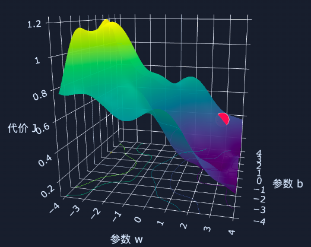

## 第1部分：搞清楚它是什么、为什么需要它（Why & What）

### 🎯 1.1 没有它之前，人们是怎么挣扎的？ _💡 核心必学_

**① 还原当时的麻烦：人们在哪一步被卡死了？**    
想象一个场景：你是一名医生，你想通过“肿瘤的大小（厘米）”来预测它“是恶性（1）还是良性（0）”。
一开始，你极其自然地使用了之前学过的**线性回归（画一条直尺）**。      
在普通数据下，这条直线画得还不错：超过 3 厘米的肿瘤，直线算出的得分大于 0.5，你判定为恶性；小于 3 厘米，得分小于 0.5，判定为良性。    
但突然有一天，来了一个极其巨大的 **100厘米** 的超级良性肿瘤（极端异常值）！     
为了照顾这个遥远的异常值，你的“直线”被严重地向右下角拉扯、倾斜了。结果，原本一个 4 厘米的致命恶性肿瘤，在这条被拉歪的直线上，得分硬生生掉到了 0.2，被系统错误地判定为“良性”。     
不仅如此，当输入 10 厘米时，直线的预测结果可能是 `1.8`；输入 0.1 厘米时，结果可能是 `-0.5`。
在这一步，系统设计者被彻底卡死了：“直线”（线性回归）虽然简单，但在面对带有极端值的分类问题时，它非常“势利”（**容易被极端值带偏，导致大部分数据分类错误**），而且“越界”（**预测值超出0-1范围**）。因此，我们需要寻找一种对异常值更鲁棒、且输出结果符合概率逻辑的模型来替代它。


**② 是什么让人不得不换一种思路？**    
“无限延伸的直线”在面对“非黑即白、非 0 即 1”的分类世界时，会导致数学意义和现实意义（**会被极端值带偏，分类错误**）的双重崩溃。这意味着必须放弃 “用一条无边界的直尺去硬套 0 和 1”的幼稚假设，我们必须发明一种“软面条”，把无边无际的直线强行弯折，封死在 0 和 1 的天花板和地板之间。

**③ 新旧方法的核心区别：哪个变量的位置被对调了？**

* 旧范式：无边界的直线预测得分 是输入 → 荒谬的负数或大于 1 的“概率” 是输出
* 新范式：无边界的直线预测得分 是输入 → 被一种魔法函数强行挤压到 0~1 的纯正概率 是输出

**④ 得到了什么，又必然失去了什么？**    
换来了**完美的概率解释能力和对极端异常值的极强抗干扰能力**，但必然失去**预测连续具体数字（如房价 500 万）的能力**。逻辑回归只能回答“是”或“不是”的概率，不能回答“具体是多少”。

**⑤ 什么情况下它会不管用？你来推导**
基于以上逻辑，你现在应该能回答：    
1. 逻辑回归的底层依然是在画一条边界线（只是加上了挤压）。如果良性肿瘤和恶性肿瘤在图纸上的分布像一个“甜甜圈”（良性在内圈，恶性在外圈），你觉得这把“直尺”还能把它们一刀切开吗？
2. 如果你的任务不是“良性/恶性”二选一，而是“猫、狗、猪”三选一，最基础的逻辑回归还能直接用吗？

---

### 🗺️ 1.2 概念地图：它在 ML 知识体系中的位置 _💡 核心必学_

```text
ML 知识体系
│
├─ 监督学习
│   │
│   ├─ 回归任务 (猜连续数字)
│   │   └─ 线性回归 (Linear Regression)
│   │
│   └─ 分类任务 (做选择题，猜类别)
│       ├─ 逻辑回归 (Logistic Regression) ← 你在这里！(名字带回归，其实是分类祖师爷)
│       ├─ 决策树分类 (Decision Tree)
│       └─ 支持向量机 (SVM)
```

---

### 📚 1.3 学这个之前，你得先知道这几件事 _💡 核心必学_

──────────────────────────────────

📖 **前置概念回顾**

- **线性回归基础公式**：$z = w \cdot x + b$。机器通过这个公式算出一个基础得分 $z$。这个得分可以是负无穷到正无穷的任何数字。
- **概率**：一个永远只能在 $0$（绝对不可能）到 $1$（绝对发生）之间的数字。

──────────────────────────────────

### 🔩 1.4 一句话说清楚它的本质 _💡 核心必学_

「逻辑回归」的本质是：**在普通线性回归的直线结果外面，强行套上一个 S 型的挤压函数，把无边无际的得分压缩成 0 到 1 之间的概率值，专门用来做二分类问题。**

后面所有的例子和代码，都是在验证这句话，而不是在解释它。

---

### 💡 1.5 先不管公式，用感觉理解它 _💡 核心必学_

**夜店保安的类比**：    
想象普通线性回归是一个心算极快、但极其死板的夜店保安。      
你走到门口，保安看了一眼你的衣着打扮（特征 $x$），在心里默默用公式算出了你的“潮人得分” $z = 150$。
如果你问保安：“我进去的概率是多少？”    
死板的线性回归保安会直接回答：“150！”（这毫无意义）。

**逻辑回归，就是给这个保安植入了一个“情商大脑（Sigmoid 挤压函数）”**。    
这个大脑的规则是极度扭曲现实的：    
- 不管你算出来的原始得分 $z$ 是 150 还是 15000，只要是个很大的正数，大脑统统把它挤压成 **99.9%（绝对让你进）**。    
- 不管你的原始得分是 -10 还是 -8000，只要是个很大的负数，大脑统统挤压成 **0.01%（绝对不让进）**。 
- 只有当你的原始得分极其接近 **0（在及格线边缘疯狂试探）** 时，大脑才会给出一个类似 **50%（看心情）** 的纠结概率。


#### 🎨 自己动手画出：保安的“情商大脑”长什么样

在任何 Python 环境（如 Colab）运行这段代码，你会亲眼看到那条改变了 AI 历史的伟大 S 型曲线：

```python
# 🎨 运行这段代码，直观感受直线是如何被“挤压”成概率的
import matplotlib.pyplot as plt
import numpy as np

# 1. 保安算出的原始得分 z (从 -10 到 10)
z = np.linspace(-10, 10, 100)

# 2. 线性回归的原始输出 (无边无际的直线)
y_linear = z 

# 3. 逻辑回归的魔法大脑：Sigmoid 挤压函数
# 公式：1 / (1 + e的负z次方)
y_sigmoid = 1 / (1 + np.exp(-z))

# 4. 画图对比
fig, ax1 = plt.subplots(figsize=(8, 5))

# 画直线
ax1.plot(z, y_linear, color='red', linestyle='--', label='线性回归 (直线得分，无边无际)')
ax1.set_ylabel('原始得分', color='red')
ax1.tick_params(axis='y', labelcolor='red')

# 画 S 型曲线
ax2 = ax1.twinx()  # 共享 x 轴
ax2.plot(z, y_sigmoid, color='blue', linewidth=3, label='逻辑回归 Sigmoid (挤压成概率)')
ax2.set_ylabel('进入夜店的概率 (0 到 1)', color='blue')
ax2.tick_params(axis='y', labelcolor='blue')

# 画辅助线：完美的 0.5 概率分界线
ax2.axhline(y=0.5, color='green', linestyle=':', label='0.5 决策边界')
ax2.axvline(x=0, color='green', linestyle=':')

plt.title("Sigmoid 函数：把无限的直线，强行塞进 0 到 1 的盒子里")
fig.tight_layout()
plt.show()
```


**📌 图像解读指南：**
- 当你运行后，**红色虚线** 是线性回归，它不受控制地冲向了正无穷和负无穷。
- **蓝色实线** 就是大名鼎鼎的 **Sigmoid 曲线**。你会发现：当原始得分 $z > 5$ 时，曲线彻底平了，死死贴着 $1.0$ 的天花板。这意味着极端异常值再也无法拉扯模型的判断边界了！
- **十字交叉的绿线**：这是它的“决策边界”。得分 $z=0$ 时，概率刚好是 $0.5$。大于 0 判断为恶性（1），小于 0 判断为良性（0）。

---

### 🔢 1.6 公式在说什么？逐字翻译给你看 _⭐ 进阶选学（可先跳过）_

把上面保安大脑的逻辑翻译成数学公式，就是深度学习里出场率最高的公式之一：

$$P = \frac{1}{1 + e^{-z}}$$
（注：其中 $z = w \cdot x + b$）

**翻译拆解：**
- $z$ = 模型算出的基础直线得分。
- $e$ = 自然常数（大概是 2.718），高中数学老熟人。
- $e^{-z}$ = 把得分变成指数。这一步极其精妙：如果 $z$ 是个极大的正数（比如 100），$e^{-100}$ 就会变成无限接近于 $0$ 的微小数字。
- $1 + e^{-z}$ = 把分母变成 $1 + 0 = 1$。
- $\frac{1}{1}$ = 最终结果无限接近于 **$1$（概率 100%）**。
- 反之，如果 $z$ 是个极大的负数（比如 -100），$e^{100}$ 会变得极大，分母无穷大，整个分数变成 **$0$（概率 0%）**。

就是这么一个巧妙的分数，完成了完美的空间挤压！

---

──────────────────────────────────

📚 **前置知识回顾**

──────────────────────────────────

本阶段会用到以下概念（已在第1部分学过）：
- **线性回归基础公式**：算出一个无边无际的得分。
- **Sigmoid 函数**：一个极其聪明的“情商大脑”，把得分强行挤压成 $0$ 到 $1$ 之间的概率。
- **梯度下降**：机器蒙眼下山找谷底（最优解）的方法。

准备好了吗？我们要给这颗大脑装上一个极其严苛的“计分员”，并亲手写出预测肿瘤的代码。

──────────────────────────────────

## 第2部分：它怎么运转、怎么动手用（How It Works & How to Use）

### ⚙️ 2.1 工作原理 _💡 核心必学_

#### （1）为什么不能用原来的MSE打分？
我们在学线性回归时，用的计分员叫 **均方误差（MSE）**。它的逻辑很简单：预测值减去真实值，算个平方。
但在逻辑回归里，如果你敢把刚刚学的 Sigmoid 函数强行塞进 MSE 的公式里，机器会当场“走火入魔”。

因为**逻辑回归 + MSE，会产生一个"坑坑洼洼"的损失曲面。**

而**梯度下降需要损失曲面是一个光滑的碗形**，才能顺着坡度滑到最低点。但 Sigmoid 套上 MSE 之后，曲面会变成充满局部最低点的崎岖地形——梯度下降会卡在半路，找不到真正的最优解。这个现象叫**非凸问题（non-convex）**。

> 实际上，算法设计者并不是碰巧发现交叉熵是个碗。他们是先定下了目标———— **“我必须在 $w$ 和 $b$ 的世界里造一个碗，让梯度下降能顺利滚到底”**，然后倒推出来：“既然前面加了 Sigmoid 挤压机，那后面就必须配上交叉熵这个形状特殊的 Loss 函数，才能把平原重新拉扯成一个碗！”



**解决方案：请出地狱级计分员——对数损失（Log Loss / 交叉熵 Cross-Entropy）**

换一个思路：与其直接衡量"预测值和真实值差多少"，不如问——

> **"用这个概率预测，我有多'惊讶'？"**

如果模型预测"是癌症"的概率是 0.99，结果真的是癌症——你一点都不惊讶，损失很小。
如果模型预测概率是 0.01，结果是癌症——你极度惊讶，损失很大。

这个"惊讶程度"在信息论里有精确的定义：

$$\text{单个样本的损失} = -\log(\hat{p})$$

其中 $\hat{p}$ 是模型对"正确答案"的预测概率。

对于二分类（标签 y = 0 或 1），把正负两种情况合并写成一个公式（单个样本的损失函数）：

$$L = -\bigl[y \cdot \log(\hat{p}) + (1-y) \cdot \log(1-\hat{p})\bigr]$$

看起来复杂，其实很简单——**y=1 时只看第一项，y=0 时只看第二项**，两个情况的逻辑完全对称。

先来互动地感受一下交叉熵损失的"惩罚机制"：

[点击跳转：逻辑回归中使用交叉熵和MSE的Loss曲线对比](5.0.2逻辑回归中使用交叉熵和MSE的Loss曲线对比.html)

切换标签，拖动滑块，观察两条曲线的关键差异：        
**当预测严重错误时（y=1 但 p̂ 接近 0），交叉熵的惩罚飙向无穷大，而 MSE 最大也只到 1**。这个"无限放大的惩罚"，正是梯度下降能从错误中快速学习的来源

#### （2）梯度下降还能用吗？

对整个训练集，把所有样本的损失取平均：

$$J(w,b) = -\frac{1}{n}\sum_{i=1}^{n}\bigl[y_i\log(\hat{p}_i) + (1-y_i)\log(1-\hat{p}_i)\bigr]$$

虽然是**换了一个代价函数**。但正因为 Loss 相对于 $z$ 是一个完美的“碗”，它相对于 $w$ 和 $b$ 才能够也是一个“碗”，相比 MSE 导致的坑洼的“千层饼”地形，机器又能开心地滑下谷底了（梯度下降）！

然后对 w 和 b 求偏导，得到梯度，得到让人惊喜的事实：**逻辑回归的梯度更新公式，形式上和线性回归几乎一样：**

$$w \leftarrow w - \alpha \cdot \frac{1}{n}\sum(\hat{p}_i - y_i)\cdot x_i$$

线性回归是 $(\hat{y}_i - y_i)$，逻辑回归是 $(\hat{p}_i - y_i)$，**只是把预测值换了个名字**。背后的道理是交叉熵和 Sigmoid 组合后，求导时刚好化简得非常干净。


---

### 💻 2.2 最小MVP：用 4 行代码写出恶性肿瘤分类器 _💡 核心必学_

在真实的 Python 工程中，你不需要手写复杂的对数损失公式。Sklearn 已经把这个“严苛的计分员”和“情商大脑”全部封装好了。

```python
# ── 第1步：准备数据 ──────────────────────────────
import numpy as np
from sklearn.linear_model import LogisticRegression

# 假装这是 6 个患者的肿瘤大小 (厘米)
X_train = np.array([[1.2], [2.1], [2.9], [4.5], [5.5], [8.0]])
# 对应的真实化验结果 (0是良性，1是恶性)
y_train = np.array([0, 0, 0, 1, 1, 1])

# 新来了两个病人，需要我们预测
X_test = np.array([[2.5], [6.0]])

# ── 第2步：召唤逻辑回归模型 ───────────────────────
model = LogisticRegression()

# ── 第3步：训练 (极其简单，让机器自己去滚圆碗) ─────
model.fit(X_train, y_train)

# ── 第4步：预测见真章！ ──────────────────────────
# 玩法A：直接让保安给出最终的决定 (非黑即白)
predictions = model.predict(X_test)
print(f"直接拍板的预测结果: {predictions}") 
# 预期输出: [0 1] (2.5厘米是良性，6.0厘米是恶性)

# 玩法B：👑 高级玩法！逼问保安内心的真实概率
probabilities = model.predict_proba(X_test)
print(f"保安内心的真实概率:\n{probabilities.round(3)}")
# 预期输出类似:
# [[0.85 0.15]  <- 2.5厘米的肿瘤，85%概率是0，15%概率是1
#  [0.02 0.98]] <- 6.0厘米的肿瘤，2%概率是0，98%概率是1
```

👉 **结论**：在真实的医疗或金融业务中，我们**极其依赖玩法 B（`predict_proba`）**，因为我们不相信机器武断的非黑即白，我们需要看它到底有多自信！

---

### 🌍 2.3 真实世界里，它被用在什么地方？ _💡 核心必学_

虽然深度学习现在很火，但在海量数据的**互联网大厂（如广告推荐、风控）**，逻辑回归依然是运行次数最多、最赚钱的霸主，因为它速度快到令人发指，而且极具解释性。    

**经典业务场景：**      
1. **垃圾邮件拦截**：提取邮件里的关键词特征，算出是垃圾邮件的概率（>90% 直接扔进垃圾箱）。
2. **银行信用卡欺诈检测**：用户刷了一笔 5 万元的海外消费。机器瞬间算出这笔交易是“盗刷”的概率。
3. **广告点击率预测 (CTR)**：抖音在决定要不要给你推这条广告时，后台就在用逻辑回归（或其变种）疯狂计算：你点击这条广告的概率到底是 0.01% 还是 5%。

---

### ✅ 2.4 工程规范：怎么写才算专业？避开会让你被骂的写法 _🔥 实战必备_

这里有两个让无数初学者在面试中被淘汰的红绿灯。

**🔴 RED（强制规范）：使用 Sklearn 的逻辑回归前，必须做特征缩放！**
- **现象**：你发现模型预测全错，或者准确率死活上不去。
- **根本原因**：Sklearn 里的 `LogisticRegression` 默认是**自带正则化（罚款机制）的**（参数 `penalty='l2'`）。我们之前学过，一旦有了正则化，机器就会对权重大刀阔斧地惩罚。如果你的特征没有缩放（比如“年龄”是 20，“存款”是 200,000），存款的权重会被不公平地极度打压。
- **正确做法**：永远记得套上 `StandardScaler()` 流水线！

**🟡 YELLOW（强烈建议）：不要迷信默认的 `0.5` 决策边界！**
- **现象**：Sklearn 的 `.predict()` 方法，极其死板地认为：只要概率 $\ge 0.5$ 就是 1，$< 0.5$ 就是 0。
- **后果**：回到刚才的肿瘤案例。如果一个肿瘤是恶性的概率是 $0.45$，按照默认边界，机器判定为“0 (良性)”，让病人回家喝水休息，结果病人一个月后去世了。
- **建议做法**：在关乎人命或重大财产的场景下，**绝对不要用 `.predict()`**。你必须用 `.predict_proba()` 获取概率，然后人工修改阈值。比如规定：“宁可错杀一千，不可放过一个！只要恶性概率 $> 0.1$，统统判定为 1（高危），立刻安排活检！”

──────────────────────────────────

💡 **下一部分预告**

──────────────────────────────────

你成功做出了一个分类模型，准确率（Accuracy）高达 **99%**！
你极其兴奋地拿着报告去给老板看。老板瞥了一眼数据，不仅没夸你，反而把你臭骂了一顿，甚至怀疑你根本不懂机器学习。

**真相极其残酷：在现实世界里，准确率 99%，可能意味着你的模型是个彻头彻尾的“瞎子”！**

──────────────────────────────────

📚 **前置知识回顾**

──────────────────────────────────

本阶段会用到以下概念（已在前两节学过）：
- **逻辑回归**：专门做“非黑即白”分类题的模型。
- **阈值 (Threshold)**：默认是 0.5，超过就算 1，低于就算 0。

准备好了吗？我们将亲手戳破机器学习界最大的谎言——“准确率”。

──────────────────────────────────

## 第3部分：哪里容易出错、怎么做得更好（What to Avoid & Beyond）

先来看下正常情况下：[点击跳转：逻辑回归训练过程中误差和正确率的关系.html](5.0.3逻辑回归训练过程中误差和正确率的关系.html)

### ⚠️ 3.1 大多数人在哪里栽了跟头？ _🔥 实战必备_

在真实的商业世界里，数据极少是“五五开”的。这种极度不平衡的数据，会把“准确率（Accuracy）”变成一个彻头彻尾的骗子。

#### 陷阱 1：99% 准确率的“瞎子模型”（准确率悖论）

**💥 现象**：       
你正在为银行开发一个“信用卡盗刷拦截系统”。
在 10000 笔交易中，只有 10 笔是真正的盗刷（极少数），剩下 9990 笔都是正常交易。
你的模型训练完了，测试结果显示 **准确率高达 99.9%**！你兴奋地拿给老板看。
老板测试了一下，发现那 10 笔真正的盗刷，模型**一笔都没拦住**！老板大发雷霆。

**🔍 根本原因**：       
你的模型根本没有学到任何识别盗刷的规律。它只是在内部写死了一行极其偷懒的代码：`永远输出 0（正常交易）`。        
因为 10000 笔里有 9990 笔是正常的，它只要无脑全猜“正常”，就能轻松蒙对 9990 次。     
计算一下：`9990 / 10000 = 99.9%`！      
**在样本极度不平衡（Imbalanced Data）的情况下，准确率毫无意义，它掩盖了模型对“少数关键群体”的完全无能。**

**✅ 修复方案**：           
永远、永远、永远不要用“准确率（Accuracy）”来评估医疗罕见病、金融欺诈、工厂罕见次品等不平衡数据！你需要引入全新的评估上帝视角的工具：**混淆矩阵（Confusion Matrix）**。

---

### 🧪 3.2 模型出问题了，怎么一步步找原因？ _🔥 实战必备_

系统设计者为了彻底看清模型的底牌，画了一个 2x2 的格子，强迫模型把所有的预测结果分门别类地填进去。

在这个矩阵里，有四个决定生死的指标（以“抓盗刷”为例，盗刷是 1/Positive，正常是 0/Negative）：
- **TP (真正例)**：它是盗刷，机器也抓对了。（干得漂亮）
- **TN (真反例)**：它是正常，机器也放行了。（理所应当）
- **FN (假反例 / 漏网之鱼)**：**极其致命！** 它是盗刷，机器却瞎了眼说正常，把它放跑了。（老板损失惨重）
- **FP (假正例 / 误杀)**：**极其烦人！** 它是正常交易，机器却神经过敏说它是盗刷，把用户的卡给冻结了。（用户打电话来骂客服）

基于这四个格子，工业界衍生出了三个比准确率重要一万倍的终极指标：

#### 1. 查准率 (Precision) —— “你报的警，有多少是真的？”
- **业务解释**：机器一共冻结了 100 张卡，其中到底有几张是真的盗刷？
- **侧重点**：怕“误杀”。查准率低，说明机器天天“狼来了”，乱报警，把正常用户得罪光了。

#### 2. 查全率 / 召回率 (Recall) —— “真正的坏人，你抓住了几个？”
- **业务解释**：真实世界里一共发生了 10 起盗刷，机器到底成功拦截了几个？
- **侧重点**：怕“漏网”。查全率低，说明机器是个瞎子，眼睁睁看着坏人把钱卷走。

#### 3. F1-Score (F1分数) —— “全能学霸的综合分”
- 查准率和查全率是一对**死敌**。
  - 你想查全率 100%？很简单，把所有人的卡全冻结（宁可错杀一万，绝不放过一个）。但查准率会跌到接近 0。
  - 你想查准率 100%？也很简单，机器只抓那个证据确凿到极点的人，其他人全放走。但查全率会跌到谷底。
- **F1-Score** 就是把这两个指标揉在一起算的综合平均分。F1 高，说明模型在“不误杀”和“不漏网”之间做到了完美的平衡。


---

### 🚀 3.3 如果要用在真实项目里，该怎么做？ _⭐ 进阶选学_

在大厂里，我们看模型报告，只会用一行代码生成一份极其详细的“体检单”。

```python
from sklearn.metrics import classification_report

# 假装 y_true 是真实的 10 笔交易 (只有最后 2 笔是盗刷 1)
y_true = [0, 0, 0, 0, 0, 0, 0, 0, 1, 1]

# 假装 y_pred 是"瞎子模型"的预测 (无脑全猜 0)
y_pred = [0, 0, 0, 0, 0, 0, 0, 0, 0, 0]

# 🌟 生产级看报告的标准姿势：
print(classification_report(y_true, y_pred, zero_division=0))
```

**这份报告会狠狠地打脸：**      
虽然报告最下面的 `accuracy`（准确率）写着 80%（猜对了 8 个 0），但你仔细看类别 `1`（盗刷）的那一行：
- `precision` 是 0.00
- `recall` 是 0.00
- `f1-score` 是 0.00

老板只要看一眼这三个 0，就会知道你的模型是个废物。

---

──────────────────────────────────

🎓 **实战挑战：来试试看自己解决一个真实问题**

──────────────────────────────────

你现在是公司的首席算法工程师。公司接了两个截然不同的外包项目，需要你来定夺模型上线的标准。

**项目 A：【核电站核心反应堆泄漏预警系统】**
- 目标：根据传感器数据，预测反应堆是否即将泄漏（1 为泄漏，0 为安全）。
- 现状：由于核泄漏的数据极其罕见，数据极度不平衡。

**项目 B：【抖音给用户推送“猜你喜欢”的广告】**
- 目标：预测用户会不会点击这条广告（1 为点击，0 为不点）。

📝 **请作为架构师，回答以下两个业务决策问题：**

1. 对于**项目 A（核泄漏预警）**，你和你的团队应该死死盯住哪个评估指标？是 **查准率 (Precision)** 还是 **召回率 (Recall)**？为什么？为了拉高这个指标，你在使用 `predict_proba()` 时，应该把判定为 1 的阈值设得很低（比如 0.01）还是设得很高（比如 0.99）？
2. 对于**项目 B（广告推送）**，你又应该更看重哪个指标？为什么？

请在回复中提交你的业务决策，我会为你进行最终的架构师方案评审！