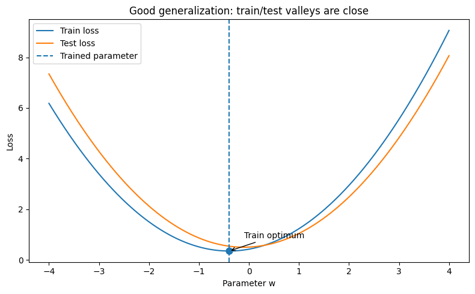
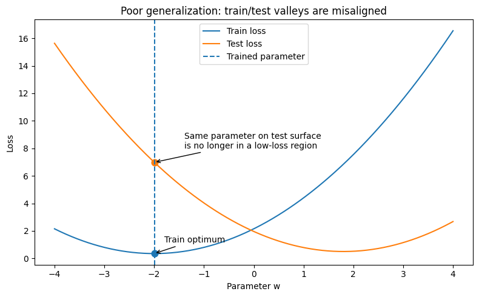
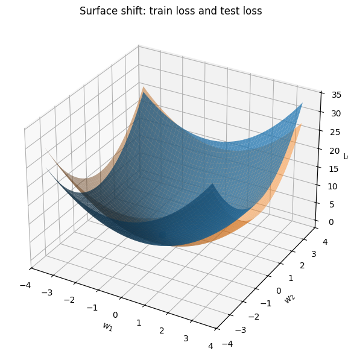

**为什么说找到什么样的谷底，直接决定了是否会过拟合？**

在回答“为什么”之前，我们要先做一次思维上的“因果关系大反转”。
并**不是“过拟合之后谷底变成了尖锐的”**，而是：因为模型**掉进了一个尖锐的谷底，所以当它遇到新数据时，表现出了“过拟合”的灾难性结果。**

为了让你真正“看见”这个过程，我们依然从直觉层、原理层，最后再建立你的费曼回路。

---

### 第一层：直觉层（两张“会移动的地图”）

想象你在玩一个蒙眼寻宝游戏（训练模型），目标是走到地形的最低点（Loss = 0）。

*   **训练时的地形图（Training Loss Surface）：** 这张地图是根据你手头的**训练数据**实时生成的。你的优化器在这张地图上疯狂下山，最后终于找到了一个谷底停了下来。
*   **测试时的地形图（Testing Loss Surface）：** 考点来了！当你把模型拿去测试集（没见过的新数据）上跑的时候，地形图是会发生变化的！因为数据变了，所以整张地图会发生轻微的**平移或扭曲**。

现在，我们来看看你停在“不同形状的谷底”时，面对这种“地图平移”，会发生什么：

1.  **如果你停在“尖锐的谷底（Sharp Minima）”：**         
    这个谷底就像一个极窄的深井。在训练地图上，你站在井底，Loss 几乎为 0，你觉得自己考了 100 分。        
    但是，当切换到测试地图时，整个地形稍微往旁边平移了 1 米。你的坐标（模型的参数值）没有变，但你脚下的地形变了！你瞬间就从“井底”变成悬挂在“极其陡峭的悬崖半山腰”上。你的误差（Loss）瞬间飙升。**这就是过拟合的本质——对数据的极其微小变化极度敏感。**

2.  **如果你停在“平缓的谷底（Flat Minima）”：**     
    这个谷底就像一个宽广的足球场。在训练地图上，你站在球场中央，Loss 为 0。    
    切换到测试地图时，地形同样平移了 1 米（权重移动）。但因为你周围是一大片平地，平移之后，你依然站在足球场里，你的 Loss 依然很低。**这就是泛化能力强——对数据的轻微变化表现得很鲁棒（稳健）。**

---

### 第二层：原理层（为什么训练集里会存在“尖锐的谷底”？）

你可能会问：既然尖锐的坑这么坏，为什么神经网络的损失平面上会存在这么多尖锐的坑？它是怎么挖出来的？

现在的深度学习模型（参数动辄几千万、上百亿）实在是**太聪明了，聪明到可以用极其扭曲和极端的方式来“死记硬背”数据。**

*   **平缓谷底背后的逻辑：** 模型找到了数据中**真正的普遍规律**（比如：猫都有尖耳朵和胡须）。这种规律是宽泛的、平稳的，不管换哪只猫，这个规律都适用。
*   **尖锐谷底背后的逻辑：** 模型没有找规律，而是**记住了训练集里的特异性噪点**。为了迎合异常点，模型把某几个参数调得极其极端（形成了一个尖锐的深坑）。

所以，**尖锐的谷底的本质是：模型用庞大的参数量，为训练集里的“偶然噪声”量身定制的“陷阱”。**

---

### 自己总结（非常重要）
 
**从几何上看，模型的泛化能力可以理解为训练损失曲面和测试损失曲面之间的相对关系。训练时，模型在训练集对应的损失曲面上找到一组低损失权重；当换到测试集后，由于数据发生变化，损失曲面通常会有一定偏移或形变。但如果训练得到的这组权重在测试损失曲面上仍然位于低损失区域或者接近测试集的最优区域（平缓谷底找到普遍规律），那么模型在测试集上仍然会有较好的表现，这就是泛化较好的几何直觉**

> 【特别说明】
> 
> **泛化好，并不要求训练得到的参数 恰好是测试集全局最优点；**
> 
> 只要它落在测试集的**低损失区域**里，就已经说明泛化不错。