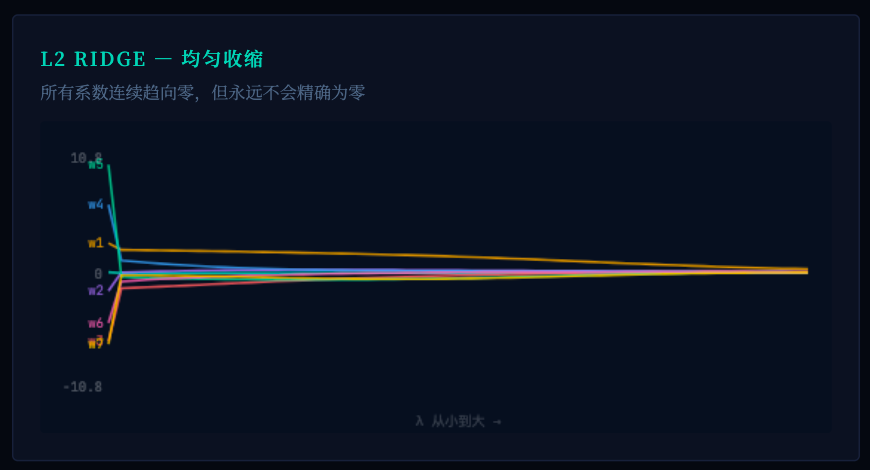
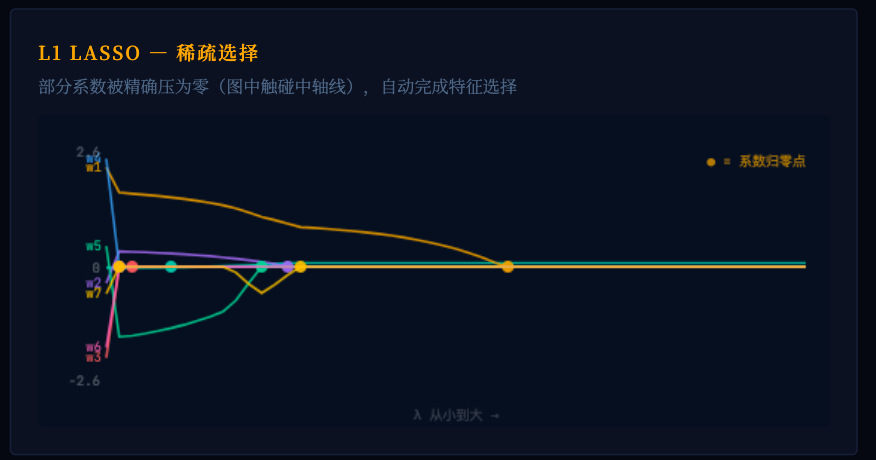

好，我们就走**第一版** 😊
下面我直接把它润成一篇**更像正式成稿**的版本：整体以**文档1为主**，保留它的“第一性原理 + 层层推进”的骨架；同时把**文档2里好用的教学提示、工程实践、易错点**自然吸收进去，但尽量不让文章显得拼接感太重。

---

# 正则化：从第一性原理讲透

> 为什么复杂模型明明能把训练误差降到零，我们却偏偏不让它这么做？

---

## 一、从一个故事开始

假设你是一个侦探。

案发现场留下了 5 个脚印，你的任务是根据这些脚印，推断罪犯的行走路线。

**侦探 A** 画了一条平滑的曲线，大致经过这些脚印附近，但并没有精确踩中每一个点。他说：“人走路本来就是平滑的，有一两个脚印偏了很正常，可能只是地面打滑了一下。”

**侦探 B** 则画出一条极其扭曲的路线，精确穿过每一个脚印。他很自信：“你看，我的解释是完美的，误差为零。”

问题来了：**谁更可能抓到真正的罪犯？**

大多数人会选侦探 A。

因为侦探 B 的路线虽然完美解释了眼前的 5 个脚印，但那条路线扭曲得太离谱了，根本不像正常人会走出的轨迹。如果明天现场又发现第 6 个脚印，侦探 A 画的路线大概率离它不远，而侦探 B 的路线很可能差了十万八千里。

**这就是正则化最核心的直觉：我们宁愿接受一点不完美，也不要一个“完美但扭曲”的解释。**

但直觉只是起点。真正重要的是，我们要把这个“为什么”拆开，一层层讲清楚。

---

## 二、机器学习到底在干什么？

在深入正则化之前，我们先回答一个更根本的问题：

### 机器学习真正的目标是什么？

很多初学者会说：

> 让模型在训练数据上表现最好。

这其实不准确。

更准确的说法是：

> **让模型在从未见过的新数据上也表现好。**

这是整个机器学习最容易被忽略、但又最关键的一点。

我们给模型 100 个训练样本，不是为了让它把这 100 个样本死记硬背下来，而是希望它从中提炼出某种**规律**，从而对第 101 个、第 102 个、甚至未来所有没见过的数据都能做出合理预测。

于是，机器学习里最核心的一对概念就出现了：

### 训练误差 vs 泛化误差

| 概念   | 含义              | 类比          |
| ---- | --------------- | ----------- |
| 训练误差 | 模型在训练数据上的预测错误程度 | 学生做练习题的得分   |
| 泛化误差 | 模型在新数据上的预测错误程度  | 学生参加正式考试的得分 |

我们真正关心的是**泛化误差**。

训练误差只是手段，不是目的。

一个学生把往年真题全部背下来，练习题能拿 100 分，但一上考场遇到新题就考 40 分，这不叫学会了，这叫背会了。

在机器学习里，这种现象就叫：

> **过拟合（Overfitting）**

---

## 三、过拟合：一切问题的根源

### 3.1 一个直观的例子

假设真实世界的规律是一条简单的二次曲线：

$$
y = 2x^2 + 1
$$

但我们并不知道这个公式。我们手里只有 6 个观测数据点，而且这些点里还带着一点随机噪声。

现在我们用不同复杂度的模型去拟合这些数据。

#### 模型 1：直线（1 次多项式）

$$
y = w_1x + w_0
$$

这条直线太简单了。它无论怎么调，都抓不住数据中的弯曲趋势。训练误差很高，新数据上的表现通常也不会好。

这叫**欠拟合（Underfitting）**：模型能力太弱，连真实规律都表达不出来。

#### 模型 2：抛物线（2 次多项式）

$$
y = w_2x^2 + w_1x + w_0
$$

这条抛物线和真实规律的形状恰好一致。它未必能把每个训练点都踩得严丝合缝，但它抓住了背后的本质结构。通常它在新数据上的表现会最好。

#### 模型 3：高次多项式（比如 5 次）

$$
y = w_5x^5 + w_4x^4 + \cdots + w_0
$$

这类模型有足够强的表达能力，可以精确穿过每一个训练点，训练误差甚至能降到零。

听起来很厉害，但问题也恰恰出在这里：为了穿过每一个点，它不得不不断弯折、扭曲自己。一旦新数据落在两个训练点之间，它就可能给出非常离谱的预测。

这就是过拟合。

---

### 3.2 为什么过拟合几乎是“必然风险”？

很多人会问：

> 既然高复杂模型容易过拟合，那为什么不一开始就只用简单模型？

答案是：

> **因为我们事先并不知道真实规律到底有多复杂。**

真实世界可能真的是线性的，也可能是二次的，也可能是更复杂的非线性关系。如果你一开始就把模型限制得太死，那面对复杂规律时，模型永远不可能学到它。

所以，实践中的正确策略通常不是：

* 一上来就禁止复杂模型

而是：

* **先给模型足够的表达能力**
* **再想办法防止它滥用这种能力**

正则化，就是这个“防止滥用”的机制。

---

## 四、第一性原理：为什么“穿过每个点”反而危险？

这是理解正则化最重要的一步。

### 4.1 数据从来不是“纯规律”，而是“规律 + 噪声”

我们观测到的每一个数据点，其实都可以拆成两部分：

$$
y_{\text{观测}} = f_{\text{真实}}(x) + \epsilon_{\text{噪声}}
$$

其中：

* $f_{\text{真实}}(x)$ 是真实规律，这是我们想学到的东西
* $\epsilon_{\text{噪声}}$ 是测量误差、随机波动、不可控因素，这是我们**不想学到**的东西

问题在于，模型并不知道哪个部分是规律，哪个部分是噪声。

于是它只能靠“拟合训练数据”来盲目学习。

当一个模型精确穿过每一个训练点时，它学到的就不只是规律本身，还包括了那些本不该被学习的噪声。

所以，**过拟合的本质**其实就是一句话：

> **模型把噪声当成了信号。**

---

### 4.2 偏差-方差分解：数学上为什么会这样？

统计学习里有一个非常经典的框架，叫做**偏差-方差分解**。

对于模型在新数据上的期望误差，我们可以写成：

$$
\text{泛化误差} = \text{偏差}^2 + \text{方差} + \text{不可消除的噪声}
$$

把它翻译成人话：

#### 偏差（Bias）

模型太简单，导致它系统性地学不到真实规律。

比如真实规律是抛物线，但你偏偏只允许模型画直线。那它无论怎么努力，都不可能学对。

#### 方差（Variance）

模型对训练数据太敏感。换一批训练样本，它学出来的结果就明显变样。

这通常意味着：模型记住了训练样本里的偶然细节，而不是稳定规律。

#### 不可消除的噪声

数据本身就带有随机性，这一部分无论你多努力都无法消除。

---

### 4.3 用偏差和方差重新看三种模型

| 模型         | 偏差 | 方差 | 泛化表现 |
| ---------- | -: | -: | ---- |
| 直线（欠拟合）    |  高 |  低 | 差    |
| 抛物线（恰好）    |  低 | 适中 | 好    |
| 高次多项式（过拟合） |  低 | 极高 | 差    |

所以问题从来不是“模型复杂就一定坏”，也不是“模型简单就一定好”。

真正的问题是：

> **你是否找到了偏差和方差之间那个最合适的平衡点。**

而正则化，本质上就是一种：

> **用一点偏差，去换更低方差**

的机制。

---

## 五、正则化到底在做什么？

### 5.1 从损失函数说起

在没有正则化时，模型的目标通常是最小化训练误差。以均方误差为例：

$$
\min_w \quad \frac{1}{n}\sum_{i=1}^{n}\big(y_i - f(x_i; w)\big)^2
$$

这件事本身当然没错，但它有个问题：

> 它只关心“错了多少”，完全不关心“模型是不是已经复杂到离谱”。

于是，正则化做了一个非常关键的动作：

> **在原本的损失函数后面，加上一项“复杂度惩罚”。**

$$\min_w L(w) = \underbrace{\frac{1}{n} \sum_{i=1}^{n} (y_i - f(x_i; w))^2}_{\text{训练误差 (MSE)：求平均}} + \underbrace{\lambda \cdot R(w)}_{\text{正则化项：惩罚复杂度}}$$

这里：

* $R(w)$ 是模型复杂度的度量
* $\lambda$ 是惩罚强度，也就是“税率”
* 偏置项 $b$ 不惩罚

---

### 5.2 用“收税”来理解正则化

这是理解正则化最顺手的类比。

你可以把模型想象成一个极其贪婪的商人，它的目标只有一个：

> **把误差降到最低。**

为了多赚一点，它会不断开分店、扩规模、加资源。对应到模型上，就是不断把参数调大、把规则搞复杂。

#### 没有正则化：免税天堂

模型为了让训练误差继续下降，哪怕只下降一点点，也愿意把自己弄得越来越复杂。最后，它可能为了迎合少数几个异常点，把整条曲线扭得面目全非。

#### 有了正则化：开始征收“复杂性税”

现在税务局规定：你每增加一点复杂度，就得交税。

于是模型开始算账：

* 如果某种复杂调整能明显降低训练误差，那值得交税
* 如果某种复杂调整只是为了迎合一个噪声点，收益很小，税却很高，那就不值得

于是模型会自然放弃那些“只对训练集好看、对未来没帮助”的复杂弯折。

这就是正则化真正厉害的地方。

它不是暴力禁止复杂，而是让复杂**必须证明自己有价值**。

---

### 5.3 它本质上创造了一场“拔河”

从更抽象的角度看，正则化后的目标函数就像两股力量在拔河：

* **训练误差项**：把模型往“更贴合训练数据”的方向拉
* **正则化项**：把模型往“更简单、更平滑”的方向拉

最终模型停下来的位置，就是两股力量平衡的地方。

这意味着：

* 真正有用的模式，模型仍然会去学
* 纯粹的噪声，模型会因为“代价太高”而放弃

所以正则化不是在“削弱模型”，而是在“引导模型”。

---

## 六、回答那些关键的“为什么”

### 问题 1：既然高次项危险，为什么不直接删掉高次项？

因为你并不知道真实规律是不是本来就复杂。

如果一开始就武断地删掉高次项，那一旦真实规律真的需要它们，你就连学到它的机会都没有了。

正则化更高明的地方在于：

> **它不预设哪些项该留、哪些项该删，而是让数据自己说话。**

如果某一项真的有价值，它能显著降低训练误差，那么即使要多交一点“复杂性税”，模型也会保留它。
但如果某一项只是用来拟合噪声，收益很小、代价很大，它自然会被压制下去。

所以正则化不是粗暴的删减，而是更细腻的约束。

---

### 问题 2：为什么限制参数大小，就能控制复杂度？

这是很多人最困惑的地方。

核心直觉是：

> **参数越大，模型对输入的变化越敏感。**

比如一个最简单的线性模型：

$$
y = w_1x
$$

* 当 $w_1 = 2$ 时，$x$ 每增加 1，$y$ 增加 2
* 当 $w_1 = 100$ 时，$x$ 每增加 1，$y$ 增加 100

显然，第二个模型对输入变化更“激动”。

这种“高灵敏度”一旦放到复杂模型里，就会让模型非常容易为了某个局部噪声而剧烈弯折。

所以，大参数往往意味着：

* 更高的灵敏度
* 更剧烈的输出波动
* 更强的过拟合风险

于是，惩罚参数大小，本质上就是在限制模型的“过度反应能力”。

---

### 问题 3：复杂模型明明能把训练误差做到零，为什么不去“硬抗”正则化？

因为它优化的目标已经变了。

没有正则化时，模型优化的是训练误差，所以它当然愿意为了穿过最后一个点而疯狂调整参数。

但有了正则化以后，它优化的是：

> **总损失 = 训练误差 + 正则化惩罚**

这时模型会计算的是：

* 我如果把参数再调大一点，训练误差能降多少？
* 但同时我会多付出多少复杂度代价？

很多时候，为了拟合最后几个噪声点，训练误差可能只下降一点点，但参数会暴涨，导致惩罚项增加得更多。

这时候，总损失反而会上升。

所以不是模型“不肯努力”，而是它发现：

> **继续迎合这些点，已经不划算了。**

---

### 问题 4：什么时候正则化会适得其反？

当模型本身就已经太弱、连训练数据都学不好时，再加正则化只会雪上加霜。

也就是说：

* **过拟合时**，正则化通常有帮助
* **欠拟合时**，正则化往往会让情况更糟

你可以自己推导两个极端情况：

#### 情况 A：模型本身就很笨

它连训练数据都抓不住，说明模型能力不足。这时候你再给它加复杂度惩罚，就等于在一个本来就跑不动的人身上再绑沙袋。

#### 情况 B：你拥有无限多、无限干净的数据

在这种几乎理想的世界里，真实规律会被数据充分暴露出来，过拟合风险会显著降低，正则化的重要性也会下降。

现实世界通常既不是 A，也不是 B，所以正则化才会如此重要。

---

## 七、两种最主流的正则化：L1 与 L2

### 7.1 L2 正则化（Ridge / 岭回归）

L2 的惩罚项是参数平方和：

$$
J(\mathbf w,b)=\frac{1}{2m}\sum_{i=1}^m\left(f_{\mathbf w,b}(\mathbf x^{(i)})-y^{(i)}\right)^2
+\frac{\lambda}{2m}\sum_{j=1}^n w_j^2
$$

这样对 $w_j$ 求偏导时，就会得到：

$$
\frac{\partial J(\mathbf w,b)}{\partial w_j} = \frac{1}{m}\sum_{i=1}^m\left(f_{\mathbf w,b}(\mathbf x^{(i)})-y^{(i)}\right)x_j^{(i)}
+\frac{\lambda}{m}w_j
$$

梯度下降更新为：

$$
w_j := w_j-\alpha \frac{\partial J(\mathbf w,b)}{\partial w_j}
$$

把上面的梯度代进去：

$$
w_j
:=
w_j-\alpha
\left[
\frac{1}{m}\sum_{i=1}^m\left(f_{\mathbf w,b}(\mathbf x^{(i)})-y^{(i)}\right)x_j^{(i)}
+\frac{\lambda}{m}w_j
\right]
$$

整理一下：

$$
w_j := \left(1-\alpha\frac{\lambda}{m}\right)w_j - \alpha \frac{1}{m}\sum_{i=1}^m\left(f_{\mathbf w,b}(\mathbf x^{(i)})-y^{(i)}\right)x_j^{(i)}
$$

---

因为通常：

$$
0<1-\alpha\frac{\lambda}{m}<1
$$

所以每一步更新时，旧的 $w_j$ 都会先变成：

$$
\left(1-\alpha\frac{\lambda}{m}\right)w_j
$$

这就像“先统一缩一圈”。这就是为什么 L2 常被叫作 **weight decay（权重衰减）**。也就是说：

> **哪怕暂时不看数据误差那一项，L2 本身就会让每一步的权重自动变小。**

不过，**它不是只剩“缩小”，还有数据项在拉扯**。后面还有一项：

$$
-\alpha
\frac{1}{m}\sum_{i=1}^m\left(f_{\mathbf w,b}(\mathbf x^{(i)})-y^{(i)}\right)x_j^{(i)}
$$

这说明模型不是一味把 $w_j$ 压成 0，而是还在问：

> “这个参数对拟合数据有没有真实贡献？”

所以最终 $w_j$ 的位置，不是单纯由正则项决定，而是**数据拟合需求**和**正则化收缩**两边博弈的结果。

---

**为什么 L2 会越来越小，但通常不会等于 0？**

这个问题要看**最优点条件**。

当训练结束、到达最优点附近时，参数不再继续更新，此时通常满足：

$$
\frac{\partial J(\mathbf w,b)}{\partial w_j}=0
$$

也就是：

$$
\frac{1}{m}\sum_{i=1}^m\left(f_{\mathbf w,b}(\mathbf x^{(i)})-y^{(i)}\right)x_j^{(i)}
+\frac{\lambda}{m}w_j
=0
$$

移项：

$$\frac{1}{m}\sum_{i=1}^m\left(f_{\mathbf w,b}(\mathbf x^{(i)})-y^{(i)}\right)x_j^{(i)}=-\frac{\lambda}{m}w_j
$$

再整理：

$$
w_j
= -\frac{1}{\lambda}
\sum_{i=1}^m\left(f_{\mathbf w,b}(\mathbf x^{(i)})-y^{(i)}\right)x_j^{(i)}
$$

这个式子告诉你：

> **最优时，$w_j$不是凭空消失，而是在“数据项梯度”和“正则项梯度”之间达到平衡。**

---


#### 它带来的结果

当 $w_j$ 越靠近 0， $\frac{\lambda}{m}w_j$ 就越小。

也就是说，L2 的“拉回 0 的力”不是恒定的，而是：

* $w_j$ 大时，拉力大
* $w_j$ 小时，拉力小
* $w_j=0$ 时，拉力本身就变成 0

这意味着 L2 会不断把参数往 0 压，但越压近 0，它越“手软”。于是常见情况就是：

* 它把参数压得很小
* 但只要数据项还需要这个参数贡献一点点
* 它就会停在一个**小的非零值**上

所以：
* 所有特征通常都会保留
* 每个特征的影响力都会被削弱
* 特别适合大多数特征都可能有点用的场景
* 对特征共线性通常更稳定




#### 一个类比

把模型想成一个团队。L2 的管理方式像是：

> “大家都降一点薪、都收一点权，不让任何一个人权力大到失控。”

---

### 7.2 L1 正则化（Lasso）

L1 的惩罚项是参数绝对值和：

$$J(\mathbf{w}, b)=\frac{1}{2m}\sum_{i=1}^{m}\left(f_{\mathbf{w}, b}(\mathbf{x}^{(i)}) - y^{(i)}\right)^2
+\frac{\lambda}{m}\sum_{j=1}^{n} |w_j|
$$

这里需要特别注意：**L1 和 L2 最大的技术区别在于，$|w_j|$ 在 $w_j = 0$ 处不可导。**  
所以在讨论 L1 时，更严格地说，我们不能简单说“求导”，而要说 **次梯度（subgradient）**。

---
对于 $w_j \neq 0$，L1 正则项对 $w_j$ 的次梯度是：

$$
\frac{\partial}{\partial w_j}\left(\frac{\lambda}{m}|w_j|\right)
=\frac{\lambda}{m}\operatorname{sign}(w_j)
$$

其中：

$$
\operatorname{sign}(w_j)
=\begin{cases}
1, & w_j > 0 \\\\
-1, & w_j < 0
\end{cases}
$$

所以当 $w_j \neq 0$ 时，目标函数对 $w_j$ 的次梯度可以写成：

$$
\frac{\partial J(\mathbf{w}, b)}{\partial w_j}
=\frac{1}{m}\sum_{i=1}^{m}\left(f_{\mathbf{w}, b}(\mathbf{x}^{(i)}) - y^{(i)}\right)x_j^{(i)}
+
\frac{\lambda}{m}\operatorname{sign}(w_j)
\qquad (w_j \neq 0)
$$

---
梯度下降（更准确地说，这里是**次梯度下降**）更新为：

$$
w_j := w_j - \alpha \frac{\partial J(\mathbf{w}, b)}{\partial w_j}
$$

把上面的式子代进去：

$$
w_j
:=w_j
-\alpha
\left[
\frac{1}{m}\sum_{i=1}^{m}\left(f_{\mathbf{w}, b}(\mathbf{x}^{(i)}) - y^{(i)}\right)x_j^{(i)}
+
\frac{\lambda}{m}\operatorname{sign}(w_j)
\right]
\qquad (w_j \neq 0)
$$

---
为了更直观地看出 L1 的作用，我们把它分成两种情况。

#### 情况 1：当 $w_j > 0$ 时

因为这时 $\operatorname{sign}(w_j) = 1$，所以更新式变成：

$$
w_j
:=w_j
-\alpha
\left[
\frac{1}{m}\sum_{i=1}^{m}\left(f_{\mathbf{w}, b}(\mathbf{x}^{(i)}) - y^{(i)}\right)x_j^{(i)}
+
\frac{\lambda}{m}
\right]
$$

也就是：

$$
w_j
:=w_j
-\alpha \frac{1}{m}\sum_{i=1}^{m}\left(f_{\mathbf{w}, b}(\mathbf{x}^{(i)}) - y^{(i)}\right)x_j^{(i)}
-\alpha \frac{\lambda}{m}
$$

这说明：**只要 $w_j > 0$，L1 就会额外减去一个固定大小的量 $\alpha \frac{\lambda}{m}$。**

---
#### 情况 2：当 $w_j < 0$ 时

因为这时 $\operatorname{sign}(w_j) = -1$，所以更新式变成：

$$
w_j
:=w_j
-\alpha
\left[
\frac{1}{m}\sum_{i=1}^{m}\left(f_{\mathbf{w}, b}(\mathbf{x}^{(i)}) - y^{(i)}\right)x_j^{(i)}
-\frac{\lambda}{m}
\right]
$$

也就是：

$$
w_j
:=w_j
-\alpha \frac{1}{m}\sum_{i=1}^{m}\left(f_{\mathbf{w}, b}(\mathbf{x}^{(i)}) - y^{(i)}\right)x_j^{(i)}
+
\alpha \frac{\lambda}{m}
$$

这说明：**只要 $w_j < 0$，L1 就会额外加上一个固定大小的量 $\alpha \frac{\lambda}{m}$。**  
本质上，这仍然是在把它往 0 推。

---
### 先只看正则项，会发生什么？

如果我们暂时不看数据误差那一项，只看 L1 正则项，那么更新规律非常简单：

- 当 $w_j > 0$ 时，每一步都减去固定的 $\alpha \frac{\lambda}{m}$
- 当 $w_j < 0$ 时，每一步都加上固定的 $\alpha \frac{\lambda}{m}$

也就是说，**L1 不是像 L2 那样“按比例缩小”权重，而是每一步都用一个固定力度把权重往 0 推。**

这和 L2 非常不同：

- **L2** 的附加项是 $\frac{\lambda}{m} w_j$，权重越小，这股力越弱
- **L1** 的附加项是 $\frac{\lambda}{m}\operatorname{sign}(w_j)$，只要还没到 0，这股力的大小几乎不变

所以：

> **哪怕暂时不看数据误差那一项，L1 本身也会用“固定力度”持续把权重往 0 推。**

---
不过，**它同样不是只剩“推向 0”这一件事，数据项也还在拉扯。** 前面仍然有一项：

$$
-\alpha
\frac{1}{m}\sum_{i=1}^{m}\left(f_{\mathbf{w}, b}(\mathbf{x}^{(i)}) - y^{(i)}\right)x_j^{(i)}
$$

这说明模型也还在问：

> “这个参数对拟合数据到底有没有足够大的贡献？”

所以最终 $w_j$ 的位置，也不是单纯由正则项决定，而是**数据拟合需求**和**L1 的固定收缩**共同作用的结果。

---
### 为什么 L1 会越来越小，而且一部分会直接等于 0？

这个问题同样要看**最优点条件**。

在最优点附近，我们不再写普通导数等于 0，而是写成：

$$
0
\in
\frac{1}{m}\sum_{i=1}^{m}\left(f_{\mathbf{w}, b}(\mathbf{x}^{(i)}) - y^{(i)}\right)x_j^{(i)}
+
\frac{\lambda}{m}\,\partial |w_j|
$$

这里的 $\partial |w_j|$ 表示 $|w_j|$ 的次梯度集合。

---
#### 当 $w_j > 0$ 时

有：

$$
\partial |w_j| = \{1\}
$$

于是最优条件变成：

$$
\frac{1}{m}\sum_{i=1}^{m}\left(f_{\mathbf{w}, b}(\mathbf{x}^{(i)}) - y^{(i)}\right)x_j^{(i)}
+
\frac{\lambda}{m}
=0
$$

也就是：

$$
\frac{1}{m}\sum_{i=1}^{m}\left(f_{\mathbf{w}, b}(\mathbf{x}^{(i)}) - y^{(i)}\right)x_j^{(i)}
=-\frac{\lambda}{m}
$$

这说明：如果一个参数最后还能保持为正，那么数据项必须强到足以抵消这固定的 $\frac{\lambda}{m}$ 惩罚。

---
#### 当 $w_j < 0$ 时

有：

$$
\partial |w_j| = \{-1\}
$$

于是最优条件变成：

$$
\frac{1}{m}\sum_{i=1}^{m}\left(f_{\mathbf{w}, b}(\mathbf{x}^{(i)}) - y^{(i)}\right)x_j^{(i)}
-\frac{\lambda}{m}
=0
$$

也就是：

$$
\frac{1}{m}\sum_{i=1}^{m}\left(f_{\mathbf{w}, b}(\mathbf{x}^{(i)}) - y^{(i)}\right)x_j^{(i)}
=\frac{\lambda}{m}
$$

这同样说明：如果一个参数最后还能保持为负，那么数据项也必须足够强，才能顶住这固定的惩罚。

---
#### 最关键：当 $w_j = 0$ 时

这时 $|w_j|$ 在 0 点不可导，但它的次梯度集合是：

$$
\partial |w_j| = [-1, 1]
$$

于是最优条件变成：

$$
0
\in
\frac{1}{m}\sum_{i=1}^{m}\left(f_{\mathbf{w}, b}(\mathbf{x}^{(i)}) - y^{(i)}\right)x_j^{(i)}
+
\frac{\lambda}{m}[-1, 1]
$$

这等价于：

$$
\left|
\frac{1}{m}\sum_{i=1}^{m}\left(f_{\mathbf{w}, b}(\mathbf{x}^{(i)}) - y^{(i)}\right)x_j^{(i)}
\right|
\le
\frac{\lambda}{m}
$$

这个条件特别重要。它告诉你：

> **只要数据项对这个参数的“拉动”还不够大，不足以超过 $\frac{\lambda}{m}$ 这个阈值，那么最优解就可以直接停在 $w_j = 0$。**

这就是 L1 会产生大量精确 0 的根本原因。

---
#### 它带来的结果

L1 的“拉回 0 的力”不是像 L2 那样随着 $w_j$ 变小而变弱，而是：

- $w_j > 0$ 时，始终额外减去一个固定量
- $w_j < 0$ 时，始终额外加上一个固定量
- 即使 $w_j$ 已经很小了，只要还没到 0，这股惩罚的力度也不会自动变弱
- 一旦数据项的贡献不足以超过阈值 $\frac{\lambda}{m}$，最优点就会直接落在 $w_j = 0$

这意味着 L1 的常见结果是：

- 一部分权重会被直接压成 **精确的 0**
- 只有那些对拟合数据贡献足够大的特征，才会被保留下来
- 模型会变得 **稀疏（sparse）**
- 它天然带有**特征选择**的效果



#### 一个类比

把模型想成一个团队。L1 的管理方式像是：

> “不是所有人都一起降薪，而是先统一砍掉一刀。扛不住的人直接出局，只留下那些真正不可替代的人。”


---

### 7.3 L1 和 L2 的对比

| 维度     | L2（Ridge）  | L1（Lasso）   |
| ------ | ---------- | ----------- |
| 惩罚方式   | 参数平方和      | 参数绝对值和      |
| 对参数的影响 | 缩小，但通常不归零  | 很多参数会被压成 0  |
| 特征选择能力 | 没有         | 有           |
| 解的风格   | 平滑、均匀收缩    | 稀疏、断舍离      |
| 适合场景   | 大多数特征都可能有用 | 特征很多，只有少数重要 |

---

### 7.4 Elastic Net：两者结合

有时候，你既想要 L1 的稀疏性，又想要 L2 的稳定性，就会用两者的混合版本：

$$
R(w)=\alpha|w|_1+(1-\alpha)|w|_2^2
$$

它叫 **Elastic Net**。

在高维、特征相关性又很强的场景里，Elastic Net 往往非常实用。

---

## 八、工程实践：真正落地时怎么用？

到这里，理论已经够了。接下来进入最容易拉开差距的部分：**工程实践**。

### 8.1 一个最小例子

我们先看一个极简例子：预测房价。

特征有 3 个：

1. 面积（真正有用）
2. 房东名字笔画（噪声）
3. 看房当天温度（噪声）

```python
import numpy as np
from sklearn.linear_model import LinearRegression, Ridge, Lasso

X_houses = np.array([
    [1.0, 12, 25],
    [2.0, 8, 22],
    [3.0, 15, 30],
    [4.0, 5, 15],
    [5.0, 20, 18]
])

y_prices = np.array([100, 200, 300, 400, 500])  # 真实规律：价格 = 面积 × 100

model_none = LinearRegression().fit(X_houses, y_prices)
model_l1 = Lasso(alpha=5.0).fit(X_houses, y_prices)
model_l2 = Ridge(alpha=5.0).fit(X_houses, y_prices)

print("无正则化权重:", np.round(model_none.coef_, 2))
print("L1 权重:", np.round(model_l1.coef_, 2))
print("L2 权重:", np.round(model_l2.coef_, 2))
```

这个例子最该观察的，不是“训练误差多少”，而是：

* 哪些参数被保留
* 哪些参数被压小
* 哪些参数被直接压成了 0

这才是建立直觉的关键。

---

### 8.2 工程第一铁律：正则化前先做标准化

这是最致命、也最常见的坑之一。

假设两个特征：

* 房屋面积：50 到 200
* 邮编：100000 到 999999

如果你不做标准化，不同特征的尺度完全不同，模型学到的权重大小就会非常不公平。

而正则化只看“参数大不大”，它根本不知道这个大到底是因为特征有用，还是因为量纲问题。

结果可能是：

* 真正有意义的特征被重罚
* 没意义但数值尺度特殊的特征反而被放过

所以一条非常重要的工程规范是：

> **绝对不要在未标准化的数据上直接使用 L1 / L2 正则化。**

标准写法通常是用 `Pipeline`：

```python
from sklearn.preprocessing import StandardScaler
from sklearn.pipeline import Pipeline
from sklearn.linear_model import Ridge

model = Pipeline([
    ('scaler', StandardScaler()),
    ('ridge', Ridge(alpha=1.0))
])

model.fit(X_houses, y_prices)
```

---

### 8.3 λ（或 alpha）怎么选？

正则化强度太小，形同虚设；太大，又会把模型压死。

所以最常见的方法是：

1. 先给一个对数尺度的候选范围
2. 用交叉验证自动搜索

例如：

$$
\lambda \in {0.0001, 0.001, 0.01, 0.1, 1, 10, 100}
$$

工程里常见写法：

```python
from sklearn.linear_model import RidgeCV
from sklearn.preprocessing import StandardScaler
from sklearn.pipeline import Pipeline
from sklearn.model_selection import train_test_split

X_train, X_test, y_train, y_test = train_test_split(
    X_houses, y_prices, test_size=0.2, random_state=42
)

auto_model = Pipeline([
    ('scaler', StandardScaler()),
    ('ridge_auto', RidgeCV(alphas=[0.001, 0.01, 0.1, 1.0, 10.0, 100.0]))
])

auto_model.fit(X_train, y_train)

best_alpha = auto_model.named_steps['ridge_auto'].alpha_
print(f"最佳 alpha: {best_alpha}")

final_score = auto_model.score(X_test, y_test)
print(f"测试集得分: {final_score:.2f}")
```

这里最重要的原则不是代码本身，而是：

> **测试集不能被拿来反复调参。**

---

## 九、最容易踩的坑

### 坑 1：用测试集选超参数

很多人会写出下面这样的代码：

```python
best_score = 0
best_model = None

for a in [0.1, 1.0, 10.0]:
    model = Ridge(alpha=a).fit(X_train, y_train)
    score = model.score(X_test, y_test)  # 错误
    if score > best_score:
        best_score = score
        best_model = model
```

这看起来很自然，但本质上已经发生了**数据泄露**。

因为测试集本来应该代表“未来未知的数据”，但你却反复根据它的表现去调整模型。等于说，你在偷偷拿“高考题”做训练。

正确做法是：

* 训练集：训练模型
* 验证集 / 交叉验证：选超参数
* 测试集：最后只考一次

---

### 坑 2：正则化强度太大，模型直接废掉

如果 $\lambda$ 太大，模型为了少交税，会把所有参数都压到接近 0。

结果就是：无论你输入什么，模型都只会猜一个差不多的平均值。

这不是模型学得稳，这是模型已经“摆烂”了。

---

### 坑 3：训练误差和测试误差都很高，却还在拼命加正则化

这通常说明问题不是过拟合，而是欠拟合。

最基本的排查逻辑是：

```text
模型效果差
    │
    ├─ 训练误差高，验证误差也高
    │       → 欠拟合
    │       → 降低正则化 / 增强模型能力 / 改特征
    │
    └─ 训练误差很低，验证误差很高
            → 过拟合
            → 增强正则化 / 降低模型复杂度 / 增加数据
```

---

## 十、很多看似不同的方法，本质上也是正则化

正则化不一定非得写成“损失函数后面加一项”。

很多在深度学习里常见的方法，虽然形式不同，但本质上都在做同一件事：

> **限制模型的有效复杂度，让它更倾向于学稳定模式，而不是记忆噪声。**

### 10.1 Dropout

训练时随机关闭一部分神经元，防止神经元之间“串通起来”记住训练集的细节。

### 10.2 Early Stopping

训练到一半提前停下，因为训练早期通常在学大趋势，训练后期更容易开始学噪声。

### 10.3 Data Augmentation

通过旋转、翻转、裁剪、加噪声等方式扩充数据，让模型更难记住某个具体样本，只能去学习更稳定的共性特征。

### 10.4 Batch Normalization

它最初不是为正则化设计的，但在实践中常常带来类似的效果，因为 mini-batch 统计量本身会引入一定随机性。

---

## 十一、什么时候该用正则化？

现实里几乎可以说：

> **大多数时候都应该考虑正则化。**

尤其是下面这些情况：

| 场景            | 建议                 |
| ------------- | ------------------ |
| 训练误差很低，测试误差很高 | 典型过拟合，应该加强正则化      |
| 特征数量接近或超过样本数  | 高维风险大，正则化很重要       |
| 模型很复杂         | 参数多，过拟合风险高         |
| 数据噪声大         | 更容易学到噪声，建议加        |
| 训练误差和测试误差都高   | 先怀疑欠拟合，不一定该继续加大正则化 |

一个很实用的经验是：

* **默认先试 L2**
* **特征极多且希望自动筛特征时试 L1**
* **想兼顾二者时试 Elastic Net**

---

## 十二、最后把整件事串起来

现在我们把全文压缩成一张思维图。

### 起点

机器学习真正的目标不是在训练集上拿满分，而是在新数据上也表现好。

### 问题

复杂模型有能力把训练误差做得极低，但它在这个过程中，也可能把噪声一起学走。这就是过拟合。

### 数学解释

泛化误差可以看成：

$$
\text{偏差}^2 + \text{方差} + \text{不可消除噪声}
$$

过拟合通常不是偏差太大，而是方差太大。

### 解决办法

在损失函数中加入复杂度惩罚：

$$
\text{总损失} = \text{训练误差} + \lambda \cdot \text{复杂度}
$$

让模型在“更贴合训练数据”和“保持足够简单”之间做权衡。

### 为什么它有效

* 大参数意味着高灵敏度
* 高灵敏度意味着更容易响应噪声
* 正则化让拟合噪声的代价变高
* 模型自然会放弃那些不划算的复杂弯折

### 方法上

* **L2**：让所有参数都缩小，更平滑
* **L1**：让部分参数直接归零，更稀疏
* **Elastic Net**：两者折中

### 工程上

* 正则化前先标准化
* 调参要用验证集或交叉验证
* 测试集只能最后使用一次

---

## 十三、最终结论

正则化最容易被误解的地方在于：很多人以为它是在“削弱模型”。

其实不是。

它真正做的是：

> **阻止模型把聪明才智浪费在噪声上。**

它放弃了对训练集“完美解释”的执念，换来了对真实世界更稳定、更可靠的理解。

所以，正则化并不是“让模型变差”。

更准确地说，它是：

> **让模型在训练集上少一点自我陶醉，在现实世界里多一点真正本事。**

---

下一步更适合做的是：把这篇再继续压成**更像公众号发布版的排版稿**，比如加上导语、小标题风格统一、重点句加粗规则统一、图注占位统一。
