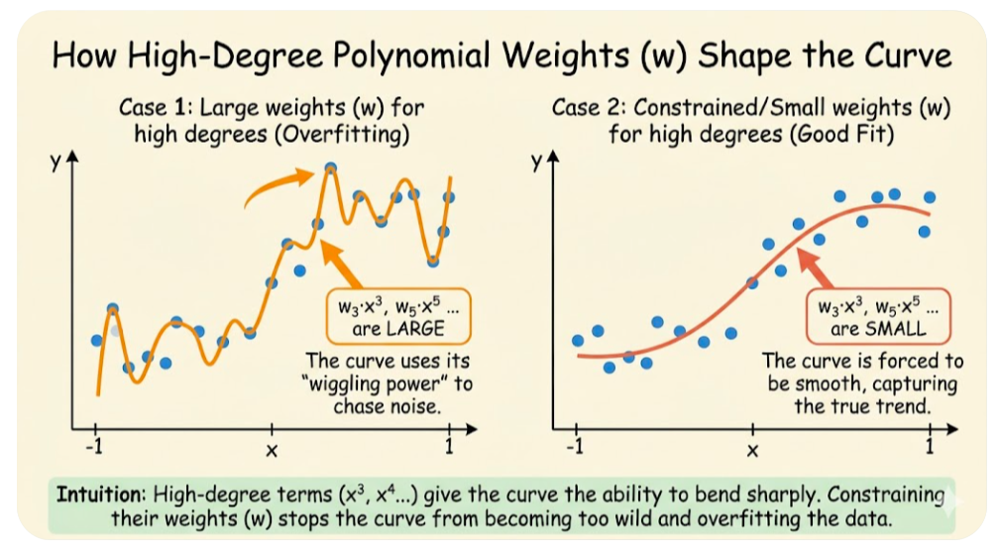

### 1. 在多项式回归中，改变 $w$ 到底在改变什么？

在最简单的一元线性回归（$y = b + w \cdot x$）中，画出来是一条直线，改变 $w$ 就是在改变这条直线的**倾斜角度**。

那么多项式回归呢？假设我们的模型是 $y = b + w_1 \cdot x + w_2 \cdot x^2 + w_3 \cdot x^3$。

你可以把多项式回归想象成一个 **“调音台”**：
* $x$ 本身代表“直线”的基础形状。
* $x^2$ 代表“U型”或者“抛物线”的形状（有一个弯折）。
* $x^3$ 代表“S型”的形状（有两个弯折）。

这里的 $w_1, w_2, w_3$ 是什么？**它们就是每个形状的“音量旋钮”或“颜料比例”。**
* 改变 $w_1$：调节直线属性的强弱。
* 改变 $w_2$：调节 U型弯折 的强弱（$w_2$ 越大，这个弯折越剧烈、越陡峭）。
* 改变 $w_3$：调节 S型扭曲 的强弱。

所以，**在多项式回归中，改变 $w$，改变的是“不同弯曲形状在最终曲线里的占比”，也就是改变曲线的“扭曲程度”和“转弯的剧烈程度”。**

#### 1.1 图像说明

下面两张对比图，它们展示了完全相同的数据点（蓝点），但是模型对高次幂特征（比如 $x^3, x^5$ 等）的权重（$w$）控制是不同的。

我们假设这个多项式模型包含很多高次项，比如：$$y = b + w_1x + w_2x^2 + w_3x^3 + ... + w_nx^n$$

👈 **左图：Case 1 - 高次项权重$w$ 很大（过拟合）**
- **现象：** 橘色的拟合曲线非常 **“疯狂”**。它为了依次穿过每一个蓝色的数据点，进行了极其剧烈的弯曲和上下波动。
- **原因：** 这就是我之前说的，模型把高次项（$x^3, x^4...$）的音量旋钮（$w$）开到了最大。高次项赋予了曲线极强的局部弯曲能力，模型利用这种能力去“讨好”每一个样本点，甚至包括那些因为误差产生的噪点。
- **结果：** 在训练数据上表现完美，但曲线形状极其怪异，完全不像现实世界的规律。

👉 **右图：Case 2 - 约束/限制高次项权重 $w$（拟合良好）**
- **现象：** 橘色的拟合曲线变得非常 **“平滑”、“柔顺”**。它并没有强求穿过每一个点，而是把握了数据的整体趋势。
- **原因：** 我们（设计者）施加了约束（正则化），强行把 $x^3, x^4...$ 这些高次项的音量旋钮（$w$）拧小了。虽然它们还在起作用，但只能稍微影响曲线的形状，不能让曲线剧烈扭动。
- **结果：** 曲线看起来非常自然，更接近数据背后的真实规律。

---

### 2. 特征缩放后，数值范围是平等的，为什么高次幂的特征影响更大？（核心矛盾）

很多人觉得：“既然 $x^1$ 缩放到了 $0$ 到 $1$ 之间，$x^3$ 也作为一个独立特征被缩放到了 $0$ 到 $1$ 之间，它们在数值范围上是平等的，Loss 曲面也变平滑了。那为什么我们依然觉得高次幂“影响大”、“要约束”呢？”

这里我要**温和地纠正一个常见误区**：
- **特征缩放** 解决的是 **“梯度下降好不好走”** 的问题（**Loss 曲面**的形状）；
- **高次幂特征影响大**，导致需要约束，解决的是 **“模型会不会过拟合（Overfitting）”** 的问题（**拟合曲线**的形状）。

让我们用刚才“调音台”的例子来理解：      
假设 $x$ 变化了一点点（比如从 $0.8$ 变成 $0.9$）。      
即使 $x^3$ 这个特征被强行缩放到了 $0 \sim 1$ 的范围内，它的数学本质依然是三次幂。它赋予了模型一种 “剧烈转弯的超能力”。

* **低次幂特征（低频）：** 即使你把它的旋钮（$w$）拧得很大，它**最多也就是让直线变得很陡，或者让抛物线开口变窄**，它总体是平滑的。
* **高次幂特征（高频）：** 只要你给它**一点点权重（$w$），它就能在局部产生非常剧烈的扭动。**

**为什么说它影响大？**  
因为如果不加约束，模型为了100%穿过训练集里的每一个点（包括那些噪点），它会把 $x^3$ 甚至 $x^{10}$ 的“音量旋钮（$w$）”开得极大！它会利用高次幂“能剧烈扭动”的特性，画出一条疯狂上下波动的曲线去完美迎合数据。
这就是为什么我们要去**约束它**。不是因为它的数值没缩放，而是因为**它本身代表的“形状”太灵活、太危险了。**

---

### 3. 约束权重到底是针对单个样本，还是综合考虑？

这里给出明确的答案：**约束是针对整个模型的“规则”，是所有样本综合考虑下来的结果。**

我们为什么要训练模型？是为了让它在**未来没见过的新数据**上表现好，而不是在现在的训练数据上考满分。

当你引入了 $x^3, x^4, x^5$ 这些高次幂特征时，模型为了拟合眼前的几百个样本，可能会把 $w_5$ 设置得很大。对于这几百个训练样本，误差可能降到了 0。      
但是，我们（设计者）心里很清楚：现实世界的数据规律大概率只是一条平滑的曲线，而不是疯狂波动的曲线。

所以，我们要在这个模型拟合所有样本的过程中，加一个“紧箍咒”：
**“你可以去尽量拟合这些样本，但是，你不准把高次幂特征的 $w$ 设置得太大！你必须给我保持平滑！”**

这也就是 **Regularization（正则化）**。我们是在综合所有样本的 Loss 基础之上，强行压制那些能引发剧烈波动的 $w$。

---

