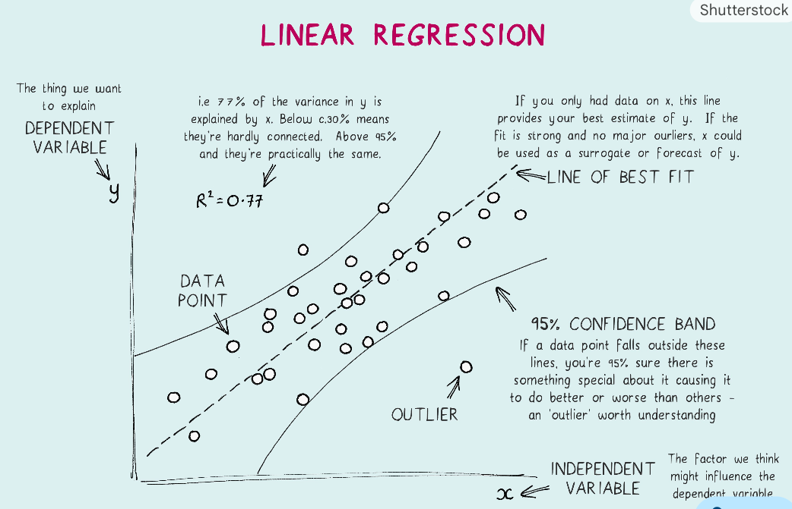
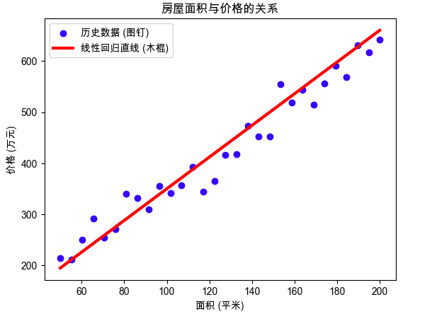

## 第1部分：搞清楚它是什么、为什么需要它（Why & What）

### 🎯 1.1 没有它之前，人们是怎么挣扎的？ _💡 核心必学_

#### ① 还原当时的麻烦：人们在哪一步被卡死了？
假设你是中世纪的一名房产评估师。在这个概念出现之前，人们评估房价只能靠“老专家的直觉”。      
面对几十个房子的交易记录（面积和最终售价），老专家摸摸胡子说：“嗯，这套 100 平米的房子，大概值 500 金币。”      
但如果新开了一个楼盘，有 1000 套房子需要定价呢？老专家的直脑子根本转不过来，新员工又全凭瞎猜。**人们在“如何将散乱的历史经验，转化为一个可复制的、精确的计算标准”这一步被卡死了。**      

#### ② 是什么让人不得不换一种思路？
当数据量变大且需要批量预测的情况下，根据经验寻找“房价”和“面积”之间的规律是难以做到的，所以我们**假设：所有房子的面积和价格之间，是某种线性关系。**

#### ③ 新旧方法的核心区别：哪个变量的位置被对调了？
线性回归的核心，就是把“规则”和“数据”的地位对调了：

```text
旧范式（人类硬写规则）：
[面积数据] + [人工脑补的换算率(比如1平米=5金币)，预设规则] ──▶ [预测房价]

新范式（机器学习找规则）：
[历史面积数据] + [历史真实房价] ──▶ 算出最优的 [换算率] ──▶ 再去预测新房价
```

#### ④ 得到了什么，又必然失去了什么？
换来了**极速预测能力**和**极强的可解释性**（你能精确说出“面积每增加1平米，房价就上涨4.2万”），但必然失去了**拟合复杂关系的能力**。这不是缺陷，是设计的必然——一条笔直的线，当然无法描绘出“超级大别墅因为面积太大反而单价下降”的曲线规律。

#### ⑤ 什么情况下它会不管用？你来推导
基于以上逻辑，你现在应该能回答：    
- 为什么当“房屋具有不可抗力的风水缺陷（面积大但极便宜）”时，它会预测极其不准？
    - **回答：** 因为模型要兼顾所有图钉（例子在下方），一个极其偏离的异常值会产生巨大的“弹簧拉力”，把整根直线硬生生拽偏。这就是线性回归的一大软肋：**对异常值极其敏感。**
- 为什么当影响房价的因素不仅仅是“面积”，还包含“是否是学区房（非数字的分类）”时，单靠一条简单的线会失效？
    - **回答：** 真实世界房价是多因素影响的。当引入“楼层”、“房龄”时，我们的公式就从 $y = wx + b$ 变成了 $y = w_1x_1 + w_2x_2 + b$。此时，模型在几何上不再是一根线，而变成了**一个切分空间的平面**。
    - 说明：针对“是否是学区房”这种文字，工程师会把它变成数字（比如 是=1，否=0），这叫 特征编码 (Feature Encoding)。


---

### 🗺️ 1.2 概念地图：它在 ML 知识体系中的位置 _💡 核心必学_

```text
ML 知识体系
│
├─ 监督学习 (有标准答案的训练)
│   │
│   ├─ 回归任务 (预测连续的数字，如价格、温度)
│   │   │
│   │   ├─ 线性回归 ← 你在这里
│   │   │   ├─ 一元线性回归 (只看面积)
│   │   │   └─ 多元线性回归 (看面积、楼层、房龄)
│   │   │
│   │   └─ 决策树回归 / 神经网络回归
│   │
│   └─ 分类任务 (容易混淆兄弟：逻辑回归。注意，逻辑回归是用来做分类的！)
```

---

### 📚 1.3 学这个之前，你得先知道这几件事 _💡 核心必学_

──────────────────────────────────

📖 **前置概念：特征 (Feature) 与 标签 (Label)**

- **是什么**：**特征**是模型的“考题”（线索），**标签**是模型的“标准答案”（我们要预测的东西）。
- **最小示例**：在预测房价任务中，`[房屋面积 120平米, 楼层 5楼]` 是特征，`[最终售价 600万]` 是标签。
- **为什么需要它**：线性回归本质上就是寻找“特征”到“标签”之间的乘法映射关系。

──────────────────────────────────

### 🔩 1.4 一句话说清楚它的本质 _💡 核心必学_

「线性回归」的本质是：**假设事物之间存在恒定的比例关系，通过不断微调一根直线的倾斜度和起点，让它尽可能均匀地穿过所有已知的历史数据点。**

后面所有的例子和公式，都是在验证这句话，而不是在解释它。

---

### 💡 1.5 先不管公式，用感觉理解它 _💡 核心必学_




想象一块软木板上钉着许多图钉（这就是我们收集到的历史特征和标签数据点）。        
现在，你手里有一根笔直的**硬木棍**（模型），并且木棍和每个图钉之间都连着一根**弹簧**。(弹簧的拉力代表着误差对预测值的导数)

「线性回归」做的事情是：    
第一步：你随便把木棍扔在木板上。    
第二步：所有的弹簧开始同时拉扯这根木棍。离木棍远的图钉，弹簧拉力极大；离得近的，拉力小。    
第三步：在各种拉力的拉扯下，木棍在木板上不断滑动、旋转。    
结果：最终木棍静止在了一个“各方受力最平衡”的位置。这根静止的木棍，就是我们找到的**最优预测直线**。  

**极端情况直觉**：
- 如果图钉完美地排成一条斜线，木棍会直接贴合上去，所有弹簧长度为0（**完美预测，误差为0**）。
- 如果图钉乱七八糟地围成一个正圆形，木棍不管怎么摆受力都一样，它会无奈地平躺在中间（**找不到任何规律，模型失效**）。

⚠️ **这个类比在这里开始失效：**
真实的算法里并没有真实的弹簧物理拉力系统 —— 实际上是用微积分（梯度下降）或者矩阵代数来计算这个“受力平衡点”的。如果只记住弹簧，你会无法理解后面代码中为什么要计算偏导数。

#### 🎨 运行这段代码，你会亲眼看到「这根木棍」
如果你有 Python 环境，可以直接运行下面这段极简代码，看看它是怎么画线的：

```python
# 🎨 运行这段代码，你会亲眼看到「线性回归的直线拟合」
import matplotlib.pyplot as plt
import numpy as np

# 1. 准备极简数据：生成一些带有随机波动的“房价数据”
np.random.seed(42)
X = np.linspace(50, 200, 30) # 特征：房屋面积 50 到 200 平米
y_true = 3 * X + 50 + np.random.normal(0, 30, 30) # 标签：真实房价（加了点噪音图钉）

# 2. 绘制图像
plt.scatter(X, y_true, color='blue', label='历史数据 (图钉)')
# 假设我们算出的最优直线是 y = 3.1x + 40
y_pred = 3.1 * X + 40 
plt.plot(X, y_pred, color='red', linewidth=3, label='线性回归直线 (木棍)')

plt.title("房屋面积与价格的关系")
plt.xlabel("面积 (平米)")
plt.ylabel("价格 (万元)")
plt.legend()
plt.show()
```



**📌 图像解读指南：**
- 当你运行后，图中的 **蓝点** 代表真实发生过的房屋交易（图钉）。
- 图中的 **红线** 代表线性回归模型找到的规律（木棍）。
- **🔍 重点看这里**：你会发现红线并没有穿过每一个蓝点，而是从它们中间“穿过去”，**保证所有蓝点到红线的垂直距离（弹簧长度）总和最小。**

---

### 🔢 1.6 公式在说什么？逐字翻译给你看 _⭐ 进阶选学_

线性回归有两个核心公式，一个是“木棍长什么样”，另一个是“弹簧拉力怎么算”。

**公式一：模型本身（这根木棍长什么样）**        
$$y = wx + b$$

**翻译拆解：**
- $x$ = 房屋面积（特征输入）
- $y$ = 预测出来的房价（预测输出）
- $w$ = 权重/斜率（Weight）。面积每增加 1 平米，房价涨多少？这就是 $w$。它是决定直线倾斜度的关键。
- $b$ = 偏置/截距（Bias）。如果面积是 0 平米，这块地皮本身值多少钱？它是直线在 Y 轴上的起跑线。

**公式二：均方误差（MSE - 衡量弹簧被拉了多长）**        
$$Loss = \frac{1}{n} \sum (y_{pred} - y_{true})^2$$

**翻译拆解：**
- $y_{pred}$ = 红线预测的房价
- $y_{true}$ = 蓝点真实的房价
- $(y_{pred} - y_{true})$ = 猜错了多少（误差，即弹簧伸长的长度）
- $(...)^2$ = 把误差平方。**为什么要平方？一是把负数误差变正（免得正负抵消）**，二是**如果模型针对样本的预测结果很差的情况下，会严厉惩罚，即平方将错误进一步放大**
    - 在**监督学习的训练阶段，样本集（也就是那些蓝点 $y_{true}$）是上帝，是绝对正确的**。训练线性归回模型的到的好的结果是：让模型对整个样本集的误差最小。而真实的世界里存在许多噪音，结果就是：**有限的噪音会使模型逐渐偏离正确的规律**。
    - 所以，**MSE对异常点非常敏感，抗干扰能力很差**
- $\sum$ = 把所有弹簧的拉力（平方误差）加起来。
- $\frac{1}{n}$ = 除以数据总数 $n$，算出“平均每根弹簧的拉力”。
- $Loss$ = 最终的“总失分”。机器学习的唯一目标，就是让这个 $Loss$ 降到最低！

> **疑惑点1：究竟是代价函数对异常值敏感，还是线性回归对异常值敏感**
>
> **线性回归本身是无辜的，它既可以被异常值带偏，也可以无视异常值。它到底敏不敏感，完全取决于你给它用了什么样的代价函数”。**
> 
> 比如一个样本集中存在一个非常夸张的异常点，MSE（均方误差）非常敏感，会把整个模型往异常点拽动；MAE（平均绝对误差）会**忽略这个异常点**，抗干扰能力强

> **疑惑点2: 为什么 MAE 能够无视异常点？**
> 模型是怎么寻找那条最优红线的？它是**靠梯度下降（算导数）**。也就是说，**决定红线往哪边移的，不是误差的绝对大小，而是误差函数求导后的“拉力（梯度）”。**

---

接下来我们就进入**动手环节**。看看计算机是如何在几秒钟内，算出那根“最优直线”的。


## 第2部分：它怎么运转、怎么动手用（How It Works & How to Use）

### ⚙️ 2.1 工作原理：计算机是怎么找到那根线的？ _💡 核心必学_

我们在第1部分说过，模型的目标是让“所有弹簧的拉力总和（Loss 损失）”最小。        
计算机并不像人类那样可以用眼睛看，它使用的是一种叫 **梯度下降 (Gradient Descent)** 的笨拙但绝对有效的方法。

你可以把“寻找最小误差”想象成**在一个大雾弥漫的碗状山谷里找谷底** 。

**完整工作流程图：**

```text
[初始猜测] 随便猜一个斜率 w 和截距 b (比如 w=0, b=0)
    │
    ▼
[步骤1：前向预测] 用当前的 w 和 b，算出所有房屋的预测价格
    │
    ▼
[步骤2：计算误差] 对比每一个房屋真实价格，算出总误差 (Loss)
    │
    ├─ 误差已经极小或不再下降？ ──▶ [输出最终的 w 和 b] (训练结束)
    │
    ▼
[步骤3：计算梯度] 算出当前位置的“坡度”（微积分偏导数）。
                 坡度告诉模型：w 稍微变大一点，误差是会变大还是变小？
    │
    ▼
[步骤4：更新参数] 顺着下坡的方向，把 w 和 b 稍微调整一点点
    │
    └─ (循环回到步骤1，不断重复这个过程，直到走到谷底)
```

> **🔑 核心超参数：学习率 (Learning Rate)**
> 在步骤4中，每次“调整一点点”，这个步伐有多大，就是学习率。
> - **步伐太大**：会在山谷两边反复横跳，甚至飞出山谷（模型崩溃）。
> - **步伐太小**：下山太慢，等到太阳下山（计算时间耗尽）都没走到谷底。

---

### 💻 2.2 最小MVP：10行代码跑出你的房价预测模型 _💡 核心必学_

不用自己手写微积分，Python 的 `scikit-learn` 库已经把这一切打包好了。我们直接调用它来解决一个实际问题。

```python
# ── 第1步：准备数据 ──────────────────────────────
import numpy as np
from sklearn.linear_model import LinearRegression

# 特征 X (必须是二维矩阵，哪怕只有一个特征。每行代表一套房)
# 这里代表：房屋面积（平米）
X_area = np.array([[50], [80], [100], [120], [150]]) 

# 标签 y (一维数组)
# 这里代表：历史真实售价（万元）
y_price = np.array([160, 240, 310, 350, 460]) 

# ── 第2步：创建并训练模型 ───────────────────────
# 实例化模型（掏出那根木棍）
model = LinearRegression()

# fit 的意思是“拟合/训练”。这一行代码在底层疯狂执行“梯度下降找谷底”
model.fit(X_area, y_price)

# ── 第3步：揭晓规律并预测未来 ───────────────────
print(f"计算机找到的规律：每增加1平米，房价上涨 {model.coef_[0]:.2f} 万元")
print(f"地皮基础起步价（截距）：{model.intercept_:.2f} 万元")

# 如果新开盘了一套 110 平米的房子，预测它能卖多少钱？
new_house = np.array([[110]])
predicted_price = model.predict(new_house)
print(f"预测 110 平米房子的售价：{predicted_price[0]:.2f} 万元")
```

**运行预期输出：**
```text
计算机找到的规律：每增加1平米，房价上涨 2.95 万元
地皮基础起步价（截距）：12.00 万元
预测 110 平米房子的售价：336.50 万元
```

---

### 🌍 2.3 真实世界里，它被用在什么地方？ _💡 核心必学_

线性回归因为太简单，现在很少直接用来做超级复杂的人工智能应用（比如自动驾驶识别路标肯定不用它）。但它在**金融、商业分析和医学统计**领域永远有一席之地。

**四象限决策指南：**

```text
                要求极高的准确率 (不管黑盒)
                        │
        适合：随机森林    │   适合：深度学习
        XGBoost树模型    │   (神经网络)
                        │
     数据特征少 ──────────┼────────── 数据特征极多(如图像/文本)
      逻辑简单            │           逻辑极其复杂
                        │
      适合：线性回归      │         (通常需要先降维提取特征)
                        │
              要求极高的可解释性 (必须说出为什么)
```

- ✅ **什么时候必须用它**：当老板或监管部门问你“为什么拒绝了这个客户的贷款？”时。线性回归可以精准回答：“因为他的负债率增加了10%，导致信用分确切地下降了15分。”（这就是极强的**可解释性**）。
- ❌ **什么时候千万别用它**：预测股票明天的绝对价格（非线性波动极大）、识别猫狗图片（像素点和猫耳朵之间不是线性乘法关系）。

---

### ✅ 2.4 工程规范：避开让你被骂的写法 _🔥 实战必备_

初学者拿上面的 10 行代码去公司干活，大概率会被骂。

**🔴 RED（强制规范）：绝对不能用全部数据去训练模型，必须留一部分做“期末考试”。**

- **现象**：如果你把所有历史数据都喂给 `fit()`，模型就像提前看了期末考卷的学生。它可能把答案“死记硬背”下来了，一旦遇到真实世界的新房子，预测会一塌糊涂。这在术语里叫 **过拟合 (Overfitting)**。
- **✅ 正确做法：拆分训练集和测试集**。

```python
from sklearn.model_selection import train_test_split
from sklearn.linear_model import LinearRegression
from sklearn.metrics import mean_squared_error

X = np.array([[50], [80], [100], [120], [150]]) 
y = np.array([160, 240, 310, 350, 460]) 

# 假设 X, y 是包含 1000 套房子的大数据集
# ✅ 正确做法：砍下 20% 的数据锁在保险箱里，训练时不准看！
X_train, X_test, y_train, y_test = train_test_split(X, y, test_size=0.2, random_state=42)

model = LinearRegression()
model.fit(X_train, y_train) # 只用 80% 的日常作业数据训练

# 训练好后，拿保险箱里的 20% 新试卷来测试它到底学懂了没
predictions = model.predict(X_test)
error = mean_squared_error(y_test, predictions)
print(f"模型在未见过的新房子上，平均误差是: {error}")
```

---

现在你已经能跑通模型了，但在真实业务里，数据往往是肮脏的。
下一部分：**90%的新手都会掉进去的 3 个数据陷阱，以及如何排查模型崩溃的原因。**

欢迎来到真实世界！在理想状态下，线性回归是一条完美的直线穿过漂亮的数据点；但在实际工程中，数据往往是肮脏、残缺、且充满误导性的。

如果你拿着上一节的代码直接去处理真实业务数据，大概率会遇到模型崩溃或预测离谱的情况。以下是 90% 的新手都会掉进去的 4 个数据陷阱，以及高阶工程师的破解之法。

## 第3部分：哪里容易出错、怎么做得更好（Traps & Pro Tips）

### 💣 3.1 真实业务中的四大致命陷阱 _🔥 实战必备_

#### 陷阱一：被极端值带偏（异常值毁所有）
我们在第一部分讨论过“风水极差的超大便宜房”。在线性回归中，模型为了让全局的“均方误差（MSE）”最小，对这种极端偏差极其敏感。
* **现象**：一个错得离谱的数据点（比如输入错误，把 100 平米写成了 10000 平米），会像黑洞一样把整根直线死死拽过去。

* **破解之法**：
    * **前期排查**：画个散点图，用肉眼或统计算法（如 IQR 规则）把离群点直接删掉。
    * **换个弹簧（代价函数）**：不要用“平方误差”，改用“绝对值误差（MAE）”或“Huber 损失”，这样极端点产生的惩罚就不会被放大得那么夸张。

#### 陷阱二：特征之间互相抄袭（多重共线性）
假设你预测房价，扔进去了两个特征：`[特征1: 房屋面积(平方米)]` 和 `[特征2: 房屋面积(平方英尺)]`。
* **现象**：这两个特征本质上是一回事（完全线性相关）。在计算 $y = w_1x_1 + w_2x_2 + b$ 时，模型会彻底懵逼——既然 $x_1$ 和 $x_2$ 一样，那是让 $w_1$ 大一点，还是让 $w_2$ 大一点？这会导致算出来的权重极度不稳定，甚至出现无穷大。我们管这叫“兄弟打架”。
* **破解之法**：训练前，计算特征之间的相关系数矩阵。如果发现两个特征相关性高达 0.9 以上，**果断删掉其中一个**。

#### 陷阱三：蚂蚁和大象同台竞技（量纲不统一）
假设你的特征是：`[特征1: 年收入(10000~500000元)]` 和 `[特征2: 家庭人口数(1~5人)]`。
* **现象**：在“梯度下降”找谷底的过程中，年收入的数字动辄几十万，而人口数只有个位数。模型会误以为数字大的“年收入”更重要，导致“下山”的步伐在这个维度上疯狂震荡，半天找不到最优解。
* **破解之法**：**特征缩放（标准化 / 归一化）**。用代码强制把所有特征的数据都按比例压缩到 $-1$ 到 $1$ 的范围内，让大家都站在同一起跑线上。

#### 陷阱四：强扭的瓜不甜（非线性硬套）
有些规律本来就不是一条直线。比如“年龄”和“收入”的关系，通常是年轻时上升，中年顶峰，老年下降（一条倒 U 型曲线）。
* **现象**：如果你非要用一条笔直的线去拟合这条曲线，结果就是怎么画都不对，误差极大。

* **破解之法**：给特征升维（多项式回归）。既然直线不行，我们就人为造出一个新特征 $x^2$ （年龄的平方），把公式变成 $y = w_1x + w_2x^2 + b$。此时，虽然它依然叫“线性模型”（因为 $w$ 还是线性的），但在几何画面上，它已经能弯曲了！

---

### 🛡️ 3.2 进阶武器库：当普通线性回归不够用时 _⭐ 进阶选学_

为了应对上述的各种坑，数学家和工程师们对基础线性回归进行了改良，你在日后的工作中一定会遇到这两个变体：

1.  **岭回归 (Ridge Regression / L2 正则化)**
    * **作用**：专门对付“多重共线性”（特征太多且互相干扰）。
    * **原理**：在原本的 Loss 公式后加了一个“惩罚项”，如果模型把某个权重 $w$ 设置得过大，Loss 就会飙升。它逼迫模型把权重分配得更均匀、更小，模型也就更稳定。
2.  **Lasso 回归 (L1 正则化)**
    * **作用**：自带“自动特征筛选”功能的回归。
    * **原理**：如果有很多没用的特征（比如预测房价时混入了“房主今天穿什么衣服”），Lasso 会非常狠地把这些无用特征的权重 $w$ 直接变成 $0$。等于帮你自动剔除了垃圾数据。

---

### 🎓 3.3 总结

到这里，就完整走完了一个「线性回归」：

用**特征**和**标签**寻找直线的思路；接着用**均方误差**做衡量，用**梯度下降**找寻最优解；最后，你掌握了 Python 实现，并洞悉了真实业务中异常值、多重共线性等致命陷阱。


#### 面试题

**【背景】**        
你现在是一家二手车交易平台的高级算法工程师。公司刚招来的实习生小明，接手了一个「二手车售价预测」的线性回归项目。

小明跟你汇报说：“师傅，我用你教我的线性回归跑了一下咱们的数据。我把所有能用的特征都扔进去了，用了**均方误差（MSE）**做损失函数，也用了**梯度下降**找最优解。但是模型彻底崩了！不仅算出来的权重（w）变成了 `NaN`（无穷大），而且在测试集上预测出来的价格离谱到天上去了。您帮我看看是哪里出了问题？”

你看了一眼小明使用的数据特征清单，以及他在数据库里抽样打印出来的几条数据：

**📊 特征清单 (Features)：**    
* $X_1$：汽车行驶里程（单位：英里，日常数据范围约 1万 ~ 15万）
* $X_2$：汽车行驶里程（单位：公里，日常数据范围约 1.6万 ~ 24万）
* $X_3$：车龄（单位：年，日常数据范围 1 ~ 15）
* $X_4$：是否有过重大事故（1=是，0=否）

**📝 数据库抽样记录（共 10000 条数据）：**
| 车辆编号 | $X_1$ (英里) | $X_2$ (公里) | $X_3$ (年) | $X_4$ (事故) | **标签 Y: 真实售价(万元)** |
| --- | --- | --- | --- | --- | --- |
| No.001 | 30,000 | 48,280 | 3 | 0 | 15.5 |
| No.002 | 55,000 | 88,513 | 5 | 0 | 11.2 |
| ... | ... | ... | ... | ... | ... |
| **No.542** | **9,999,999** | **16,093,438** | **2** | **0** | **18.0** |
| ... | ... | ... | ... | ... | ... |

---

**🎤 你的任务：**
根据我们之前学过的 **“真实业务中的致命陷阱”**，请你帮小明指出他的项目中存在的 **3 个致命错误**，并分别告诉他**应该怎么改**。

[点击跳转：模型异常排查SOP之线性回归&神经网络](1.1模型异常排查SOP之线性回归&神经网络%20(基于梯度下降).md)

**我的排查过程：**
- 第一步：检查输入数据是否存在空值、极值、标签异常。发现 *No.542 数据非常极端*，可以选择删除这组数据或者调整损失函数为 MAE
- 第二步：特征工程检查，是否存在多重共线性、量纲不统一、类别变量。发现*里程数和车龄、事故数量纲不统一*，并且X1 和 X2 属于多重共线性，删除其中一个
- 第三步：检查训练过程是否有问题