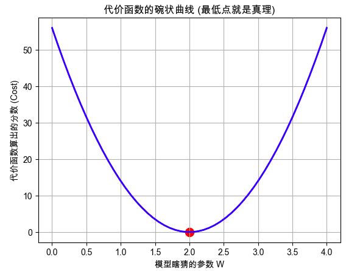

## 第1部分：搞清楚它是什么、为什么需要它（Why & What）

### 🎯 1.1 没有它之前，人们是怎么挣扎的？ _💡 核心必学_

**① 还原当时的麻烦：人们在哪一步被卡死了？**        
想象一个场景：你在做一个房价预测模型。你拍脑袋定了一个规则：“房子面积 × 5万元 = 房价”。
你拿去测试了 3 套房子：
- A房：真实 150万，你预测 100万（少估了 50万）
- B房：真实 200万，你预测 250万（多估了 50万）
- C房：真实 300万，你预测 300万（猜得很准）

如果有人问你：“你这个模型整体有多准？”      
你会怎么蠢笨地解决？你可能会想：“把所有误差加起来看看！”        
结果：(-50) + (+50) + 0 = 0。           
误差总和竟然是 0！你的模型明明错得离谱，但简单的加法却掩盖了错误，让你以为模型是完美的。在这一步，系统设计者被卡死了：**正负误差互相抵消，导致无法量化整体的“烂”。**

**② 是什么让人不得不换一种思路？**      
“正负误差抵消”在面临成千上万条数据时会导致灾难性的误判。这意味着必须放弃 **“直接相加算总账”**的幼稚假设，必须想办法让所有的误差都变成“正数”，并且还要严惩那些错得特别离谱的猜测。

**③ 新旧方法的核心区别：哪个变量的位置被对调了？**      
代价函数的出现，改变了模型评估的范式：

* 旧范式：**人类感觉** 是输入 → **模型好坏** 是输出（“我觉得这个预测差不多行了”）
* 新范式：**数学惩罚** 是输入 → **机器自动调整** 是输出（“当前得分为 2500，极差，必须改参数”）

**④ 得到了什么，又必然失去了什么？**        
换来了**客观的评分标准**（机器终于能自己知道错在哪了），但必然失去**对单个样本错因的关注**。代价函数把成千上万个错误揉成了一个数字，你只知道总体很烂，但单看这个数字，你不知道是哪套房子的预测拖了后腿。

**⑤ 什么情况下它会不管用？你来推导**                
基于以上逻辑，你现在应该能回答：
1. 为什么如果我们只对误差取绝对值（变成正数），而不对误差进行平方，面对极其个别的“极端离谱预测”（比如一套房差了 1000 万），机器可能不够重视？
    - 回答：**梯度决定了模型对错误的重视程度**，因为线性回归模型中代价函数 MAE 对预测值的导数绝对值始终为常数 1（或 $1/n$） —— 这个梯度是常数，误差再大，梯度也就那么大，所以个别的异常点对模型不会产生太大的影响
    - [dafa]
2. 如果我们的目标不是预测具体价格，而是预测“这套房能不能卖出去”（是/否），继续用计算差值的方法还会管用吗？
    - 回答：“不管用。**计算差值（均方误差 MSE）的方法只适用于预测连续数值（如具体价格），如果用来预测‘能不能卖出去’（是/否的分类问题），会产生两个致命问题：**
        - **业务逻辑不合理（预测值越界）**： 如果直接拿线性加权求和的结果来计算差值（用均方误差），它可以预测任意的一个连续值，比如‘卖出概率为 2.5’或‘-1.2’这种荒谬的结果，没有现实意义。当然，分类问题的概率本身就要限制在 0 到 1 之间，直接拿线性加权求和就是不正确的做法。
        - **底层数学会卡死（非凸优化问题）**： 为了把结果限制在 0 到 1 之间，我们必须把直线‘掰弯’（引入激活函数）。但如果在这个弯曲的模型上继续强行使用‘计算差值平方’作为代价函数，原本平滑的‘U型山谷’会变成坑坑洼洼的‘月球表面’。这会导致算法在下山找最优解（梯度下降）时，卡在半山腰的坑里出不来（陷入局部最优解），模型彻底卡死。

---

### 🗺️ 1.2 概念地图：它在 ML 知识体系中的位置 _💡 核心必学_

```text
ML 知识体系
│
├─ 模型训练核心要素
│   │
│   ├─ 代价函数 (Cost Function) ← 你在这里！(给机器看的“失分表”)
│   │   ├─ 均方误差 (MSE, 算连续数字时用)
│   │   └─ 交叉熵 (Cross-Entropy, 做分类选择题时用)
│   │
│   ├─ 优化器 (如梯度下降，负责根据代价函数去改错)
│   │
│   └─ 评估指标 (如准确率 Accuracy) 
│       ⚠️ 极易混淆：代价函数是给机器看的（方便求导），评估指标是给老板/人类看的（直观）。
```

---

### 📚 1.3 学这个之前，你得先知道这几件事 _💡 核心必学_

──────────────────────────────────

📖 **前置概念：模型参数（Parameters / Weights）**

- **是什么**：模型内部的“旋钮”。就像收音机的调频旋钮，拧一拧，声音就不一样。
- **最小示例**：公式 `房价 = W × 面积` 中的 `W` 就是参数。一开始 `W` 可能是随机的瞎猜（比如 100）。
- **为什么需要它**：代价函数存在的唯一目的，就是为了指导我们**该往哪个方向拧、拧多少**这些参数。

──────────────────────────────────

---

### 🔩 1.4 一句话说清楚它的本质 _💡 核心必学_

「代价函数」的本质是：**衡量模型当前表现好坏的工具，同时它也为模型修正错误、自我优化指明了方向（配合梯度下降）**

后面所有的例子和公式，都是在验证这句话，而不是在解释它。

---

### 💡 1.5 先不管公式，用感觉理解它 _💡 核心必学_

**射箭靶子的类比（针对单个样本）**：
想象机器是一个被蒙上眼睛的射箭手。
- 靶心 = 真实答案（比如房价的真实价格）。
- 射出的箭的落点 = 机器的预测结果。
- **代价函数 = 计分员**。

计分员不管你是怎么射的，他只拿尺子量：箭落点离靶心有多远。
如果偏了 1 厘米，他记 1 分（小代价）；如果偏了 10 厘米，他记 100 分（平方级的大代价）。射箭手（模型）的目标只有一个：**让计分员报出的数字越小越好。**

**极端情况直觉**：      
- 当代价函数的输出无穷大时：说明模型完全在胡说八道，预测结果和现实完全脱节。        
- 当代价函数的输出为 **0** 时：说明每一支箭都正中靶心，模型完美预测了所有历史数据（注意：这在现实中往往意味着“过拟合”，我们后面会讲）。     

**⚠️ 这个类比在这里开始失效**：     
射箭的类比暗示了“每次只射一箭（针对单个样本）”。但在真实的代价函数里并不是这样 ———— 实际上，机器是**同时射出成千上万支箭（预测所有样本）**，然后计分员把所有偏离距离汇总算出一个总平均分。你优化的是整体的得分，而不是某一箭。
    - “同时”有两层含义：（1）现实意义上的，是**预测所有样本之后再调整参数**，而非单一样本；（2）工程（代码）层面上，**并行计算数据**

#### 🎨 自己动手画出代价函数的“碗”

直观感受“单一权重”是如何指导机器的，请在任何 Python 环境（如 Colab）运行以下代码：



**📌 图像解读指南：**
- 当你运行后，图中的 **蓝线** 代表了“不同猜测下的烂度得分”。
- **🔍 重点看这里**：你会发现这根线是一个完美的“碗”形（抛物线）！最底端的红点，Cost 为 0，对应的正是真实的参数 W=2。
- **💡 为什么这很重要？**：因为有了这个“碗”，机器哪怕一开始猜在 W=0（在碗的左高边缘），它只要顺着坡往下滚，就一定能找到谷底（正确答案）！**代价函数把一个复杂的找规律问题，变成了一个 “找谷底”的几何问题。**

---

### 🔢 1.6 公式在说什么？逐字翻译给你看 _⭐ 进阶选学（可先跳过）_

最经典、最常用的代价函数叫做 **均方误差（Mean Squared Error, MSE）**。
它的数学长相如下：

$$J = \frac{1}{n} \sum_{i=1}^{n} (y_{pred} - y_{true})^2$$

**翻译拆解：**
- $y_{pred}$ = 机器的猜测值（这支箭落在哪）
- $y_{true}$ = 真实答案（靶心在哪）
- $(y_{pred} - y_{true})$ = 猜错了多少（偏离了多远。可能为正，可能为负）
- $(...)^2$ = **灵魂操作：求平方**。1. 把所有负数变正数（**防止抵消**）；2. 严厉**惩罚大误差**（错 2 罚 4，错 10 罚 100）。
- $\sum$ = 把所有房子的误差全部加起来。
- $\frac{1}{n}$ = 除以样本数量（房子总数），求个“平均失分”。防止数据越多，分数无脑变大。
- $J$ = 代价函数最终输出的“总离谱程度”。


> 一般来说，梯度下降存在的一个问题就是找到局部最小点，但是针对线性回归不需要经过特别的优化或者处理，而是选择普通的梯度下降是因为，线性回归无论有多少个参数，它的代价函数都是一个凸函数（碗形），总能找到全局最小点

---

──────────────────────────────────

📚 **前置知识回顾**

──────────────────────────────────

在进入实战之前，我们复习一下刚刚在第 1 部分建立的核心直觉：
- **模型参数 (W)**：机器的射箭姿势（我们要调整的东西）。
- **全批量 (Batch)**：机器不是射一箭算一次分，而是“万箭齐发”后看总平均分。
- **代价函数 (Cost)**：那个无情的计分员，分数（Cost）越大，说明当前这批箭射得越离谱。

如果不记得了，随时打断我！

──────────────────────────────────

## 第2部分：它怎么运转、怎么选、怎么写代码（How It Works & How to Use）

### ⚙️ 2.1 工作原理：它在整个系统里是干嘛的？ _💡 核心必学_

初学者最容易犯的错误，就是把“代价函数”和“模型”混为一谈。    
记住：**代价函数本身不负责预测，它只负责衡量当下模型的好坏并为自动优化知道方向。**

在这个系统里，它的位置和运转逻辑是这样的（这是机器学习最核心的死循环）：

```text
[历史真实数据 (如：1000套房子的面积和真实价格)]
       │
       ▼
[步骤1：模型瞎猜] ──(用当前的参数W)──▶ 算出 1000 个预测价格
       │
       ▼
[步骤2：计分员出场] ◄── 把【预测价格】和【真实价格】对比
       │            (代入代价函数公式，算出一个总误差值 Cost)
       ▼
[步骤3：方向指导]
       ├─ 如果 Cost = 5000 ──▶ 优化器说：“太烂了！参数 W 给我调小一点！”
       └─ 如果 Cost = 10   ──▶ 优化器说：“很接近了，参数 W 微调一下即可。”
       │
       ▼
[步骤4：更新参数，回到步骤1，直到 Cost 降不下去为止]
```

**手动模拟（用最简单的数字）：**
假设我们有 2 套房子。真实价格是 `[100, 200]`。
- **第 1 轮**：模型瞎猜 `[50, 150]`。
  代价计算：$(50-100)^2 + (150-200)^2 = 2500 + 2500 = 5000$。平均代价 = `2500`。
- **第 2 轮**：模型被骂了，调整参数，猜 `[90, 190]`。
  代价计算：$(90-100)^2 + (190-200)^2 = 100 + 100 = 200$。平均代价 = `100`。
  
👉 **结论**：代价从 2500 降到了 100。虽然我们没写怎么调整参数，但**仅仅因为代价函数给出了这个明确变小的数字，系统就知道自己走对了路！**

---

### 💻 2.2 最小MVP：动手写代码，亲眼看看代价的计算 _💡 核心必学_

在很多高级库（比如 Sklearn）里，代价函数被深深隐藏在底层，你调用 `fit()` 的时候它自动就跑完了。但为了剥开它的外衣，我们用最基础的 Python (NumPy) 手写一个代价函数，再用 Sklearn 验证它。

```python
# ── 第1步：准备数据 ──────────────────────────────
import numpy as np
from sklearn.metrics import mean_squared_error

# 假设这是 5 套房子的真实价格（万元）
y_true = np.array([150, 200, 250, 300, 350])

# 假设我们有两个模型，分别给出了预测
model_A_preds = np.array([140, 190, 260, 290, 360]) # 猜得比较准，每套只偏了10万
model_B_preds = np.array([100, 150, 200, 250, 300]) # 猜得很烂，每套都偏了50万

# ── 第2步：手写代价函数 (MSE 均方误差) ────────────
# 说明：这就是底层“万箭齐发”的同步计算！
# (model_A_preds - y_true) 底层会同时让 5 个数字两两相减
def calculate_mse(predictions, targets):
    # 第一步：算差值
    errors = predictions - targets
    # 第二步：差值平方 (消灭负数，惩罚大错)
    squared_errors = errors ** 2
    # 第三步：求平均 (算出最终的单一数字 Cost)
    cost = np.mean(squared_errors)
    return cost

# ── 第3步：见证奇迹 ──────────────────────────────
cost_A = calculate_mse(model_A_preds, y_true)
cost_B = calculate_mse(model_B_preds, y_true)

print(f"模型 A 的代价得分: {cost_A}") # 预期输出: 100.0 (因为10的平方是100)
print(f"模型 B 的代价得分: {cost_B}") # 预期输出: 2500.0 (因为50的平方是2500)

# 验证：用业界标准的 sklearn 算一下，看看和我们手写的是不是一模一样
industry_cost_A = mean_squared_error(y_true, model_A_preds)
print(f"Sklearn 算出的模型 A 代价: {industry_cost_A}") # 一模一样！
```

---

### ✅ 2.4 工程规范：怎么选才算专业？避开会让你被骂的写法 _🔥 实战必备_

这里我们要解答第 1 部分结尾留下的悬念：**做房价预测（连续数字）和做猫狗识别（分类选择题），为什么必须用不同的代价函数？**

**🔴 RED（强制规范）：绝对不要把 MSE（均方误差）用在分类问题（如判断是不是垃圾邮件）上！**
- **违反会导致**：模型的代价函数曲线会从一个“完美的碗”变成“连绵起伏的山丘”。优化器（那个找谷底的球）极其容易卡在半山腰的某个小坑（局部最优解）里出不来，导致模型彻底训练失败。
- **根本原因**：分类问题输出的是概率（0 到 100%）。如果你强行把 1 和 0 相减求平方，数学上会破坏掉“碗”的形状（失去凸性）。
- **正确做法**：做分类问题，必须换另一个计分员——**交叉熵代价函数（Cross-Entropy / Log Loss）**。


**🟡 YELLOW（强烈建议）：使用 MSE 时，警惕数据里的“超级异常值”！**
- **现象**：1000 套房子里，有 1 套是因为操作失误录入成了 100 亿。
- **后果**：因为 MSE 有“平方”操作！$(100亿 - 真实房价)^2$ 会产生一个极其恐怖的超大代价。模型为了把这个超大代价压下来，会被迫把原本预测准的 999 套房子的预测值全部拉歪，去“迎合”那个异常值。
- **建议做法**：（1）**清洗数据时干掉异常值**（2）**替换代价函数（如 MAE）**

---

### 🔄 2.5 有好几种代价函数，怎么选？ _⭐ 进阶选学_

真实世界中，主要有 3 个常用的“计分员”。

| 对比维度 | MSE (均方误差 L2) | MAE (平均绝对误差 L1) | Cross-Entropy (交叉熵) |
| :--- | :--- | :--- | :--- |
| **它是怎么算分的？** | 算距离，然后**平方** | 算距离，求**绝对值**(不平方) | 用对数算**概率分布**的差异 |
| **解决什么问题？** | 回归 (猜连续的具体数字) | 回归 (猜连续的具体数字) | 分类 (做选择题，猜概率) |
| **对极端异常值的态度** | 极其敏感！重拳出击，狠狠惩罚大错 | 冷静客观，错多少算多少，不加倍惩罚 | 只看重“你给正确答案分配了多大概率” |
| **一句话总结：何时用** | **90% 猜数字的首选** | **数据脏、异常值多时用** | **只要是做分类/选择题就用它** |

**🌳 工业界决策树（保存下来，以后照着选）：**

```text
你的模型是要预测什么？
    │
    ├─ 预测具体的连续数字（房价、气温、销售额） ──▶ 【回归问题】
    │       │
    │       ├─ 数据里有没有极其离谱的异常值（且不能删）？
    │       │       ├─ YES ──▶ 选 MAE (绝对误差)
    │       │       └─ NO  ──▶ 选 MSE (均方误差) ⭐ 最常用
    │       │
    │       └─ 想要模型更关注相对误差（比如错10块钱对白菜和对跑车意义不同）？
    │               └─ 选 MAPE (平均绝对百分比误差)
    │
    └─ 预测类别/打标签（猫/狗、良性/恶性、是/否） ──▶ 【分类问题】
            │
            └─ 别犹豫了，直接选 Cross-Entropy (交叉熵) ⭐ 唯一神
```

──────────────────────────────────

💡 **下一部分预告**

──────────────────────────────────

我们已经搞懂了代价函数的运转逻辑和选型。
但是，在真实项目中：
- **为什么代价明明已经降到了 0，模型上线后却是个智障？**（高频陷阱）
- **如果代价函数一直在疯狂上下跳动，死活降不下去，是哪里出错了？**

---

──────────────────────────────────

📚 **前置知识回顾**

──────────────────────────────────

本阶段会用到以下概念（已在阶段1和2学过）：
- **代价 (Cost)**：模型猜测值和真实答案之间的整体误差。
- **MSE (均方误差)**：做连续数字预测（回归）时的专属计分员。
- **交叉熵 (Cross-Entropy)**：做分类选择题（如猫狗识别）时的专属计分员。

如果不记得了，建议先回顾相关章节。准备好了吗？我们要开始排雷了！

──────────────────────────────────

## 第3部分：哪里容易出错、怎么做得更好（What to Avoid & Beyond）

### ⚠️ 3.1 大多数人在哪里栽了跟头？ _🔥 实战必备_

关于代价函数，新手最容易踩进两个极其隐蔽的陷阱。这两个陷阱如果不避开，你的模型在电脑上跑得再好，上线后也会是一场灾难。

#### 陷阱 1：代价降到 0 的骗局（过拟合 Overfitting）

**💥 现象**：       
你看着屏幕上的代价（Cost）从 5000 一路狂降到 0.001。你兴奋地以为自己训练出了一个完美的模型，结果一上线，遇到新的数据，模型错得离谱，预测完全是胡说八道。

**🔍 根本原因**：       
想象一个准备期末考试的学生。他没有去理解公式的原理，而是**把历年真题的答案死记硬背了下来**。        
如果计分员（代价函数）只拿这套“历年真题”（训练数据）去考他，他当然能考满分（Cost = 0）。但他根本没有学到真正的规律。        
在机器学习中，这叫**过拟合（Overfitting）**：模型为了迎合那几个极端异常点，或者强行记住每一条数据，画出了一条极其扭曲的规则曲线。       

**❌ 错误代码**：
```python
# ❌ 错误示范：只看训练集的代价，掩耳盗铃
from sklearn.metrics import mean_squared_error

model.fit(X_train, y_train) # 疯狂做历年真题

# 问题行：拿刚刚做过的真题来考试！
train_predictions = model.predict(X_train) 
train_cost = mean_squared_error(y_train, train_predictions)
print(f"代价是 {train_cost}！我太牛了！") # 其实是个幻觉
```

**✅ 修复方案**：
必须把数据切分成两份。一份用来训练（做练习），另一份**绝对不能给模型看**，专门留着做期末考试（验证/测试）。

```python
# ✅ 修复版本：引入从未见过的测试集
from sklearn.model_selection import train_test_split

# 把数据切成两份，80%练习用，20%考试用
X_train, X_test, y_train, y_test = train_test_split(X, y, test_size=0.2)

model.fit(X_train, y_train) # 拿 80% 的数据训练

# 用剩下的 20% 全新数据来评估代价！
test_predictions = model.predict(X_test)
real_cost = mean_squared_error(y_test, test_predictions)
print(f"这才是模型真实的代价：{real_cost}") 
```

---

#### 陷阱 2：代价直接爆炸变成 `NaN` (Not a Number)

**💥 现象**：
模型刚开始跑，你打印出来的 Cost 是：        
第1轮：`1000`       
第2轮：`95000`      
第3轮：`8900000000`     
第4轮：`NaN`（系统直接崩溃，算不出数了）        

**🔍 根本原因**：       
步子迈太大，扯着蛋了。还记得我们在 1.5 节画的那个“碗”吗？找谷底的球，如果是慢慢往下滚，就能找到最低点。但如果你的“学习率”（每次调整参数的幅度）设置得太大，球就会在碗的两边疯狂反复横跳，而且越跳越高，最后直接飞出宇宙。这叫**梯度爆炸**。         
另一种常见原因是：你的数据没有做**归一化**（比如房龄是 10 年，房价是 5000000 元，两个数字差距几万倍，导致那个“碗”变成了一个极其狭长的深谷，根本没法好好滚）。

---

### 🧪 3.2 模型出问题了，怎么一步步找原因？ _🔥 实战必备_

当你发现代价函数表现诡异时，不要慌，对照这棵诊断树，一步步排查：

```text
代价 (Cost) 表现异常
    │
    ├─ Cost 死活降不下来（一直很高）？
    │       │
    │       ├─ 检查1：模型是不是太简单了？（比如用直线去拟合曲线）
    │       ├─ 检查2：你的数据特征是不是太少了？（巧妇难为无米之炊）
    │       └─ 检查3：数据里面是不是一堆脏数据/异常值？
    │
    ├─ Cost 降到了极低，但一上线就拉胯？
    │       │
    │       └─ 🚨 确诊：过拟合！
    │           ├─ 解决方法1：收集更多的数据。
    │           └─ 解决方法2：减少模型的复杂程度（给模型加“惩罚项”）。
    │
    └─ Cost 忽高忽低，甚至变成 NaN？
            │
            ├─ 检查1：特征数据做归一化了吗？（把所有特征缩放到 0~1 之间）
            └─ 检查2：每次下山的步伐（学习率）是不是设置得太大了？调小 10 倍试试。
```

---

──────────────────────────────────

🎓 **实战挑战：来试试看自己解决一个真实问题**

──────────────────────────────────

恭喜你！你已经掌握了关于代价函数最核心的内功。现在，轮到你来当系统设计者了。

**场景描述**：
你入职了一家邮箱服务公司，老板让你写一个机器模型来拦截垃圾邮件。
- **任务类型**：识别邮件“是”还是“不是”垃圾邮件（1 代表是，0 代表不是）。
- **你的前任同事**留下了下面这段代码，他说：“我已经把代价降到很低了，可以直接上线！”

**你的任务**：
请仔细阅读这段代码，指出它存在的 **2 个致命错误**（刚好对应我们在第 2 部分和第 3 部分讲过的核心陷阱），并写出你的修复方案或思路。

```python
"""
前任同事留下的“垃圾邮件拦截”代码
"""
from sklearn.linear_model import LinearRegression
from sklearn.metrics import mean_squared_error

# 1. 准备数据：X 是邮件特征，y 是标签（0正常，1垃圾）
X = [[0.1, 0.5], [0.8, 0.9], [0.2, 0.3], [0.9, 0.8]]
y = [0, 1, 0, 1] 

# 2. 训练模型
model = LinearRegression()
model.fit(X, y)

# 3. 计算代价并汇报
predictions = model.predict(X)
cost = mean_squared_error(y, predictions)
print(f"老板！我的代价只有 {cost:.4f}，模型完美！")
```

📝 **请在回复中提交你的答案：**
1. 这段代码犯了哪两个致命错误？
2. 如果是你，你会怎么改？

回答：  
问题1: (1)没有拆分数据集，不知道模型的真实效果如何；（2）分类问题直接对线性加权求和的结果进行均方误差计算   
问题2: 把线性回归改成逻辑回归，然后吧代价函数MSE改成交叉熵