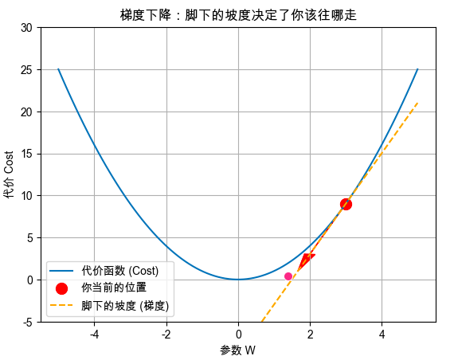

## 第1部分：搞清楚它是什么、为什么需要它（Why & What）

### 🎯 1.1 没有它之前，人们是怎么挣扎的？ _💡 核心必学_

**① 还原当时的麻烦：人们在哪一步被卡死了？**        
想象一个场景：你的房价预测模型里有 2 个参数（比如 $W_1$ 代表面积的权重，$W_2$ 代表房龄的权重）。你在上一节知道了怎么算“代价（Cost）”。      
为了让代价降到最低，你会怎么蠢笨地解决？你可能会想：“我先改改 $W_1$，看看代价是不是变小了；如果变小了，我就继续改；如果变大了，我就改 $W_2$”， 这叫**随机瞎猜法（Grid Search / Random Search）**。      
当模型只有 2 个参数时，你还能勉强试出来。但如果是一个真实的神经网络，有 100 万个参数呢？

**② 是什么让人不得不换一种思路？**      
“逐个试错”在面对高维参数时遇到了维度灾难（时间成本呈指数级爆炸）。这意味着必须放弃“先走一步，再看结果”的幼稚假设，我们必须想出一种方法，能 **在走之前，就精确知道下一步该往哪个方向走、走多远**。

**③ 新旧方法的核心区别：哪个变量的位置被对调了？**

* 旧的方法：随机试错，先走一步再看结果（先看结果再决定下一步）
* 新的方法：根据当前位置的**代价函数的斜率（梯度）** 来决定下一步该往哪个方向走（蒙眼下山，脚底感受坡度）

**④ 得到了什么，又必然失去了什么？**        
换来了**在几百万维空间里同时优化所有参数的超能力**，但必然失去**确信自己找到了“最好答案”的底气。**。    
梯度下降就像一个蒙着眼睛的盲人，他只能凭脚底板的感觉往下走。如果他走着走着，掉进了一个半山腰的小水坑（局部最优解 Local Minimum），坑底是平的（梯度为 0）。他可能以为自己找到了谷底，但其实他只是掉进了一个小水坑，离真正的谷底还很远

**⑤ 什么情况下它会不管用？你来推导**        
基于以上逻辑，你现在应该能回答：
1. 为什么如果代价函数的形状是一片“完全平坦的大平原”，梯度下降就会彻底瘫痪？
    - 回答：因为在平坦的地方，梯度为0，公式变成 $\theta_{new} = \theta_{old} - \alpha \times 0$， 参数不更新了，机器就停在了原地
2. 为什么如果代价函数的形状像搓衣板一样坑坑洼洼（充满无数个局部小坑），梯度下降会很难找到最底部的正确答案？
    - 回答：因为搓衣板上梯度为0的点不止一个，机器可能会停在局部最优解而不是全局最优解

---

### 🗺️ 1.2 概念地图：它在 ML 知识体系中的位置 _💡 核心必学_

```text
ML 知识体系
│
├─ 模型训练核心要素
│   │
│   ├─ 代价函数 (Cost Function) （上一节学的：给机器打分的计分员）
│   │
│   ├─ 梯度下降 (Gradient Descent) ← 你在这里！（根据分数决定怎么改参数的导航仪）
│   │   ├─ 批量梯度下降 (BGD)
│   │   └─ 小批量梯度下降 (Mini-batch GD)
│   │
│   └─ 高级优化器 (如 Adam, RMSprop 等，它们是梯度下降的升级魔改版)
```

---

### 📚 1.3 学这个之前，你得先知道这几件事 _💡 核心必学_

──────────────────────────────────

📖 **前置知识回顾**

本阶段会用到以下我们在上一节学过的概念：
- **代价函数的碗状曲面**：代价函数的形状像一个碗，碗底（Cost=0）就是我们梦寐以求的正确答案。
- **参数 ($\theta$)**：模型里的旋钮，也就是我们在碗里当前站着的位置。

──────────────────────────────────

### 🔩 1.4 一句话说清楚它的本质 _💡 核心必学_

「梯度下降」的本质是：**在不知道全局最优解在哪里的情况下，用局部坡度信息反复修正当前位置，直到无路可下。**

后面所有的例子和公式，都是在验证这句话，而不是在解释它。

---

### 💡 1.5 先不管公式，用感觉理解它 _💡 核心必学_

**蒙眼下山的类比**：        
想象你被蒙上了眼睛，被直升机随机空投到了一个深山谷（代价函数曲面）的半山腰上。      
你的任务是：活着走到谷底（找到最小的 Cost）。       
由于你看不到全貌（无法直接求解），你只能用脚底板去感受脚下土地的**倾斜程度（这就是梯度/斜率）**。   

- 第一步：你用脚探一探，发现右边的地势是向上的，左边的地势是向下的。
- 第二步：因为你要下山，所以你**背对着向上倾斜的方向**，往左边迈出一步。
- 第三步：在这个新位置，你再次用脚感受倾斜度，继续朝着往下的方向走。
- 结果：不知不觉中，只要你一直顺着最陡的坡往下走，你最终一定会停在一个地势完全平坦的地方（梯度为0）——恭喜你，你到谷底了！

**极端情况直觉**：
- 当脚下的坡度（梯度）极其陡峭时：说明你离谷底还很远，此时你应该迈出**大步**，快速下降。
- 当脚下的坡度（梯度）接近 0 时：说明你已经到了平地（谷底），此时你应该停下脚步，停止更新参数。

**⚠️ 这个类比在这里开始失效(重要)**：
“蒙眼下山”暗示了你是连续不断地走下去的，但在真实的算法里并不是这样——实际上，机器是 **瞬移（离散跳跃）** 的。它先算出现在位置的坡度，然后直接在数学空间里“闪现”到下一个位置。如果你决定“一步迈出10公里”（步子太大），你可能会直接跨过谷底，闪现到对面的半山腰上！

#### 🎨 自己动手画出梯度的几何意义

在任何 Python 环境（如 Colab）运行以下代码，你会直观看到“斜率”是如何指引方向的：

```python
# 🎨 运行这段代码，你会亲眼看到「梯度（斜率）」是如何指向谷底的
import matplotlib.pyplot as plt
import numpy as np

# 1. 准备极简数据：画一个完美的代价函数碗 (y = x^2)
W = np.linspace(-5, 5, 100)
Cost = W**2 

# 2. 假设我们现在被空投到了 W=3 的半山腰
current_W = 3
current_Cost = current_W**2

# 3. 算出这里的梯度（微积分告诉我们 y=x^2 的导数是 2x）
# 所以在 W=3 的地方，坡度(斜率) = 2 * 3 = 6
gradient = 2 * current_W 

# 4. 绘图
plt.plot(W, Cost, label='代价函数 (Cost)')
plt.scatter(current_W, current_Cost, color='red', s=100, label='你当前的位置')

# 画出脚底板感受到的“坡度”（切线）
tangent_line = gradient * (W - current_W) + current_Cost
plt.plot(W, tangent_line, color='orange', linestyle='--', label='脚下的坡度 (梯度)')

# 画一个箭头，指示下一步该往哪走 (梯度的反方向)
plt.arrow(current_W, current_Cost, -1, -gradient*1, head_width=0.3, head_length=2, fc='red', ec='red')

plt.title("梯度下降：脚下的坡度决定了你该往哪走")
plt.xlabel("参数 W")
plt.ylabel("代价 Cost")
plt.ylim(-5, 30)
plt.legend()
plt.grid(True)
plt.show()
```



**📌 图像解读指南：**
- 当你运行后，图中的 **红点** 代表你当前瞎猜的参数位置。
- **虚线（切线）** 代表你在该点感受到的坡度（在这个点，梯度是正数 6，意味着越往右走山越高）。
- **红色的箭头** 是这套机制的核心：既然向右是上坡，那我们就把当前的 W 减去一点点，往左走！这正是那根箭头指引的方向。

---

### 🔢 1.6 公式在说什么？逐字翻译给你看 _⭐ 进阶选学_

不要怕下面这个微积分公式。所有的深度学习底层，都在疯狂重复这行仅仅十几个字符的代码。

$$\theta_{new} = \theta_{old} - \alpha \times \nabla J(\theta_{old})$$

**翻译拆解：**
- $\theta_{new}$ = 你**下一步**要站的坐标（更新后的新参数）。
- $\theta_{old}$ = 你**现在**站的坐标（当前的旧参数）。
    - $\theta$,$\vec{w}$,$w$的区别：
        - $\theta$: 代表模型中所有参数的集合，是一个**向量**（比如 $\theta = [W_1, W_2, b]$）。
        - $\vec{w}$: 权重参数的向量，不包含偏置
        - $w$: 代表单个权重参数
- $\nabla J(\theta_{old})$ = 倒三角叫 Nabla，代表**梯度（导数）**，是你脚下**最陡**的斜率（也就是“梯度”）。如果是上坡（正数），公式会让你往后退；如果是下坡（负数），负负得正，公式会让你往前走。
    - **偏导数**：只是你往“某一个特定方向（比如只沿着 $w_1$）”看的倾斜度。
    **梯度（Gradient / $\nabla L$）**：它是一个方向指针（向量）。它把所有方向的斜率综合起来，精准地指向那 360 度中唯一一个**上坡**最快、最陡峭的方向。
        - **说明：** 梯度永远代表的是**上坡**。**在向量的世界里，正负号只是指向的区别，正数向右上坡，负数向左上坡。**
- $\alpha$ (Alpha) = **学习率（Learning Rate）**。这是一个你需要手动设置的乘数（比如 0.01），代表你“腿有多长”，决定了你下山时一步要迈多大。
    - ⚠️ 需要注意的是：自我优化的一步在Loss曲线上看是平滑的，但实际上是 **瞬移（离散跳跃）** 
- $-$ (减号) = **灵魂操作**。减号代表“逆着梯度往**下**走”

---

好主意！在学术界和工业界的标准论文中，用 $\theta$ (Theta) 表示包含所有参数的**参数向量/矩阵**（也就是模型全部旋钮的集合），用 $w$ 表示其中的**某一个单独权重**，确实是更严谨、更不容易引起歧义的做法。

你的这种严谨态度非常有工程师风范！我们这就无缝切换，接下来的讲解和代码将严格遵守这个规范。

──────────────────────────────────

📚 **前置知识回顾**

──────────────────────────────────

本阶段会用到以下概念（已在阶段1学过，并换上了你的严谨皮肤）：
- **参数组 $\theta$**：模型内部所有旋钮的集合。在代码里通常是一个数组 `[w1, w2, b]`。
- **代价函数 $J(\theta)$**：计分员，分数越低越好。
- **梯度 $\nabla J(\theta)$**：你当前脚下感受到的坡度。
- **学习率 $\alpha$**：你下山时一步迈出的腿长。

如果不记得了，建议先回顾阶段 1。

──────────────────────────────────

## 第2部分：它怎么运转、怎么动手用（How It Works & How to Use）

### ⚙️ 2.1 工作原理：它内部是怎么运转的 _💡 核心必学_

梯度下降并不是走一步就完事了，它是一个极其机械的“死循环”（在机器学习里，走完一整圈叫作一次 **Epoch** 或 **Iteration**）。

**完整工作流程：**

```text
[初始化参数组 θ（通常是瞎猜的随机数或0）]
       │
       ▼
┌──▶ [步骤1：计算预测值] 用当前的 θ 跑一遍前向预测
│      │
│      ▼
│    [步骤2：计算代价] 把预测值和真实答案对比，算出总误差 J(θ)
│      │
│      ▼
│    [步骤3：计算梯度] 算出 J(θ) 针对每个单独权重 w 的偏导数（坡度）
│      │
│      ▼
│    [步骤4：更新参数] θ_new = θ_old - α × 梯度
│      │
│      ├─ 检查：梯度是不是已经接近 0 了？（到谷底了吗？）
│      │     ├─ YES ──▶ [跳出循环，输出最终的最优 θ]
│      │     │
│      └─────└─ NO  ──▶ [带着新的 θ，回到步骤1继续下山]
```

**🔢 手动模拟（只用 1 个单独的权重 $w$ 来演示）：**

假设真实规律是 $y = 2x$。你的模型只有一个单独的权重，所以 $\theta = [w]$。代价函数是简单的抛物线 $J(w) = w^2$（为了方便手算，假设谷底在 $w=0$ 处）。
微积分告诉我们，这个代价函数的梯度（导数）是 $2w$。
假设我们设置**学习率 $\alpha = 0.1$**。

- **初始位置**：瞎猜 $w = 3$。
- **第 1 步下山**：
  - 算坡度：梯度 = $2 \times 3 = 6$
  - 更新位置：$w_{new} = 3 - 0.1 \times 6 = 3 - 0.6 = 2.4$
- **第 2 步下山**：
  - 算坡度：现在的 $w = 2.4$，梯度 = $2 \times 2.4 = 4.8$
  - 更新位置：$w_{new} = 2.4 - 0.1 \times 4.8 = 2.4 - 0.48 = 1.92$

👉 **结论**：仅仅 2 步，参数 $w$ 就从最初的 3，变成了 1.92，正在朝着真实的谷底 0 飞速逼近！你会发现，**因为越靠近谷底坡度（梯度）越小，所以机器自动迈出的步子（0.6 -> 0.48）也会越来越小，这保证了它不会轻易跨过谷底！**

---

### 💻 2.2 最小MVP：动手写代码，跑出你的第一个结果 _💡 核心必学_

底层框架（如 PyTorch / TensorFlow）已经帮你把“求导数（算梯度）”这一步自动化了（叫自动微分）。但在完全不依赖高级框架的情况下，纯用 NumPy 写一个梯度下降，是最能帮你打通任督二脉的。

```python
import numpy as np

# ── 第1步：准备数据 ──────────────────────────────
X = np.array([1, 2, 3, 4, 5]) 
y_true = np.array([2, 4, 6, 8, 10]) # 显然，真实规律是 y = 2x

# ── 第2步：初始化系统 ────────────────────────────
# 参数组 theta 这里只包含一个权重 w
theta = 0.0          # 蒙着眼睛瞎猜初始位置
alpha = 0.05         # 学习率：下山的步长
epochs = 5           # 规定只能走 5 步

# ── 第3步：梯度下降死循环 ────────────────────────
print(f"初始状态: theta = {theta:.4f}")

for i in range(epochs):
    # 1. 前向预测：用当前的 theta 算算结果
    y_pred = theta * X
    
    # 2. 算误差
    error = y_pred - y_true
    
    # 3. 算梯度 (这里是均方误差代价函数对 theta 求导的公式结果)
    # 本质：把(误差 × X)加起来求平均，再乘以 2
    gradient = 2 * np.mean(error * X)
    
    # 4. 更新参数 (核心公式：θ = θ - α * ∇J)
    theta = theta - alpha * gradient
    
    print(f"第 {i+1} 步: 感受到的坡度={gradient:.2f}, 更新后 theta={theta:.4f}")

# 预期输出: theta 会在 5 步之内极其逼近真实答案 2.0
```

---

### 🌍 2.3 真实世界里，它被用在什么地方？ _💡 核心必学_

**只要模型参数一多，就必须用它。**      
深度学习（神经网络）之所以在 2010 年代后迎来了大爆发，本质上就是因为我们找到了如何用 GPU 高效且快速地做海量数据的“梯度下降”。

**⚠️ 什么时候不该用？（这一点比“怎么用”更重要）**       
如果你在做极其简单的**线性回归**，且数据量很小（比如只有几万条），特征也很少（比如十几个），**请绝对不要用梯度下降！**      
为什么？因为对于极其简单的线性方程，数学家已经推导出了一个直接算出谷底位置的万能公式，叫做**正规方程（Normal Equation）**。一步就能算出来，完全不需要你蒙着眼睛一步步走。           
*（类比：如果你能直接睁开眼睛坐直升机飞到谷底，就别蒙着眼睛慢慢下山。）*

---

### ✅ 2.4 工程规范：怎么写才算专业？避开会让你被骂的写法 _🔥 实战必备_

**🔴 RED（强制规范）：永远不要在未经归一化（特征缩放）的数据上跑梯度下降！**        
- **违反会导致**：假设你预测房价，特征1是“面积（100平米）”，特征2是“房龄（5年）”。由于面积的数据比房龄大几十倍，代价函数的“碗”会被严重拉扯变形，变成一个极其狭长、陡峭的“峡谷”。
- **后果**：你的梯度下降会像一个醉汉一样，在峡谷的两壁之间疯狂“之”字形反弹，迟迟走不到谷底，甚至因为某一侧太陡直接导致梯度爆炸（NaN）。
- **正确做法**：在把数据喂给循环之前，必须用 `StandardScaler` 把所有特征缩放到类似的尺度（均值为0，方差为1）。让那个“碗”变圆！

**🟡 YELLOW（强烈建议）：别把死循环写死了，加上“早停（Early Stopping）”机制。**
- **违反不会立刻出错**：如果你规定走 10 万步，哪怕模型在第 1 万步时就已经到了平地（梯度几乎为0），它也会傻傻地在原地继续摩擦 9 万次，白白浪费计算资源和电费。
- **建议做法**：监控两步之间代价函数的差值（[即：判断梯度下降是否收敛](2.0.5如何判断梯度下降是否收敛.md)，如果代价几乎不下降了（比如改变小于 `1e-5`），直接 `break` 跳出循环。

---

### 🔄 2.5 有好几种梯度下降方法，怎么选？ _⭐ 进阶选学_

真实业务中，如果你的训练集有 10 亿条数据，按照公式，你每迈出 **1 步**，就要把 10 亿条数据的误差全部算一遍求平均。这会导致下山极慢！为了解决这个问题，工程师搞出了 3 个变种：


| 对比维度 | BGD (批量梯度下降) | SGD (随机梯度下降) | Mini-batch GD (小批量) |
| :--- | :--- | :--- | :--- |
| **每次下山看多少数据？** | **全部**数据 | 只随机抽 **1 条**数据 | 抽一小撮（如 **256 条**） |
| **下山轨迹** | 极其平滑，直奔目标 | 像醉汉，疯狂左右横跳 | 稍微有点抖，但大方向准 |
| **计算速度（单步）** | 极慢（内存容易爆） | 极快（但无法利用GPU加速） | **最完美**（刚好塞满GPU显存） |
| **是否容易卡在局部小坑** | 很容易卡死 | 容易借着“醉汉步”跳出坑 | 较好地平衡了跳出坑的能力 |

**🌳 工业界决策树（如何选择参数更新策略）：**

```text
你的训练数据量有多大？
    │
    ├─ 数据量很小（小于 1 万条），内存完全装得下
    │       └─ 选 BGD（批量梯度下降）：大步流星，平稳准确。
    │
    └─ 数据量极大（几百万到百亿级别），或者在训练神经网络
            │
            ├─ YES ──▶ 选 Mini-batch GD（小批量梯度下降）⭐ 工业界 99% 的选择
            │          (通常把 batch_size 设为 32, 64, 128, 256 等 2 的指数倍)
            │
            └─ 特殊情况：系统要求必须来一条数据就立刻学习一条（在线学习）
                       └─ 选 SGD（随机梯度下降）
```

---

──────────────────────────────────

📚 **前置知识回顾**

──────────────────────────────────

本阶段会用到以下概念（已在前两节学过）：
- **学习率 $\alpha$**：你下山的“腿长”（步长）。决定了每次更新参数的幅度。
- **代价函数的碗**：正常情况下，我们希望代价（Cost）越来越小，直到谷底。
- **特征缩放（归一化）**：把不同维度的数据压缩到同一个比例，防止“碗”变成畸形的“峡谷”。

准备好了吗？我们将进入梯度下降最容易翻车的重灾区。

──────────────────────────────────

## 第3部分：哪里容易出错、怎么做得更好（What to Avoid & Beyond）

### ⚠️ 3.1 大多数人在哪里栽了跟头？ _🔥 实战必备_

如果你在真实的工业界跑深度学习模型，十次报错里有八次是因为下面这两个梯度下降的专属陷阱。

#### 陷阱 1：步子迈太大，扯着蛋了（学习率过大与梯度爆炸）

**💥 现象**：
你高高兴兴地开始训练，盯着屏幕看输出的 Cost（代价）：       
第 1 步：`Cost = 150`       
第 2 步：`Cost = 8900`      
第 3 步：`Cost = 27000000`          
第 4 步：`Cost = NaN`（Not a Number，系统直接崩溃，算出无穷大了）       

**🔍 根本原因**：
这就是臭名昭著的**梯度爆炸（Gradient Explosion）**。        
回忆我们在第1部分的“碗”。如果你在左侧半山腰，因为学习率 $\alpha$ 设置得实在太大了（比如 10.0），你这“一步”非但没有走到谷底，反而直接跨越了谷底，飞到了右侧**更高**的山腰上！            
到了右侧，坡度变得更陡了，于是下一步你又带着更大的力量弹回左侧，越弹越高，直到数字大到计算机的内存装不下（溢出变成 NaN）。


**❌ 错误代码**：
```python
# ❌ 错误示范
import numpy as np

theta = 3.0
# 致命错误：学习率设得极大
alpha = 1.1 
X = np.array([1, 2])
y = np.array([2, 4])

for _ in range(5):
    gradient = 2 * np.mean((theta * X - y) * X)
    theta = theta - alpha * gradient
    print(f"当前 theta: {theta:.2f}")

# 输出会是：
# 当前 theta: -5.80
# 当前 theta: 18.84
# 当前 theta: -50.11 （越偏越离谱，如果在真实网络里直接就 NaN 了）
```

**✅ 修复方案**：
```python
# ✅ 修复版本
# 把 alpha 调小至少一个数量级（比如从 1.0 变成 0.1，0.01，甚至 0.001）
alpha = 0.01 
```

**🛡️ 如何从源头预防**：         
工业界从来不会死死盯着一个固定的学习率。现代的做法是使用**动态学习率（Learning Rate Scheduler）**——刚开始下山时步子大一点（快），越接近谷底步子越小（稳）。

---

#### 陷阱 2：坐井观天（卡在局部最优解 Local Minimum）

**💥 现象**：       
Cost 平稳地下降，比如从 5000 降到了 300，然后就死活不降了。你以为模型训练完美了，但一测准确率，发现只有 60%。

**🔍 根本原因**：       
你假设代价函数是一个完美的平滑大碗（凸函数），但现实世界的深度神经网络，其代价函数曲面像是一片**连绵起伏的山脉（非凸函数）**。      
你的模型蒙着眼睛下山，顺着坡度滑进了一个半山腰的“小坑”。在小坑的底部，四周的坡度（梯度）都是向上的，模型觉得“周围没有往下的路了，我肯定到了全局最低点！”于是心安理得地停了下来。    
但它不知道，在几座山头之外，有一个真正的万丈深渊（全局最优解）。


**✅ 修复方案**：   
单纯的基础梯度下降对“局部最优”无能为力。为了解决这个问题，工程师发明了两个作弊器：
1. **加动量（Momentum）**：别像走路一样下山，像一颗**沉重的铁球**一样滚下山！铁球在滚入小坑时，会带着极大的惯性，直接冲出这个小坑，继续往更深的地方滚。
2. **换优化器**：直接放弃基础的梯度下降，改用工业界标配的 **Adam 优化器**（它自带动量，并且会自适应调整每个参数的步伐）。

---

### 🧪 3.2 模型出问题了，怎么一步步找原因？ _🔥 实战必备_

当你训练模型时盯着 Cost 曲线看，这就是你的心电图。按照这棵决策树进行抢救：

```text
观察 Cost 的变化趋势
    │
    ├─ 1. Cost 一直在变大，甚至变成 NaN？
    │       │
    │       ├─ 第一步 ──▶ 赶紧把学习率 α 缩小 10 倍！
    │       └─ 第二步 ──▶ 检查输入数据有没有做归一化（StandardScaler）
    │
    ├─ 2. Cost 像心电图一样剧烈上下震荡（锯齿状下降）？
    │       │
    │       └─ 诊断 ──▶ 学习率稍稍偏大，或者 Batch Size 设得太小了。稍微调小 α。
    │
    ├─ 3. Cost 降得极其缓慢，像蜗牛爬？
    │       │
    │       └─ 诊断 ──▶ 学习率 α 太小了。你可以放心大胆地把它调大一点。
    │
    └─ 4. Cost 很快降到一个较高的值，然后彻底平的一条直线？
            │
            └─ 诊断 ──▶ 卡在局部最优了。换用 Adam 优化器，或者尝试不同的初始参数 (随机种子)。
```

---

### 🚀 3.3 如果要用在真实项目里，该怎么做？ _⭐ 进阶选学_

真实世界中，你极少需要像第 2 阶段那样手写 `for` 循环和求导公式。高级框架已经为你封装好了一切。

**PyTorch 中的工业级标准写法（感受一下它的优雅）：**

```python
import torch
import torch.nn as nn

# ── 拼图 1：准备数据 (X_train, y_train) ──
# 假设任务：根据“学习时长(小时)”预测“考试能不能及格(1=及格, 0=挂科)”
X_train = torch.tensor([[1.0], [2.0], [8.0], [9.0]]) # 特征：学了几个小时
y_train = torch.tensor([[0.0], [0.0], [1.0], [1.0]]) # 标签：0代表挂科，1代表及格

# ── 拼图 2：定义模型 (model) ──
# 逻辑回归 = 线性回归 (nn.Linear) + Sigmoid 掰弯机制
model = nn.Sequential(
    nn.Linear(in_features=1, out_features=1), # 先画一条直线 (wx + b)
    nn.Sigmoid()                              # 然后强行把它掰弯，限制在 0 到 1 之间
)

# ── 拼图 3：定义代价函数 (loss_function) ──
# 重点！分类问题绝不能用 MSE，这里使用的是“二元交叉熵 (Binary Cross Entropy)”
loss_function = nn.BCELoss() 

# ── 拼图 4：装载你的高级引擎并启动 ──
# (这就是你刚才贴的代码，我把学习率设为 0.1 跑得快一点)
optimizer = torch.optim.Adam(model.parameters(), lr=0.1)

print("🚀 开始训练...")
for epoch in range(100):
    
    # [前向传播] 算预测值
    predictions = model(X_train)
    
    # [算代价]
    cost = loss_function(predictions, y_train)
    
    # 🔴 关键三步曲
    optimizer.zero_grad()  
    cost.backward()        
    optimizer.step()       
    
    # 每 20 圈打印一次成绩，看看计分板上的失分是不是越来越少
    if (epoch + 1) % 20 == 0:
        print(f"Epoch [{epoch+1}/100] - 计分板 (Cost): {cost.item():.4f}")

# ── 训练结束，测试一下！ ──
print("\n🔮 预测未来：")
test_student = torch.tensor([[7.0]]) # 一个新学生，复习了 7 个小时
pass_probability = model(test_student).item()
print(f"复习 7 个小时的及格概率是: {pass_probability * 100:.1f}%")
```

```text
运行结果：

🚀 开始训练...
Epoch [20/100] - 计分板 (Cost): 0.2957
Epoch [40/100] - 计分板 (Cost): 0.1258
Epoch [60/100] - 计分板 (Cost): 0.0704
Epoch [80/100] - 计分板 (Cost): 0.0474
Epoch [100/100] - 计分板 (Cost): 0.0352

🔮 预测未来：
复习 7 个小时的及格概率是: 94.4%
```

──────────────────────────────────

🎓 **实战挑战**

──────────────────────────────────

恭喜你完成了梯度下降的学习！现在，来做一次真正的 Debug 挑战。

**场景**：      
你正在用梯度下降训练一个预测二手车价格的模型。特征包含：`[行驶里程数(通常在几万到几十万公里), 汽车使用年限(通常在1到15年)]`。
你的代码如下，但是一跑起来，**仅仅经过 3 次循环，Cost 就直接变成了 `NaN`。**

```python
import numpy as np

# 假设 X 是你的特征数据，第一列是里程数，第二列是年限
X = np.array([[120000, 5], [80000, 3], [150000, 8], [50000, 2]])
y_true = np.array([10, 15, 8, 20]) # 价格：万

# 初始化
theta = np.array([0.0, 0.0])
alpha = 0.01 # 学习率 

for i in range(100):
    # 算预测和误差
    y_pred = np.dot(X, theta)
    error = y_pred - y_true
    
    # 算梯度并更新
    gradient = 2 * np.dot(X.T, error) / len(y_true)
    theta = theta - alpha * gradient
```

📝 **提交你的答案：**
根据上面代码的表现和业务场景，请指出**导致 `NaN` 的最核心（也是极其隐蔽的）根本原因**是什么？（提示：结合我们提过的 🔴 RED 强制规范），如果是你，在训练之前你会加一行什么操作？

```python
# 特征归一化处理

from sklearn.preprocessing import StandardScaler
import numpy as np

X = np.array([[120000, 5], [80000, 3], [150000, 8], [50000, 2]])

# 🌟 生产级修复：在 for 循环之前，加上这关键的两行！
scaler = StandardScaler()
X_normalized = scaler.fit_transform(X) 
# 现在 120000 可能变成了 0.8，5 可能变成了 0.6，大家终于在同一条起跑线上了！

# 然后再用 X_normalized 去跑梯度下降，包治百病，绝对不会 NaN！
```

加上归一化之后，原本被大数字拉扯得极其狭长、陡峭的“峡谷”，瞬间变成了一口圆润的“大碗”。你那颗找谷底的球，终于可以平稳地滚下去了！