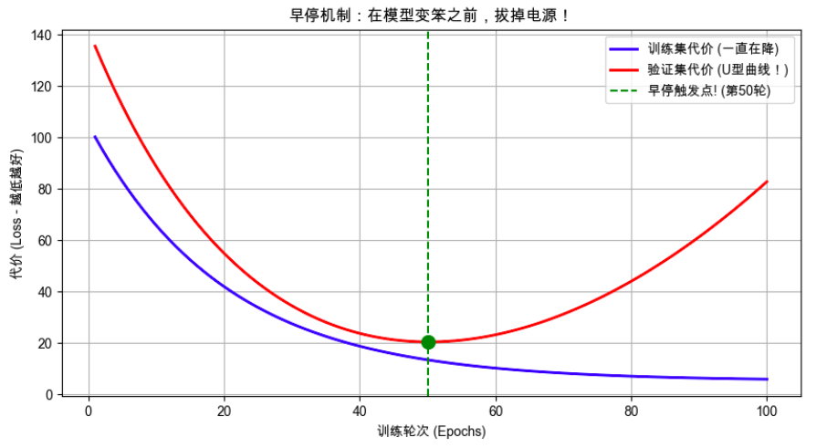

## 第1部分：搞清楚它是什么、为什么需要它（Why & What）

### 🎯 1.1 没有它之前，人们是怎么挣扎的？ _💡 核心必学_

**① 还原当时的麻烦：人们在哪一步被卡死了？**        
在早停机制普及之前，训练神经网络就像设定一个无法中途打开的微波炉。你设定让模型跑 1000 轮（Epochs）。      
跑完后，你发现模型在真实的“测试集”上表现极差。你一看记录，发现模型在第 200 轮的时候，其实已经达到了巅峰（极其聪明）。但在剩下的 800 轮里，它因为看了太多遍训练数据，开始疯狂死记硬背（过拟合），把规律给学歪了。    
在这一步，系统设计者被卡死了：**在训练开始前，人类根本无法预判到底第几轮才是“完美巅峰”。猜少了欠拟合，猜多了过拟合。**

**② 是什么让人不得不换一种思路？**      
“提前规定死训练轮次”在面对复杂非线性模型时是一场盲人摸象的赌博。这意味着必须放弃 **“限制死训练轮次”**的幼稚假设，必须转而依赖 **“把模型在验证集上的表现当作实时信号”** 来动态决定何时停止训练。

**③ 新旧方法的核心区别：哪个变量的位置被对调了？**

* 旧方法：**人类拍脑袋定的死轮次 (Epochs)** 是输入 → **不可控的过拟合/欠拟合结果** 是输出
* 新方法：**模型在模拟考（验证集）上的实时成绩** 是输入 → **动态决定何时立刻终止训练** 是输出

**④ 得到了什么，又必然失去了什么？**        
换来了 **“防过拟合”的能力 并 节省电费/算力**，但必然**不能准确知道训练所需时长**（你再也不知道这个模型是跑 10 分钟还是 10 个小时结束）

**⑤ 什么情况下它会不管用？你来推导**        
基于以上逻辑，你现在应该能回答：
1. 如果我在“早停”时，偷看的是“训练集（平时练习题）”而不是“验证集（全新模拟卷）”的成绩，这个机制还能防住过拟合吗？
    - 回答：**不能！因为模型的过拟合表现是针对全新数据（验证集）才会暴露出来的。如果你监控的是训练集的成绩，模型在训练集上的表现会一直提升，永远不会触发停止条件，最终还是会过拟合。**
2. 在梯度下降时，Cost 代价函数的下降往往是像心电图一样有波动的。如果我发现模拟考成绩只要有 **1 次** 下降，就立刻拔电源，这会引发什么灾难？
    - 回答：这会导致**模型过早停止训练，甚至在模型还处于欠拟合阶段时就被迫停止，没有找到真正的最佳参数，导致模型性能极差。**

---

### 🗺️ 1.2 概念地图：它在 ML 知识体系中的位置 _💡 核心必学_

```text
ML 知识体系
│
├─ 防止过拟合的工程手段 (Regularization Techniques)
│   │
│   ├─ 减少特征数量 / 降低模型复杂度
│   ├─ L1 / L2 正则化 (给参数加惩罚税)
│   └─ 早停机制 (Early Stopping) ← 你在这里！(时间层面的物理防线)
│       │
│       └─ 核心超参数：Patience (耐心值)
```

---

### 📚 1.3 学这个之前，你得先知道这几件事 _💡 核心必学_

──────────────────────────────────

📖 **前置概念回顾**

- **Epoch（轮次）**：把所有的训练数据从头到尾看一遍，叫 1 个 Epoch。
- **训练集 (Train Set) vs 验证集 (Validation Set)**：训练集是给机器日常做的“练习册”；验证集是绝对不给机器看答案、专门用来摸底测验的“全新模拟卷”。

──────────────────────────────────

### 🔩 1.4 一句话说清楚它的本质 _💡 核心必学_

「早停机制」的本质是：**在死循环训练中，一旦发现模型在“验证集”上的表现连续 $N$ 轮没有提升，就强行终止训练，并回滚到历史成绩最好的那一刻。**

---

### 💡 1.5 先不管公式，用感觉理解它 _💡 核心必学_


“早停”之所以叫“早”停，它的灵魂就在于一个“早”字！它绝对不是等模型学不动了才停，而是在模型“走火入魔”的前一秒，强行拔掉电源！

- **物理画面：** 学生依然在疯狂刷练习题（训练集）。但是！老师极其聪明，每隔一小时，就给他做一套 **“他从来没见过的全新模拟卷（验证集）”**。
- **触发条件：** 老师根本不看他练习题的分数是不是不再提升了。老师只盯着模拟卷的分数！
- **神级操作：**
    - 前两个小时：练习题分数提升，模拟卷分数也提升（很好，在学真本事）。
    - 第三个小时：练习题分数还在稳步提升（还在降 Loss），但是！模拟卷的分数突然开始下降了！
    - **立刻刹车！** 老师极其敏锐地发现：“他现在的练习题分数提升，靠的不是学懂了规律，而是在死记硬背练习题的特例！再练下去只会适得其反！” 于是老师当场没收练习题，提前终止训练。


#### 🎨 自己动手画出为什么需要早停



**📌 图像解读指南：**
- **蓝线**：训练集的 Cost。如果不拦着，机器会一直把它降到接近 0。
- **红线**：验证集的 Cost。你会发现它在第 40 轮左右达到了最低点（谷底），然后居然**开始掉头向上了**！这说明机器已经开始走火入魔。
- **绿虚线**：早停机制强制模型在这一刻停止，保留此时的脑子状态。

---

──────────────────────────────────

📚 **前置知识回顾**

──────────────────────────────────

本阶段会用到以下概念（已在第1部分学过）：
- **过拟合 (Overfitting)**：机器死记硬背，在训练集上拿满分，在验证集上考砸了（U型曲线掉头向上）。
- **验证集 (Validation Set)**：专门用来做模拟考、决定何时拔电源的数据集。

准备好了吗？我们要开始写这个“大堂经理”的底层逻辑了。

──────────────────────────────────

## 第2部分：它怎么运转、怎么动手用（How It Works & How to Use）

### ⚙️ 2.1 工作原理：为什么不能“只要变差一次，就立刻停”？ _💡 核心必学_

系统设计者在实现早停时，遇到了一个工程现实问题：**真实的 Loss 曲线根本不是完美的平滑曲线，而是充满了像心电图一样的“毛刺（局部震荡）”。**

如果你规定“只要验证集成绩比上一轮差一次，就立刻停”，那模型极大概率在第 5 轮遇到一个正常的“小颠簸”时就被腰斩了，此时它明明还没学到真本事！

为了解决这个问题，设计者引入了一个极其伟大的发明：**耐心值（Patience）**。
“大堂经理”允许你连续把菜炒砸几次，只要在耐心耗尽之前，你炒出了一次更好吃的，之前积攒的“砸锅次数”就一笔勾销（清零）！

**完整工作逻辑图（强制记忆）：**

```text
跑完第 N 个 Epoch
       │
       ▼
[算一下验证集 Loss]
       │
       ├─ 这次成绩比"历史最低分"还要低吗？
       │     │
       │     ├─ YES ──▶ [太棒了！更新历史最低分]
       │     │          [立刻把此刻的模型权重存进硬盘备用]
       │     │          [耐心值清零！]
       │     │
       │     └─ NO  ──▶ [没进步，耐心值 + 1]
       │                   │
       │                   ├─ 耐心值达到上限(如 Patience=5)了吗？
       │                   │     │
       │                   │     ├─ YES ──▶ [彻底失望，拔断电源！]
       │                   │     │          [从硬盘里加载最后一次存的最佳权重]
       │                   │     │
       │                   │     └─ NO  ──▶ [再给你次机会，继续跑下个 Epoch]
```


---

### 💻 2.2 最小MVP：用 20 行代码手撕一个早停管理器 _💡 核心必学_

在真实的 PyTorch 项目中，哪怕是大厂工程师，也经常自己手写下面这个极简版的 Early Stopping 类，因为它实在太好用了。

```python
# ── 第1步：打造 早停管理器 ───────────────────────
class EarlyStopper:
    def __init__(self, patience=3):
        self.patience = patience     # 允许连续考砸的次数
        self.counter = 0             # 当前连续考砸了多少次
        self.best_loss = float('inf')# 历史最低分（初始设为无穷大）
        self.best_weights = None     # 专门用来存"巅峰时刻"的脑子

    # 每次考完试，调用这个函数问问经理："我该停了吗？"
    def should_stop(self, current_val_loss, current_weights):
        if current_val_loss < self.best_loss:
            # 破纪录了！
            self.best_loss = current_val_loss
            self.best_weights = current_weights.copy() # 保存巅峰状态
            self.counter = 0                           # 耐心值清零
            return False
        else:
            # 没破纪录，增加考砸次数
            self.counter += 1
            if self.counter >= self.patience:
                return True  # 耐心耗尽，必须停！
            return False

# ── 第2步：在训练死循环中接入管理器 ───────────────────────
# 假设我们设定耐心值为 3 
stopper = EarlyStopper(patience=3)
model_weights = [0.0] # 假装这是模型参数

# 假装这是模型跑了 8 轮测出来的验证集 Loss 
# 注意看：第 4 轮是巅峰(2.0)，之后连差 3 次(2.1, 2.2, 2.5)
val_losses_history = [5.0, 4.0, 3.0, 2.0, 2.1, 2.2, 2.5, 1.0] 

for epoch, val_loss in enumerate(val_losses_history):
    # 【假装这里是前向传播、算梯度、更新 weights 的代码】
    model_weights = [val_loss * 2] # 假装权重在变化
    
    print(f"第 {epoch+1} 轮跑完，验证集 Loss: {val_loss}")
    
    # 🔴 核心：呼叫大堂经理
    if stopper.should_stop(val_loss, model_weights):
        print(f"🚫 触发早停！在第 {epoch+1} 轮强行掐断电源！")
        break

print(f"🏆 训练结束，最终交卷的完美参数属于 Loss={stopper.best_loss} 那一轮！")
```

---

### ✅ 2.4 工程规范：怎么写才算专业？避开会让你被骂的写法 _🔥 实战必备_

这里集中了早停机制最容易踩的坑。

**🔴 RED（强制规范）：绝不能用“测试集 (Test Set)”触发早停！**
- **违反会导致**：数据泄露（Data Leakage）。你的模型是通过不断“偷看”测试集来决定什么时候停的，这意味着早停的轮次是专门为了迎合这批测试集而挑出来的。最后汇报给老板的准确率是严重虚高的。
- **后果**：线上效果崩塌。
- **正确做法**：必须单独切出一个“验证集（Validation Set）”专门给大堂经理看。最后的“测试集”在早停完全结束后，只准跑一次做最终评估。

**🟡 YELLOW（强烈建议）：不要忘记“回滚（Restore Best Weights）”！**
- **现象**：很多新手写了早停，电源确实在第 50 轮被掐断了。然后新手极其开心地直接把此刻（第 50 轮）的模型拿去上线。
- **后果**：你被开除了！因为既然它在第 50 轮触发了早停（假设耐心是 5），说明它的巅峰期是在**第 45 轮**！第 50 轮的模型已经是个彻头彻尾的“过拟合智障”了。
- **建议做法**：触发 `break` 后，必须有一行代码把 `best_weights` 重新塞回模型脑子里。

**🟢 GREEN（推荐风格）：耐心值 (Patience) 设多少合适？**
- **规律**：学习率越小，模型下山越慢，曲线上的毛刺越多，你的 Patience 就必须设得越大（比如 10 到 20）。如果你步子迈得大，Patience 设 3 到 5 就够了。

---

──────────────────────────────────

🎓 **实战挑战**

──────────────────────────────────

经过这一路的学习，你已经被提拔为 AI 团队的主力架构师。      
今天，新来的实习生在用深度学习框架 Keras 训练一个极其昂贵的推荐系统模型。他写了下面这段配置代码交给你审核：

```python
from tensorflow.keras.callbacks import EarlyStopping

# 1. 实习生定义了早停回调函数
# monitor='loss' 意思是监控训练集代价
# patience=0 意思是只要不下降，哪怕颠簸了一丝丝，立刻停！
# restore_best_weights=False 意思是停了就停了，保留最后一刻的状态
es_callback = EarlyStopping(
    monitor='loss', 
    patience=0, 
    restore_best_weights=False
)

# 2. 开始训练，并把验证集传了进去
model.fit(
    X_train, y_train,
    epochs=1000,
    validation_data=(X_val, y_val),
    callbacks=[es_callback]
)
```

📝 **你的任务：**
如果你是架构师，看到这段代码里的 `EarlyStopping` 配置，你应该立刻指出他犯的 **3 个足以毁灭模型的严重配置错误**。
请列出这三个错误，并写出正确的参数值。

提交你的答案，我会为你进行最终的代码评审和结业反馈！
