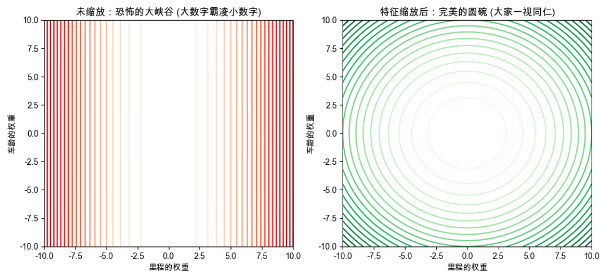

## 第1部分：搞清楚它是什么、为什么需要它（Why & What）

### 🎯 1.1 没有它之前，人们是怎么挣扎的？ _💡 核心必学_

**① 还原当时的麻烦：人们在哪一步被卡死了？**    
想象一个场景：你正在用梯度下降训练一个预测二手车价格的模型。你输入了两个特征：
- 特征 A：**行驶里程**（数值通常是 `120,000` 公里）
- 特征 B：**车龄**（数值通常是 `5` 年）

当你把这两个数字直接喂给机器去算代价函数时，因为里程数的绝对值比车龄大了整整 2 万倍！所以在计算梯度（坡度）时，“里程”产生的一丁点误差，都会被放大成一个极其巨大的数字；而“车龄”的误差则微小到几乎可以忽略不计。   
在这一步，系统设计者被卡死了：**大数字的特征完全剥夺了小数字特征的发言权，代价函数的曲面被严重拉扯成了一个极其狭长的“大峡谷”。机器在峡谷里疯狂撞墙，死活走不到谷底。**
  - **大特征是狭窄的方向，小特征是宽广的方向。** 因为根据预测值的公式来看，大特征的权重移动一点点，整个误差会变动特别多。

**② 是什么让人不得不换一种思路？**    
为了让机器能顺利找到谷底，系统设计者们想：**如果我能把所有特征都压缩到同一个尺寸上，机器就不会被大数字吓到，也不会忽略小数字了！**。换句话说，**去掉数字的物理单位（即：现实意义）后，每个权重对误差的影响就变得相对平等了（变成了纯粹的数学比例尺）**，代价函数的曲面变得圆润了，机器就能顺利沿着坡度找到谷底了！


**③ 新旧方法的核心区别：哪个变量的位置被对调了？**

* 旧范式：参差不齐的原始物理数值 是输入 → 崎岖畸形的代价曲面与极慢的训练 是输出
* 新范式：被强制压扁拉长的无单位纯数字 是输入 → 完美圆润的代价曲面与极速的收敛 是输出

**④ 得到了什么，又必然失去了什么？**      
换来了**所有特征在数学空间里的绝对平等、以及模型训练速度的百倍提升**，但必然失去**数据的直观可读性**（缩放后，一套 `120平米` 的房子在数据里可能变成了 `0.85`，人类根本看不懂这是多大）。

---

### 🗺️ 1.2 概念地图：它在 ML 知识体系中的位置 _💡 核心必学_

```text
ML 知识体系
│
├─ 数据预处理 (Data Preprocessing)
│   │
│   ├─ 数据清洗 (去重、填补缺失值)
│   ├─ 数据矢量化 (把文字变数字，上一节刚学)
│   │
│   └─ 特征缩放 (Feature Scaling) ← 你在这里！
│       ├─ 标准化 (Standardization / Z-score) 
│       └─ 归一化 (Normalization / Min-Max)
│
└─ 模型训练 (如果没有特征缩放，这里的梯度下降就会崩溃)
```

---

### 📚 1.3 学这个之前，你得先知道这几件事 _💡 核心必学_

──────────────────────────────────

📖 **前置概念回顾：梯度下降的“碗”**

- **是什么**：我们在讲梯度下降时画过的那个寻找谷底的抛物线曲面。
- **为什么需要它**：特征缩放唯一的终极目的，就是为了改变这个“碗”的形状，让机器下山下得更舒服。

──────────────────────────────────

### 🔩 1.4 一句话说清楚它的本质 _💡 核心必学_

「特征缩放」的本质是：**剥离特征的物理单位和绝对大小，把他们压缩到同一个尺度上，让机器在数学空间里公平地比较每个特征的权重对误差的影响，从而让代价函数的曲面变得圆润，机器能顺利找到谷底。**


后面所有的例子和代码，都是在验证这句话，而不是在解释它。

---

### 💡 1.5 先不管公式，用感觉理解它 _💡 核心必学_

**奥运会十项全能的类比**：    
想象你要评选出一个“世界上身体综合素质最强的人”。    
参赛者比两项：**100米短跑** 和 **1500米长跑**。
- 选手 A：100米跑了 10秒，1500米跑了 300秒。原始总分 = 310。
- 选手 B：100米跑了 15秒（极慢），1500米跑了 290秒。原始总分 = 305。

如果机器直接把原始数字相加，机器会觉得 B 选手的总时长更短（305 < 310），所以 B 赢了！   
**这简直荒谬！** 100米短跑差了 5 秒，那可是世界冠军和普通人的差距；而 1500米差 10 秒，只不过是多喘两口气的区别。但因为 1500米的**绝对数字太大**，它直接在总分里“霸凌”了 100米的成绩。

**特征缩放，就是奥委会引入的“标准积分换算表”**。    
不管你是跑了 10秒还是 300秒，全给我换算成 0 到 100 之间的标准分。大家都在同一个维度里比拼，谁也别想靠数字大欺负人！

#### 🎨 自己动手画出缩放带来的“整容级”改变

在任何 Python 环境（如 Colab）运行这段代码，你会亲眼看到特征缩放是如何把一个畸形的峡谷，变成一口完美的碗的：

```python
# 🎨 运行这段代码，亲眼见证特征缩放对模型底层几何空间的“整容”
import matplotlib.pyplot as plt
import numpy as np

# 假设 W1 是里程权重的尝试范围，W2 是车龄权重的尝试范围
W1 = np.linspace(-10, 10, 100)
W2 = np.linspace(-10, 10, 100)
W1_grid, W2_grid = np.meshgrid(W1, W2)

# 1. 没有缩放时：里程数极大，导致 W1 方向的误差被疯狂放大
# 代价函数变成了一个极其狭长的椭圆（峡谷）
cost_unscaled = (W1_grid * 100)**2 + (W2_grid * 1)**2 

# 2. 缩放后：里程和车龄被压缩到了同样的尺度
# 代价函数变成了一个完美的同心圆（正碗）
cost_scaled = (W1_grid * 1)**2 + (W2_grid * 1)**2 

fig, (ax1, ax2) = plt.subplots(1, 2, figsize=(12, 5))

# 画图：未缩放的峡谷
ax1.contour(W1_grid, W2_grid, cost_unscaled, levels=20, cmap='Reds')
ax1.set_title("未缩放：恐怖的大峡谷 (大数字霸凌小数字)")
ax1.set_xlabel("里程的权重")
ax1.set_ylabel("车龄的权重")

# 画图：缩放后的完美圆碗
ax2.contour(W1_grid, W2_grid, cost_scaled, levels=20, cmap='Greens')
ax2.set_title("特征缩放后：完美的圆碗 (大家一视同仁)")
ax2.set_xlabel("里程的权重")
ax2.set_ylabel("车龄的权重")

plt.show()
```



**📌 图像解读指南：**
- **左边的红图（未缩放）**：想象一下你是一颗找谷底的球（梯度下降）。在这个极其狭长陡峭的峡谷里，你只会撞来撞去，死活滚不到中间！这就是为什么不缩放数据，Cost 会变成 `NaN` 或者死活降不下去。
- **右边的绿图（缩放后）**：完美的同心圆！无论你被扔在这个碗的哪个角落，你脚下的坡度（梯度）都会极其精准地指向最中心的谷底。你只需要顺着坡，大步流星，瞬间就能走到正确答案！

---

──────────────────────────────────

📚 **前置知识回顾**

──────────────────────────────────

本阶段会用到以下概念（已在前面的章节学过）：
- **特征 (Feature)**：相亲表上的每一栏（比如里程、车龄）。
- **梯度下降的碗**：机器寻找最优解的地形。如果不缩放，地形是畸形的峡谷；缩放后，是完美的圆碗。
- **训练集 vs 测试集**：平时练习题 vs 最终高考卷。

准备好了吗？我们将进入真实工程中对数据动刀子的核心环节。

──────────────────────────────────

## 第2部分：它怎么运转、怎么选、怎么写代码（How It Works & How to Use）

### ⚙️ 2.1 工作原理：怎么把几百万的数字优雅地压扁？ _💡 核心必学_

把数据变小，工业界主要有两套不同的“压扁模具”。我们用极其简单的数据：`[10, 20, 30]` 来说明。

**方法 1：Min-Max 归一化 (Normalization)**    
- **公式：** $$X_{norm} = \frac{X - X_{min}}{X_{max} - X_{min}}$$
- 我们用上帝视角把这个公式大卸八块：
  - 分母 ($X_{max} - X_{min}$)： 这叫数据的 **“极差”或“最大跨度”**。它丈量了这组数据从头到尾到底有多长。
  - 分子 ($X - X_{min}$)： 这叫 **“平移对齐”**。它算的是当前这个数，距离这组数据的“垫底值（最小值）”走出了多远。
  - 相除的本质： 把分子除以分母，其实就是在算一个 **“百分比进度”**！它在问：“当前这个数，在这个特征的整体跨度里，排在百分之多少的位置？”
- **数字演示：**
  - 10 是（10-10）/（30-10），变成0
  - 20 是（20-10）/（30-10），变成0.5
  - 30 是（30-10）/（30-10），变成1

**方法 2：Z-score 标准化 (Standardization)**
- **它在想什么**：我不规定死你的上下限，但我要求所有数据的**平均值必须是 0，大部分人都集中在 -1 到 1 之间**。
- **怎么做**：算出所有人的平均分，把每个人的分数减去平均分（让中心移到 0）。然后再除以“标准差”（看大家分得多散，把胖子捏瘦）。
- **数字演示**：`[10, 20, 30]`。平均值是 20，标准差是 8.16。
  - 20 是平均水平，变成 0。
  - 30 比平均高一点，变成 1.22。
  - 10 比平均低一点，变成 -1.22。
  - 最终结果：`[-1.22, 0, 1.22]`。


---

### 💻 2.2 最小MVP：动手写代码，体验瞬间压扁 _💡 核心必学_

在真实的 Python 工程里，你绝对不需要手写上面的公式。我们用 ML 标配库 `Sklearn`，3 行代码搞定。

```python
# ── 第1步：准备参差不齐的数据 ──────────────────────────────
from sklearn.preprocessing import MinMaxScaler, StandardScaler
import numpy as np

# 假设这是 3 辆二手车的数据：[里程数(极大), 车龄(极小)]
X = np.array([
    [120000, 5],
    [80000,  3],
    [150000, 8]
])

# ── 第2步：Min-Max 归一化 (压成 0~1) ───────────────────────
min_max_scaler = MinMaxScaler()
# fit_transform 意思是：先扫一遍数据找出最大最小值(fit)，然后立刻压缩(transform)
X_minmax = min_max_scaler.fit_transform(X)

print("🔽 Min-Max 归一化结果 (全在0~1之间)：")
print(X_minmax)
# 输出：
# [[0.57  0.4 ]
#  [0.    0.  ]
#  [1.    1.  ]]  <- 150000 和 8 是各自列的最大值，都变成了 1！

# ── 第3步：Z-score 标准化 (以 0 为中心) ─────────────────────
standard_scaler = StandardScaler()
X_standard = standard_scaler.fit_transform(X)

print("\n🎯 Z-score 标准化结果 (平均值为0，有正有负)：")
print(X_standard)
# 机器现在看这两列数据，再也没有大小歧视了！
```

---

### 🌍 2.3 真实世界里，它被用在什么地方？ _💡 核心必学_

**场景：房价预测系统**    
你有极其繁杂的特征：房间数（1~5）、面积（50~300平米）、距离市中心距离（0.5~50公里）、总价（百万级）。如果你要用**神经网络**或者**线性回归（带梯度下降）**，使用特征缩放是**活命的前提**。

**使用指南（什么算法必须用，什么算法坚决不用）：**

```text
算法对“数据绝对大小”敏感吗？
    │
    ├─ 敏感（底层靠算距离、算坡度的算法）
    │       ├─ 神经网络 (深度学习) ──▶ 必须缩放！不缩放必死！
    │       ├─ 线性回归 / 逻辑回归 (用梯度下降时) ──▶ 必须缩放！
    │       ├─ KNN (算两点之间的物理距离) ──▶ 必须缩放！
    │       └─ K-Means 聚类 (算中心点距离) ──▶ 必须缩放！
    │
    └─ 不敏感（底层靠问“是/否”做切分的算法）
            ├─ 决策树 (Decision Tree) ──▶ ❌ 坚决不需要！
            ├─ 随机森林 (Random Forest) ──▶ ❌ 坚决不需要！
            └─ XGBoost / LightGBM ──▶ ❌ 坚决不需要！
            (解释：因为树模型只问“里程>10万吗？”，数字是10万还是0.8对它完全没区别)
```

---

### ✅ 2.4 工程规范：怎么写才算专业？避开会让你被骂的写法 _🔥 实战必备_

这里藏着特征缩放里最致命、也是面试必考的终极红线。

**🔴 RED（强制规范）：永远、永远不要把训练集和测试集拼在一起做缩放！**
- **违反会导致**：灾难性的**数据泄露（Data Leakage）**。如果你把测试集（高考卷）的数据也加进来一起算“最大值”或者“平均值”，等于你让模型在学习时，偷偷获取了未来数据的分布信息。你的模型在线下测试时准确率高达 99%，一上线遇到真正的全新数据，立刻变成智障。
- **后果**：你的模型报废，严重影响线上业务。
- **正确做法**：只有 `X_train` 有资格做 `fit`（量体裁衣找出最大值/平均值），`X_test` 只能卑微地沿用训练集量好的尺子去做 `transform`（强行套衣服）。

```python
# ❌ 错误示范：把数据混在一起量尺子（数据泄露！）
scaler = StandardScaler()
X_all_scaled = scaler.fit_transform(X_all) # 绝对禁止！

# ✅ 黄金准则代码：尺子只能在训练集上打造！
scaler = StandardScaler()

# 第一步：只在训练集上找平均值/标准差，并转换训练集
X_train_scaled = scaler.fit_transform(X_train) 

# 第二步：测试集绝不准 fit！只能老老实实沿用训练集打造好的 scaler 尺子去转换！
X_test_scaled = scaler.transform(X_test) 
```

**🟡 YELLOW（强烈建议）：在使用 Min-Max 归一化之前，先干掉极端异常值！**
- **现象**：你的房价数据里，99套房子面积在 50~200 平米。但有一套因为录入错误写成了 200,000 平米。
- **后果**：由于 Min-Max 极其依赖“最大值”，那套 20万平米的异常房子会占据 `1.0` 的位置，而剩下 99 套正常的房子会被疯狂挤压，全部变成 `0.001`, `0.002`。整个数据彻底失去区分度。
- **建议做法**：如果有极端异常值，要么提前用清洗脚本删掉，要么换用抗造的 `RobustScaler`（下面会讲）。

---

### 🔄 2.5 有好几种缩放方法，到底该怎么选？ _⭐ 进阶选学_

真实业务中，最常用的就三种。一张表帮你理清：

| 对比维度 | StandardScaler (标准化 Z-score) | MinMaxScaler (归一化 0~1) | RobustScaler (鲁棒缩放) |
| :--- | :--- | :--- | :--- |
| **它做了什么** | 让平均变成 0，把胖瘦捏匀 | 强行把上下限卡死在 0 和 1 之间 | 用“中位数”代替平均数进行缩放 |
| **对极端异常值的容忍度** | 较弱（异常值会拉偏平均分） | **极差（一粒老鼠屎毁了一锅汤）** | **极强（完全无视极端数字）** |
| **是否破坏原有数据分布** | 不破坏（只是平移和缩放） | 不破坏 | 不破坏 |
| **推荐场景** | **⭐ 90% 算法的默认首选** | 图像处理(像素本就是0~255)、神经网络的某些特定层 | 你的数据极脏，没空清理异常值时 |

**🌳 工业界决策树（保存下来，以后照着选）：**

```text 
你的算法需要特征缩放吗？ (参考 2.3 节)
    │
    ├─ NO ──▶ (树模型) 保持原样，直接送进模型。
    │
    └─ YES ──▶ 你的数据是什么类型？
            │
            ├─ 图像像素点 ──▶ 选 MinMaxScaler (直接除以 255 更简单)
            │
            ├─ 数据极其脏，充满离谱的极端值且不能删 ──▶ 选 RobustScaler
            │
            └─ 常规数据（电商特征、房价特征等）──▶ 闭着眼睛选 StandardScaler！
```

---

──────────────────────────────────

📚 **前置知识回顾**

──────────────────────────────────

本阶段会用到以下概念（我们在前两节刚学过）：
- **数据泄露 (Data Leakage)**：偷看高考卷（测试集）来定做缩放尺子。
- **独热编码 (One-Hot)**：把类别（如城市）变成 `[0, 1, 0]` 的数组。
- **目标值 $y$**：你要预测的最终结果（比如真实的房价）。

准备好了吗？我们将进入特征缩放最容易让人“社死”的高阶雷区。

──────────────────────────────────

## 第3部分：哪里容易出错、怎么做得更好（What to Avoid & Beyond）

### ⚠️ 3.1 大多数人在哪里栽了跟头？ _🔥 实战必备_

我们在 2.4 节强调了绝对不能“把测试集混进去一起量尺子”。但这只是第一层坑。在真实的复杂业务中，还有两个极其隐蔽的陷阱。

#### 陷阱 1：忘了“解压缩”最终的预测结果

**💥 现象**：   
老板让你预测明天某款鞋子的销量。你非常严谨地对特征 $X$ 做了缩放，为了让神经网络收敛得更好，你甚至把目标值 $y$（历史销量，比如 `5000` 双）也做了 `MinMaxScaler` 缩放。   
模型训练得极其完美。第二天，你把预测结果发给老板：“老板，明天的销量预测出来了，是 **`0.85`** 双！”
老板以为公司要破产了。

**🔍 根本原因**：   
如果你对预测目标 $y$ 也做了缩放（把它压扁到了 0~1 之间），模型吐出来的答案自然也是 0~1 之间的纯小数。机器并不知道原本的物理单位是多少，它只对数字负责。

**✅ 修复方案**：   
怎么压扁的，就必须怎么“吹起来”！`Sklearn` 的每一个 Scaler 都自带一个“解药”函数：`inverse_transform`（反向转换）。

```python
# ✅ 修复版本：还原物理世界的真实面貌
from sklearn.preprocessing import MinMaxScaler
import numpy as np

# 假装这是目标值 y_train (真实销量 1000~5000)
y_train = np.array([[1000], [3000], [5000]])

# 打造一把专门量 y 的尺子，并压扁它
scaler_y = MinMaxScaler()
y_train_scaled = scaler_y.fit_transform(y_train)

# --- 假装模型训练完毕，给出了明天的预测结果 ---
# 预测出来的值是 0.85
predictions_scaled = np.array([[0.85]]) 

# 🔴 关键一步：用同一把尺子，把 0.85 还原成真实的销量！
real_predictions = scaler_y.inverse_transform(predictions_scaled)

print(f"老板，明天的真实预测销量是：{real_predictions[0][0]:.0f} 双！") 
# 预期输出: 4400 双。危机解除！
```

---

#### 陷阱 2：把“独热编码（One-Hot）”也给标准化了

**💥 现象**：   
你的相亲数据里有两列：【年薪（数十万），性别（男0，女1）】。    
你写了一行 `StandardScaler().fit_transform(X)`，把所有列同时打包做标准化。    
突然，电脑风扇狂转，原本只占 10MB 的数据，瞬间把 16GB 的内存全部撑爆（OOM 崩溃）。

**🔍 根本原因**：   
你用独热编码生成了大量的 `0` 和 `1`。在底层，这种全是 `0` 的矩阵叫**稀疏矩阵**，它在内存里是不占用空间的（机器只记 `1` 的位置）。   
当你用 `StandardScaler` 去减平均值时，比如性别的平均值是 `0.5`，所有的 `0` 减去 `0.5` 后变成了 `-0.5`。   
**完蛋了！所有的 `0` 都变成了非零的小数！** 稀疏矩阵瞬间变成了极其庞大的密集矩阵（稠密矩阵），你的内存直接被几百亿个 `-0.5` 给活活撑爆。而且，把性别变成 `-0.5` 和 `0.5`，在逻辑上毫无意义。

**✅ 修复方案**：   
**井水不犯河水。** 连续的数值（年薪、面积）才需要缩放；离散的类别（0 和 1 的独热编码）坚决不缩放！你需要分开处理它们（在 3.3 节我会教你怎么用流水线自动化解决）。

---

### 🧪 3.2 模型出问题了，怎么一步步找原因？ _🔥 实战必备_

当特征缩放引发惨案时，按照这张图去排查：

```text
特征缩放故障排查树
    │
    ├─ 预测出来的房价全是 0.几，或者负数？
    │       └─ 💊 诊断：你对 y 做了缩放，但忘了还原。
    │           👉 处方：使用 `scaler_y.inverse_transform(predictions)`。
    │
    ├─ 线下测试集准确率 95%，一上线新数据准确率 50%？
    │       └─ 💊 诊断：典型的数据泄露。
    │           👉 处方：检查代码，绝对是你在切分 `train_test_split` 之前，就手贱对全局的 X 做了一次整体的 `fit_transform`。
    │
    └─ 数据集一做缩放，内存就立刻爆炸？
            └─ 💊 诊断：你破坏了 One-Hot 编码的稀疏性。
                👉 处方：停止对包含极多 0 的特征列做 StandardScaler。
```

---

### 🚀 3.3 如果要用在真实项目里，该怎么做？ _⭐ 进阶选学_

前面我们提到：既要防止测试集“数据泄露”，又要防止“数值和独热编码混在一起缩放”。如果纯靠手写代码去分离、拼接，极其容易出错。


工业界的最优解是使用 `sklearn.pipeline.Pipeline`（流水线）。它像一条物理传送带，完美封装了所有步骤，彻底杜绝数据泄露。

**大厂工程师都是这么写代码的：**

```python
from sklearn.pipeline import Pipeline
from sklearn.preprocessing import StandardScaler
from sklearn.linear_model import LogisticRegression
from sklearn.model_selection import train_test_split
import numpy as np

# 假装有 100 个样本，2 个特征
X = np.random.rand(100, 2) * 1000 
y = np.random.randint(0, 2, 100)

X_train, X_test, y_train, y_test = train_test_split(X, y, test_size=0.2)

# 🌟 生产级流水线：第一步缩放，第二步训练。全部绑在一起！
# Pipeline 的超级魔力在于：
# 当你调用 fit 时，它知道 StandardScaler 只能在 X_train 上 fit。
# 当你调用 predict 时，它会自动只让 X_test 做 transform！绝对不泄露！
my_pipeline = Pipeline([
    ('scaler', StandardScaler()),       # 工序 1：压扁数据
    ('model', LogisticRegression())     # 工序 2：训练模型
])

# 只需要对流水线发号施令：
my_pipeline.fit(X_train, y_train) 

# 测试时，直接丢原始数据进去，流水线会自动帮你做缩放后再预测！
accuracy = my_pipeline.score(X_test, y_test)
print(f"安全、规范、无泄露的最终得分：{accuracy * 100:.1f}%")
```

──────────────────────────────────

🎓 **实战挑战：来试试看自己解决一个真实问题**

──────────────────────────────────

你正在交接一个离职同事的项目。这个项目是预测“工厂机器磨损程度（一个 0 到 100 之间的分数）”。    
特征是两个极其庞大的机器传感器读数：`[温度, 振动频率]`。    
离职同事留下了下面这段代码，并信誓旦旦地说：“我做了特征缩放，测试过了，预测出来的磨损程度非常准，可以直接接上公司的前端大屏展示了！”

**请你作为系统设计者，审查这段代码。找出里面会导致线上大屏展示出“极其离谱数字”的 2 个致命错误。**

```python
import numpy as np
from sklearn.preprocessing import MinMaxScaler
from sklearn.model_selection import train_test_split
from sklearn.linear_model import LinearRegression

# 1. 准备数据 (假装有 1000 台机器)
X = np.random.rand(1000, 2) * 5000  # 温度和振动频率
y = np.random.rand(1000, 1) * 100   # 真实磨损程度 (0~100)

# ⚠️ 注意离职同事接下来的操作顺序！
# 错误预警 1：
scaler_X = MinMaxScaler()
X_scaled = scaler_X.fit_transform(X)

scaler_y = MinMaxScaler()
y_scaled = scaler_y.fit_transform(y)

# 切分数据
X_train, X_test, y_train, y_test = train_test_split(X_scaled, y_scaled, test_size=0.2)

# 训练模型
model = LinearRegression()
model.fit(X_train, y_train)

# 错误预警 2：前端大屏马上要拿 test_predictions 去展示了
test_predictions = model.predict(X_test)
print(f"老大，第一台机器预测的磨损度是：{test_predictions[0][0]}") 
# 打印结果：0.65 
# 同事说："你看，磨损度是 0.65 分，非常健康！"
```

📝 **请在回复中提交你的答案：**
1. 错误 1（关于数据切分和缩放的顺序）：他在哪一步犯了什么严重禁忌？会导致什么后果？
2. 错误 2（关于最后打印的 `0.65`）：如果前端大屏真的显示磨损度为 `0.65`，为什么这其实是个弥天大谎？真实的磨损度到底是多少（大致逻辑是什么）？怎么修改代码才能得到真实的预测结果？

提交你的答案，我会进行最终的代码评审和结业反馈！