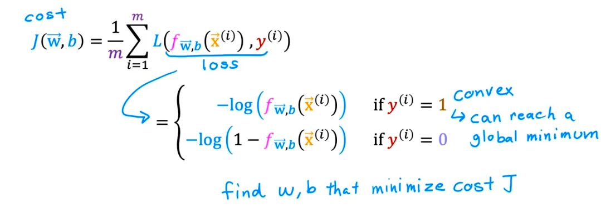

「逻辑回归的代价函数」（它在工程中常被称为**对数损失 Log Loss** 或**交叉熵损失 Cross-Entropy Loss**）！

它是一个用来衡量模型在做“非黑即白”的选择时，到底“有多自信却猜错了”的惩罚计分板。


## 第1部分：建立认知（Why & What）

### 🎯 1.1 问题动机：还原发明者面对的困境现场

假设你面临一个真实的医疗诊断场景：你要训练一个机器，根据肿瘤大小预测病人是否患有恶性肿瘤（患病记为真实答案 `1`，未患病记为 `0`）。

**困境重建：**       
起初，程序员尝试用预测房价的旧方法—— **均方误差（MSE，算物理距离）** 来解决这个问题。由于逻辑回归的输出是 $0\%$ 到 $100\%$ 的概率，当一个病人确实患癌（真实值 $= 1$），但模型由于刚开始训练，非常愚蠢且自信地预测他患癌的概率是 $0.0001$ 时。        
如果我们算均方误差的惩罚分数：$(1 - 0.0001)^2 \approx 0.9998$ 分。  

**发现致命失败了吗？** 这是一个会出人命的漏诊错误（100% 错判），但模型受到的惩罚最高只有区区 1 分！模型根本感觉不到痛，它会觉得“我只差了 1 的距离，问题不大”，导致模型需要几周时间才能缓慢纠正这个致命错误，甚至彻底卡死在错误的参数上无法动弹（梯度消失）。所以，逻辑回归的代价函数不用均方误差的原因有两点：
- **逻辑回归的均方误差函数属于非凸函数，存在很多局部最小点，不利于寻找最优点**
- 真实值和预测值之间的偏差用均方误差来算，最终结果太小，**惩罚太小，参数更新极慢**

**发明压力：**           
旧方法在处理概率分类时必然失败，因为它的根本假设是**“误差是线性的物理距离”**，而现实是 **“在生死攸关的分类问题上，绝对的错误应该受到近乎毁灭性的惩罚”**。这意味着必须放弃“把误差当作物理距离来计算”这个理所当然的前提。具体来说：

- **情况 A：真实标签 $y=1$**
模型输出：
  - $\hat{y}=0.9$：很好
  - $\hat{y}=0.6$：还行
  - $\hat{y}=0.1$：很差

- **情况 B：真实标签 $y=0$**
模型输出：
  - $\hat{y}=0.1$：很好
  - $\hat{y}=0.4$：一般
  - $\hat{y}=0.95$：很差

所以代价函数本质上是在做这件事： 奖励“给正确类别高概率”，惩罚“给错误类别高概率”。

---

**范式跳跃：**       
逻辑回归的代价函数让我们从 **[计算物理距离]** 变成了 **[测算盲目自信被打脸的程度]**。

### 🗺️ 1.2 概念地图：它在 ML 知识体系中的位置

```text
ML 知识体系
│
├─ 模型评估与优化 (Loss Functions)
│   │
│   ├─ 回归问题损失：均方误差 MSE (算距离)
│   │
│   └─ 分类问题损失
│       │
│       ├─ 逻辑回归代价函数 / 对数损失 ← 你在这里
│       │   └─ 多分类变种：分类交叉熵
│       │
│       └─ 铰链损失 Hinge Loss (支持向量机 SVM 用)

```

### 📚 1.3 前置概念补充：使用前必须知道的基础

──────────────────────────────────      
📖 **前置概念：逻辑回归的输出 (Sigmoid)**
──────────────────────────────────      
- **是什么：** 逻辑回归虽然叫“回归”，但它其实是个分类器。它内部有一个叫 Sigmoid 的门控机制，会把任何数字都死死地压缩在 0 到 1 之间。
- **最小示例：** 它不会输出“是”或“否”，也不会输出 `5.8`，它只会输出诸如 `0.85`（意思是：我有 85% 的把握认为是 1 类）。
- **为什么需要它：** 代价函数就是专门为了这种“0到1之间的概率数字”量身定制的判分系统。
──────────────────────────────────      

### 💡 1.4 直觉建立：结构翻转与代价揭示

这是新旧范式的核心差异点：

**旧范式（均方误差）：** [预测数值] 和 [真实数值] 是输入 ──▶ **[两者的物理距离平方]** 是输出  
**新范式（对数损失）：** [预测的概率] 和 [真实类别] 是输入 ──▶ **[被现实打脸的惊讶程度（惩罚值）]** 是输出

**翻转的含义：我们不再惩罚“距离”，而是狠狠地惩罚“盲目自信的错误”。**

**代价揭示：**
换来了 **[能够对致命错误施加无限大惩罚，且在数学图形上绝对平滑（凸函数）、永不卡死的能力]**，但必然失去 **[直观的物理可解释性]**。这不是缺陷，是因为你要惩罚“惊讶程度”，所以代价分数算出来可能是 `0.693` 或者 `14.5`，你无法直观地向老板解释“0.693”对应什么物理意义，你只需要知道：数字越小，模型越准。

**生活类比：天气预报员的惩罚**
把代价函数想象成电视台台长对天气预报员的“扣钱规则”：

* **极端情况1（极度自信且猜对）：** 预报员说“明天 99.9% 降雨”，结果真的下雨了。台长很满意，**惩罚 = 0**。
* **中间情况（含糊其辞）：** 预报员说“明天 50% 降雨”，结果下雨了。台长觉得你说了等于没说，**惩罚 = 适中**（扣点工资）。
* **极端情况2（盲目自信且猜错）：** 预报员说“明天 0.001% 降雨，绝对不可能下！”，结果下暴雨把城市淹了。台长震怒，**惩罚 = 无限大**（直接开除）。

**图示：惩罚分数的变化曲线**

```text
真实答案是 1（今天确实下雨了）时的惩罚曲线：

惩罚分数 (Loss)
  ↑ 
  │* (无限大的惩罚！)
  │ *
  │  *
  │   *
  │     *
  │       *
  │          *
  │               * │                     * * * * 0 (完全不惩罚)
  └──────────────────────────────→ 预报员说的下雨概率
  0.0               0.5              1.0
(极其自信不下雨)                   (极其自信下雨)

```

### 🔢 1.5 数学解读：公式是直觉的速记符号（⭐ 进阶选学，可先跳过）

上面讲的“台长扣工资逻辑”，数学家觉得每次都要分两种情况（真下雨/真没下雨）来写太麻烦了，于是他们发明了一个绝妙的“数学 If-Else 语句”。

公式(对**单个样本**）：
$Cost = L(y, \hat{y}) -[ y \cdot \log(\hat{y}) + (1 - y) \cdot \log(1 - \hat{y}) ]$

**翻译拆解：**
- $y$ = 真实答案（只能是 `1` 或 `0`）
- $\hat{y}$ = 模型预测的概率（`0` 到 `1` 之间，比如 `0.9`）
- $\log$ = 对数函数（在这里它的作用就是：输入数字越接近 0，输出的负数就越大，用来制造“无限大”的惩罚）
- $-$ = 最外面的负号是为了把里面算出来的负数变成正的“罚分”

**直觉验证（为什么这个公式极其聪明）：**
仔细看公式的加号 `+` 左右两边。

* **如果真实答案 $y = 1$：**
  公式右半边会变成 $(1 - 1) \times \dots = 0$，直接消失！
  只剩下左半边：$-\log(\hat{y})$。如果你预测概率 $\hat{y}$ 很小（瞎猜），$\log$ 就会输出极大的负数，负负得正，变成**巨大惩罚**。
* **如果真实答案 $y = 0$：**
  公式左半边会变成 $0 \times \dots = 0$，直接消失！
  只剩下右半边：$-\log(1 - \hat{y})$。由它来专门负责计算 $0$ 类的惩罚。

一行公式，完美融合了两种情况的计分规则！以下是**代价函数公式：**
$$J(\vec{w},b) = \frac{1}{m} \sum L(y, \hat{y})$$


──────────────────────────────────    
🧠 **边界预测测试**    
──────────────────────────────────      
基于你刚才学到的逻辑，试着回答：
- 为什么逻辑回归绝对不能使用均方误差（MSE）作为代价函数？（提示：从“惩罚力度”的角度想）
- 如果一个模型的预测概率永远输出 `0.5`（就像抛硬币），它的代价分数会是 0 还是无穷大？为什么？

（不用查资料，用你刚建立的直觉推导）

很高兴你选择继续！

在进入第2部分之前，让我快速揭晓一下上一部分【边界预测测试】的标准答案，看看你的直觉是否准确：

1. **为什么不能用 MSE？** 因为当模型极其自信且错误时，MSE 的最大惩罚只有 1（比如 $(1-0)^2$），这让模型“感觉不到痛”，在更新参数时会像陷入泥潭一样慢（也就是著名的“梯度消失”问题）。
2. **如果一直输出 0.5 呢？** 代价分数既不是 0 也不是无穷大，而是一个中等的值（大约 0.69）。它代表一种“无功无过、不偏不倚的困惑状态”。

---

## 第2部分：理解与实践（How It Works & How to Use）

🔍 **前置知识检查**
──────────────────────────────────      
本阶段会用到以下概念（已在阶段1学过）：
- **模型预测概率（$\hat{y}$）**：模型输出的 0~1 之间的自信程度。
- **真实标签（$y$）**：现实世界的真实答案（0 或 1）。

如果不记得了，请随时打断我！      
──────────────────────────────────      

### ⚙️ 2.1 工作原理：它内部是怎么运转的 💡 *核心必学*

我们来玩一个数字游戏，手动模拟一下代价函数是如何“判分”的。假设真实情况是 **病人确实患病（$y = 1$）**。

[计算流程演示]

```text
输入：真实标签 y = 1

          模型预测概率 (y_hat)
               │
    ├──────────┴──────────┐
  预测 0.9 (很准)       预测 0.1 (大错特错)
    │                     │
    ▼                     ▼
[计算公式：-log(y_hat)]  [计算公式：-log(y_hat)]
    │                     │
    ▼                     ▼
  -log(0.9)             -log(0.1)
    │                     │
    ▼                     ▼
输出：惩罚 0.105 分     输出：惩罚 2.302 分

```

**为什么这么做？**
看！仅仅是因为模型从“90%的确信”变成了“10%的误判”，惩罚分数就瞬间**飙升了 22 倍**！如果预测概率变成 0.001，惩罚会飙升到近乎无限大。
这就是代价函数在训练阶段的工作原理：它通过计算出一个巨大的惩罚值（Loss），顺着网络反向传递，像一记响亮的耳光打在模型的参数上，逼迫模型下一次千万别再犯这种“盲目自信的致命错误”。

### 💻 2.2 代码实战：从零跑出第一个结果 💡 *核心必学*

在实际工程中，我们不需要手动写对数公式。Scikit-learn 已经帮我们打包好了这个计分板，它叫 `log_loss`。

```python
import numpy as np
from sklearn.linear_model import LogisticRegression
from sklearn.metrics import log_loss

# ── 第1步：准备数据 ──────────────────────────────
# 说明：这里用极简数据。X 是学习时间，y 是是否及格（1为及格，0为不及格）
X = np.array([[1], [2], [5], [8], [10]])  # 特征：学习小时数
y = np.array([0, 0, 1, 1, 1])             # 标签：考试结果

# ── 第2步：创建并训练模型 ───────────────────────
# 说明：逻辑回归在内部 fit 的时候，就是在不断降低咱们刚才讲的“对数损失”
model = LogisticRegression()
model.fit(X, y)

# ── 第3步：获取“概率输出”并计算代价 ─────────────
# 注意：我们不能只拿“及格/不及格(1/0)”的最终结果，
# 必须拿到模型“有多自信”的概率值（predict_proba），才能算惊讶程度！
# [:, 1] 表示提取“预测为类别 1（及格）”的概率
probabilities = model.predict_proba(X)[:, 1] 

# ── 第4步：用对数损失函数（Log Loss）进行评分 ───
loss_score = log_loss(y, probabilities)

print(f"模型预测为及格的概率：{np.round(probabilities, 2)}")
print(f"真实的考试结果：      {y}")
print(f"模型的对数损失评分：  {loss_score:.4f} 分 (越接近0越好)")

```

*预期输出结果：*

```text
模型预测为及格的概率：[0.08 0.18 0.73 0.96 0.99]
真实的考试结果：      [0 0 1 1 1]
模型的对数损失评分：  0.1812 分 (越接近0越好)

```

### 🌍 2.3 真实场景：在实际问题中使用它 💡 *核心必学*

**场景：信用卡欺诈检测系统**

* **数据描述**：100万条刷卡记录，特征包括“异地刷卡频率”、“单笔金额”、“夜间交易比例”等。
* **业务目标**：找出盗刷交易（$y=1$ 为盗刷，$y=0$ 为正常）。
* **成功标准**：宁可错杀一千（冻结账户并人工核实），不可放过一个（导致用户真实资金损失）。

**使用指南（四象限决策）：我们应该看准确率，还是看对数损失（Log Loss）？**

```text
                   标签极度不平衡 (99%正常，1%盗刷)
                               │
        ✅ 必须看 Log Loss/AUC  │   ❌ 不能只看准确率
        (惩罚盲目自信的漏网之鱼)   │   (全猜正常也能得 99% 准确率)
                               │
          只看分类结果 ──────────┼────────── 需知道具体概率
         (发不发邮件)            │           (决定风控拦截等级)
         🟢 可看准确率/F1分      │   ✅ 必须看 Log Loss
         (垃圾邮件过滤)          │   (医疗诊断、金融风控)
                               │
                      标签相对平衡 (50%对50%)

```

**结论：** 当你的业务场景中，**“犯错的代价极其高昂”**，或者你需要**“根据概率大小来排序处理”**（比如概率 > 0.9 的直接拦截，0.7~0.9 的发短信确认）时，代价函数（Log Loss）就是你必须盯着的核心指标。

### ✅ 2.4 工程规范：写出"能过 Code Review"的 ML 代码 🔥 *实战必备*

在工程实战中，评估代价函数极易踩坑。

🔴 **RED（强制规范）：错用硬标签计算 Log Loss**

* **后果**：会直接报错，或者得出完全没有意义的分数。Log Loss 的输入必须是**概率**，而不是经过门槛切割后的 0/1 类别。

```python
# ❌ 错误示范：用预测的 0 或 1 去算对数损失
hard_predictions = model.predict(X) # 输出全是 0 和 1
bad_loss = log_loss(y, hard_predictions) # ← 逻辑崩塌！

# ✅ 正确做法：必须用 predict_proba 提取原始概率
prob_predictions = model.predict_proba(X)[:, 1] # 输出 0.8, 0.2 等概率
good_loss = log_loss(y, prob_predictions)

```

🟡 **YELLOW（强烈建议）：在比较不同模型时，保持样本集完全一致**

* **建议做法**：由于 Log Loss 算的是“平均惊讶程度”，如果你测试集 A 有 100 个样本，测试集 B 有 200 个样本，两个 Log Loss 的绝对值不能直接横向对比。必须在同一个测试集上对比“模型甲”和“模型乙”的 Log Loss 才能决定谁能上线。

──────────────────────────────────    
🧠 **边界预测测试**    
──────────────────────────────────      
基于你刚才学到的逻辑，试着回答：
- 如果某个测试集中包含了一条标注错误的数据（比如明明是正常刷卡，却被人工标成了盗刷）。你的模型极其聪明，100% 确信它是正常刷卡。此时，这条标注错误的数据，会对最终的 Log Loss 产生多大的影响？
- 为什么说在含有“大量脏数据/乱标数据”的场景中，逻辑回归的代价函数可能会非常脆弱？

（不用查资料，用你刚建立的直觉推导）
很高兴你坚持到了最后！

在进入第3部分之前，我们先揭晓上一部分【边界预测测试】的答案。你的直觉是不是这样的：

1. **错标数据的影响：** 影响**无限大**！如果真实是 `1`，但模型 100% 确信是 `0`（预测概率为 `0.0`），在公式中就会计算 $-\log(0)$。数学上这是无穷大。一条极度自信的错误预测，就能让整个数据集的平均得分直接爆炸。
2. **为什么在脏数据中脆弱：** 因为对数损失（Log Loss）对“盲目自信的错误”采取**零容忍**态度。如果你的数据里有很多标错的脏数据，模型为了避免受到无穷大的惩罚，会变得非常“胆小”，所有预测都往 `0.5` 靠拢，最终变成一个什么都不敢确定的废弃模型。

──────────────────────────────────    

## 第3部分：避坑与进阶（What to Avoid & Beyond）

🔍 **前置知识检查**
──────────────────────────────────           
本阶段会用到以下概念（已在阶段1-2学过）：
- **模型预测概率**：用 `predict_proba()` 提取出的 0 到 1 之间的小数。
- **极端惩罚**：概率极度接近 0 时，Log Loss 会趋向于无穷大。
──────────────────────────────────    

### ⚠️ 3.1 常见陷阱：高频故障排查 🔥 *实战必备*

这是在实际工程中使用代价函数时，最容易让你抓狂的“幽灵 Bug”。

**陷阱 1：数值爆炸（NaN / Infinity）**
💥 **现象：**
你在自己手写对数损失公式，或者在 PyTorch 等框架中自定义损失函数时，训练了一会儿，模型的 Loss 突然变成了 `NaN`（Not a Number，非数字）或者 `inf`（无穷大），模型直接“死机”。

🔍 **根本原因：**
数学上的灾难。当模型越来越自信，由于浮点数精度的原因，它可能会输出绝对的 `1.0` 或 `0.0`。一旦它输出了 `0.0`，公式中的 $-\log(0)$ 就会触发数学上的无解（负无穷大），导致整个程序的计算链条瞬间崩溃。
**类比：** 就像裁判的计分器最多只能显示 9999 分，你非要输入无穷大，计分器直接烧毁了。

❌ **错误代码：**

```python
# ❌ 错误示范：毫无保护的纯公式实现
import numpy as np

def bad_log_loss(y_true, y_pred_prob):
    # 如果 y_pred_prob 里有一个绝对的 0.0，这里就会报 RuntimeWarning，并返回 inf
    return -np.mean(y_true * np.log(y_pred_prob) + (1 - y_true) * np.log(1 - y_pred_prob))

# 模拟一个绝对自信的错误预测
y_true = np.array([1])
y_pred = np.array([0.0]) # 极度自信是0
print(bad_log_loss(y_true, y_pred)) # 输出：inf

```

✅ **修复方案：**
在送入 $\log$ 函数之前，强行把太极端的概率“掐头去尾”（Clipping）。这也是 Scikit-learn 内部偷偷在做的事情。

```python
# ✅ 修复版本：加入微小的安全垫 (epsilon)
def good_log_loss(y_true, y_pred_prob):
    epsilon = 1e-15  # 一个极小的数字，0.000...001
    
    # 将概率强制限制在 [0.000000000000001, 0.999999999999999] 之间
    # 这样永远不会出现绝对的 0 或 1
    y_pred_safe = np.clip(y_pred_prob, epsilon, 1 - epsilon)
    
    return -np.mean(y_true * np.log(y_pred_safe) + (1 - y_true) * np.log(1 - y_pred_safe))

print(good_log_loss(y_true, y_pred)) # 输出：34.5387 (巨大惩罚，但程序活下来了！)

```

🛡️ **如何从源头预防：**
除非必要，永远使用成熟框架自带的损失函数（如 `sklearn.metrics.log_loss` 或 `torch.nn.BCELoss`），它们内部已经写好了完美的数值保护（Clipping）机制。

### 🧪 3.2 调试手册：模型不工作时怎么排查 🔥 *实战必备*

当你的分类模型表现不佳时，不要慌张瞎调参。把**准确率（Accuracy）**和**对数损失（Log Loss）**放在一起看，它们能像 X 光一样照出模型的病因。

```text
准确率很高 (比如 95%)，但模型没用？
    │
    ├─ Log Loss 也很低 (比如 0.1)？
    │       │
    │       ├─ YES ──▶ 模型没问题。可能是测试集太简单，或者发生了【数据泄露】。
    │       │
    │       └─ NO ──▶ Log Loss 异常高 (比如 2.5)？
    │                   │
    │                   └─ 发生【类别不平衡幻觉】。
    │                      (比如 99% 都是正常刷卡，模型只要全猜"正常"就能得 99% 准确率，
    │                       但 Log Loss 看破了它的伪装，给出了很差的分数。)
    │
    └─ 准确率很低 (比如 50%)？
            │
            ├─ Log Loss 极大？ ──▶ 模型不仅蠢，还很自大。(检查是否标签标反了)
            │
            └─ Log Loss 在 0.69 左右？ ──▶ 模型彻底迷茫，在瞎猜。(特征毫无区分度)

```

### 🚀 3.3 进阶模式：工程级最佳实践 ⭐ *进阶选学*

在真实的金融或医疗场景中，除了关注 Log Loss，我们还会引入**“概率校准（Probability Calibration）”**的工程模式。

**动机**：有时候模型为了把 Log Loss 降到最低，输出的概率会失真。比如它输出了 0.9 的患病概率，但实际上这类病人只有 70% 真正患病。我们希望 `0.9` 就代表真实世界里实实在在的 90% 概率。

```text
[原始数据] ──▶ [训练逻辑回归] ──▶ [未经校准的概率分布] 
                                    │ (可能过于自信或胆小)
                                    ▼
                          [概率校准器 (CalibratedClassifierCV)]
                                    │ (用真实的分布去"掰正"概率)
                                    ▼
                        [输出真实可信的业务级概率]

```

（这里仅作概念拓展，后续如果你接触“风控模型”或“广告点击率预估”，这是必考题。）

──────────────────────────────────      
🎓 **实战挑战**      
──────────────────────────────────      
场景：你入职了一家医疗 AI 公司。同事小王写了一段评估“肿瘤诊断模型”代码，但他跑出来的 Log Loss 结果不仅高得离谱，而且每次运行结果还不一样！

数据描述：
- 特征：肿瘤大小、密度等数值
- 任务类型：二分类（1代表恶性，0代表良性）

以下是他的代码（存在致命问题），请你作为导师找出并指出问题：

```python
from sklearn.linear_model import LogisticRegression
from sklearn.metrics import log_loss
from sklearn.model_selection import train_test_split

# X 和 y 是准备好的肿瘤数据
X_train, X_test, y_train, y_test = train_test_split(X, y)

model = LogisticRegression()
model.fit(X_train, y_train)

# 小王的评估代码
predictions = model.predict(X_test)
error_score = log_loss(y_test, predictions)

print(f"模型的诊断误差分数为：{error_score}")

```

📝 **提交你的答案，我会进行代码评审：**
✅ 指出做得好的地方
⚠️ 指出需要改进的地方
🌟 给出最优解