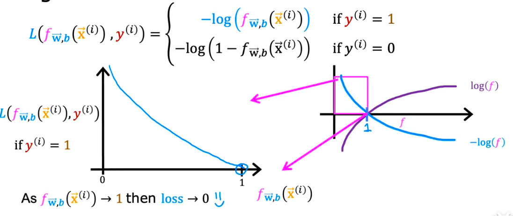
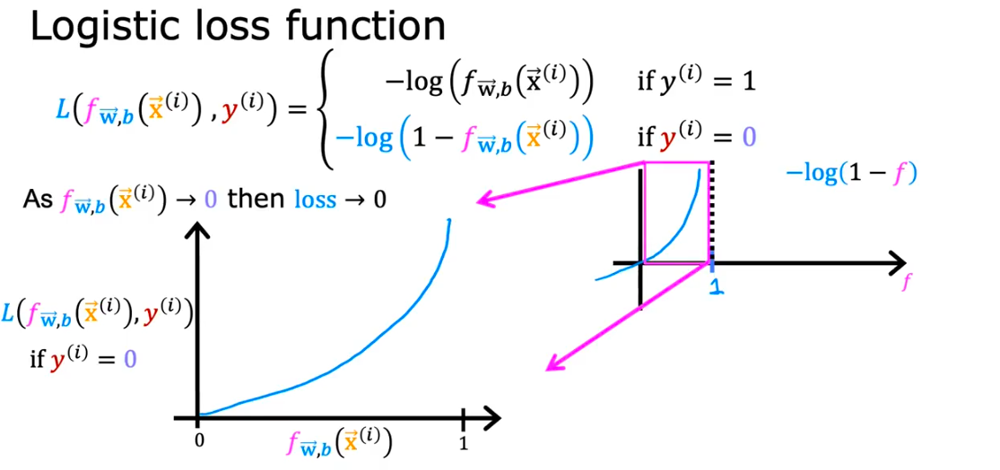

**如何理解逻辑回归的代价函数？**

### 1. 先把公式摆出来，但先别怕它

逻辑回归对**单个样本**的损失函数通常写成：

$$
L(\hat{y}, y) = -\left[y\log(\hat{y}) + (1-y)\log(1-\hat{y})\right]
$$

这里每个符号都先翻成人话：

* $y$：真实标签，只能是 $0$ 或 $1$
* $\hat{y}$：模型预测为正类的概率，范围在 $0$ 到 $1$ 之间
* $\log$：对数函数，你现在先把它当成一个“特殊放大镜”
* $L(\hat{y}, y)$：这个样本的损失，也就是“罚款金额”

你现在不用背公式，先只看一句话：

> 这个公式的任务，就是让模型对正确答案给高概率，对错误答案给低概率。

---

### 2. 这个公式最聪明的地方：会自动切换模式

公式是：

$$
L(\hat{y}, y) = -\left[y\log(\hat{y}) + (1-y)\log(1-\hat{y})\right]
$$

因为 $y$ 只能取 $0$ 或 $1$，所以它会自动变成两种情况之一。

---

### 3. 当真实标签 $y=1$ 时，会发生什么

把 $y=1$ 代进去：

$$
L(\hat{y}, 1) = -\left[1\cdot\log(\hat{y}) + (1-1)\log(1-\hat{y})\right]
$$

因为 $(1-1)=0$，第二项直接消失：

$$
L(\hat{y}, 1) = -\log(\hat{y})
$$



这句话是什么意思？

> 如果真实答案是 $1$，那损失只关心你给 $1$ 的概率 $\hat{y}$ 有多大。

所以：

* $\hat{y}$ 越接近 $1$，损失越小
* $\hat{y}$ 越接近 $0$，损失越大

这非常合理，因为真实明明是正类，你就应该把正类概率打高。

---

### 4. 当真实标签 $y=0$ 时，会发生什么

把 $y=0$ 代进去：

$$
L(\hat{y}, 0) = -\left[0\cdot\log(\hat{y}) + (1-0)\log(1-\hat{y})\right]
$$

第一项消失，得到：

$$
L(\hat{y}, 0) = -\log(1-\hat{y})
$$



这句话的意思是：

> 如果真实答案是 $0$，那损失只关心你给负类的概率 $1-\hat{y}$ 有多大。

所以：

* $\hat{y}$ 越接近 $0$，损失越小
* $\hat{y}$ 越接近 $1$，损失越大

这也很合理，因为真实明明是负类，你就不该给正类很高概率。

---

### 5. 一张总图，把两种情况合起来

```text
真实标签 y
│
├── y = 1
│   └── 损失 = -log(y_hat)
│       └── 希望 y_hat 越接近 1 越好
│
└── y = 0
    └── 损失 = -log(1 - y_hat)
        └── 希望 y_hat 越接近 0 越好
```

所以这个统一公式，本质上是在做：

> 真实是哪个类，就检查你有没有给那个类足够高的概率。

---

### 6. 为什么要用 $\log$

这是很多初学者第一次看到时最困惑的地方。

你现在不用从数学推导去理解，只要抓住两个直觉。

#### 6.1 对的时候，奖励“温和”

如果你已经预测得不错，比如：

* 真实是 $1$
* 你给出 $\hat{y}=0.9$

那说明模型做得挺好，损失应该比较小。

#### 6.2 错得离谱时，重罚

如果：

* 真实是 $1$
* 你却给出 $\hat{y}=0.01$

这就是“非常自信地判错”，应该被重罚。

而 $\log$ 恰好能实现这种效果：

> 当正确类别的概率很低时，损失会陡然变大。

所以你可以先把 $\log$ 理解成：

> 一个会对“自信地判错”特别敏感的放大器。

---

### 7. 用极端情况建立真正直觉

这是最重要的一步。

#### 7.1 情况 A：真实标签 $y=1$

此时损失是：

$$
L(\hat{y}, 1) = -\log(\hat{y})
$$

看几个极端值。

##### 当 $\hat{y}=1$

$$
L = -\log(1) = 0
$$

解释：完全正确，而且非常自信，罚款为 $0$。

##### 当 $\hat{y}=0.9$

损失很小。

解释：预测得很好，稍微罚一点点或者几乎不罚。

##### 当 $\hat{y}=0.5$

损失中等。

解释：模型很犹豫，不算离谱，但也不算好。

##### 当 $\hat{y}=0.01$

损失非常大。

解释：真实明明是 $1$，你却几乎肯定它不是 $1$，这要重罚。

---

#### 7.2 情况 B：真实标签 $y=0$

此时损失是：

$$
L(\hat{y}, 0) = -\log(1-\hat{y})
$$

再看几个极端值。

##### 当 $\hat{y}=0$

$$
L = -\log(1) = 0
$$

解释：完全正确，且非常自信，罚款为 $0$。

##### 当 $\hat{y}=0.1$

损失很小。

解释：预测不错。

##### 当 $\hat{y}=0.5$

损失中等。

解释：模型不确定。

##### 当 $\hat{y}=0.99$

损失非常大。

解释：真实明明是 $0$，你却几乎肯定它是 $1$，要重罚。

---

### 8. 用一个具体数字例子来算

现在我们真正算几个数，不做抽象停留。

---

#### 8.1 例子一：真实标签 $y=1$

如果模型预测：

$$
\hat{y}=0.8
$$

那么损失是：

$$
L = -\log(0.8)
$$

大约等于：

$$
L \approx 0.223
$$

这是一个比较小的损失，说明预测还不错。

---

#### 8.2 例子二：真实标签 $y=1$

如果模型预测：

$$
\hat{y}=0.2
$$

那么损失是：

$$
L = -\log(0.2)
$$

大约等于：

$$
L \approx 1.609
$$

这个损失就大很多了。

说明什么？

> 同样都是“没预测到很高概率”，但给到 $0.2$ 已经算比较严重的错误了。

---

#### 8.3 例子三：真实标签 $y=0$

如果模型预测：

$$
\hat{y}=0.1
$$

那么：

$$
L = -\log(1-0.1) = -\log(0.9)
$$

大约等于：

$$
L \approx 0.105
$$

损失很小，说明表现不错。

---

#### 8.4 例子四：真实标签 $y=0$

如果模型预测：

$$
\hat{y}=0.9
$$

那么：

$$
L = -\log(1-0.9) = -\log(0.1)
$$

大约等于：

$$
L \approx 2.303
$$

损失非常大。

这就是交叉熵最重要的特性：

> 不是简单看“对没对”，而是看“你有多自信地对，或者多自信地错”。

---

### 9. 一张 ASCII 图，帮助你看出趋势

#### 9.1 当 $y=1$ 时，损失函数是 $-\log(\hat{y})$

```text
损失
^
|\
| \
|  \
|   \
|     \
|       \
+----------------------> y_hat
0        0.5          1
```

解释：

* $\hat{y}$ 越接近 $1$，损失越接近 $0$
* $\hat{y}$ 越接近 $0$，损失迅速变大

---

#### 9.2 当 $y=0$ 时，损失函数是 $-\log(1-\hat{y})$

```text
损失
^
|        /
|      /
|    /
|   /
|  /
| /
+----------------------> y_hat
0        0.5          1
```

解释：

* $\hat{y}$ 越接近 $0$，损失越接近 $0$
* $\hat{y}$ 越接近 $1$，损失迅速变大

---

### 10. 单个样本损失，怎么变成整体代价函数

前面讲的是**一个样本**的损失。

但训练模型时，我们不只看一个样本，而是看整个训练集。

假设有 $m$ 个样本，那么总体代价函数通常写成：

$$
J(w,b)=\frac{1}{m}\sum_{i=1}^{m}L\left(\hat{y}^{(i)}, y^{(i)}\right)
$$

把单个样本的交叉熵代进去，就得到：

$$
J(w,b)= -\frac{1}{m}\sum_{i=1}^{m}\left[
y^{(i)}\log\hat{y}^{(i)} + \left(1-y^{(i)}\right)\log\left(1-\hat{y}^{(i)}\right)
\right]
$$

你现在只要把它翻译成一句话：

> 把每个样本的“罚款金额”算出来，再求平均，这就是整批数据的总代价。

---

### 11. 代价函数和梯度下降终于接上了

现在你已经可以把整个训练过程讲通了：

```text
输入特征 x
   ↓
逻辑回归算出预测概率 y_hat
   ↓
代价函数 J(w,b) 衡量整体错得多严重
   ↓
求 J 对 w、b 的梯度
   ↓
梯度下降更新参数
   ↓
让下一轮代价更小
```

也就是说：

> 代价函数不是为了好看，而是为了给梯度下降一个明确优化目标。

没有它，梯度下降就不知道自己该让什么东西变小。

---

### 12. 为什么这比“准确率”更适合训练

这点特别重要。

准确率的问题是：

* 预测对了就是对了
* 预测错了就是错了

它看不到概率细节。

例如下面两个预测，准确率可能都算“预测为 1”：

* $\hat{y}=0.51$
* $\hat{y}=0.99$

但它们显然不一样：

* $0.51$ 很犹豫
* $0.99$ 很自信

代价函数能区分这种差别，而准确率通常不能。

所以：

> 准确率适合拿来评估结果，代价函数更适合拿来训练模型。

---

### 13. 这一部分你必须记住的 5 句话

1. 交叉熵公式虽然看着长，但本质上会自动分成两种情况
2. 当 $y=1$ 时，损失变成 $-\log(\hat{y})$
3. 当 $y=0$ 时，损失变成 $-\log(1-\hat{y})$
4. 它会重罚“自信地判错”
5. 总代价函数就是把所有样本的损失求平均

---

