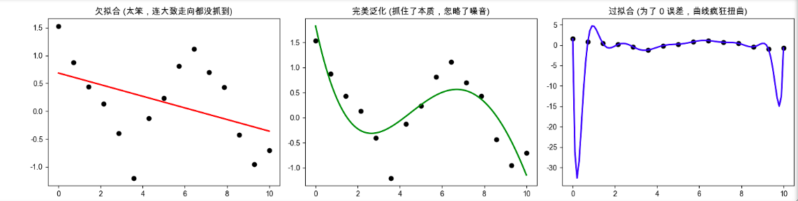

## 第1部分：搞清楚它是什么、为什么会发生（Why & What）

### 🎯 1.1 还原案发现场：为什么 100 分的学霸在高考中落榜了？ _💡 核心必学_

想象一个场景：你正在教一个名叫“AI”的学生识别“猫”。    
你给了他 100 张猫的照片（训练集）。为了让他学得透彻，你给了他极大的脑容量（极其复杂的神经网络或极高的多项式阶数）。   
这个学生学得极其刻苦，他在练习册上拿到了完美的 100 分。   

你极其兴奋地把他送进真实世界（测试集）。结果，他把一只极其普通的橘猫认成了“狗”。        
你震惊地翻开他的“错题本”和“脑回路”，发现了一个让人吐血的真相：      
在这 100 张用来训练的猫的照片里，有 3 张照片的背景里刚好有一棵绿色的树。这个脑容量极大的学生，并没有学会“猫有尖耳朵和胡须”，而是死记硬背下了一个极其荒谬的规律：“只要画面右上角有绿色的树叶，且像素值为 [105, 150, 60]，它就是一只猫！”   

在这一步，系统设计者遭遇了暴击：**模型没有学会“通用规律（Pattern）”**，而是死记硬背了训练数据里的“噪音（Noise）”和“偶然特征”，**被异常值影响。**

事实是，**在真实的世界里，数据集往往有很多异常值，开始训练模型的时候，无论是训练集还是验证集，Loss的值都会处于下降的状态，因为模型越来越接近真实规律，此时通常是找到样本之间的通用规律，模型达到一般水平。过后，模型进一步优化，目标是找到一个最终的结果，让所有样本都能够适用这个规律。如果样本本身的数据极度准确，模型最终的效果将非常完美，但样本集中存在噪音，模型就会被噪音影响，让原本适用常规规律的结果发生改变**

**② 是什么让人不得不换一种思路？**      
“只要训练集得分越高，模型就越牛”的这种直线思维被彻底粉碎了。这意味着必须放弃 **“盲目追求训练误差为 0”**的贪婪欲望，我们必须承认：现实世界的数据都是有杂质和噪音的，**完美的拟合，往往意味着完美的灾难。**

**③ 新旧方法的核心区别：我们在追求什么？**

* 菜鸟的追求：**尽一切代价把训练集（Train Loss）降到 0** ──▶ 得到一个只能做原题的“书呆子”。
* 高手的追求：**追求模型在没见过的新数据（泛化能力 Generalization）上的表现** ──▶ 得到一个能举一反三的“真学霸”。

### 🔩 1.2 一句话说清楚它的本质 _💡 核心必学_





「过拟合」的本质是：**模型的复杂度远远超过了数据本身蕴含的规律，导致模型不仅学习了真正的知识，还把数据里的随机误差、噪音和极端异常值当成宇宙真理给“死记硬背”了下来，最终丧失了对全新数据的预测能力。**

---

### ⚖️ 1.3 进阶灵魂拷问：偏差与方差的终极博弈 (Bias-Variance Tradeoff) _⭐ 核心必考_

在工业界和面试中，过拟合和欠拟合经常被包装成两个极其高级的统计学词汇：**偏差（Bias）** 和 **方差（Variance）**。

* **高偏差 (High Bias) = 欠拟合 (Underfitting)**：模型太笨，或者脑容量太小（比如用钢直尺去拟合抛物线）。它对数据的敏感度极低，看谁都一样，规律根本没学到。
* **高方差 (High Variance) = 过拟合 (Overfitting)**：模型太敏感、太神经质！只要训练数据稍微换几张图片，它总结出来的规律就会发生极其剧烈的改变。


---

## 第2部分：它的病理特征与临床诊断（Diagnosis & Mechanics）

### ⚙️ 2.1 怎么知道模型是不是“走火入魔”了？ _💡 核心必学_

过拟合最可怕的地方在于，它在训练初期是极其隐蔽的。要抓住它，你必须同时监控**训练集**和**验证集**的代价函数（Loss）曲线。

过拟合的绝对临床特征是这根大名鼎鼎的 **死亡 U 型曲线**：

```text
随着训练轮次 (Epochs) 增加，机器看数据的次数变多：
       │
       ├─ 初期：Train Loss 下降，Val Loss 跟着下降 ──▶ 机器正在茁壮成长，学习真正的规律。
       │
       ├─ 中期：Train Loss 继续降，Val Loss 停滞不前 ──▶ 机器的真功夫已经学到头了。
       │
       └─ 后期：Train Loss 逼近 0，Val Loss 突然掉头向上飙升！ 
                ──▶ 🚨 过拟合爆发！机器开始走火入魔，疯狂死记硬背噪音点。
```


---

## 第3部分：工业界的抗生素：怎么治好过拟合？（What to Avoid & Solutions）

面对过拟合，算法工程师们发明了一个庞大的武器库，统称为**正则化（Regularization / 惩罚机制）**。它们的核心思想高度统一：**给机器的学习过程人为地制造阻力，不让它学得太爽、太细。**

### 💊 解药 1：数据增强 (Data Augmentation) —— “最根本的物理治疗”
- **逻辑**：机器之所以死记硬背，是因为题库太小了。如果你只有 10 张猫的照片，它当然会记住背景里的树。
- **做法**：疯狂扩充数据。如果没有新数据，就把现有的图片进行旋转、裁剪、加噪点、调暗（这叫数据增强）。当机器看了 1000 万张不同角度、不同背景的猫之后，背景里的树自然就被抵消掉了，它只能被迫去学习猫的通用骨骼特征。

### 💊 解药 2：早停机制 (Early Stopping) —— “强制交卷”
- **逻辑**：我们在之前的章节手写过这个大堂经理。
- **做法**：死死盯着验证集的 Loss 曲线。只要发现 Val Loss 连续 $N$ 轮没有下降反而上升了，立刻掐断电源，剥夺机器继续做题的权利，强制它交卷。

### 💊 解药 3：权重衰减 (L1 / L2 正则化) —— “收缴智商税”
- **逻辑**：还记得多项式回归里那根疯狂扭动的“面条”吗？面条之所以能扭动，是因为某些高次幂特征的权重 $w$ 变得极其巨大（比如 $w = 85000$）。

[点击跳转1：特征缩放≠正则化](6.2.2特征缩放≠正则化.html)
[点击跳转2：为什么高次幂的特征对模型影响更大](6.2.1为什么高次幂的特征对模型影响更大.md)
  
- **做法**：在计算代价函数时，强行加上一笔“权重税”。只要机器敢把任何一个权重 $w$ 调得特别大，总体代价（Cost）就会瞬间爆炸。这就逼迫机器：**除非这个特征真的极其重要，否则尽量把所有的权重 $w$ 都压制在接近 $0$ 的平滑状态。**

### 💊 解药 4：Dropout (神经元随机失活) —— “打断内部的小团体”
- **逻辑**：这是深度学习神经网络里最伟大的发明之一。如果脑细胞全负荷运转，某些脑细胞就会互相串通，专门去记忆那些毫无意义的噪音。
- **做法**：在每一次前向传播训练时，**像扔骰子一样，随机“闭眼”或者“枪毙”掉 30% 的神经元。** 因为没有任何一个神经元知道自己下一秒会不会被干掉，它们无法形成专门死记硬背的“小团体”，每一个存活的神经元都必须尽力去学习最具代表性的全局特征，对应几何上的多项式复杂曲线也会被扔掉


──────────────────────────────────

🎓 **实战挑战：来当一次“AI 模型的主治医师”**

──────────────────────────────────

你现在是公司的 AI 抢救专家。你的三个实习生各自训练了一个“根据心电图预测心脏病”的分类模型，并向你提交了他们的期末体检报告。

请你根据他们汇报的数据，**准确诊断出他们模型患有什么病（欠拟合、过拟合、或者完美），并给出你的治疗方案（从上面的 4 种解药中选，或指出其它低级错误）。**

**实习生 A 的报告：**
“老大，我的模型跑完啦！训练集的准确率只有 **55%**，验证集的准确率也是 **54%**。我感觉这数据太难了，机器根本学不会！”

**实习生 B 的报告：**
“老大，我天下无敌！我的模型在训练集上的准确率达到了惊人的 **99.9%**！但是好奇怪，我把它丢进验证集一测，准确率只有可怜的 **62%**。为什么它在考试时发挥失常了？”

**实习生 C 的报告（陷阱预警）：**
“老大，我才是真正的天才！我在训练集上拿了 **99%**，在验证集上也拿了 **99%**！但我今天刚把它接上医院的实时检测仪器（真实全新数据），它把所有的健康人都判定为心脏病，准确率跌到了 **10%**！这绝对是医院的仪器坏了！”

📝 **你的任务：**
分别对 A、B、C 三个实习生的模型进行诊断。
- **A 的症状是什么？怎么救？**
- **B 的症状是什么？怎么救？**
- **C 遇到了我们在特征工程那节讲过的什么恐怖级工程灾难？**

提交你的诊断报告，我会为你进行最终的架构师复核！