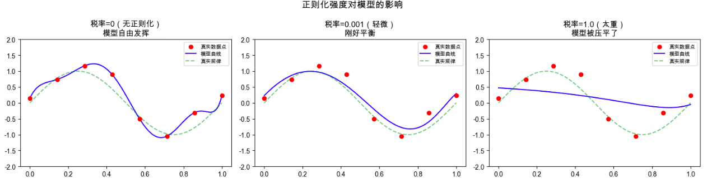
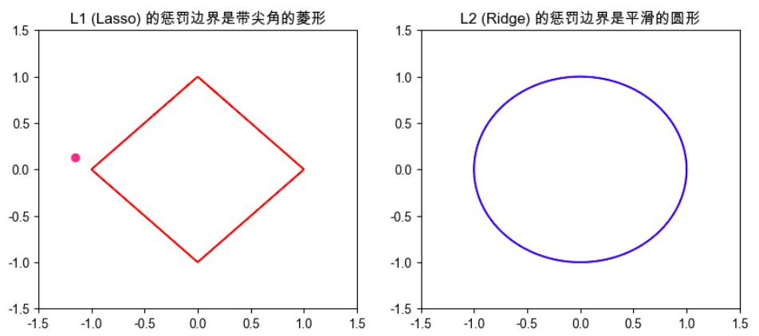

## 第1部分：搞清楚它是什么、为什么需要它（Why & What）

### 🎯 1.1 没有它之前，人们是怎么挣扎的？ _💡 核心必学_

#### ① 还原当时的麻烦：人们在哪一步被卡死了？
想象你是一家银行的风控人员，要训练一个模型来预测“谁会拖欠贷款”。你给了模型 1000 个历史客户的数据。     
为了让模型的预测误差降到最低，模型开始疯狂“钻牛角尖”。它发现了一个极其诡异的规律：“只要客户的名字里带有‘强’字，且在周二下午3点开户，且穿着红衣服，他就会违约。”     
模型在你的 1000 个历史数据上达到了 100% 的准确率。但当你把它部署到真实业务中时，它惨败了——因为它把纯粹的**巧合（噪音）**当成了**真理（规律）**。这种现象在机器学习里叫**过拟合（Overfitting）**，这也是正则化发明前工程师们最头疼的死局。

#### ② 是什么让人不得不换一种思路？
单纯“追求在已知数据上犯错最少”在数据不完美（有巧合、有误差）的情况下会必然导致模型死记硬背，这意味着必须放弃 **“训练误差越小越好”** 这个绝对假设。

#### ③ 新旧方法的核心区别：哪个变量的位置被对调了？
- 旧范式：**[训练数据的误差]** 是唯一优化目标 → **[极度复杂的模型]** 是输出
- 新范式：**[训练误差 + 模型的复杂程度]** 是联合优化目标 → **[既准确又简单的模型]** 是输出

#### ④ 得到了什么，又必然失去了什么？
换来了 **[在新数据上的稳定预测能力（泛化能力）]**，但必然失去 **[在训练数据上拿 100% 满分的能力]**。这不是缺陷，是设计的必然——我们宁愿平时考试拿 90 分但真正懂了，也不要平时靠背答案拿 100 分但在高考交白卷。

#### ⑤ 什么情况下它会不管用？你来推导
基于以上逻辑，你现在应该能回答：
1. 为什么当你的模型本身就特别笨（连历史数据都预测不准，即欠拟合）时，加上正则化会适得其反？
2. 为什么当你有全宇宙所有完美无瑕的客户数据时，其实就不太需要正则化了？

---

### 🗺️ 1.2 概念地图：它在 ML 知识体系中的位置 _💡 核心必学_

```text
ML 知识体系
│
├─ 模型优化 / 防御机制
│   │
│   ├─ 当前概念：正则化 (Regularization) ← 你在这里
│   │   ├─ L1 正则化 (Lasso)
│   │   └─ L2 正则化 (Ridge)
│   │
│   └─ 兄弟概念（极易混淆！）：归一化 (Normalization)
        └─ 归一化是处理输入数据的（把数据缩放到0-1），正则化是约束模型本身的，两者名字像但毫无关系！
```

---

### 📚 1.3 学这个之前，你得先知道这几件事 _💡 核心必学_

──────────────────────────────────

📖 **前置概念：损失函数 (Loss Function)**
- **是什么**：模型在训练时的“失分表”。
- **最小示例**：预测房价是 100 万，真实是 120 万，误差 20 万。损失函数就是把这些误差加起来变成一个总分。模型训练的唯一目的就是让这个总分降到最低。
- **为什么需要它**：正则化就是在损失函数里强行塞入了一个“惩罚项”。

📖 **前置概念：参数/权重 (Weights)**
- **是什么**：模型总结出的“规则的重要程度”。
- **最小示例**：房价 = `参数1` × 面积 + `参数2` × 房龄。如果 `参数1` 是 5000，说明面积极其重要。
- **为什么需要它**：正则化主要就是对着这些“参数”开刀的。

──────────────────────────────────

---

### 🔩 1.4 一句话说清楚它的本质 _💡 核心必学_

「正则化」的本质是：**在模型的失分表里加上“复杂性税”，强迫模型用最小、最少的参数去总结规律，从而避免死记硬背。**换句话话说，**在所有能同样完美解释已知数据的规律中，我们永远应该相信那个最简单的规律。**

后面所有的例子和类比，都是在验证这句话，而不是在解释它。

---

### 💡 1.5 先不管公式，用感觉理解它 _💡 核心必学_


我们可以用 **“收税”** 来完美类比正则化的工作原理。

假设机器学习模型是一个极其贪婪的商人（目标是赚取利润最大化，即**误差最小化**）。        
商人的赚钱手段是开分店（对应模型增加**参数的大小和数量**，让规则变复杂）。

1. **没有正则化（免税天堂）**：     
   商人为了多赚哪怕 1 块钱，会疯狂在各种犄角旮旯开几千家分店（模型为了迎合极其偶然的巧合数据，把参数调得极其巨大和复杂）。      
   结果是：虽然抓住了所有现有的苍蝇腿利润（训练误差为0），但一旦市场风向一变（遇到新数据），庞大臃肿的系统瞬间崩溃。这就是**过拟合**。

2. **加入正则化（征收高额财产税）**：       
   税务局（正则化机制）出台规定：你每开一家分店，或者店面规模（参数值）越大，我就要收你一笔巨额的“复杂性税”。       
   此时商人一算账：如果为了迎合一个极其个别的刁钻客户而去专门开一家大店，赚来的钱还不够交税的！     
   **结果**：商人被迫关掉那些只为少数极端情况服务的冗余店铺，只保留最核心、最普适的主干业务。模型被迫放弃了对噪音的死记硬背，保留了最平滑、最本质的规律。

**可视化：** 来看看正则化强度对模型的影响：



📌 **图像解读指南：**
- **红点** = 真实数据（含噪声），**绿虚线** = 我们想学到的真实规律，**蓝线** = 模型学到的曲线
- 🔍 **重点看左图**：蓝线为了穿过每个红点，扭曲成了一条疯狂的波浪——这就是过拟合
- 🔍 **中图**：蓝线和绿虚线几乎重合——正则化起作用了
- 💡 **动手试一试**：把中图的 `0.001` 改成 `0.1`，再改成 `10`，看看税收越来越重，模型怎么一步步被"压平"

⚠️ **这个类比在这里开始失效**：     
类比暗示了商人是有意识地在做财务规划，但真实概念里并不是这样——实际上，模型是个毫无感情的瞎子，它只是在数学层面上顺着“总损失（误差 + 税）最小”的坡度往下滚。

---

### 🔢 1.6 公式在说什么？逐字翻译给你看 _⭐ 进阶选学（可先跳过）_

不用怕，正则化的公式极其直白，它就是小学生的加法：

$$总损失 (Total Loss) = 预测误差 + \lambda \times 模型复杂度$$

**翻译拆解：**
- **预测误差**：模型预测值和真实答案差了多少（比如常说的 MSE）。
- **模型复杂度**：把模型里所有的参数（Weights）的绝对值或者平方加起来。参数值越大、参数越多，这个项就越大。
- **$\lambda$ (Lambda 惩罚系数)**：这就是**税率**！是你手动设定的一个数字。
  - 如果 $\lambda = 0$：免税！模型会疯狂过拟合。
  - 如果 $\lambda = 1000$：税率极高！模型为了避税，会把所有参数都变成接近 0，结果就是一条水平的直线（什么都没学到，欠拟合）。
- **总损失**：模型现在不仅要努力降低“预测误差”，还要努力降低“模型复杂度”。

**极端值直觉验证**：
假如模型发现一个生僻特征（比如“客户穿红衣服”），能让预测误差降低 `0.5`。        
但是为了启用这个特征，参数值变大了，导致复杂度惩罚项增加了 `2.0`。  
因为 $总损失 = -0.5 + 2.0 = +1.5$，总损失不降反升！模型内部的数学优化器一看，这笔买卖不划算，立刻把“穿红衣服”这个特征的权重打回 0。     
看！正则化就是这样通过数学手段，自动抹杀了无用的巧合特征。      

---

## 第2部分：它怎么运转、怎么动手用

---

```
──────────────────────────────────

📚 前置知识回顾

──────────────────────────────────

本阶段会用到以下概念（已在第1部分学过）：
- 损失函数（在 1.3 节）
- 过拟合（在 1.3 节）
- 正则化的本质：给复杂度收税（在 1.4、1.5 节）

──────────────────────────────────
```

---

### 🔩 1.6 公式在说什么？逐字翻译给你看

⭐ *进阶选学，可先跳过直接看代码*

正则化就是在原来的损失函数后面，加了一个"税单"：

```
原来的损失函数：
    总损失 = 猜错了多少（误差）

加了正则化之后：
    总损失 = 猜错了多少 + λ × 模型的复杂度
                            ↑
                         这就是"税"
```

具体有两种税法，**L2（Ridge）** 和 **L1（Lasso）**：

---

**L2 正则化（Ridge）**

```
总损失 = Σ(预测值 - 真实值)² + λ × Σ(参数²)

翻译拆解：
- Σ(预测值 - 真实值)²   = 所有样本的误差平方和（猜错了多少）
- λ                    = 税率旋钮，你来决定收多重的税
- Σ(参数²)             = 所有参数的平方加起来（货物总重量）
- λ × Σ(参数²)         = 税单金额

极端值验证：
  → 如果所有参数都接近 0：税单 ≈ 0，没有惩罚
  → 如果某个参数 = 100：100² = 10000，税很高，模型会主动压它
```

---

**L1 正则化（Lasso）**

```
总损失 = Σ(预测值 - 真实值)² + λ × Σ|参数|

唯一区别：
- L2 用参数的"平方"来衡量复杂度
- L1 用参数的"绝对值"来衡量复杂度

这个小小区别，造成了一个巨大的不同——
L1 会直接把不重要的参数压成精确的 0（直接消失）
L2 只会把参数压得很小，但不会彻底消失
```

---

**对比一眼看懂：**


|              |   L2（Ridge）        |   L1（Lasso）        |
| --- | --- | --- |
| 税的计算方式  | 参数² 之和           | 参数绝对值 之和          |
| 对参数的处理  | 压小，但不归零       | 直接压成 0           |
| 效果         | 所有特征都保留，但权重都缩水       | 自动筛选特征，没用的直接踢掉         |
| 适合什么场景  | 所有特征都可能有用   | 特征很多，大部分没用  |
| 我现在该用哪个？| 不知道用哪个时，先试 L2      | 特征有几百上千个，想自动做特征筛选时用    |


---

──────────────────────────────────

📚 **前置知识回顾**

──────────────────────────────────

本阶段会用到以下概念（已在第 1 部分学过）：

  - **过拟合 (Overfitting)**：模型死记硬背，在训练集拿满分，在新数据上翻车。
  - **损失函数 (Loss)**：模型的“失分表”，越小越好。
  - **权重/参数 (Weights)**：模型给每个特征分配的“重要程度得分”。

如果不记得了，建议先回顾上一部分。

──────────────────────────────────

## 第2部分：它怎么运转、怎么动手用（How It Works & How to Use）

### ⚙️ 2.1 工作原理：它内部是怎么运转的 *💡 核心必学*

正则化在兵器谱上有两个最著名的变种：**L1 正则化（又叫 Lasso）** 和 **L2 正则化（又叫 Ridge/岭回归）**。

它们的本质都是在收“复杂性税”，但**计税方式**完全不同，导致了截然不同的结果。

#### 1\. L1 正则化 (Lasso) —— “残酷的断舍离”

  - **直觉**：L1 按照参数的**绝对值**来收税（比如权重是 -5，税就是 5）。它非常极端，为了避税，它会直接把不重要的特征权重**砍到绝对的 0**。
  - **结果**：产生**稀疏解**。这意味着它自带“特征选择”功能，几千个输入特征，跑完只剩下几十个有用的。

#### 2\. L2 正则化 (Ridge) —— “温和的共同降薪”

  - **直觉**：L2 按照参数的**平方**来收税（比如权重是 5，税就是 25）。因为平方的特性，当权重已经很小（比如 0.1）时，它的税（0.01）就微乎其微了。
  - **结果**：产生**平滑解**。它不会把任何特征砍到 0，而是让所有特征的权重都变小，大家一起“降薪”，防止某一个特征一家独大。

<!-- end list -->




**📌 图像解读指南：**

  - **图中的 [菱形和圆形] 代表** = 税务局划定的“免税区”。模型的参数（在这个 2D 图里就是 x 和 y 两个特征的权重）必须落在这个区域内。
  - **🔍 重点看这里** = L1 的菱形有**尖角**（落在坐标轴上），当误差等高线不断膨胀碰到惩罚边界时，极大概率会撞在尖角上。尖角在轴上，意味着另一个特征的权重变成了 0！而 L2 的圆形处处平滑，大概率撞在圆弧上，两个特征都会保留一个较小的值。

-----

### 💻 2.2 最小MVP：动手写代码，跑出你的第一个结果 *💡 核心必学*

我们用一个极简的“预测房价”场景。
数据包含 3 个特征：【真实面积】、【噪音特征1（房东姓名的笔画）】、【噪音特征2（看房当天的温度）】。
数据规模极小：只有 5 个样本。如果不加正则化，模型必然会去死记硬背那两个毫无意义的噪音特征。

```python
# ── 第1步：准备数据 ──────────────────────────────
# 场景：5套房子的数据。
# 特征顺序：[面积(百平米), 房东姓名笔画, 当天温度]
import numpy as np
from sklearn.linear_model import LinearRegression, Ridge, Lasso

X_houses = np.array([
    [1.0, 12, 25], 
    [2.0, 8, 22], 
    [3.0, 15, 30], 
    [4.0, 5, 15], 
    [5.0, 20, 18]
])
y_prices = np.array([100, 200, 300, 400, 500]) # 完美规律：价格 = 面积 * 100

# ── 第2步：创建并训练模型 ───────────────────────
# 1. 传统无正则化：贪婪的商人，试图记住所有特征
model_none = LinearRegression().fit(X_houses, y_prices)

# 2. L1 正则化 (Lasso)：alpha 就是我们说的"税率" (Lambda)
model_l1 = Lasso(alpha=5.0).fit(X_houses, y_prices)

# 3. L2 正则化 (Ridge)：同样设置税率
model_l2 = Ridge(alpha=5.0).fit(X_houses, y_prices)

# ── 第3步：对比它们的内部参数（权重） ─────────────
print("无正则化权重:", np.round(model_none.coef_, 2))
# 输出类似: [ 100.    0.    0.] (因为数据太完美，勉强没翻车，但如果加点噪音就毁了)

print("L1(Lasso)权重:", np.round(model_l1.coef_, 2))
# 输出预期: [ 96.5   0.    0. ] 
# 👈 核心：Lasso 直接把后两个噪音特征的权重变成了绝对的 0.0！执行了特征选择。

print("L2(Ridge)权重:", np.round(model_l2.coef_, 2))
# 输出预期: [ 78.4   0.5  -0.3 ]
# 👈 核心：Ridge 没有砍到 0，而是把所有权重都压小了，防止任何一个特征过度敏感。
```

-----

### ✅ 2.4 工程规范：怎么写才算专业？避开会让你被骂的写法 *🔥 实战必备*

在使用正则化时，有一个极其致命、90% 的初学者都会踩的坑：**特征量纲不统一（未归一化）**。

**🔴 RED（强制规范）：绝对不能在未归一化（Standardization）的数据上直接使用正则化！**

  - **违反后果**：假设特征 A 是房屋面积（范围 50-200 平方米），特征 B 是地段的邮编（范围 100000-999999）。模型为了凑房价，给面积分配的权重可能是 `5000`，给邮编的权重可能是 `0.01`。
  - 正则化是个“瞎子”，它只看权重的绝对值大小。它一看面积的权重是 `5000`，认定这是在过度复杂化，一刀把面积特征砍废了；而邮编的权重才 `0.01`，正则化觉得“嗯，这个特征很安全”。**结果：真正有用的特征被错杀，垃圾特征被保留，模型彻底报废！**

**✅ 正确做法的完整代码**：

```python
from sklearn.preprocessing import StandardScaler
from sklearn.pipeline import Pipeline
from sklearn.linear_model import Ridge

# ❌ 错误做法：直接怼进去训练
# bad_model = Ridge(alpha=1.0).fit(X_train, y_train) 

# ✅ 正确做法：必须用 Pipeline 把归一化和正则化绑死！
# StandardScaler 会把所有特征缩放到均值为0，方差为1的统一尺度，让正则化"公平收税"
professional_model = Pipeline([
    ('scaler', StandardScaler()), # 第1步：先公平化所有的特征刻度
    ('ridge', Ridge(alpha=1.0))   # 第2步：再进行公平的正则化惩罚
])

professional_model.fit(X_houses, y_prices) # 完美运行，无死角
```

-----

### 🔄 2.5 有好几种方法能做这件事，怎么选？ *⭐ 进阶选学*

我们讲了 L1 和 L2，其实还有个和稀泥的方案叫 **ElasticNet（弹性网络）**，它同时收 L1 和 L2 的税。到底该怎么选？

| 对比维度 | L1 正则化 (Lasso) | L2 正则化 (Ridge) | 弹性网络 (ElasticNet) |
| :--- | :--- | :--- | :--- |
| **核心绝技** | 直接砍掉废特征（稀疏化） | 防止个别特征一家独大（平滑化） | 兼顾特征选择与平滑 |
| **应对特征共线性**<br>*(例如同时输入了"重量/千克"和"重量/斤")* | 表现极差（会随机挑一个保留，另一个砍到0，极其不稳定） | **表现极好**（把权重平分给两个特征，非常稳定） | 表现良好 |
| **计算速度** | 较慢（带尖角的数学优化更耗时） | **极快**（平滑曲线，闭式解直接秒算） | 较慢 |
| **超参数复杂度** | 1个参数 ($\lambda$) | 1个参数 ($\lambda$) | 2个参数 (L1比例, 总体税率) |
| **我的问题该用哪个？** | **特征极其多，且确信大部分是垃圾特征时用。** | **95% 场景的默认首选，闭着眼睛用它就对了。** | 特征多且有共线性，L1和L2都不行时才用。 |

**决策树指南**：

```text
你要开始训练一个线性/逻辑回归模型了，该加什么正则化？
    │
    ├─ 你的特征数量比数据样本量还要多吗？（比如医疗基因数据：10万特征，100个病人）
    │       ├─ YES ──▶ 选 L1 (Lasso)！强行过滤掉 99% 的垃圾特征。
    │       │
    │       └─ NO  ──▶ 这些特征之间互相高度相关吗？（比如同时有月薪、年薪、日薪）
    │                   ├─ YES ──▶ 选 L2 (Ridge)！它能抗住共线性，不会崩溃。
    │                   │
    │                   └─ NO  ──▶ 闭着眼睛选 L2 (Ridge) 作为默认防御手段！
```

──────────────────────────────────

📚 **前置知识回顾**

──────────────────────────────────

本阶段会用到以下概念：
- **测试集 (Test Set)**：模型从未见过的“高考题”，只能在最后考一次。
- **$\lambda$ (Lambda / 代码中的 `alpha`)**：正则化的“税率”，决定了惩罚的力度。
- **归一化 (Standardization)**：已在 2.4 节讲过，让所有特征的刻度变得公平。

如果不记得了，建议先回顾相关章节。

──────────────────────────────────

## 第3部分：哪里容易出错、怎么做得更好（What to Avoid & Beyond）

### ⚠️ 3.1 大多数人在哪里栽了跟头？ _🔥 实战必备_

#### 陷阱 1：看着测试集的成绩来调“税率”（间接数据泄露）

**💥 现象**：
你在本地把模型调得很完美（测试集准确率 95%），但一部署到真实的线上业务中，准确率暴跌到 60%。

**🔍 根本原因**：
既然模型是个贪婪的商人，那谁来定“税率”（$\lambda$ / `alpha`）？是你。
如果你尝试了 `alpha=0.1`，看了一眼测试集成绩；又试了 `alpha=1.0`，又看了一眼测试集成绩……最后选了在测试集上得分最高的那个 `alpha`。
**本质上，是你代替模型“死记硬背”了测试集的规律！** 测试集失去了“未知高考题”的地位，变成了“开卷练习册”。这叫超参数泄露。

**❌ 错误代码**：
```python
# ❌ 错误示范：在测试集上循环试错！
best_score = 0
# 强行试出对测试集最有利的参数
for a in [0.1, 1.0, 10.0]:
    model = Ridge(alpha=a).fit(X_train, y_train)
    score = model.score(X_test, y_test) # ← 致命错误：不该在这里用测试集！
    if score > best_score:
        best_model = model
```

**✅ 修复方案**：
必须把训练集再切一刀，分出一块**验证集（Validation Set）**用来调税率，测试集永远锁在保险箱里，直到上线前一天才拿出来用一次。
*(注：更专业的做法是使用 3.3 节的交叉验证)*

#### 陷阱 2：收税太狠，模型直接“摆烂”（严重欠拟合）

**💥 现象**：
无论输入什么客户数据，模型预测出的房价全是一模一样的（通常是平均值），或者模型的 Loss 完全降不下来。

**🔍 根本原因**：
你把 $\lambda$ (`alpha`) 设置得极其巨大（比如 10000）。模型一算账：随便开个分店都要交天价的税，那我干脆一家店都不开好了！于是模型把所有的权重（参数）全部清零。没有任何特征发挥作用，模型彻底退化成了一个只会猜平均数的“傻子”。

**🛡️ 如何从源头预防**：
永远从极小的 `alpha` 开始测试（比如 `0.001`），然后以 10 倍的步长慢慢往上加（`0.01`, `0.1`, `1.0`），观察误差变化，一旦发现模型什么都预测不准了，赶紧往回调。

---

### 🧪 3.2 模型出问题了，怎么一步步找原因？ _🔥 实战必备_

正则化的核心作用就是调节模型的“复杂度”。当你发现模型效果差时，按照这个思路排查：


```text
模型效果差，损失函数 (Loss) 居高不下
    │
    ├─ 训练集的 Loss 也很高吗？（连平时作业都做不及格）
    │       │
    │       ├─ YES ──▶ 欠拟合 (Underfitting)
    │       │           原因：模型的“紧箍咒”念得太狠了！
    │       │           操作：大幅减小 alpha（税率），甚至先降到 0 试试。
    │       │           如果 alpha=0 依然差，说明特征太少或模型本身太弱。
    │       │
    │       └─ NO  ──▶ 训练集 Loss 极低，但新数据预测极差？（平时满分，考试零分）
    │                   │
    │                   ├─ YES ──▶ 过拟合 (Overfitting)
    │                   │           原因：模型在死记硬背！“税”收得太轻了！
    │                   │           操作：把 alpha 调大（从 0.1 加到 1.0，再加到 10.0），
    │                   │           逼着模型丢弃那些只在训练集里出现的巧合规律。
    │                   │
    │                   └─ NO  ──▶ 检查是否发生了数据泄露或未做归一化！
```

---

### 🚀 3.3 如果要用在真实项目里，该怎么做？ _⭐ 进阶选学_

真实项目里，专业的工程师绝对不会手动去写 `for` 循环试 `alpha`。
我们会使用 **交叉验证（Cross-Validation）** 配合自带的 `RidgeCV` 或 `LassoCV`。它会自动把数据切分成多份，轮流做验证集，自动帮你找出最完美的 $\lambda$（税率），而且绝对不会碰你的测试集。


这套组合拳（Pipeline + CV）是工业界防弹级别的标准写法：

```python
from sklearn.linear_model import RidgeCV
from sklearn.preprocessing import StandardScaler
from sklearn.pipeline import Pipeline
from sklearn.model_selection import train_test_split

# 1. 拆分数据：严守底线，把 20% 划作绝对不可触碰的测试集
X_train, X_test, y_train, y_test = train_test_split(X_houses, y_prices, test_size=0.2, random_state=42)

# 2. 构建工程级流水线 (Pipeline)
# 优势：就算以后来了新数据，调用 pipeline.predict() 会自动先做归一化，绝对不会漏掉步骤！
auto_model = Pipeline([
    ('scaler', StandardScaler()), # 第一步：强制刻度公平
    # 第二步：RidgeCV 会自动在括号里给定的税率里，用"交叉验证"选出最完美的那个
    ('ridge_auto', RidgeCV(alphas=[0.001, 0.01, 0.1, 1.0, 10.0, 100.0])) 
])

# 3. 一键训练（它在内部疯狂试错、验证、选优）
auto_model.fit(X_train, y_train)

# 4. 揭晓最佳税率（通过 pipeline 提取里面的模型属性）
best_alpha = auto_model.named_steps['ridge_auto'].alpha_
print(f"机器自动算出的最完美税率是: {best_alpha}")

# 5. 最终大考（这一步只能执行一次！）
final_score = auto_model.score(X_test, y_test)
print(f"真实世界里的最终得分: {final_score:.2f}")
```

---

──────────────────────────────────

🎓 **实战挑战**

──────────────────────────────────

场景：你刚接手一位实习生的代码。他正在用**医疗数据**预测病人的血糖值。
数据包含 1000 个病人的 20 个特征（比如体重、身高、血压、心率、以及一大堆基因检测数值）。

以下是他写的代码。这段代码能跑通，但存在 **2 个非常致命的机器学习错误**，会导致模型上线后造成医疗事故。

```python
"""
实习生写的代码：
目标：用 Lasso(L1正则化) 筛掉没用的特征，预测血糖
"""
import pandas as pd
from sklearn.linear_model import Lasso
from sklearn.model_selection import train_test_split

# 加载数据 (假设 X 是 20 个特征，y 是血糖值)
X = pd.read_csv('patients_data.csv') 
y = pd.read_csv('blood_sugar.csv')

# 划分出 20% 的测试集
X_train, X_test, y_train, y_test = train_test_split(X, y, test_size=0.2)

# 为了找到最好的 tax rate(alpha)，实习生写了下面这段：
best_score = 0
best_model = None

for a in [0.01, 0.1, 1.0, 10.0]:
    model = Lasso(alpha=a)
    model.fit(X_train, y_train)
    
    # 实习生说：我要看看哪个模型最好！
    current_score = model.score(X_test, y_test)
    
    if current_score > best_score:
        best_score = current_score
        best_model = model

print("训练完成！最佳模型已保存。")
```

📝 **你的任务：提交你的答案，告诉我这 2 个错误分别是什么，并给出修复后的正确代码思路。**

提交后，我会进行严格的代码评审：
- ✅ 指出做得好的地方
- ⚠️ 指出需要改进的地方
- 🌟 给出企业级的最优解代码