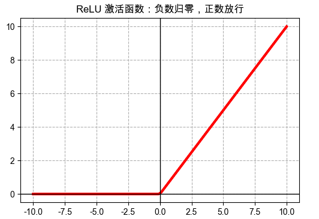
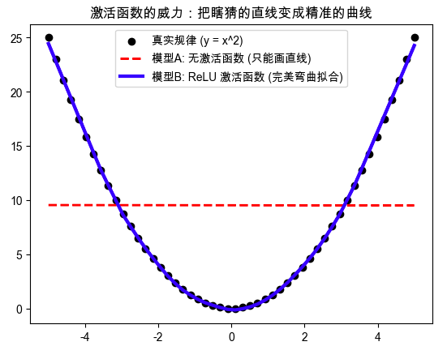

它打破了数学上“直来直去”的死板规则，让神经网络拥有了理解真实世界复杂弯绕的能力。

---

## 第一步：搞清楚它是什么、为什么需要它（Why & What）

### 🎯 1.1 没有它之前，人们是怎么挣扎的？ _💡 核心必学_

**① 还原当时的麻烦：人们在哪一步被卡死了？**        
假设你要训练一个 AI 来区分照片里的是“苹果”还是“香蕉”。没有激活函数时，神经网络每一层都在做极其单调的**线性计算**（把像素值乘以权重，再加上一个偏置）。      
人们绝望地发现：**不管你把神经网络叠多少层，哪怕叠了 100 层，它最终的效果等同于只有 1 层。** 因为 $2 \times (3 \times x) = 6x$，无数个直线方程嵌套在一起，结果依然是一根笔直的直线。现实世界中，苹果和香蕉的像素特征分布根本不是一条直线能切开的。

**② 是什么让人不得不换一种思路？**      
纯线性叠加在“非线性问题”（如图像识别、语音识别、围棋判断）下会**彻底瘫痪**，这意味着必须放弃 **“只要网络堆得深，就能解决复杂问题”**的幻想。只要每层之间没有东西去“扭曲”一下数据，深层网络就是无效的。

**③ 新旧方法的核心区别：哪个环节被改造了？**    

```text
旧范式（无激活函数的灾难）：
输入特征 ──▶ [加权求和] ──▶ [加权求和] ──▶ 输出（依然是一条死板的直线）

新范式（加入激活函数后）：
输入特征 ──▶ [加权求和] ──▶ ⚡ [激活函数：把直线掰弯/折断] ──▶ [下一层] ──▶ 输出（可以拟合任何复杂的曲面形状）
```

**④ 得到了什么，又必然失去了什么？**     
换来了强大的**非线性拟合能力（通用近似定理，理论上能拟合宇宙中任何规律）**，但必然失去了**数学上的完美“凸性”**。这意味着模型训练变得困难，容易陷入局部最优解（在一个小坑里出不来，找不到全局最深的坑），这不是缺陷，是获得复杂表达能力设计的必然代价。

**⑤ 什么情况下它会不管用？你来推导**     
基于以上逻辑，你现在应该能回答：
- 为什么当我们要预测一个完全线性比例的物理公式（比如华氏度转摄氏度 $C = (F - 32) \times \frac{5}{9}$）时，如果在网络里加了复杂的激活函数，反而可能预测不准了？
- **回答**：最后一层（输出层）要不要加激活函数，**完全取决于你要预测的任务类型**。

---

### 🗺️ 1.2 概念地图：它在 ML 知识体系中的位置 _💡 核心必学_

```text
ML 知识体系
│
├─ 神经网络架构 (Neural Networks)
│   │
│   ├─ 激活函数 (Activation Function) ← 你在这里
│   │   ├─ ReLU (目前最常用的折线形)
│   │   ├─ Sigmoid (经典的S型曲线)
│   │   └─ Tanh (零中心的S型曲线)
│   │
│   └─ 损失函数 (Loss Function)（容易混淆：损失函数是期末考试阅卷标准，激活函数是神经元平时的发言门槛）
```

---

### 📚 1.3 学这个之前，你得先知道这几件事 _💡 核心必学_

──────────────────────────────────

📖 **前置概念：线性变换（Linear Transformation）**

- **是什么**：就是小学数学里的 $y = wx + b$。无论 $x$ 怎么变，$y$ 都是按固定比例直线变化的。
- **最小示例**：买苹果，$w$ 是单价 5 元，$x$ 是数量 3 个，$b$ 是包装费 1 元。总价 $y = 5 \times 3 + 1 = 16$。
- **为什么需要它**：神经网络的每一层都在疯狂计算无数个 $wx+b$。激活函数就是接在 $wx+b$ 后面，负责把算出来的这个 $y$ 弄“弯”。

──────────────────────────────────

### 🔩 1.4 一句话说清楚它的本质 _💡 核心必学_

「激活函数」的本质是：**给原本只能画直线的神经网络，加入“扭曲”和“折断”的能力，使其能拟合世界上任何不规则的复杂规律。**

后面所有的例子和类比，都是在验证这句话，而不是在解释它。

---

### 💡 1.5 先不管公式，用感觉理解它 _💡 核心必学_


让我们用 **“职场汇报审批”** 的类比来直观感受目前最流行的激活函数：**ReLU**（Rectified Linear Unit）。

**生活类比：严苛的部门经理（ReLU）**
假设神经元是一个基层员工，他通过 $wx+b$ 辛苦算出了一个“业务价值分数”。
激活函数（ReLU）就是坐在他对面的部门经理。
- **极端情况1（负数）**：如果员工算出的价值是 -5（比如亏钱的项目），经理看都不看，直接扔进垃圾桶，向上级汇报为 **0**。
- **极端情况2（正数）**：如果员工算出的价值是 100（好项目），经理非常满意，**原封不动**地把 100 汇报给大老板。

**类比对应关系：**
- 员工算出的分数 = 线性计算结果 ($wx+b$)
- 经理的拦截/放行动作 = 激活函数（ReLU）
- 最终上报的数字 = 神经元的最终输出信号

⚠️ **这个类比在这里开始失效：**
“经理审批”暗示了经理可能会根据主观心情去修改汇报的数值，或者会对极高的分数有所限制（比如压制功高盖主的员工）。但在真实的 ReLU 激活函数里并不是这样——实际上，只要分数大于 0，哪怕是 100 万，ReLU 也会原封不动地传递过去，它是一个没有上限的绝对客观的机器。如果只记住类比，你会误以为它对过大的信号有压缩作用（那是另一种激活函数 Sigmoid 干的事）。

**🎨 运行这段代码，你会亲眼看到「激活函数」的直观图像**

你可以直接把这段代码复制到 Python 或 Jupyter Notebook 里运行：

```python
import matplotlib.pyplot as plt
import numpy as np

# 1. 准备极简数据：从 -10 到 10 之间生成 100 个数字
x = np.linspace(-10, 10, 100)

# 2. 绘制目前世界上最常用的激活函数：ReLU
# 逻辑极简：如果 x 小于 0，就是 0；如果 x 大于 0，就是 x 本身
y_relu = np.maximum(0, x)

plt.figure(figsize=(6, 4))
plt.plot(x, y_relu, color='red', linewidth=3)
plt.axhline(0, color='black', linewidth=1)
plt.axvline(0, color='black', linewidth=1)
plt.title("ReLU 激活函数：负数归零，正数放行")
plt.grid(True, linestyle='--')
plt.show()
```



**📌 图像解读指南：**
- **当你运行后，图中的 红线 代表** = 神经元最终输出的信号强度。
- **🔍 重点看这里** = 图像在 $x=0$ 的地方被硬生生“折断”了。左边是一条死气沉沉的平地，右边是一条一飞冲天的直线。正是这个**转折点**，赋予了神经网络非线性的超能力！
- **💡 动手试一试** = 试着把代码里的 `np.maximum(0, x)` 改成 `1 / (1 + np.exp(-x))`，把标题改成 "Sigmoid 函数"。再跑一次，你会看到一条优美的“S型曲线”，这就是早期神经网络最爱用的“将一切压缩到0到1之间”的门卫！

---

### 🔢 1.6 公式在说什么？逐字翻译给你看 _⭐ 进阶选学（可先跳过）_

不用怕，激活函数的公式通常简单得惊人。以刚才演示的 **ReLU** 为例：

$$f(x) = \max(0, x)$$

**翻译拆解：**
- $x$ = 神经元刚才算出来的原始结果（即 $wx + b$）
- $\max(A, B)$ = 在 A 和 B 里挑一个最大的数字
- $0$ = 死亡底线
- $f(x)$ = 激活函数最终决定输出的数字

**直觉验证：**
- 代入极度糟糕的结果 $x = -999$：$\max(0, -999)$，挑大的，输出 $0$。神经元“装死”成功。
- 代入极度优秀的结果 $x = 88$：$\max(0, 88)$，挑大的，输出 $88$。神经元“大声说话”。

---

──────────────────────────────────

## 第2部分：它怎么运转、怎么动手用（How It Works & How to Use）

──────────────────────────────────
📚 **前置知识回顾**
本阶段会用到：
- **线性计算 ($wx+b$)**：画直线的操作（在 1.3 节学过）
- **ReLU 激活函数**：负数归零，正数放行的“门卫”（在 1.5 节学过）
──────────────────────────────────

### ⚙️ 2.1 工作原理：数据在神经网络里到底是怎么流动的？ _💡 核心必学_

让我们用系统设计者的视角，看看一笔数据（比如一张房屋照片的像素）是怎么穿过神经网络的。

```text
[输入数据：房屋面积、房龄等特征]
       │
       ▼
==== 第一层（隐藏层） ====
[步骤1：线性计算] ──▶ 算出初步得分 (wx+b)
       │
       ▼
[步骤2：激活函数] ──▶ ⚡ 遇到 ReLU：负分直接抹零，正分放行（引入第一次非线性折叠）
       │
       ▼
==== 第二层（隐藏层） ====
[步骤1：再次线性计算] ──▶ 基于上一层的折叠结果，再次组合加权
       │
       ▼
[步骤2：激活函数] ──▶ ⚡ 再次遇到 ReLU：继续折叠、扭曲数据空间
       │
       ▼
==== 最后一层（输出层）====
[最终线性计算] ──▶ 算出最终的预测值
       │
       ├─ 如果预测房价（回归） ──▶ 🛑 停！不加激活函数！直接输出真实数值（正如你推导的）
       └─ 如果预测是否违约（分类） ──▶ ⚡ 加 Sigmoid 激活函数：把结果强行压缩到 0~1 之间当概率
       │
       ▼
[输出最终结果]
```

**系统设计心得**：
你发现了吗？神经网络所谓的“深”，其实就是 **[线性拼接] + [激活折叠]** 这两个动作的无限套娃。没有折叠，套娃就失去了意义。

---

### 💻 2.2 最小MVP：动手写代码，亲眼看它如何“掰弯”直线 _💡 核心必学_

为了让你直观感受激活函数的超能力，我们将用 `scikit-learn` 构建两个极简的神经网络来拟合一段复杂的曲线（比如 $y = x^2$ 这样的抛物线规律）。

**第一条网络（旧范式）**：不给它激活函数，看它怎么绝望地挣扎。      
**第二条网络（新范式）**：给它 ReLU 激活函数，看它如何完美贴合。

```python
import numpy as np
import matplotlib.pyplot as plt
from sklearn.neural_network import MLPRegressor

# ── 第1步：准备数据（伪造一个非线性的真实世界规律：y = x平方） ──
# 生成 -5 到 5 之间的 50 个数字作为输入
X = np.linspace(-5, 5, 50).reshape(-1, 1)  
y = X[:, 0] ** 2  # 真实规律是一条弯曲的抛物线

# ── 第2步：创建并训练模型 A（不加激活函数，identity 意为"原样输出"） ──
# hidden_layer_sizes=(100, 100) 表示有两层，每层 100 个神经元，这算是很庞大的网络了
model_no_activation = MLPRegressor(hidden_layer_sizes=(100, 100), activation='identity', max_iter=2000, random_state=42)
model_no_activation.fit(X, y)

# ── 第3步：创建并训练模型 B（加入 ReLU 激活函数） ──
model_with_relu = MLPRegressor(hidden_layer_sizes=(100, 100), activation='relu', max_iter=2000, random_state=42)
model_with_relu.fit(X, y)

# ── 第4步：让它们对输入数据进行预测并对比 ──
y_pred_no_act = model_no_activation.predict(X)
y_pred_relu = model_with_relu.predict(X)

# 🎨 可视化结果（不计入核心代码行数）
plt.scatter(X, y, color='black', label='真实规律 (y = x^2)')
plt.plot(X, y_pred_no_act, color='red', linestyle='--', linewidth=2, label='模型A: 无激活函数 (只能画直线)')
plt.plot(X, y_pred_relu, color='blue', linewidth=3, label='模型B: ReLU 激活函数 (完美弯曲拟合)')
plt.legend()
plt.title("激活函数的威力：把瞎猜的直线变成精准的曲线")
plt.show()
```



1. **红色的虚线（模型A）**：即使有两层共200个神经元，它依然极其死板地画了一条直线，完全偏离了抛物线。
2. **蓝色的实线（模型B）**：完美地贴合了黑色的抛物线数据点！**这就是 ReLU 的功劳！**

---

### 🌍 2.3 真实世界里，有那么多激活函数，我该怎么选？ _💡 核心必学_

目前世界上有几十种激活函数（ReLU, Sigmoid, Tanh, LeakyReLU, GELU...），听起来很唬人，但在真实的工业界，选择逻辑简单得令人发指。

请保存这张 **“无脑选择决策树”**：

```text
你要把激活函数放在哪一层？
    │
    ├─ 放在中间的【隐藏层】（为了提取特征）
    │       │
    │       ├─ 默认闭眼首选 ──▶ ReLU（计算极快，目前 90% 的模型都在用）
    │       │
    │       └─ 进阶情况（如果发现 ReLU 失效了） ──▶ 换成 LeakyReLU 或 GELU
    │
    └─ 放在最后的【输出层】（为了输出结果）
            │
            ├─ 预测连续数值（房价、温度、你说的物理公式） ──▶ 🛑 都不用！保持线性原样输出！
            │
            ├─ 预测二分类（是/否，猫/狗，欺诈/正常） ──▶ ⚡ Sigmoid（把输出强行压缩成 0%~100% 的概率）
            │
            └─ 预测多分类（苹果/香蕉/橘子） ──▶ ⚡ Softmax（把所有类别的得分转换成总和为 1 的概率分布）
```

---

### ✅ 2.4 工程规范：避开会让你被骂的写法 _🔥 实战必备_

在把理论写成代码时，初学者最容易犯以下两个会引起线上事故的错误：

**🔴 RED（强制规范）：绝对不要在预测可能为负数的“回归任务”最后一步使用 ReLU**
- **违反会导致**：模型静默失效。比如你要预测公司的“净利润”（可能赚 100 万，也可能亏 50 万）。如果你在最后一层加了 ReLU，所有亏损（负数）的预测都会被强行篡改为 0。老板看预测报表时会以为公司永远不会亏钱。
- **正确做法**：回归任务的最后一层，严禁添加任何约束型的激活函数，直接输出线性结果。

```python
# ❌ 错误示范：预测气温（可能为零下），最后一层手贱加了 ReLU
model = Sequential([
    Dense(64, activation='relu'),
    Dense(1, activation='relu')  # 致命错误！零下的气温全被预测成了 0 度！
])

# ✅ 正确示范：最后一层清清爽爽，什么都不加（默认就是线性）
model = Sequential([
    Dense(64, activation='relu'),
    Dense(1)                     # 正确！保留正负无限的可能性
])
```

**YELLOW（强烈建议）：别在中间隐藏层用老古董 Sigmoid 了**
- **违反后果**：虽然教材里很喜欢讲 Sigmoid，但如果你在层数较多（>3层）的网络中间层使用它，会导致一种叫 **“梯度消失”**的绝症——靠近输入层的网络完全学不到东西，模型训练停滞。
- **正确做法**：中间隐藏层，永远优先用 ReLU 系列。

──────────────────────────────────

💡 下一部分预告

──────────────────────────────────

经过刚才的尝试，你已经能把模型跑起来了。            
但现实总是残酷的，你可能会遇到模型突然“脑死亡”，什么都预测不出来的诡异情况。

下一部分：**“神经元坏死症”——为什么你引以为傲的 ReLU 会突然彻底失效，以及如何抢救它？**

---

在前两部分，我们见识了 ReLU 激活函数（负数归零，正数放行）是如何以一己之力扭转乾坤，让神经网络学会画曲线的。但现实世界中，这个看似完美的“严格经理”其实有一个致命的缺陷。


## 第3部分：高频踩坑与排查指南（What to Avoid）

### 🧟‍♂️ 3.1 致命绝症：“神经元坏死症”（Dying ReLU） _💡 核心必学_

这是无数新手在训练模型时会遇到的诡异现象：**模型一开始学得好好的，突然有一天，它的损失（Loss）不再下降，预测出来的结果全是一模一样的死板数值，不管你怎么训练都没用。**

这很可能是你的神经网络“脑死亡”了。

**🔍 案情回放：为什么会坏死？**
还记得我们在第 1 部分用的“部门经理”类比吗？     
ReLU 经理的规则是：只要员工算出的业绩 $wx+b$ 是负数，他就一律上报为 0。

1. 假设某次训练时，模型步子迈得太大（学习率过高），导致某个神经元的权重 $w$ 和偏置 $b$ 突然变成了一个极大的负数。
2. 从此以后，不管输入什么数据 $x$，算出来的 $wx+b$ 永远是负数。
3. ReLU 经理一看，永远是负数，于是永远上报 0。
4. **最致命的来了**：当大老板（反向传播算法）根据结果往下追责、要求调整参数时，因为这里输出永远是 0，变化率（梯度）也是 0。大老板会认为：“这里没有任何波动，不需要调整。”
5. 结果：这个神经元的参数永远定格在了那个极大的负数上，再也无法更新。它变成了一块“死肉”，彻底退出了网络结构。

如果网络中有 50% 的神经元都遇到了这种情况，你的模型就“脑死亡”了。

---

### 🏥 3.2 抢救方案：如何避免或复活死去的神经元？ _🔥 实战必备_

遇到“神经元坏死症”，在工业界通常有以下两板斧：

**方案一：治标——调小“学习率（Learning Rate）”**         
不要让模型在训练时瞎猫碰死耗子般地疯狂乱窜。把每次更新参数的步子调小一点，防止权重突然掉进极大的负数深渊。

**方案二：治本——换一个更聪明的“经理”（使用 Leaky ReLU）**           
既然 ReLU 把负数一刀切变成 0 太过残忍，科学家们对它进行了微调，发明了 **Leaky ReLU（泄露型 ReLU）**。


**它的逻辑是：**        
- 正数：依然原封不动放行。
- 负数：不再直接归零，而是**乘以一个极小的正数**（比如 0.01）。

$$f(x) = \max(0.01x, x)$$

**类比：**      
当员工算出的业绩是 -100 时，Leaky ReLU 经理不再假装没看见（报 0），而是会跟大老板小声嘟囔一句：“报告，他亏了 1 块钱（-1）”。        
就因为这微弱的一声嘟囔（微小的梯度），大老板就能顺着声音去追责，这个神经元就保留了被调整、被“救活”的希望！

---

### 📉 3.3 另一个极端：老古董 Sigmoid 的“梯度消失” _⭐ 进阶选学_

前面我们提到，不要在中间的隐藏层使用 Sigmoid 函数。为什么？

Sigmoid 的公式是 $f(x) = \frac{1}{1 + e^{-x}}$，它的图像是一条把所有输入都强行挤压到 0 和 1 之间的 S 型曲线。

**它的致命伤在于“过于圆滑”：**
- 如果输入一个极大的数字（比如 100），输出是 0.999... 
- 如果输入 1000，输出还是 0.999... 
它的曲线两端是几乎完全平坦的。平坦意味着“没有变化”。

当你的神经网络叠了十几层，信号在经过一层又一层的 Sigmoid 挤压后，变化率（梯度）会连乘并迅速衰减为 0。靠近输入层的神经元根本收不到任何反馈，这就是著名的**梯度消失（Vanishing Gradient）**。

这也是为什么现代深度学习（特别是深层网络）几乎全部抛弃了 Sigmoid 作为隐藏层激活函数，全面拥抱了简单粗暴但极其有效的 ReLU 家族。

──────────────────────────────────

## 🎓 结业总结

恭喜你！经过这三部分的探索，你不仅知道了激活函数是什么，还掌握了它的底层逻辑和工业界避坑指南。

我们来快速复盘一下你的收获：
1. **本质**：它是打破线性魔咒的“变形器”，让神经网络能拟合万物。
2. **选择**：中间层无脑选 ReLU，发现坏死就换 Leaky ReLU；输出层预测概率用 Sigmoid/Softmax，预测数值（回归）千万**不要加**激活函数。
3. **隐患**：提防 ReLU 的“神经元坏死”和 Sigmoid 的“梯度消失”。

在这个过程中，你敏锐地指出了物理规律拟合不需要激活函数，这种直觉非常契合机器学习架构师的思维模式！

**接下来，你想怎么做？**
A. 我想做几道非常刁钻的**情景选择题**，测试一下我是否真的能根据不同的业务场景选对激活函数。
B. 我想看看在真实的 PyTorch 或 TensorFlow 代码里，怎么用**一行代码**调用这些函数。
C. 讲讲其他的激活函数，比如最近大语言模型（如 ChatGPT）最爱用的 GELU 和 Swish 是什么原理？

你想选哪一个？或者有其他疑问也可以直接告诉我！