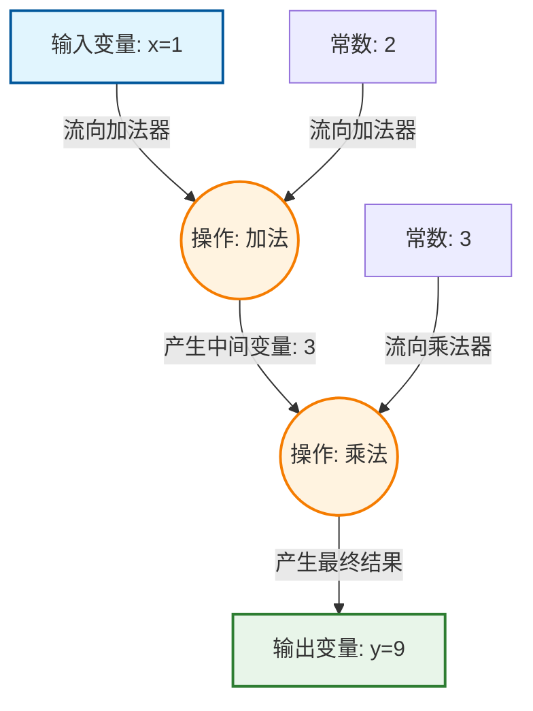

计算图它是深度学习框架（如 PyTorch、TensorFlow）背后的“超级记账本”，让复杂的微积分求导变成了一种自动化的流水线作业。

## 第1部分：搞清楚它是什么、为什么需要它（Why & What）

### 🎯 1.1 没有它之前，人们是怎么挣扎的？ _💡 核心必学_

**① 还原当时的麻烦：人们在哪一步被卡死了？**       
想象在 2012 年左右，你是一名深度学习研究员。你设计了一个拥有 10 层的新型神经网络。模型写好了，接下来你需要让它“学习”（也就是计算误差对每个参数的导数/梯度）。       
在没有计算图的时代，你必须拿出一支笔和一沓草稿纸，利用微积分里的“链式法则”，**纯手工推导**这 10 层网络中成千上万个参数的求导公式。推导完后，你还要小心翼翼地把这些复杂的公式翻译成 C++ 或 Python 代码。         
更绝望的是：只要你哪怕修改了网络中的**一个**小环节（比如把加法改成了乘法），你昨天推导的几页纸全部作废，必须从头再推一遍！研究员们大量的时间不是在设计模型，而是在痛苦地查验“到底哪一步的求导代码写错了一个负号”。        

**② 是什么让人不得不换一种思路？**        
随着神经网络越来越深（几十层到上百层），甚至出现了会循环和分支的复杂结构（RNN/CNN）。这里的逻辑不可能性在于：**人脑根本无法无差错地手写并维护拥有上百万参数的复杂微积分求导代码。** 这意味着必须放弃“工程师必须亲自写出求导数学公式”的落后假设。         

**③ 新旧方法的核心区别：哪个变量的位置被对调了？**

* **旧范式**：[人脑手推的微积分公式] 是输入 ──▶ [死板的求导代码] 是输出
* **新范式**：[普通的正向加减乘除代码] 是输入 ──▶ [系统自动生成的求导结果] 是输出

**④ 得到了什么，又必然失去了什么？**       
换来了 **“自动微分”（Autograd）的超能力**，你只需专注于搭建模型（正向写代码），系统会自动帮你搞定所有复杂的数学求导。但必然失去了**对底层内存的绝对掌控**——因为系统为了能在事后倒推导数，必须在正向计算时把你做的每一步操作都偷偷“记在内存里”，这会消耗成倍的显存（VRAM）。这不是缺陷，是用空间换取人类脑力解放的必然代价。

**⑤ 什么情况下它会不管用？你来推导**
基于以上逻辑，你现在应该能回答：            
* 如果系统在记录你的操作时，你用了一个“不可导”的野蛮操作（比如把数字四舍五入变成整数，或者掷骰子产生随机数），系统在事后倒推求导时会发生什么？
* 如果为了节省内存，我们在算出最终结果后，立刻把中间步骤的“记账本”给烧了，还能进行反向求导吗？

> 在深度学习的底层框架（如 PyTorch）中，**遇到“不可导”的野蛮操作，通常有两种下场**：
> 
> - **静默死亡（最可怕）**：像“四舍五入”这种操作，PyTorch 在求导时会在大部分地方直接强行返回 0。代码不报错，但你的模型参数就像冻住了一样，训练几百个 Epoch，Loss 一动不动。
> - **当场报错：** 对于某些完全无法定义导数的操作，调用 .backward() 时，程序会直接抛出红字 `RuntimeError: element 0 of tensors does not require grad and does not have a grad_fn`。系统根本无法建立“输入变量”和“输出误差”之间的因果关系，在 PyTorch 中，如果你加入纯粹的随机节点，计算图走到这里就会发现“线断了”（因为随机操作没有固定的数学求导公式），它会直接报错罢工，或者悄悄把这部分图断开，导致你的参数永远得不到更新

---

### 🗺️ 1.2 概念地图：它在 ML 知识体系中的位置 _💡 核心必学_

```text
ML 知识体系
│
├─ 深度学习框架底层机制 (Deep Learning Frameworks)
│   │
│   ├─ [计算图] (Computational Graph) ← 你在这里
│   │   ├─ 动态图 (Dynamic Graph, PyTorch首创：边写边画)
│   │   └─ 静态图 (Static Graph, 早期TF：先画图再通电)
│   │
│   └─ 链式法则 (Chain Rule, 它是计算图能在数学上成立的基石)
```

---

### 📚 1.3 学这个之前，你得先知道这几件事 _💡 核心必学_

──────────────────────────────────

📖 **前置概念：梯度（Gradient）与链式法则（Chain Rule）**

* **是什么**：
    * **梯度**：就是“敏感度”。旋钮 A 转动 1 毫米，最终误差会下降多少？这个比例就是梯度。
    * **链式法则**：就是“齿轮传动”。大齿轮转 1 圈让中齿轮转 2 圈，中齿轮转 1 圈让小齿轮转 3 圈。那么大齿轮转 1 圈，小齿轮转多少圈？答案是连乘：$2 \times 3 = 6$ 圈。
* **最小示例**：如果 $y = 3x$，梯度就是 3（$x$ 每变 1，$y$ 变 3）。
* **为什么需要它**：神经网络的误差反向传播，本质上就是成千上万个“齿轮”连在一起算链式法则。计算图就是为了把这些齿轮的连接关系记录下来。

──────────────────────────────────

---

### 🔩 1.4 一句话说清楚它的本质 _💡 核心必学_

「计算图」的本质是：**把复杂的数学公式拆解成按顺序连接的基础运算节点，系统通过这张有向网络记录每一步操作，从而实现全自动的反向求导。**

后面所有的例子和类比，都是在验证这句话，而不是在解释它。

---

### 💡 1.5 先不管公式，用感觉理解它 _💡 核心必学_

让我们用 **“工厂流水线与追责系统”** 来建立直觉。

想象一个生产汽车的工厂。
1. **输入节点**：原材料（钢铁、橡胶），在代码里就是你的数据 $X$ 和权重 $W$。
2. **运算节点（操作）**：车间里的机器。比如“冲压机”（加法操作）、“焊接机”（乘法操作）。
3. **输出节点**：最终造出来的汽车，在代码里就是最终的误差（Loss）。

当你写下一行代码：`Loss = (X * W) + B` 时，表面上你只是在做算术题，但在深度学习框架底层，它偷偷为你建了一座“工厂”（计算图）：      
它记录下：“原材料 $X$ 和 $W$ 进了乘法车间，生出了半成品 $M$；半成品 $M$ 和材料 $B$ 进了加法车间，生出了成品 $Loss$”。

**为什么非要记录这些？为了“秋后算账”（反向传播求导）。**         
当最终的成品汽车（Loss）被发现有瑕疵时，质检员需要**顺着流水线的记录往回查**：     
* 质检员先找到最后的“加法车间”，问：“成品出问题，你这加法机器要承担多少责任？”
* 问完后，顺着记录本继续往回找“乘法车间”，问：“那个半成品 $M$ 有问题，你这乘法机器又要承担多少责任？”

这就是计算图的作用：**它是前向计算时留下的“追责路径图”。没有这张图，出了错（有误差）你都不知道该去调整哪个零件（权重）。**

⚠️ **这个类比在这里开始失效:** 工厂流水线暗示了这些机器是物理存在的、永远固定的。但在现代深度学习框架（如 PyTorch 的动态图）中，每次处理一条新数据时，这座“工厂”都是瞬间临时搭建的，算完一次导数后，这座“工厂”就会被立刻拆除销毁，下一次计算再重新搭建。如果只记住固定的物理工厂，你会在理解循环神经网络（RNN）每次长度不同的输入时感到困惑。

#### 🕸️ 看看“计算图”长什么样

假设我们有一行极简的数学代码：$y = (x + 2) \times 3$。
当输入 $x = 1$ 时，底层画出的计算图如下：



**📌 架构图解读：**
* **图中的 [操作节点（圆圈）]** = 就是车间里的机器（加减乘除、激活函数等）。不仅能正向算结果，内部还自带了求导公式。
* **图中的 [变量节点（方块）]** = 就是流转的原材料和半成品。
* **为什么箭头这样指？** = 箭头代表前向计算时“数据流动的方向”。当进行反向传播求导时，计算机会**把所有的箭头完全反转**，从底部的 $Y$ 一路乘回顶部的 $X$，算出每个节点的梯度！

---

──────────────────────────────────

📚 **前置知识回顾**

──────────────────────────────────

本阶段会用到以下概念（已在第1部分学过）：
- **链式法则**：齿轮传动原理，把各个环节的导数乘起来求总导数。
- **节点（Node）**：图里的圈圈和方块，代表变量（如数据、权重）和操作（如加减乘除）。

如果不记得了，建议先快速回顾第一部分。

──────────────────────────────────

## 第2部分：它怎么运转、怎么动手用（How It Works & How to Use）

### ⚙️ 2.1 工作原理：它内部是怎么运转的 _💡 核心必学_


计算图的运转，永远严格遵循**“先正向建房，再反向拆房”**的两步走流程。

让我们用 ASCII 流程图看看一次完整的训练迭代中，计算图经历了什么：

```text
[阶段一：前向传播 (Forward Pass) —— 边算边记账]
输入特征数据，开始计算预测结果。

   变量(体重)        变量(运动量)
       │                 │
       ▼                 ▼
  ╭───────────────────────────╮
  │ 操作节点：乘法 (×)          │ ◀── 【系统暗中动作】：
  │ 算出了中间结果：消耗热量      │      不仅算出结果，还悄悄把输入值
  ╰───────────────────────────╯      (体重和运动量) 保存到内存里！
       │
       ▼
  ╭───────────────────────────╮
  │ 操作节点：误差计算 (-)       │ ◀── 【系统暗中动作】：
  │ 算出最终误差：Loss           │      记录这是由上一层的"消耗热量"算来的。
  ╰───────────────────────────╯
       │
       ▼
【图建好了，停在这里等待指令】


[阶段二：反向传播 (Backward Pass) —— 顺藤摸瓜算责任]
你喊了一句代码：Loss.backward()！

   变量(体重的梯度) ◀── 算出责任 ── (操作节点 ×) ◀── 收到上级传来的梯度
                                          │
                                          │ (链式法则连乘)
                                          │
                                (操作节点 -) ◀── 从 Loss=1 开始往回传
                                          │
【算完所有梯度后，系统立刻把这张图销毁（释放显存）！】
```

**关键点**：
现代主流框架（如 PyTorch）采用的是**动态图（Dynamic Graph）**。意思是，这张图不是你提前画好的死图，而是**代码每运行一行，图就往前画一笔**。当反向传播结束后，这张图就灰飞烟灭了。下一轮看新数据时，又会重新建一张新图。这种“随用随建，用完即毁”的机制，给了开发者极大的调试自由。

---

### 💻 2.2 最小MVP：动手写代码，跑出你的第一个结果 _💡 核心必学_

我们来用 PyTorch 见证自动求导的魔法。我们要算一个极其简单的公式：
$预测分数 = (学习时间 \times 效率权重) + 基础分$

如果我们想知道：“在这个状态下，稍微调整一下『效率权重』，分数会变动多少？”（这就是求导）。看看有了计算图，代码有多简单。

```python
# ── 第1步：准备变量，并开启"记账"功能 ────────────────
import torch

# 学习时间是客观数据，不需要求导（不需要模型去学习改变它）
hours_studied = torch.tensor([2.0]) 
base_score = torch.tensor([10.0])

# 效率权重是模型参数，我们需要不断微调它，所以必须加上 requires_grad=True
# 这行代码的意思是告诉 PyTorch："盯紧这个变量，把它加到计算图里！"
efficiency_weight = torch.tensor([3.0], requires_grad=True)

# ── 第2步：前向计算（此时系统在暗中建图） ─────────────
# 算术：(2.0 * 3.0) + 10.0 = 16.0
predicted_score = (hours_studied * efficiency_weight) + base_score
print(f"前向算出的预测分数: {predicted_score.item()}") 
# 输出: 16.0

# ── 第3步：一键反向传播求导！ ───────────────────────
# 我们根本不需要手动去写链式法则公式，只要喊出下面这句咒语：
predicted_score.backward() 

# 此时，PyTorch 已经顺着计算图把所有 requires_grad=True 的变量的导数算好了！
# 我们来检查一下：
print(f"效率权重的梯度 (导数): {efficiency_weight.grad.item()}")
# 输出: 2.0
```

**验证一下直觉**：
公式是 $y = (x \times w) + b$。数学上，对 $w$ 求导，结果就是 $x$。
我们的 $x$（学习时间）是 $2.0$。PyTorch 算出来的 `efficiency_weight.grad` 也是 $2.0$。完全正确！你一行数学推导都没写，框架替你干了所有脏活累活。

---

### 🌍 2.3 真实世界里，它被用在什么地方？ _💡 核心必学_

在真实的 AI 训练场景中，计算图是 **“模型训练大循环”** 的心脏。无论你训练的是预测房价的简单网络，还是像 ChatGPT 这种有千亿参数的巨兽，底层都在不断重复下面这四步：

```text
       ╭──────── 1. 前向传播 (产生预测与Loss，并建图) ────────╮
       │                                                  │
 4. 优化器走一步                                       2. 误差反向传播
 (根据梯度更新权重)                                     (Loss.backward() 算梯度)
       │                                                  │
       ╰──────── 3. 清空梯度 (烧毁旧账本，准备下一次)  ────────╯
```

如果不该用计算图的地方你用了（比如模型上线去给用户做预测时），会导致显存（GPU 内存）被大量无用的“记账”数据塞满，直接引发系统崩溃。

---

### ✅ 2.4 工程规范：怎么写才算专业？避开会让你被骂的写法 _🔥 实战必备_

在操作计算图时，有两个极其经典的“行业规范”，新手几乎 100% 会在这里踩坑。

**🔴 RED（强制规范）：反向传播前，必须清空上一轮的梯度！**
- **后果**：PyTorch 的计算图有一个反直觉的设定——梯度是**累加**的。如果你忘了清空，第二轮的梯度会直接加上第一轮的梯度。跑个十轮下来，你的梯度会变成一个巨大无比的错误数字，模型瞬间崩溃（Loss 变成 `NaN`）。

```python
# ❌ 错误示范：忘记清零，梯度像滚雪球一样错误累加
for data in dataset:
    loss = model(data)
    loss.backward()
    optimizer.step()
    # 灾难：上一轮的梯度还在，下一轮继续往上加！

# ✅ 正确做法：每次反向传播前（或后），用 zero_grad() 洗白白
for data in dataset:
    optimizer.zero_grad()  # ← 核心：把所有变量身上的旧梯度清零！
    loss = model(data)
    loss.backward()
    optimizer.step()
```

**🟢 GREEN（强烈建议）：在测试/推理阶段，一定要把图给“关掉”！**
- **后果**：当你训练好模型，拿它去给用户做预测时，你不需要再去微调权重了（不需要求导）。但如果你不明确告诉 PyTorch，它依然会傻傻地在内存里建庞大的计算图，导致你的显存占用翻了 3 倍，预测速度极慢。

```python
# ❌ 错误做法：测试时依然保持记账，浪费大量显存
predictions = model(test_data)

# ✅ 专业做法：使用 torch.no_grad() 结界
# 结界内的代码，PyTorch 会彻底关闭计算图机制，不留任何痕迹
with torch.no_grad():
    predictions = model(test_data)
```

---

### 🔄 2.5 有好几种方法能做这件事，怎么选？ _⭐ 进阶选学_

前面我们提到过 PyTorch 用的是“动态图”。与之对立的是早期的 TensorFlow 1.x 使用的“静态图”。这两大阵营的战争塑造了今天的深度学习格局。

| 对比维度 | 动态图 (Dynamic Graph) 代表：PyTorch | 静态图 (Static Graph) 代表：TensorFlow 1.x, JAX |
| --- | --- | --- |
| **建图时机** | **边跑边建** (Define-by-Run) | **先建好，后通电** (Define-and-Run) |
| **代码体验** | 极佳！就像写普通的 Python 代码。随时可以用 `print()` 查看中间变量。 | 极差。你写的是在“描述”一个图，不能用普通的 `if/else`，中间变量无法直接 `print()` 出来看。 |
| **运行速度** | 略慢。每次都要重新建图。 | **极快**！因为图是死固定的，编译器可以对图进行极其深度的优化（比如合并多个节点）。 |
| **我现在该选哪个？** | **首选 PyTorch（动态）**。在科研和日常项目中，开发效率远比节省那点计算时间重要。 | 如果你是在大厂要把成熟模型部署到几千张显卡上追求极致性能，才会用到静态图/JIT编译。 |

*(注：如今的 TensorFlow 2.x 也已经向 PyTorch 妥协，默认开启了动态图机制。可见动态图有多受欢迎！)*

---

──────────────────────────────────

📚 **前置知识回顾**

──────────────────────────────────

本阶段会用到以下概念（已在第1、2部分学过）：
- **前向传播（建图）**：随着代码运行，系统在暗中搭建记录操作的“工厂流水线”。
- **反向传播（拆房）**：调用 `.backward()` 算完梯度后，这张图就会被立刻销毁释放内存。

如果不记得了，建议先快速回顾上一部分。

──────────────────────────────────

## 第3部分：哪里容易出错、怎么做得更好（What to Avoid & Beyond）

### ⚠️ 3.1 大多数人在哪里栽了跟头？ _🔥 实战必备_

在处理计算图时，如果不理解底层是在“建图”和“记账”，你写出的看起来完全符合 Python 语法的代码，会引发毁灭性的后果。

#### 陷阱 1：无意中保留了所有的账本（显存刺客）

**💥 现象**：
模型刚开始跑得好好的，但随着训练轮数增加，显存（GPU 内存）占用越来越高，最后突然报错崩溃：`CUDA out of memory`。

**🔍 根本原因**：
你想计算所有批次（Batch）的平均误差，于是定义了一个普通的 Python 列表或变量来把每一步的 `Loss` 存起来。
但是！只要你不剥离计算图，你存下来的不仅仅是那个 `Loss` 的数字，而是**连带着算出这个数字的整座“庞大工厂”（整张计算图）！** 每循环一次，你就把一座百万吨级的工厂塞进内存，几十轮下来，神仙也扛不住。

**❌ 错误代码**：
```python
total_loss = 0

for data in dataset:
    loss = model(data)           # 前向传播，建了一张巨大的图
    total_loss += loss           # ❌ 灾难！你把带有整张图的 tensor 塞进了变量里
    
    loss.backward()              # 算完梯度
    optimizer.step()
    # 本来图在这里应该被销毁，但因为你的 total_loss 引用了它，它变成了"钉子户"永远留在内存里！
```

**✅ 修复方案**：
```python
total_loss = 0

for data in dataset:
    loss = model(data)
    # ✅ 修复版本：使用 .item() 
    # .item() 的作用是："我只要这上面的纯粹数字，后面的账单和图我统统不要！"
    total_loss += loss.item()    
    
    loss.backward()
    optimizer.step()
```

#### 陷阱 2：原位操作（In-place Operation）打断了记账连招

**💥 现象**：
一运行代码，立刻爆出一段极其生草的红字报错：
`RuntimeError: one of the variables needed for gradient computation has been modified by an inplace operation...` (算梯度需要的某个变量，被原位操作修改了)。

**🔍 根本原因**：
“原位操作”就是直接在内存原来的地址上覆盖数据（比如 Python 里的 `+=`，或者 PyTorch 里带下划线的函数 `x.add_(1)`）。
想象质检员（反向传播）正在看账本倒推责任：“当时输入给乘法机器的原料 $x$ 是多少来着？” 结果他回头一看，**那个原料在原有的格子里已经被你用 `+=` 强行涂改换成了别的东西！** 原始证据被破坏，系统为了防止算出错误的梯度，只能立刻报错罢工。

**❌ 错误代码**：
```python
x = torch.tensor([2.0], requires_grad=True)
weight = torch.tensor([3.0], requires_grad=True)

# ❌ 错误示范：使用了 += 原位覆盖了 x 的原始证据
x += 1.0  
y = x * weight

y.backward() # 崩溃！图在往回找 x 的时候发现数据被篡改了
```

**✅ 修复方案**：
```python
x = torch.tensor([2.0], requires_grad=True)
weight = torch.tensor([3.0], requires_grad=True)

# ✅ 修复版本：使用普通的加法 x = x + 1.0
# 系统会开辟一块新的内存放新结果，保留旧的 x 供图反向查账
x = x + 1.0  
y = x * weight

y.backward() # 完美运行
```

---

### 🧪 3.2 模型出问题了，怎么一步步找原因？ _🔥 实战必备_

当你遇到和计算图相关的诡异报错时，请拿出这张诊断图：

```text
计算图与显存排查指南
    │
    ├─ 报错 OOM (Out of Memory)？
    │       │
    │       ├─ 第一步就爆了？ ──▶ Batch Size 开太大了，图本身就塞不进显卡，改小点。
    │       │
    │       └─ 跑了几十步后才慢慢爆掉？ ──▶ 绝对是存历史数据时忘了加 .item()！
    │
    └─ 报错 modified by inplace operation？
            │
            ├─ 检查代码里有没有 +=, -=, *=
            │      └─ 换成 x = x + 1 等非原位操作。
            │
            └─ 检查有没有用带下划线的函数 (如 x.relu_(), tensor.copy_())
                   └─ 去掉下划线，改用普通版本 x = torch.relu(x)。
```

---

### 🚀 3.3 如果要用在真实项目里，该怎么做？ _⭐ 进阶选学_

前面讲了，梯度在计算图里是“累加”的（如果不清零的话）。这个看似反人类的设计，在工业界其实是一个极其强大的特性！

**工业界神技：梯度累加（Gradient Accumulation）**

假设你正在一台破笔记本上训练大模型，显卡内存极小，每次（Batch Size）最多只能塞下 2 张图片。但算法要求必须看 32 张图片才能更新一次权重。怎么办？
**利用计算图的累加特性“蚂蚁搬家”！**

```python
# 假设真实想达到的 Batch Size 是 32，但显卡只能装 2
accumulation_steps = 16  # 16次 * 2张 = 32张

for i, data in enumerate(dataset):
    # 1. 每次只算 2 张图片，建很小的图
    loss = model(data)
    
    # 2. 算梯度并"累加"到参数上（注意！图在这里被正常销毁，释放显卡）
    # 但梯度数字本身被保留在了权重参数的 .grad 属性里！
    loss.backward()
    
    # 3. 只有攒够了 16 次（相当于看了 32 张图的梯度之和）
    if (i + 1) % accumulation_steps == 0:
        optimizer.step()      # 才让模型真正走一步
        optimizer.zero_grad() # 走完立刻把旧账本烧掉
```
这种方法让你用极其低廉的硬件，完美模拟了顶级显卡大批量训练的效果！

---

### 🎓 3.4 实战挑战：来试试看自己解决一个真实问题 _🔥 实战必备_

恭喜你学完了计算图的完整运转逻辑！现在，来帮一位快要崩溃的实习生看段代码。

──────────────────────────────────

🎓 **实战挑战**

──────────────────────────────────

**场景：商品销量预测模型训练**

实习生写了一段极其基础的训练大循环。代码能够顺利运行，既没有报错，也没有崩溃。但是！模型跑出来的效果极其糟糕，而且随着训练的进行，**这台服务器的内存很快就被吃光了**，而且**模型的预测数字像脱缰的野马一样越来越离谱（一会儿极大，一会儿极小）**。

这里面藏着我们在第 2 和第 3 部分重点强调的 **2 个严重陷阱**。

请找出它们，并写出你的修复方案。

```python
import torch

# ... 省略模型和数据加载 ...

total_epoch_loss = 0.0

for epoch in range(50):
    for batch_data, batch_labels in dataloader:
        
        # 1. 前向传播
        predictions = model(batch_data)
        loss = loss_function(predictions, batch_labels)
        
        # 2. 记录这段时间的总误差，用于事后画图分析
        total_epoch_loss += loss
        
        # 3. 反向传播与优化
        loss.backward()
        optimizer.step()
        
    print(f"Epoch {epoch} 结束啦！")
```

📝 **将你的诊断和修改后的代码发送给我，我会进行代码评审：**
- ✅ 指出你做得好的地方
- ⚠️ 纠正遗漏的细节
- 🌟 给出符合工业标准的最终版代码