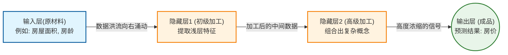
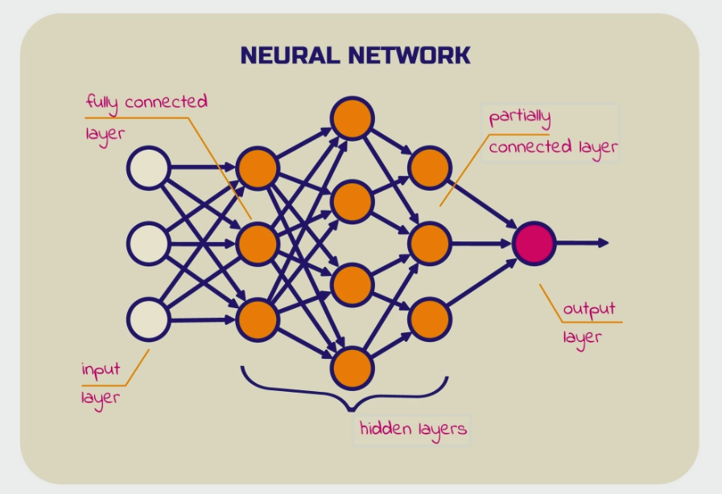

## 第1部分：搞清楚它是什么、为什么需要它

### 1.1 没有它之前，人们是怎么挣扎的？ 💡 核心必学

**① 还原当时的麻烦：人们在哪一步被卡死了？**   
想象一个场景：你需要让计算机识别一张 $100 \times 100$ 像素的图片里是不是一只猫。在深度学习普及之前，工程师们是怎么做的？他们必须手动写极其复杂的条件判断（If-Else）规则：“如果左上角的像素是黑色，且旁边是棕色，同时某处有锐角的形状，那么它可能是猫的耳朵……”。      
当面对成千上万的像素点、复杂的光影变化和猫的各种奇葩姿势时，**人类手工编写规则的脑力彻底被卡死**，无论写多少条规则，都无法覆盖所有情况。

**② 是什么让人不得不换一种思路？**        
**人工手写规则**在面对**高维度、非结构化数据（如图像、声音）**时会**遭遇穷举爆炸的绝对失败**，这意味着必须放弃“让人类去定义特征和提取逻辑”这个前提假设。

**③ 新旧方法的核心区别：哪个变量的位置被对调了？**        
为了解决这个问题，人们发明了多层神经网络，并用“前向传播”来代替人工逻辑。       
- 旧范式：[原始数据] + [人类手写的规则] ──▶ 算出 ──▶ [最终预测]
- 新范式：[原始数据] + [网络里无数个权重参数] ──▶ 经过前向传播自动算出 ──▶ [最终预测]

「前向传播」让我们从 **写死板的代码逻辑** 变成了 **让数据像流水一样穿过一层层的权重网，自动加工出结果**。

**④ 得到了什么，又必然失去了什么？**       
换来了 **极其强大的复杂模式识别能力（只需给数据，网络自己算）**，但必然失去了 **过程的可解释性（黑盒效应）**。当一个前向传播告诉你“这是一只猫”时，你很难像看 If-Else 代码一样，清晰地指出它到底是根据哪根猫毛判断出来的。这不是缺陷，这是用矩阵暴力计算换取能力的必然代价。

**⑤ 什么情况下它会不管用？你来推导**       
基于以上逻辑，你现在应该能回答：        
- 如果网络里的参数（权重）全部都是随机的，没有经过反向传播的训练，这时候进行“前向传播”，得到的结果会是什么？
- 如果你在训练时输入的是 $100 \times 100$ 的正方形图片，而在预测时强行塞入一张 $200 \times 100$ 的长方形图片，前向传播还能顺利进行吗？

---

### 1.2 概念地图：它在 ML 知识体系中的位置 💡 核心必学

```text
ML 知识体系
│
├─ 深度学习 (Deep Learning)
│   │
│   ├─ 前向传播 (Forward Propagation) ← 你在这里
│   │   ├─ 线性加权求和 (矩阵乘法)
│   │   └─ 激活函数 (非线性映射)
│   │
│   └─ 反向传播 (Backpropagation)（你的老朋友，必须在前向传播之后才执行）
```

---

### 1.3 学这个之前，你得先知道这几件事 💡 核心必学

──────────────────────────────────

📖 **前置概念：神经元 (Neuron)**
- **是什么**：一个接收多个输入，给它们打分加权，最后输出一个结果的“微型决策器”。
- **最小示例**：你决定今天是否带伞。天气预报说下雨（权重极高），你妈让你带伞（权重中等），你嫌重不想带（权重为负）。神经元把这些因素按权重相加，得出最终决定。
- **为什么需要它**：前向传播的过程，本质上就是成千上万个神经元同时在做这样的计算。

──────────────────────────────────

### 1.4 一句话说清楚它的本质 💡 核心必学

「前向传播」的本质是：**把原始数据当作原材料，在一层一层的神经网络矩阵中进行预定的乘法和加法运算，最终单向输出预测结果的“流水线加工”过程。**

后面所有的例子和类比，都是在验证这句话，而不是在解释它。

---

### 1.5 先不管公式，用感觉理解它 💡 核心必学


为了让你有直观的感受，我们直接看它在架构图中是怎么流动的。



**📌 架构图解读：**
- **图中的节点和连线** = 就像是一个严格的**多级工厂流水线**。
- **为什么箭头这样指？** = 前向传播是**绝对单向**的（Forward）。原材料（数据）从左边输入，每经过一个车间（隐藏层），就被里面的工人（权重参数）和机器（激活函数）进行一次变形和加工，直到右边吐出最终的成品（预测值）。在这个过程中，数据**决不能回头**。

⚠️ **这个类比在这里开始失效：**
“流水线工厂”暗示了每一个车间都知道自己在造什么零件。但真实的前向传播里并不是这样——隐藏层里的神经元根本不知道自己在提取什么特征，它们只是在机械、盲目地执行矩阵相乘。如果只记住类比，你会误以为神经网络内部有明确的语义分工（比如一楼做猫耳朵，二楼做猫尾巴），而在实际工程中，它完全是一个不可解释的数字黑盒。

---

### 1.6 公式在说什么？逐字翻译给你看 ⭐ 进阶选学（可先跳过）

对于网络中的任意一层（假设是第 $L$ 层），前向传播在数学上只需要极其简单的两个公式交替进行：

**步骤一：线性加权求和**
$$Z^{[L]} = W^{[L]} \cdot A^{[L-1]} + b^{[L]}$$

**步骤二：激活函数过滤**
$$A^{[L]} = g(Z^{[L]})$$

**翻译拆解：**
- $A^{[L-1]}$ = **上一层送来的原材料**（如果是第一层，它就是你的原始数据 $X$）。
- $W^{[L]}$ = **这一层的权重矩阵**（记录了这一层认为哪些输入更重要）。
- $b^{[L]}$ = **偏置项**（基础底分，就像温度计的零度标记）。
- $Z^{[L]}$ = **加工后的总打分**。
- $g(...)$ = **激活函数**（比如前面讲过的 ReLU，把负数变成 0）。
- $A^{[L]}$ = **这一层最终输出的成品**（将作为原材料继续送往下一层）。

**直觉验证：**
想象一下，如果没有第二步的激活函数 $g(...)$ 会怎样？
那么无论你有多少层，公式就变成了 $W_3 \cdot (W_2 \cdot (W_1 \cdot X))$。在线性代数中，多个矩阵相乘等价于一个单一矩阵。这意味着，**如果没有非线性的激活函数，你耗费巨资搭建的 100 层前向传播，其能力和 1 层没有任何区别！**

---

## 第2部分：它怎么运转、怎么动手用

### 🔍 前置知识回顾

本阶段会用到以下概念（已在阶段1学过）：
- **线性加权求和**（把输入乘以权重再相加）
- **激活函数**（给结果套上一层非线性滤网，比如 ReLU）

---

### ⚙️ 2.1 工作原理：它内部是怎么运转的 💡 核心必学





在系统运转时，前向传播本质上就是一次 **“矩阵形态的连环变形”**。

让我们用你刚才提到的“特征数量”来看看数据是怎么流转的。假设我们在预测房价，输入有 2 个特征（面积、房龄），我们要把它送入一个有 3 个神经元的隐藏层。

```text
[输入数据 X] (形状: 1行 × 2列)
  比如：[120平米, 5年]
       │
       ▼
[步骤1：矩阵相乘 (线性加权求和)]
  底层逻辑：数据 X 撞上了权重矩阵 W (形状: 2行 × 3列)。
  数学规则：(1×2) 的矩阵 乘以 (2×3) 的矩阵，会变成 (1×3) 的矩阵！
  这就相当于把 2 个原始特征，打碎重组成了 3 个新特征。
       │
       ▼
[加上偏置 b] (形状: 1行 × 3列)
  给这 3 个新特征每个人加一个基础底分。
       │
       ▼
[步骤2：激活函数 ReLU]
  把这 3 个分数里小于 0 的全部粗暴地变成 0。
       │
       ▼
[输出结果 A] (形状: 1行 × 3列)
  得到加工后的中间产物，准备送往下一层！
```

**系统视角的顿悟**：前向传播的过程，其实就是**不断在改变数据的维度（Shape）**。通过权重矩阵的精心设计，我们可以把 2 个特征升维成 100 个特征，最后再降维成 1 个预测结果。

---

### 💻 2.2 最小MVP：不调深度学习包，纯手写前向传播 💡 核心必学

为了彻底撕开黑盒，我们这次不用 PyTorch，纯用 `NumPy` 基础库来模拟一根原始的数据管线。这就是最原汁原味的前向传播！

```python
import numpy as np

# ── 第1步：准备数据 (原材料) ──────────────────────────────
# 假设 1 个样本，2 个特征 (比如面积 1.2 百平米，房龄 0.5 十年)
X = np.array([[1.2, 0.5]])  # 形状: (1, 2)

# ── 第2步：搭建"车间" (初始化网络权重) ─────────────────────
# 隐藏层：接收 2 个输入，包含 3 个神经元 (所以是 2x3 的矩阵)
# 注意：在没有训练前，我们先随便填一些随机的权重数字
W1 = np.array([[ 0.2, -0.1,  0.4],
               [ 0.5,  0.8, -0.3]]) 
b1 = np.array([0.1, 0.1, 0.1])  # 3 个神经元的偏置

# 输出层：接收 3 个输入，输出 1 个最终预测值 (所以是 3x1 的矩阵)
W2 = np.array([[ 0.6], 
               [-0.5], 
               [ 0.8]])
b2 = np.array([0.5])

# ── 第3步：🚀 执行前向传播 (流水线开动) ───────────────────

# 第一层加工：
# np.dot 就是矩阵乘法 (线性加权求和)
Z1 = np.dot(X, W1) + b1 
# 激活函数：ReLU (把所有负数变成 0)
A1 = np.maximum(0, Z1)  
print(f"隐藏层提炼出的 3 个新特征：\n{A1}\n")

# 第二层加工 (用第一层的输出 A1 作为新输入)：
Z2 = np.dot(A1, W2) + b2
# 输出层通常不需要 ReLU，直接输出预测房价
A2 = Z2 

# ── 第4步：查看结果 ──────────────────────────────────
print(f"前向传播最终预测房价: {A2[0][0]:.2f}")
```

👉 **跑完这段代码的结论**：只要你把权重矩阵的维度设计好，前向传播就是机械的 `相乘 -> 相加 -> 截断`，毫无神秘可言。

---

### 🌍 2.3 真实世界里，它被用在什么地方？ 💡 核心必学

我们在上一节学了“反向传播是用来训练模型的”。那么“只有前向传播，没有反向传播”的场景存在吗？

**存在，而且这是 AI 创造商业价值的唯一环节！**

业界管纯粹的“前向传播”叫作：**推理（Inference） / 模型部署**。

```text
训练阶段 (在实验室烧钱)：
前向传播 ──▶ 算误差 ──▶ 反向传播 ──▶ 更新权重 (疯狂循环几万次)

上线部署阶段 (给公司赚钱)：
用户输入一句话 ──▶ 【仅执行前向传播】 ──▶ ChatGPT直接输出回答！
(反向传播的机制被彻底拆除丢弃，权重被永久锁死)
```

**四象限决策：什么时候只用前向传播？**
- ✅ 你的模型已经训练好了，现在要封装成 API 给客户端使用。
- ✅ 你的手机正在使用 Face ID 解锁（手机里只做前向传播，算力消耗极小，不需要训练）。
- ❌ 你发现模型对某类数据的预测准确率很低，想让它变聪明（此时必须把反向传播加回来重新训练）。

---

### ✅ 2.4 工程规范：怎么写才算专业？避开会让你被骂的写法 🔥 实战必备

在真实工程中，执行前向传播有一个极度重要、关乎运行速度成百上千倍差异的规范。

**🔴 RED（强制规范）：永远不要用 for 循环一条条处理数据！**

**💥 现象与后果**：
假设你有 10,000 张图片要预测。如果你写一个 `for` 循环，每次传 1 张图片进去做前向传播，你的程序会慢到让人崩溃。因为 GPU 擅长的是**并行矩阵计算**，一条条喂数据等于让高铁去送外卖。

```python
# ❌ 错误示范：会导致 GPU 处于"饿死"状态，极其低效
predictions = []
for i in range(10000):
    x = data[i]          # 每次取 1 条数据 (形状 1x2)
    pred = model.forward(x) 
    predictions.append(pred)

# ✅ 正确示范：Batching（批处理）
# 把 10000 条数据拼成一个巨大的矩阵 (形状 10000x2)
# 一次性"砸"给矩阵乘法，底层 C++ 和 GPU 会瞬间并发算完！
X_batch = data[:] 
predictions = model.forward(X_batch) 
```

**深刻理解**：前向传播中的数学公式 $Z = X \cdot W$ 是维度包容的。不论你的 $X$ 是 1 行还是 10,000 行，只要特征列数对得上 $W$ 的行数，矩阵乘法就能一次性搞定！这就叫**批处理（Batching）**。

---

## 第3部分：哪里容易出错、怎么做得更好

### 🔍 前置知识补充

在讲陷阱前，你需要了解张量（Tensor）在代码里的一个核心属性：
- **Shape（形状/维度）**：
    - **是什么**：描述一个数据块的“长宽高”。
    - **最小示例**：一个包含 3 个数字的一维数组 `[1, 2, 3]` 的 Shape 是 `(3,)`。一个 2 行 3 列的二维表格，Shape 是 `(2, 3)`。在深度学习中，**一切报错，90% 都是 Shape 对不上**。

---

### ⚠️ 3.1 大多数人在哪里栽了跟头？ 🔥 实战必备

#### 陷阱 1：维度灾难（Shape Mismatch）—— 齿轮死活卡不上

这是你在写神经网络时，每天都会遇到至少 3 次的噩梦。这也是你在第一部分中精准预测到的死穴！

**💥 现象**：
控制台甩给你一段血红的报错：
`RuntimeError: mat1 and mat2 shapes cannot be multiplied (10x20 and 10x30)`

**🔍 根本原因**：
前向传播的本质是矩阵乘法。线性代数的死规矩是：**左边矩阵的列数，必须等于右边矩阵的行数**。
如果上一层输出了 20 个特征，而下一层的神经元权重矩阵是按照接收 10 个特征设计的，这两个齿轮就彻底卡死了。


**❌ 错误代码**：
```python
import torch
import torch.nn as nn

# 假设我们在预测房价，每次送入 10 个房子，每个房子 20 个特征
X = torch.randn(10, 20)  # Shape: (10, 20)

# ❌ 错误设计：我随便猜一个隐藏层，让它接收 10 个输入，输出 30 个特征
layer = nn.Linear(in_features=10, out_features=30) 

# 前向传播瞬间爆炸！
# X 的形状是 (10, 20)，意味着有 20 列
# layer 的权重矩阵是 (10, 30)，意味着期望收到 10 行
# 20 不等于 10，报错！
output = layer(X) 
```

**✅ 修复方案**：
```python
# ✅ 修复：强制对齐"接口"
# 上游输出的是 20 个特征，这里的 in_features 必须雷打不动写 20！
layer = nn.Linear(in_features=20, out_features=30) 
output = layer(X) # 顺利通过，输出 Shape 变成 (10, 30)
```
**🛡️ 如何预防**：在写前向传播代码时，在每一层的前后疯狂使用 `print(x.shape)`，用肉眼核对数据的尺寸变化。

---

#### 陷阱 2：内存撑爆（OOM: Out Of Memory）—— 随便加一层，显卡冒烟了

**💥 现象**：
报错：`CUDA out of memory.`。你的显卡内存（比如 8GB）瞬间被塞满，程序被强行终止。

**🔍 根本原因**：
很多新手为了让模型“更聪明”，喜欢把隐藏层里的神经元数量设得极大。但他们没有意识到**全连接层（Linear/Dense）的参数量是乘法级爆炸的**。

举个例子：你想处理一张 $1000 \times 1000$ 像素的高清图片。
- 输入特征数：1,000,000 个（100万）。
- 你想接一个有 1,000 个神经元的普通隐藏层。
- 这一层的权重矩阵大小：$1,000,000 \times 1,000 = 10$ 亿个参数！
- 仅仅这**一个隐藏层**，在前向传播时就需要占据大约 4GB 的显存，如果你再加上 Batch（批处理），一张顶配显卡瞬间就被撑爆了。

**✅ 修复方案**：
绝对不要用普通的全连接层去直接处理高维度的原始图像或长文本。必须先用**卷积层（CNN）**或**嵌入层（Embedding）**进行降维提取特征，再送到全连接层。

---

### 🧪 3.2 模型出问题了，怎么一步步找原因？ 🔥 实战必备

当前向传播在代码里崩掉时，用这个决策树快速定位：

```text
前向传播报错了！
    │
    ├─ 报错里有 "Shape", "Size", "Dimension" 字眼？
    │       │
    │       ├─ YES ──▶ 打印上一层输出的 shape 和这一层权重的 shape。
    │       │           必定是没对齐！(比如把 1D 数组当 2D 传进去了)
    │       │
    │       └─ NO  ──▶ 往下看
    │
    ├─ 报错是 "Out of memory" 或直接死机重启？
    │       │
    │       ├─ YES ──▶ 检查 Batch Size 是不是设太大了（比如 512）？→ 改成 16 或 32。
    │       │           检查 Linear 层的特征数是不是上百万了？→ 删掉/加深卷积层。
    │       │
    │       └─ NO  ──▶ 往下看
    │
    └─ 报错 "Expected all tensors to be on the same device"？
            │
            └─ 致命低级错误：数据在 CPU 上，模型在 GPU 上。
               解决：把数据和模型统一用 `.to('cuda')` 转移到显卡。
```

---

### 🚀 3.3 如果要用在真实项目里，该怎么做？ ⭐ 进阶选学

在真正的工程里，前向传播有两个极其专业的套路。如果你的代码没有这几行，资深工程师一眼就能看出你是新手。

**1. 用 Pipeline（类模块）把散装的代码封装起来**
工业界绝不允许像 2.2 节那样零散地定义 `W1`、`W2`。必须继承 `nn.Module`，把一切“前向”逻辑死死封在 `forward` 函数里。

**2. 部署（纯预测）时，必须“拉闸限电”**
我们在 2.3 节说过，给用户做预测时，反向传播是被彻底丢弃的。但在 PyTorch 里，哪怕你不调用 `.backward()`，它默认还是会**偷偷记录所有前向传播的轨迹**（为了万一你要倒推做准备），这会极大地浪费内存和算力！

```python
import torch
import torch.nn as nn

# ── 1. 工业级模型封装规范 ──────────────────────────────
class HousingModel(nn.Module):
    def __init__(self):
        super().__init__() # 必须调用的祖宗初始化
        # 把工厂的机器（权重）在这里准备好
        self.layer1 = nn.Linear(2, 64)
        self.relu = nn.ReLU()
        self.layer2 = nn.Linear(64, 1)

    # 所有的前向数据流，必须严格写死在这个函数里
    def forward(self, x):
        x = self.layer1(x)
        x = self.relu(x)
        x = self.layer2(x)
        return x

model = HousingModel()

# ── 2. 工业级部署（纯前向传播）规范 ─────────────────────
# 新数据来了，准备给客户做预测
new_data = torch.tensor([[1.2, 0.5]])

# 🔴 核心护城河 1：切换到评估模式
# 这会关闭 Dropout 和 BatchNorm 等训练专用的骚操作
model.eval() 

# 🔴 核心护城河 2：拔掉窃听器（切断梯度追踪）
# "with torch.no_grad():" 告诉 PyTorch：
# "接下来的前向传播纯属预测，绝对不会更新参数，别浪费内存去记录轨迹了！"
with torch.no_grad(): 
    prediction = model(new_data)
    print(f"安全高效地预测出房价: {prediction.item():.2f}")
```

---

### 🎓 3.4 实战挑战：来试试看自己解决一个真实问题 🔥 实战必备

这可能是你独立解决的第一个生产级 Bug！

```python
"""
场景：你训练好了一个非常棒的房价预测模型（接收 2 个特征：面积、房龄）。
现在模型要上线了，后端工程师传来了一条用户的实时输入数据：
房子面积 80平米 (0.8)，房龄 5年 (0.5)。

后端工程师写了下面这段代码来调用你的模型，但是一跑就当场报错，
并且他抱怨你的模型在服务器上占用内存特别大。

以下代码存在 2 个典型的工程级别错误，请找出来并修复：
"""

import torch
import torch.nn as nn

# 模拟你已经训练好的模型 (假设训练得很好，不用管内部逻辑)
model = nn.Sequential(
    nn.Linear(2, 64),
    nn.ReLU(),
    nn.Linear(64, 1)
)

# 后端工程师写的预测代码：
# 1. 接收到单条数据，装进 Tensor (问题就隐藏在这里的形状里！)
user_input = torch.tensor([0.8, 0.5])  

# 2. 直接扔进模型做前向传播预测
predicted_price = model(user_input)

print(f"预测价格: {predicted_price}")
```

📝 **找出导致这段推理代码报错/低效的 2 个错误（一个是形状问题，一个是工程规范问题）。** 大胆把你的修复代码或者思路发出来，我会为你进行最后的代码评审！