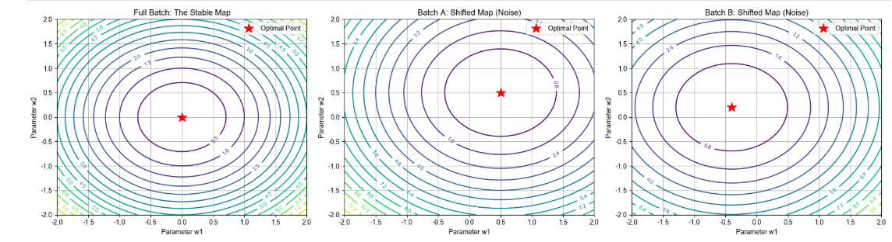
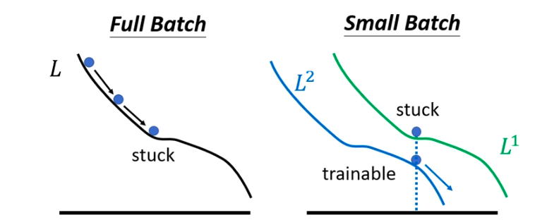

**模型的每一步优化不是连续的滑行，而是一跳一跳的闪现。**
---

### 1. 物理真相：所有的轨迹本质都是“折线段”

从数学实现上讲，无论是 Full Batch 还是 Small Batch，它们都是由无数个**微小的直线段**连接而成的。

因为每次参数更新的公式是：       
$$\theta_{new} = \theta_{old} - \eta \cdot g$$      
（$\eta$ 是步长，$g$ 是方向）。在数学上，从 $\theta_{old}$ 指向 $\theta_{new}$ 的这根向量，**在参数空间里绝对是一根笔直的线段**。

那么，为什么说引入batch前后要用“丝滑”和“折线”来对比呢？

### 2. “丝滑”不是指几何上的直，而是“决策的一致性”

这里的“丝滑”其实是一个**感官上的比喻**

*   **Full Batch 的“丝滑”曲线：**
    因为它每次都看全量数据，它计算出的方向 $g$ 是当前地势下**最精确、最权威**的下降方向。     
    如果你把步长（Learning Rate）调得非常小，你会发现它每一跳的方向和前一跳的方向衔接得非常自然。在宏观上看，它就像流水顺着山谷滑落，形成一条**优雅、确定、不抖动**的曲线。            
    *   **它的“直”：** 指的是它不走回头路，不左右横跳。

*   **Small Batch 的“折线/漫步”：**
    它算出的方向 $g$ 是带着“偏见”的。
    *   第一步（Batch 1）：它觉得左边更低，嗖地往左跳了一下。
    *   第二步（Batch 2）：它觉得不对，右边好像更低，又往右修正了一下。
    这种**由于样本随机性导致的频繁转向**，让它的路径看起来像锯齿一样，甚至会出现“往回走”的情况。

---

### 3. 用“分段视角”来拆解你的困惑

“把之间分为非常多的小段，每一段是曲还是直”这个想法非常高级，这就是**微积分**的直觉！

我们可以这样理解：

| 维度 | Full Batch (全量)                                      | Small Batch (批次)                                   |
| :--- |:-----------------------------------------------------|:---------------------------------------------------|
| **单段形状** | 绝对的直线段（由向量决定）                                        | 绝对的直线段（由向量决定）                                      |
| **段间转角** | **转角极小且平滑**。每一段的终点和下一段的起点方向高度一致，因为它们看的是同一张地图（同一个函数）。 | **转角巨大且突兀**。下一段的方向可能和上一段完全不同（函数不同），因为它们看的是“残缺”的地图。 |
| **宏观体感** | 像滑冰运动员在冰面上划出的弧线。                                     | 像一只受惊的苍蝇在房间里乱撞。                                    |

### 总结

每一次输入特征的变化，即每一批Batch，对应的Loss函数都是不同的，即**特征不同，Loss曲线地图就是不一样的**

这也是为什么说“引入 Batch 后，**small Batch 恰恰能帮助模型震出局部最小点的坑！**”
