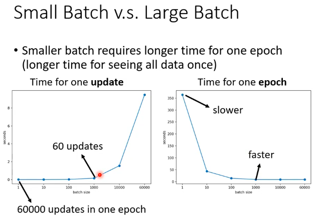

### 📷 终极类比：影楼的“超级洗照片机”

想象你经营一家影楼，有一台价值几万块的**超级洗照片机（GPU）**。
这台机器有一个核心特性：**它有一个巨大的“显影池”，一次最多能同时泡 100 张照片。**

*   **它的工作原理**：只要照片放进池子里，不管是一张还是一百张，显影液化学反应的时间都是固定的，比如 **1 秒钟**。
*   **你的任务（Epoch）**：今天你要洗 **10,000 张**照片。
*   **你的决策（Batch Size）**：你每次打算往池子里扔多少张照片？

---

### 核心公式：总时间的“乘法逻辑”

$$ \text{洗完一轮的总时间 (Epoch Time)} = \text{更新的总次数 (Updates)} \times \text{单次更新的时间 (Update Time)} $$

*   **更新的总次数**：“点击开始”的次数（数据总量 / Batch Size）。
*   **单次更新的时间**：就是左图那个曲线。

### 1. 解释左图：单次洗照片的耗时（Time for one update）

这台机器的脾气决定了左边的曲线：

*   **拐点左边（Batch Size < 100）**：
    你扔 1 张照片进去，药水反应要 1 秒；你扔 80 张进去，药水反应还是 1 秒。因为显影池没满，机器还没到极限。
    **=> 所以曲线是平的：1 秒，1 秒，还是 1 秒。**

*   **拐点右边（Batch Size > 100）**：
    你非要一次洗 200 张。显影池塞不下了，机器只能**自动排队**：先洗前 100 张（1 秒），再洗后 100 张（1 秒）。
    **=> 结果：这一次“点击开始”的操作，实际耗时变成了 2 秒。Batch Size 越大，排队次数越多，时间就线性上升。**

    
---

### 2. 解释右图：洗完 10,000 张的总耗时（Time for one epoch）

现在我们要算算你今天什么时候能下班了：

*   **极小 Batch（如 Batch Size = 1）**：
    你像个强迫症，每次只洗 1 张。你要操作机器 **10,000 次**，每次 1 秒。
    **=> 总时间 = 10,000 秒。慢得要命！（对应右图最左侧的高点）**

*   **黄金 Batch（如 Batch Size = 100，正好是拐点）**：
    你每次洗 100 张。你只需要操作机器 **100 次**，每次 1 秒。
    **=> 总时间 = 100 秒。效率最高！（对应右图大幅下降后的低点）**

*   **过大 Batch（如 Batch Size = 200，过了拐点）**：
    你每次想洗 200 张。
    1.  **操作次数减少了**：你只需要操作机器 **50 次**了。
    2.  **但单次时间增加了**：因为机器要排队，每次操作要花 **2 秒**。
        **=> 总时间 = 50 次 × 2 秒 = 100 秒。**

---

### 3. 为什么右图右边是平的？（终极奥义）

发现了吗？在过了拐点（机器满载）后：
**“操作次数的减少”被“单次操作时间的增加”完美抵消了！**

*   Batch Size 翻倍 $\rightarrow$ 操作次数减半 ($\div 2$)。
*   但机器必须排队 $\rightarrow$ 单次耗时翻倍 ($\times 2$)。
*   两者相乘：$\frac{1}{2} \times 2 = 1$。

**总时间不再变化，这就是右图右边那个“平坦的尾巴”。**

---

### 📌 总结：设计者的选择

既然过了拐点速度不再提升，作为一个聪明的算法工程师（影楼老板），你肯定会想：

1.  **别太小**：别让昂贵的机器闲着（避开右图最左边的低效区）。
2.  **别太大**：大 Batch 不仅不加钱（不提速），还会让你失去“醉汉漫步”跳出陷阱的机会，甚至可能让显存爆炸（OOM）。
3.  **选拐点**：就在机器刚好满载的地方，速度最快，性价最高。

---

