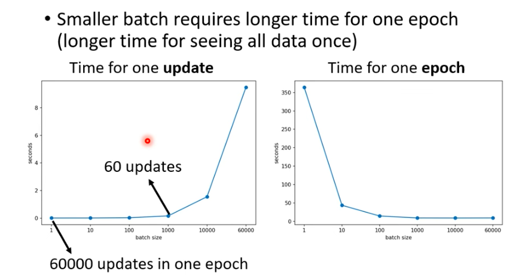

*（这是一张关于“大批次输入和小批次输入用不同模型训练，在测试集上的效果对比图）*

### 第一步：这张表到底在说什么？（看懂现象）

仔细观察你截图里的两个红框：
1. **左边框（Training Accuracy / 平时练习成绩）**：你看 `SB` (Small Batch) 和 `LB` (Large Batch) 的分数，是不是差不多？甚至有时候 LB 还要高一点点。这说明：**在训练集上，大家都能找到一个不错的终点（Loss 很低）。**
2. **右边框（Testing Accuracy / 最终期末考试成绩）**：神奇的事情发生了，无论是哪种网络架构（$F_1$ 到 $C_4$），`SB` 的成绩**全部、稳定地**超越了 `LB`！

**结论：** Small Batch 确实在测试集（没见过的数据）上表现更好。在机器学习里，我们管这种能力叫 **泛化能力（Generalization）**。

### 第二步：设计者视角——为什么小批次反而考得好？

这就回到了我们之前聊过的**“轨迹形状”**问题了。还记得吗？
* **Large Batch（LB）**：每次看全量或大量数据，算出来的方向极其精准，走的是**丝滑的直线**。
* **Small Batch（SB）**：每次只看一小撮数据，算出来的方向带有偏见，走的是带有抖动和噪声的**“醉汉漫步”**。

现在，想象一下 Loss 函数的地形，它不仅有坑，而且**坑的形状不一样** ：
1. **峡谷（Sharp Minima / 尖锐最小值）**：非常深，但口子特别窄。
2. **平原（Flat Minima / 平缓最小值）**：也是深坑，但是底部非常宽阔平坦。

* **LB（大批次）的悲剧**：因为它走得太丝滑、太顺着坡度了，一旦路过一个“窄窄的深峡谷”，它就会直接滑进去，并且稳稳地待在最底部出不来。
* **SB（小批次）的奇迹**：它是个不停乱跳的醉汉。如果它掉进了“窄峡谷”，因为峡谷太窄，它随便往左往右一抖（噪声），**就撞到墙上被弹出来了**！所以，SB 根本无法在窄坑里安家，它一路上跌跌撞撞，**最后只能被迫停留在那种极其宽阔的“大平原”里**，因为那里不管怎么抖，都还在谷底。

### 第三步：为什么“大平原”在考场上更吃香？

这是最核心的一步！

**训练集和测试集，其实是不完全一样的。**
这就好比“平时练习题”和“期末考试题”的差别。在数学图像上，这就意味着：**当你从训练集切换到测试集时，整个 Loss 地形会发生轻微的平移（Shift）。**

* **如果模型卡在“窄峡谷”（LB 的结果）**：地形稍微一平移，模型原来在谷底，现在瞬间就变成挂在悬崖峭壁上了！Loss 暴增，考试考砸。
* **如果模型停在“大平原”（SB 的结果）**：地形稍微一平移，因为平原非常宽广，模型平移之后**依然还在平坦的谷底**！Loss 几乎没变，考试照样拿高分。

---

