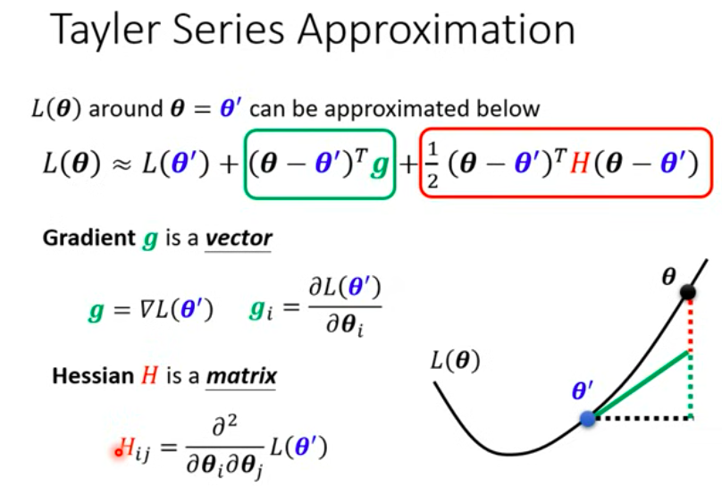
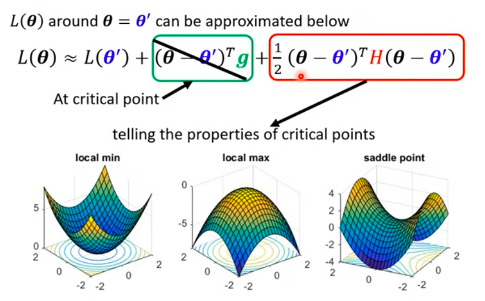
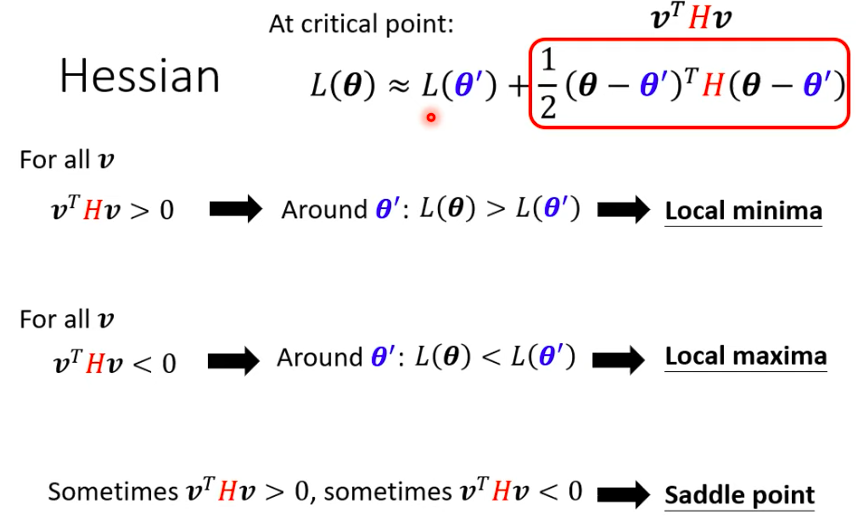

这张图上写着一个让无数大学生闻风丧胆的名字：**泰勒级数展开（Taylor Series Approximation）**。

但是别慌！既然你已经掌握了“张量”、“点积”和“梯度（斜率）”，这张图在你面前就不再是数学公式，而是一张 **“盲人摸象的雷达图”**！

**真相是：** 当你的模型训练到某一个点时，它“瞎了”。它只知道脚下的误差是多少，不知道下一步往哪走。**这个时候泰勒展开，就是用你脚下的“斜率”和“弯曲度”，硬生生在你脑海中建构出一个“方圆 10 米的 3D 全息地图”！**
更通俗地说，**当我脚站 $\theta$ 位置的时候，可以根据脚下的斜率和弯曲度，帮助我知道 $\theta$ 附近的 Loss 函数长什么样子

━━━━━━━━━━━━━━━━━━━━━━━━━━━━━━━━━━━     
🗺️ **解密：泰勒展开的“三步建图法”**      
━━━━━━━━━━━━━━━━━━━━━━━━━━━━━━━━━━━         

我们把这串长长的公式切成三块。

假设你蒙着眼在 3D 大山（Loss 曲面）上寻宝，你现在站的位置叫 $\mathbf{\theta'}$。你想知道，如果我往周围迈出一步（走到新位置 $\mathbf{\theta}$），我脚下的高度 $L(\mathbf{\theta})$ 会变成多少？

公式：$$L(\mathbf {\theta}) \approx L(\mathbf{\theta'}) + (\mathbf{\theta} - \mathbf{\theta'})^T \mathbf{g} + \frac{1}{2}(\mathbf{\theta} - \mathbf{\theta'})^T \mathbf{H} (\mathbf{\theta} - \mathbf{\theta'})$$

用工程师的大白话翻译，这就是在造假地图：            
**预测的新高度 $\approx$ 当前高度 $+$ 直线倾斜效应 $+$ 曲线弯曲效应**

──────────────────────────────────          
**第1项：$L(\mathbf{\theta'})$ —— 【当前高度】**
- **大白话**：废话，你要预测周围的高度，肯定得先知道你现在站的地方海拔是多少。比如你现在海拔 500 米。

──────────────────────────────────          
**第2项：$(\mathbf{\theta} - \mathbf{\theta'})^T \mathbf{g}$ —— 【直线的倾斜效应（梯度）】**
- **注意看！** 这里的 $^T$ 就是我们上一关学的**向量转置（也就是点积操作）**！
- $\mathbf{\theta} - \mathbf{\theta'}$ 是什么？是你**迈出去的那一步**（方向和距离）。
- $\mathbf{g}$ 是什么？就是咱们刚刚学的**梯度（斜率向量）**！**（$\mathbf{g}$ 是向量）**
- **大白话**：你迈出了一步 $\times$ 脚底下的斜率 = 你上升或下降了多少高度。
- **图里的绿框和绿线**：这一项，相当于用一块平整的硬纸板（切面），贴在你脚下。它假设山坡是直直地斜下去的。

──────────────────────────────────

**第3项：$\frac{1}{2}(\dots)^T \mathbf{H} (\dots)$ —— 【曲线的弯曲效应（海森矩阵）】**
- 真实的大山是不可能像纸板一样平的，它是弯曲的（像个碗，或者像个山丘）。
- 这里的 $\mathbf{H}$ 叫 **海森矩阵（Hessian Matrix）**，**（$\mathbf{H}$是矩阵）**。如果说梯度 $\mathbf{g}$ 是一阶导数（测倾斜度），那 $\mathbf{H}$ 就是二阶导数（**测弯曲度**），具体说：
  - **海森矩阵 = 损失函数对参数的二阶导数矩阵** 
  - **海森矩阵 = 梯度对参数再求一次导数**
- **大白话**：加上这一项，你的假地图就不再是一块硬纸板了，而是变成了一个可以向上翘、或者向下弯的**抛物面（碗）**！这个预测地图就极度精确了。

━━━━━━━━━━━━━━━━━━━━━━━━━━━━━━━━━━━         
💣 **高能预警：为什么学“鞍点”必须看这个图？**          
━━━━━━━━━━━━━━━━━━━━━━━━━━━━━━━━━━━         

当你训练神经网络时，老板拼命喊 `backward()`，让你顺着梯度 $\mathbf{g}$ 下山。
突然有一天，**你的梯度 $\mathbf{g} = \mathbf{0}$ 了！也就是脚下完全平了！**

这时候，模型懵了。梯度消失了！它停下来了。   
请你看上面的公式：如果 $\mathbf{g} = \mathbf{0}$，**中间那个绿色的框框就彻底变成了 0！消失了！**

既然第一项是常数，第二项变成了 0，那你怎么知道你现在站在哪里？
**你只能被迫去看第三项（红色的 $\mathbf{H}$，弯曲度）！** 

实际不可能代入附近所有方向的的 $\theta$ ，来验证 $v^T H v$ 是大于0、小于0还是等于0。而在线性代数中有一种方法叫做**给矩阵算特征值**：
- 如果特征值 全是正数 $\rightarrow$ 矩阵叫 正定（Positive definite） $\rightarrow$ 四面八方都往上走 $\rightarrow$ 
- 如果特征值 全是负数 $\rightarrow$ 矩阵叫 负定（Negative definite） $\rightarrow$ 四面八方都往下掉 $\rightarrow$ 
- 如果特征值 有正有负 $\rightarrow$ 说明有的方向往上，有的方向往下 $\rightarrow$ 

也就是说，只要判断海森矩阵 $\mathbf{H}$（弯曲度）的特征值正负，就会告诉你：
1. **局部最小值 (Local Minimum)**：$\mathbf{H}$ 为**正定矩阵**，你 $\theta'$ 周围四面八方全都是**往上翘**的（像个碗底）。代表着你在谷底。
2. **局部最大值 (Local Maximum)**：$\mathbf{H}$ 为**负定矩阵**，你 $\theta'$ 周围四面八方全都是**往下弯**的（像个山顶）。代表你是个倒霉蛋，卡在山顶上了。
3. **鞍点 (Saddle Point)**：最恐怖的情况！$\mathbf{H}$ 的**特征值有正有负**，你 $\theta'$ 往前看是往上翘的，往左看却是往下弯的！（就像**马鞍**一样，夹腿的地方往下，前后往上）。你虽然脚下是平的，但你根本没到谷底，往旁边跨一步就能继续掉下去！

━━━━━━━━━━━━━━━━━━━━━━━━━━━━━━━━━━━         
🏁 **你的通关判定**            
━━━━━━━━━━━━━━━━━━━━━━━━━━━━━━━━━━━     

“确定附近的 Loss 长什么样”，在数学上的本质就是：       
**当梯度（绿框）失效变成 0 时，我们只能靠海森矩阵（红色的 $\mathbf{H}$）来描绘出附近的形状，从而判断我们到底是掉进了碗底（局部最小），还是卡在了马鞍上（鞍点）！**

你不需要手算泰勒展开，你只需要知道：**梯度管倾斜，Hessian矩阵管弯曲。当倾斜为0时，弯曲决定了地形！**

