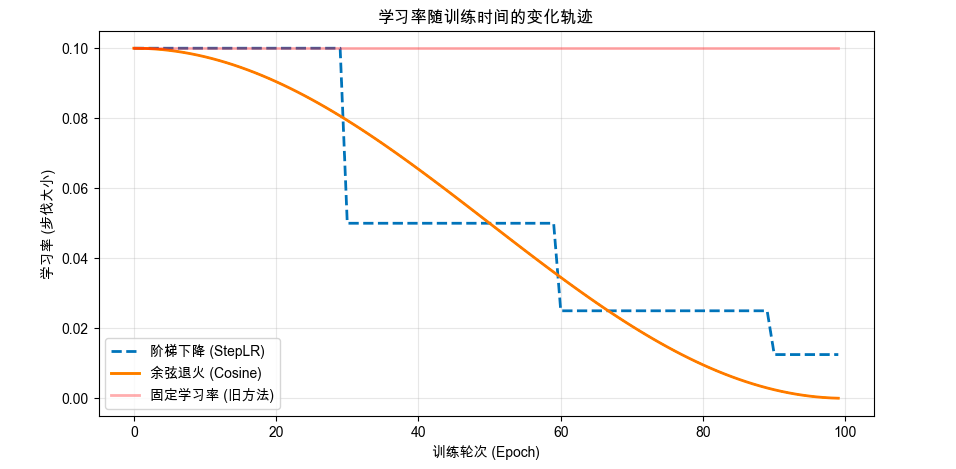

「自动调整学习速率（Learning Rate Scheduling / Adaptive Learning Rate）它解决了一个极其痛苦的炼丹难题：如果把训练 AI 比作下山找谷底，步子迈大了容易摔死，步子迈小了走到天荒地老，而手动控制这双腿的步伐，简直是反人类的折磨。

## 第1部分：搞清楚它是什么、为什么需要它

### 🎯 1.1 没有它之前，人们是怎么挣扎的？ _💡 核心必学_

#### ① 还原当时的麻烦：人们在哪一步被卡死了？
想象一个场景：你在玩一个探险游戏，任务是蒙着眼睛走到一个极其深邃、地形复杂的峡谷最底部。
你的唯一控制方式是：在游戏开始前，设定好**每一步跨出去的固定距离（固定的学习率 Learning Rate）**。
- **作死方案 A（步子设为 10 米）**：刚开始下山很快，但当你接近谷底那个只有 2 米宽的真正目标坑时，你一脚跨过头，撞到了对面的悬崖上，然后再跨回来，永远在谷底上方来回剧烈横跳，就是进不去。
- **作死方案 B（步子设为 0.1 米）**：为了能精确掉进坑里，你设定了极小的步幅。结果一开始在广阔的平原上，你像蜗牛一样挪动，别人半天就通关了，你的电脑跑了一个月还没走到半山腰。
- **痛苦的折中（手动调参）**：工程师们只能像盯盘的股民一样坐在电脑前。先设大步子跑几个小时，眼看 Loss 不降了（在谷底震荡），赶紧按暂停，手动把步子改小一点，继续跑。这极其耗费人力，且几乎不可能找到完美的时机。

#### ② 是什么让人不得不换一种思路？
人们发现，**在复杂的寻优过程中，对“速度”的需求是动态变化的：初期需要狂奔（探索），后期需要精雕细琢（收敛）**。用一个固定的常数来应付整个复杂的过程，在逻辑上是行不通的。这意味着我们必须放弃一个假设：放弃“存在一个从头到尾都完美的单一学习率”的幻想。

#### ③ 新旧方法的核心区别：哪个变量的位置被对调了？
为了解放双手并达到更好的效果，工程师们引入了“随时间或状态自动变化的学习率”：

```text
旧范式（定速巡航）：
[人工设定的固定步长] 是输入 ──▶ [模型从头到尾死板执行] 是输出

新范式（自动变速箱）：
[当前的训练轮数 / 历史的误差情况] 是输入 ──▶ [系统自动计算出当前的最佳步长] 是输出
```

#### ④ 得到了什么，又必然失去了什么？
引入自动调整策略，换来了**极快的初期收敛速度和极其平稳的后期着陆**，但必然失去了**对模型训练轨迹的绝对简单可控性**（有时候你不知道它为什么突然加速或减速，调试难度增加）。这不是缺陷，是换取强大自动化能力的必然代价。

#### ⑤ 什么情况下它会不管用？你来推导
基于以上逻辑，你现在应该能回答：
1. 为什么当你面对一个极其简单的完美“碗状”地形（比如极其简单的线性回归）时，可能根本不需要复杂的自动调整？
2. 如果你的自动减速策略设定得太激进，刚跑了 10 分钟步长就缩小到了接近 0，模型会遭遇什么灾难？

---

### 🗺️ 1.2 概念地图：它在 ML 知识体系中的位置 _💡 核心必学_

```text
ML 知识体系
│
├─ 模型训练生命周期
│   │
│   ├─ 损失函数 (Loss)
│   ├─ 优化器 (Optimizer，决定怎么走，如 SGD)
│   │
│   └─ 学习率调度器 / 自适应算法 ← 你在这里
│       ├─ 基于时间的调度 (Scheduler：如阶梯下降、余弦退火)
│       └─ 基于状态的自适应优化器 (如 Adam 内部自带的机制)
```

---

### 📚 1.3 学这个之前，你得先知道这几件事 _💡 核心必学_

──────────────────────────────────

📖 前置概念：**学习率 (Learning Rate, 常简写为 LR)**
- 是什么：决定模型在每次更新权重时，改变幅度的“油门大小”。
- 最小示例：如果误差告诉你该往右走，LR=0.1 你就往右挪一小步，LR=1.0 你就往右猛跨一大步。
- 为什么需要它：它是我们要“自动调整”的那个核心主角。

📖 前置概念：**Epoch (轮次)**
- 是什么：模型把所有训练数据完整看一遍，叫 1 个 Epoch。
- 最小示例：一本书看 1 遍叫 1 个 Epoch，看 100 遍就是 100 个 Epoch。
- 为什么需要它：很多自动调整策略是根据“当前跑到了第几个 Epoch”来决定怎么踩刹车的。

──────────────────────────────────

### 🔩 1.4 一句话说清楚它的本质 _💡 核心必学_

「自动调整学习速率」的本质是：**根据训练的进程（时间）或模型当前的状态（历史梯度），动态改变权重更新的步幅，以实现“前期大步探索，后期小步微调”的目标。**

后面所有的例子和类比，都是在验证这句话，而不是在解释它。

---

### 💡 1.5 先不管公式，用感觉理解它 _💡 核心必学_


让我们用生活中的例子来还原这个策略的演进过程。

「自动调整学习率」做的事情是：             
我们要开车去一个陌生城市的具体门牌号。
- **没有调整（固定 LR）**：你全程把油门踩死（时速 120km），结果到了目的地附近根本停不下来，来回冲过头。
- **策略一：阶梯式减速（StepLR）**：你规定自己，前 1 小时开 120km，第 2 小时强制降到 60km，第 3 小时降到 30km。简单粗暴，但管用。
- **策略二：余弦退火（Cosine Annealing）**：你的车技很好，车速像滑梯一样平滑地从 120km 慢慢降到 0km。到了目的地，刚好稳稳停下。
- **策略三：自适应巡航（Adam 等优化器自带）**：你的车极其智能，它发现前面的路很平坦笔直（历史方向一致），就自动踩油门；发现前面是个极其复杂的十字路口（方向剧烈震荡），就自动狂踩刹车。你连规则都不用设。

⚠️ **这个类比在这里开始失效：**         
开车类比暗示了“我们清楚地知道终点有多远”。但在真实的机器学习中，你根本不知道“真正的谷底（最优解）”还需要跑多少个 Epoch 才能到。如果你把“减速到 0 的时间”设定得太早，模型就会在半路彻底失去动力（停机）；设定得太晚，又起不到微调的作用。这就是为什么调度策略极其依赖工程师的经验。

🎨 **亲眼看看不同策略下的“油门变化曲线”：**



**📌 图像解读指南：**
- **红色的平直线** = 就是极其痛苦的定速巡航，极易在终点附近震荡。
- **虚线（阶梯下降）** = 就像猛踩了几次刹车。每次下降时，你会看到模型的误差（Loss）通常会跟着突然下降一截。
- **实线（余弦退火）** = 现代深度学习中最流行、最平滑的减速方式。它让模型在后期能够极尽温柔地滑入谷底。

──────────────────────────────────

💡 下一部分预告

──────────────────────────────────

光看图表没用。在 PyTorch 中，把死板的定速巡航升级成这套优雅的“余弦退火变速箱”，其实只需要加 2 行极其简单的代码。

---

──────────────────────────────────

📚 **前置知识回顾**

──────────────────────────────────

本阶段会用到以下核心本质（刚刚学过的）：
**根据训练的进程（时间）或模型当前的状态（历史梯度），动态改变权重更新的步幅，以实现“前期大步探索，后期小步微调”的目标。**

如果不记得了，请想想那辆“快到终点会自动踩刹车的智能汽车”。

──────────────────────────────────

## 第2部分：它怎么运转、怎么动手用

### ⚙️ 2.1 工作原理：两大门派的暗中较量 *💡 核心必学*

在工程实现上，让模型“自动变速”有两种截然不同的流派：

**第一派：时间维度的“统筹全局”（代表：余弦退火、阶梯下降）**

这是**学习率调度器（LR Scheduler）的功能。它不关心具体的参数在经历什么地形，它只关心“现在是训练的第几个 Epoch（时间进度）”。**

- **原理**：基于 **时间（Epoch）** 强制干预。你提前写好一份剧本（比如“第 30 圈减速一半”或“按余弦波浪减速”），调度器就像一个冷酷的交警，时间一到，强制把优化器的全局“油门（学习率）”调小。
- **特点**：**对所有参数一视同仁，大家一起减速**。
  - 它的做法是控制“大盘走势”： 它调整的是那个全局的、基础的 Base Learning Rate。不管你有一千万还是一个亿的参数，在同一时刻，调度器给出的基础油门大小是一样的。
- **背后的直觉：**
  - **前期（步伐大）：** 离终点还很远，随便跑跑，主要任务是快速逃离初始的随机乱坑。
  _ **后期（步伐小）：** 已经感觉快到真正的谷底了。这时候如果步伐还是很大，就会在谷底边缘反复横跳，死活落不到最深处。所以必须用**阶梯下降（Step Decay）或余弦退火（Cosine Annealing）**强行把全局学习率降到极低，让模型在谷底做最后的“微调”和“沉淀”。

**第二派：空间维度的“因地制宜”（代表：Adam 家族）**

这是 **优化器（Optimizer）内部自带的功能。它的核心解决的是“偏科”** 问题，也就是解决我们刚才说的峡谷地形。

- **原理**：基于 **状态（梯度/地形）** 动态调整。它的做法是**给每一个参数“开小灶”，假设你的模型有一千万个参数，Adam 会在后台维护一千万个不同的学习率。它不需要你写剧本，优化器内部会默默记下每个参数过去的震荡情况(每个参数自己的“历史梯度”)** 
- **特点**：千人千面，模型里如果有 100 万个参数，它就维护 100 万个不同的专属学习率。
- **家族成员：** Adagrad（鼻祖） $\rightarrow$ RMSprop（改进版） $\rightarrow$ Adam（集大成者：RMSprop 的自适应步伐 + Momentum 的惯性）。

-----

### 💻 2.2 最小MVP代码：20 行代码装上“余弦退火”变速箱 *💡 核心必学*

在 PyTorch 中，为基础的 SGD 优化器装上最优雅的“余弦退火外挂（Cosine Annealing）”，极其简单，只需要增加 2 行核心代码。

```python
import torch
import torch.nn as nn
from torch.optim.lr_scheduler import CosineAnnealingLR # 👈 引入外挂变速箱

# ── 第1步：准备车辆和初始油门 ──────────────────────────────
model = nn.Linear(10, 2)
# 初始油门设得大一点 (0.1)，让它前期狂奔
optimizer = torch.optim.SGD(model.parameters(), lr=0.1, momentum=0.9)

# ── 第2步：安装并配置变速箱 ────────────────────────────────
total_epochs = 100
# T_max=100 表示：用 100 个 Epoch 的时间，把油门从 0.1 平滑降到接近 0
scheduler = CosineAnnealingLR(optimizer, T_max=total_epochs)

# ── 第3步：开始赛道狂飙 ────────────────────────────────────
print("🚗 比赛开始！注意观察油门变化：")

for epoch in range(total_epochs):
    # (此处省略数据加载、前向传播、算误差、反向传播的代码...)
    
    # 1. 车辆走一步（更新权重）
    optimizer.step()
    
    # 2. ⭐️ 核心动作：交警看表，调整下一圈的油门！
    scheduler.step()
    
    # 我们每隔 20 圈看一眼仪表盘上的当前油门大小
    if epoch % 20 == 0 or epoch == total_epochs - 1:
        current_lr = scheduler.get_last_lr()[0]
        print(f"第 {epoch:2d} 圈结束 | 当前油门(学习率): {current_lr:.5f}")

# 预期输出：你会看到学习率从 0.1 开始，遵循余弦曲线，
# 在中间阶段快速下降，在最后几圈极度平稳地趋近于 0，完美着陆。
```

-----

### 🌍 2.3 四象限选择指南：到底该用哪个策略？ *💡 核心必学*

面对琳琅满目的调度器和优化器，怎么选才不被坑？看这个决策矩阵：

| 你的任务场景 | 首选组合策略 | 为什么这么选？ |
| :--- | :--- | :--- |
| **90% 的日常深度学习 / 快速验证想法** | **纯 Adam (固定小 lr)**<br>不需要加 Scheduler | Adam 自带千人千面的智能调速，对于普通难度的峡谷，它自己就能跑到底，省时省力。 |
| **打 Kaggle 比赛 / 追求 CV 模型极限精度** | **SGD + Momentum**<br>配合 **CosineAnnealingLR** | 这种组合能把油门压榨到极致。余弦退火能让模型在最后阶段进行极其细腻的“微雕”，通常能比 Adam 赢出 1%\~2% 的准确率。 |
| **训练极其巨大的语言模型 (如 GPT/BERT)** | **AdamW**<br>配合 **Linear Warmup (线性预热)** | 大模型刚醒来时很懵，必须先用极小的学习率“预热(Warmup)”几千步，然后再慢慢降速，否则直接就炸了。 |
| **极其不可控、不知道跑多久的地形** | **ReduceLROnPlateau**<br>(见招拆招型交警) | 你告诉交警：“只要连续 10 圈 Loss 都不降了，你就把油门砍掉一半。” 这是最稳妥的保底策略。 |

*（注：当你使用 StepLR 阶梯降速时，Loss 曲线通常会在降速的那一瞬间出现非常明显的“断崖式下跌”，这说明更小的步伐帮模型钻进了更深的坑。）*

-----

### ✅ 2.4 工程规范：避开会让你被骂的写法 *🔥 实战必备*

在写调度器代码时，有一个极其容易翻车的红绿灯守则：

**🔴 RED（致命错误）：把交警放在了司机前面**

- **错误写法**：在循环里，先写了 `scheduler.step()`，后写 `optimizer.step()`。
- **违反会导致**：这就好比你刚挂上 1 挡还没起步，交警就强制让你换成 2 挡。PyTorch 甚至会直接抛出警告。第一步的学习率会被直接跳过吞掉。
- **✅ 正确做法**：永远是优化器先走完一步（`optimizer.step()`），调度器再调整下一步的状态（`scheduler.step()`）。

**🟡 YELLOW（强烈建议不要）：给 Adam 盲目加上极端的阶梯降速（StepLR）**

- Adam 本身已经在疯狂地动态调整每个参数的步伐了。如果你再用一个粗暴的 StepLR 突然把全局油门砍掉 90%，两套系统会互相打架，模型瞬间失去动力，变成一滩死水。
- **建议**：如果用 Adam，最好配合平滑的余弦退火（Cosine）或线性衰减。

**🟢 GREEN（推荐风格）：永远监控你的学习率**

- 在使用像 TensorBoard 或 WandB 这样的可视化工具时，**一定要把当前的学习率画成曲线记录下来**。当你发现 Loss 突然变平不动时，只要看一眼学习率曲线，你就能立刻知道：“哦，是因为学习率降到 0 了，模型没油了。”

---

──────────────────────────────────

📚 **前置知识回顾**

──────────────────────────────────

本阶段会用到以下概念（已在阶段1和阶段2学过）：
- **学习率（LR）**：控制模型每次更新步伐大小的“油门”。
- **Epoch（轮次）**：把所有训练数据完整看一遍。
- **外挂变速箱（Scheduler）**：按照预设规则（如余弦波浪）自动调小学习率的工具。

如果不记得了，建议先回顾上一节的“开车踩油门”类比。

──────────────────────────────────

## 第3部分：哪里容易出错、怎么做得更好

### ⚠️ 3.1 大多数人在哪里栽了跟头？ _🔥 实战必备_

#### 陷阱 1：动力过早枯竭（半山腰老死）

**💥 现象**：
你设定了训练 100 个 Epoch。前 10 个 Epoch，Loss 曲线非常漂亮地下降。但是从第 11 个 Epoch 开始直到第 100 个 Epoch，Loss 曲线变成了一条死气沉沉的绝对水平线，毫无波澜。模型成绩再也提不上去。

**🔍 根本原因**：
你的“自动变速箱”参数设错了，导致**汽车在半路彻底没油了**。
如果你在使用 `CosineAnnealingLR` 时，把完成退火的周期（`T_max`）设得太短。模型刚刚跑到半山腰，学习率就被强制降到了 `0.00000001`。此时模型每次更新的步伐比原子的直径还要小，它名义上还在训练，实际上已经“脑死亡”停在原地了。

**❌ 错误代码**：
```python
# ❌ 错误示范：时间线错配
total_epochs = 100
optimizer = torch.optim.SGD(model.parameters(), lr=0.1)

# T_max=10 的意思是：只用 10 个 Epoch，就把学习率降到 0！
# 剩下的 90 个 Epoch，模型都是在没有动力的情况下空转。
scheduler = CosineAnnealingLR(optimizer, T_max=10) 

for epoch in range(total_epochs):
    # ... 训练代码 ...
    optimizer.step()
    scheduler.step()
```

**✅ 修复方案**：
```python
# ✅ 修复版本：让变速周期和总训练周期严格对齐
total_epochs = 100
# 确保在跑到终点线的那一刻，学习率刚好降到极小值
scheduler = CosineAnnealingLR(optimizer, T_max=total_epochs) 
```

---

#### 陷阱 2：交警和智能汽车打架（Adam + StepLR 的惨案）

**💥 现象**：
你使用了公认最好用的 Adam 优化器，为了追求完美，你又给它套上了一个极其粗暴的阶梯降速（StepLR，每 30 轮学习率除以 10）。
结果在第 30 轮时，模型的准确率不仅没有微升，反而发生了剧烈的断崖式暴跌，甚至直接崩盘。

**🔍 根本原因**：
Adam 是一个“自带智能变速箱”的优化器。它内部维护着过去几十步的梯度均值和方差（动量记录），用来精细计算每个参数该走多快。
当你在外部用 StepLR 突然把全局基础学习率砍掉 90% 时，Adam 内部积累的历史动量记录瞬间和当前的极小步伐产生**严重的比例失调**。这就像一辆智能汽车正在高速自动巡航，你突然伸手把发动机的油管给拔了，车载系统直接陷入混乱。

**🛡️ 如何从源头预防**：
- **铁律**：如果你用了 Adam / AdamW，尽量**不要使用**阶梯式降速（StepLR）。
- 如果一定要加调度器，请使用极其平滑的**余弦退火（CosineAnnealingLR）**，让 Adam 有足够的时间适应基础油门的缓慢变化。

---

### 🧪 3.2 模型出问题了，怎么一步步找原因？ _🔥 实战必备_

当你发现模型的误差（Loss）下不去，且你怀疑是“学习率”的锅时，请严格按照以下排查树进行诊断：

```text
Loss 曲线表现异常
    │
    ├─ 刚开始训练就变成 NaN 或飙升到天上？
    │       │
    │       └─ 诊断：初始学习率太大了！
    │          对策：把 initial_lr 砍掉 10 倍（比如从 0.1 降到 0.01）。
    │
    ├─ Loss 像心电图一样剧烈上下震荡，长排不降？
    │       │
    │       └─ 诊断：学习率没有降下来！模型在谷底反复横跳。
    │          对策：检查 Scheduler 是否真的生效了（用 scheduler.get_last_lr() 打印出来看看）。
    │
    └─ Loss 下降了一小段后，早早变成了一条死气沉沉的直线？
            │
            ├─ 打印此时的学习率，是不是接近于 0？
            │       ├─ YES ──▶ 诊断：动力过早枯竭。检查 T_max 等周期参数。
            │       └─ NO  ──▶ 诊断：这不是学习率的问题，模型遇到了复杂的鞍点或过拟合。
```

---

### 🚀 3.3 如果要用在真实项目里，该怎么做？ _⭐ 进阶选学_


在现代工业界，尤其是训练极其复杂的深度学习模型（如 ChatGPT 背后的 Transformer 架构、大型图像识别 ResNet）时，单纯的“余弦退火（由大变小）”已经不够用了。

真实世界的高级标准做法叫：**线性预热 + 余弦退火（Linear Warmup + Cosine Decay）**。

**为什么需要预热（Warmup）？**
刚开始训练时，模型里的参数全都是随机瞎猜的垃圾值。如果这个时候你直接给它一个最大的初始学习率（油门踩到底），模型会朝着一个极其错误的方向狂奔，把网络内部的参数扯得粉碎（梯度爆炸）。
**预热的逻辑是**：前几千步，我们用极小极小的学习率起步，慢慢把学习率拉高到最大值。让模型在低速状态下先“熟悉一下地形，把最离谱的错误纠正过来”。等地基稳了，再开启余弦退火，慢慢减速。

**架构设计：**

```text
[学习率大小]
    ▲
最大│       /\
    │      /  \
    │     /    \
    │    /      \
    │   /        \
最小│  /          \_________
    └─────────────────────────▶ [训练步数]
      预热期     余弦退火期
     (由小变大)  (由大变小)
```

在 PyTorch 的高阶库（如 HuggingFace `transformers`）中，调用这个工业级变速箱只需要一行：

```python
# 🚀 工程级写法（需要引入 transformers 库）
from transformers import get_cosine_schedule_with_warmup

# 假设总共要训练 10,000 步
total_steps = 10000
# 拿出前 10% 的时间来温柔地踩油门（预热）
warmup_steps = 1000 

# 这个强大的交警，包揽了从起步、加速、到最后平滑刹车的全套动作
scheduler = get_cosine_schedule_with_warmup(
    optimizer, 
    num_warmup_steps=warmup_steps, 
    num_training_steps=total_steps
)
```
这是目前你在顶级 AI 论文和开源项目中能见到的最标准、最普适的调速策略。

──────────────────────────────────

🎓 **实战挑战**

──────────────────────────────────

场景：你入职了一家自动驾驶公司，接手了一个识别交通标志的图像分类项目。
你的前任留下一段极其混乱的训练代码。项目经理抱怨说：“这代码跑起来不仅慢，而且不管我怎么加总训练轮数，Loss 到了后期就卡死不动了，第一步还老弹警告！”

以下是核心的训练大循环代码（隐藏了 2 个致命陷阱）：

```python
import torch
import torch.nn as nn
from torch.optim.lr_scheduler import StepLR

model = nn.Linear(100, 10) # 模拟交通标志识别网络
# 他图省事，直接用了最智能的 Adam
optimizer = torch.optim.Adam(model.parameters(), lr=0.01)

# 他设置了每 10 轮就把学习率除以 10
scheduler = StepLR(optimizer, step_size=10, gamma=0.1)

total_epochs = 100

for epoch in range(total_epochs):
    
    # 获取数据并计算误差... (省略)
    dummy_loss = torch.tensor([1.0], requires_grad=True)
    
    # 算梯度
    dummy_loss.backward()
    
    # 💥 前任写的一套魔幻更新逻辑
    scheduler.step()
    optimizer.step()
    optimizer.zero_grad()
```

📝 **提交你的答案，我会进行代码评审：**
1. 请指出这段代码里的 **2 个绝对不能容忍的工程陷阱**（提示：看看执行顺序，再看看优化器和调度器的组合）。
2. 写出修复后的干净代码，确保模型能顺滑地跑到第 100 个 Epoch。