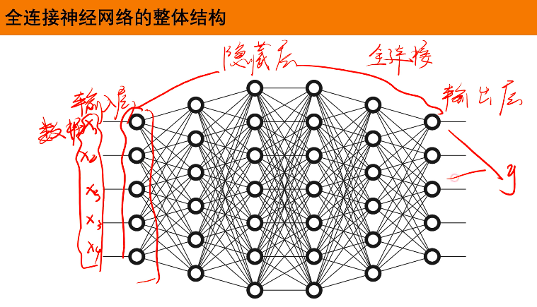

## 第1部分：搞清楚它是什么、为什么需要它

### 🎯 1.1 没有它之前，模型是怎么挣扎的？

**① 还原当时的麻烦：训练在哪一步崩掉了？**      
想象你已经掌握了逻辑回归（Logistic Regression）。逻辑回归的本质是在高维空间里画一条**直直的直线（或超平面）**来把数据一分为二。     
但在现实中，数据往往不是线性可分的。比如典型的“环形数据”（红点在内圈，蓝点在外圈），或者极其常见的异或（XOR）问题。你拿一条直直的尺子，根本不可能切开一个圆。如果强行用线性模型去拟合，Loss 会直接卡死在一个很高的位置，完全降不下来（表达能力不足）。

**② 是什么让人不得不换一种思路？**      
在没有深度学习的年代，人们解决这个麻烦的笨方法是**人工特征工程（Feature Engineering）**。为了切开环形数据，我们需要人工观察数据，然后手动添加多项式特征，比如明确告诉模型去把 $x_1$ 和 $x_2$ 平方，组合成 $x_1^2 + x_2^2$。     
但是，如果是图像呢？一张普通的 28x28 灰度图片有 784 个像素点。你要怎么人工构造组合？是 $pixel_1 \times pixel_{100}^3$ 吗？特征组合的可能性呈指数级爆炸！依靠人类专家的直觉去手工组合特征，在复杂高维数据面前**彻底破产**。这就意味着必须放弃“人工提取特征”这个大前提。

**③ 新旧方法的核心区别：哪个变量的位置被对调了？**      
* **旧范式（如多项式逻辑回归）：** **[人类]** 设计复杂的特征组合 $\rightarrow$ **[模型]** 学习这些特征的权重
* **新范式（全连接网络）：** **[模型中间层]** 自动学习特征的非线性组合 $\rightarrow$ **[模型最后一层]** 学习特征的权重

**④ 得到了什么，又必然失去了什么？**        
换来了**通用近似能力（Universal Approximation）**——理论上只要中间的网络层够宽、够深，它可以拟合出任何奇形怪状的决策边界；但必然失去了**可解释性**——你再也无法像线性回归那样，指着某个权重确切地说“这个参数代表房子面积对价格的具体贡献”。这不是缺陷，是设计的必然。

**⑤ 什么情况下它会不管用？你来推导**        
基于以上逻辑，你现在应该能回答：
1.  为什么当输入是一张 4K 高清图片时，全连接网络会遇到灾难？（提示：既然叫“全连接”，意味着每个像素都要和下一层的每个神经元产生一个权重参数，参数量会怎样？）
2.  为什么在极其简单的、本身就成线性分布的少量表格数据上，用全连接网络反而可能效果不如简单的逻辑回归，甚至更容易过拟合？

---

### 🗺️ 1.2 概念地图：它在深度学习知识体系中的位置

```text
深度学习知识体系
│
├─ 基础架构
│   │
│   ├─ 全连接神经网络 (FCNN / MLP) ← 你在这里
│   │   ├─ 隐藏层 (Hidden Layer)
│   │   └─ 激活函数 (Activation Function)
│   │
│   └─ 逻辑回归（它的单层前身，容易混淆）
```

---

### 📚 1.3 学这个之前，你得先知道这几件事

📚 本节可能会用到的前置概念：
* **逻辑回归 (Logistic Regression)**
* **矩阵乘法 (Matrix Multiplication)**
* **激活函数 (Activation Function，如 ReLU 或 Sigmoid)**

我可以默认你大致了解过这些直接进入全连接网络的核心本质，也可以先帮你补齐其中某一个前置概念。

---

### 🔩 1.4 一句话说清楚它的本质

「全连接神经网络」的本质是：**多层线性变换的级联，并在每一层之间强行插入非线性函数，以此让网络自动扭曲和折叠特征空间，拟合任意复杂的函数。**

后面所有的例子和图示，都是在验证这句话，而不是在解释它。

---

### 💡 1.5 先不管公式，用感觉理解它



在这里，我们不用比喻，直接用“概念直述法”看它做了什么：

「全连接神经网络」做的事情是：
**第一步：** 接收最原始的输入（比如 784 个像素点的数值）。  
**第二步：** 第一层（隐藏层）的每一个神经元，都跟前面所有 784 个像素相连（这就是“全连接”名字的由来）。每个神经元其实都在做一遍类似线性回归的事情——算出一个加权总和。    
**第三步（最关键的一步）：** 把这些加权总和的结果，套上一个**激活函数**。这一步强行把原本直直的线性关系“掰弯”。如果没有这一步，不管你叠多少层，本质上依然是一个巨大的线性回归，毫无意义。   
**第四步：** 下一层的神经元不再直接看原始像素，而是看上一层“掰弯”后的结果，继续做加权求和、再掰弯。 
**结果：** 原本需要人工设计的极其复杂的非线性特征（比如“检测到了一个边缘”、“检测到了一个圆”），被网络通过一层层折叠自动组合出来了。最后一层拿到的，已经是高度提纯的特征。

⚠️ **这个认知的边界声明：** 
当你听到“全连接层就是多层逻辑回归的组合”时，可能会暗示每一层都在做最终的“分类决策”。但真实概念里并不是这样——实际上**只有最后一层**在做分类/回归决策，中间的所有层（隐藏层）都在做**特征表示学习（Representation Learning）**，它们输出的是机器自己创造的、人类看不懂的高维向量。

──────────────────────────────────

💡 **本段你已经真正掌握了什么**

* 全连接网络诞生的真实动机：拯救灾难性的人工特征工程。
* 它的核心架构逻辑：把“人类手工设计特征”转变为“增加隐藏层让机器自己学特征组合”。
* 非线性的重要性：全连接层之间必须有激活函数，否则多层等价于单层。

---

──────────────────────────────────

🔍 **前置知识检查**

──────────────────────────────────

本阶段会用到以下概念：
* **矩阵乘法 (Matrix Multiplication)**：本质是批量计算加权求和。
* **激活函数 (Activation Function)**：比如 ReLU，规则很简单：如果算出负数就变成 0，正数就保留原样。它是打破纯线性计算的“铰链”。

如果不记得了，随时打断我为你补充。

──────────────────────────────────

## 第2部分：它怎么运转、怎么动手用（How It Works & How to Use）

### ⚙️ 2.1 工作原理：它内部是怎么运转的

要彻底看懂全连接网络，你只需要死死盯住一样东西：**张量形状（Tensor Shape）的变化**。

[神经网络前向传播空间维度导航](1.1.2神经网络前向传播空间维度导航.html)

深度学习的本质，就是一块名为“数据”的橡皮泥，经过每一层模具的挤压、拉伸，最终变成了我们想要的形状。

假设我们正在处理一个**非线性回归问题**（比如根据房屋的 2 个特征 $x_1, x_2$，预测一个非线性的价格 $y$）。
我们设定一个包含单层隐藏层（16个神经元）的全连接网络。

**完整前向传播流程（Forward Pass）：**

首次出现的形状记号翻译：
* `B` = Batch Size（批大小，一次看多少个样本）
* `D_in` = Input Dimension（输入特征数，比如 2）
* `D_hid` = Hidden Dimension（隐藏层神经元个数，比如 16）
* `D_out` = Output Dimension（输出维度，比如预测1个价格就是 1）

```text
[输入张量 X，形状: (B, D_in) -> 如 (32, 2)]
    │
    ▼
[步骤1：第一层全连接 (Linear 1)] 
    └─ 动作：用矩阵乘法 X * W1 + b1。把 2 维的低维特征，强行投射到 16 维的高维空间里去寻找复杂规律。
    └─ 形状变为: (B, D_hid) -> 如 (32, 16)
    │
    ▼
[步骤2：激活函数 (ReLU)]
    └─ 动作：把这 16 维空间里的负数全部掐断成 0。
    └─ 为什么这么做：把原本笔直的高维空间“强行折叠”，制造非线性！
    └─ 形状不变: (B, D_hid) -> 仍是 (32, 16)
    │
    ▼
[步骤3：第二层全连接 (Linear 2)]
    └─ 动作：再做一次矩阵乘法 X * W2 + b2。把高度提纯后的 16 维特征，压缩汇总成最终的 1 个预测值。
    └─ 形状变为: (B, D_out) -> 如 (32, 1)
    │
    ▼
[输出张量 Y_pred，形状: (32, 1)]
```

**关键超参数解释：**
* **隐藏层维度 (`hidden_features`)**：你给网络分配的“脑容量”。调得太大，容易死记硬背（过拟合）且计算极慢；调得太小，网络连基本的曲线都拟合不出来（欠拟合）。
* **网络深度（层数）**：层数越多，网络能把特征空间“折叠”的次数就越多，能拟合的规律就越复杂。但太深会导致梯度传不回去（梯度消失）。

---

### 💻 2.2 最小MVP：动手写代码，跑出你的第一个结果

在 PyTorch 中，全连接层叫做 `nn.Linear`（线性层）。我们将手写一个极简的 2 层全连接网络，去拟合一个简单的非线性规律：$y = x_1^2 + x_2^2$。

（逻辑回归只能画直线，绝对拟合不了平方和，但全连接网络可以！）

```python
import torch
import torch.nn as nn
import torch.optim as optim

# ==========================================
# 1. 准备数据 (B, D_in) = (100, 2)
# ==========================================
torch.manual_seed(42) # 固定随机种子，保证结果可复现
X = torch.randn(100, 2) 
# 我们的目标规律是一条非线性的抛物面，逻辑回归绝对学不会
y_true = (X[:, 0]**2 + X[:, 1]**2).view(-1, 1) # 形状: (100, 1)

# ==========================================
# 2. 定义模型结构 (对应上面的 ASCII 图)
# ==========================================
class SimpleMLP(nn.Module):
    def __init__(self):
        super().__init__()
        # 第一层：把2维特征升维到16维
        self.fc1 = nn.Linear(in_features=2, out_features=16)
        # 激活函数：赋予网络折叠空间的非线性超能力
        self.relu = nn.ReLU()
        # 第二层：把16维特征压缩回1维输出
        self.fc2 = nn.Linear(in_features=16, out_features=1)

    def forward(self, x):
        # 必须死死盯住这里的形状变化！
        x = self.fc1(x)   # (100, 2) -> (100, 16)
        x = self.relu(x)  # (100, 16) -> (100, 16)
        x = self.fc2(x)   # (100, 16) -> (100, 1)
        return x

model = SimpleMLP()

# ==========================================
# 3. 训练引擎 (标尺与下山策略)
# ==========================================
criterion = nn.MSELoss() # 均方误差计分员
optimizer = optim.SGD(model.parameters(), lr=0.05) # 梯度下降优化器

# ==========================================
# 4. 死循环训练 (Epochs)
# ==========================================
for epoch in range(100):
    # 前向传播：让数据流过网络
    y_pred = model(X)
    
    # 算误差
    loss = criterion(y_pred, y_true)
    
    # 反向传播三步曲
    optimizer.zero_grad() # 清空上一步的残余梯度
    loss.backward()       # 自动算偏导数（梯度）
    optimizer.step()      # 根据梯度，把权重旋钮拧一下

    if (epoch + 1) % 20 == 0:
        print(f"Epoch {epoch+1}, Loss: {loss.item():.4f}")

# 预期输出: Loss 会从一个较大的数字 (比如 1.5+) 稳步下降到接近 0 (比如 0.1 甚至更低)
# 这证明网络成功“掰弯”了直线，学会了平方和的规律！
```

---

### 🌍 2.3 真实世界里，它被用在什么地方？

在早期的深度学习中，全连接网络包打天下。但现在，它更多地作为一个**极其重要但退居幕后的“黄金配角”**。

**四象限决策指南：**

```text
                    数据特征高度结构化（如 Excel 表格的 年龄、收入、负债率）
                           │
       适合传统机器学习      │    适合全连接网络 (FCNN / MLP)
       (XGBoost / 随机森林)│    (当数据量极大，且特征间存在极其复杂的交叉关系时)
                           │
  数据量小 ────────────────┼──────────────── 数据量极大（百万级以上）
                           │
       容易严重过拟合        │    不适合纯全连接网络，参数量会爆炸！
       (参数量大于样本量)    │    必须使用提取局部特征的网络 (如 CNN 处理图片，Transformer 处理文本)
                           │
                    数据特征是空间/序列形式（如 1080p图片、超长文本）
```

**真实业务场景典型用法：**

1.  **作为高级网络的“决策大脑”（Classification Head）：** 不论前面的网络是 CNN（看图的）还是 BERT（看文本的），它们在最后一步提取出几百维的精华特征后，**几乎永远会接上 1 到 2 层全连接层**。前面的网络负责“提纯信息”，最后的全连接层负责“把这些信息映射成分类概率（比如是不是猫）”。
2.  **推荐系统（如抖音、淘宝）：**
    用户的各种离散特征（点击率、停留时长、购买力）被转换为向量后，拼接在一起喂给几层极其宽广的全连接网络（Deep Crossing 等架构），让网络自动去寻找“高收入群体在深夜更喜欢买什么”这种**隐式交叉特征**。

**❌ 什么时候绝对不该用它：**
直接把未经处理的高清图片（比如 1000x1000 像素 = 100万个特征）喂给全连接层。如果隐藏层有 1000 个神经元，仅这一层就会产生 **10亿个权重参数** ($100万 \times 1000$)。这不仅瞬间撑爆显存，还会立刻导致不可挽回的过拟合。

──────────────────────────────────

💡 **本段你已经真正掌握了什么**

* 全连接层内部的流转机制：其实就是高维矩阵乘法 + 激活函数的不断交替。
* 如何在 PyTorch 中定义 `nn.Linear` 并追踪特征张量 `(B, D)` 维度的挤压与拉伸。
* 它的工程生态位：它极少再单独用来处理原始图片/文本，而是作为提取高级交叉特征或最终分类输出的“收尾模块”。

➡️ **下一段会进入：**
**第3部分：What to Avoid & Beyond**（既然这么好用，那我们多叠几十层行不行？全连接网络最容易踩的坑是什么？以及资深工程师才会注意的工程红线。）

如果你想继续，我就接着往下讲；
如果你想先补某个前置概念（比如什么是反向传播的 `loss.backward()`），也可以直接告诉我。