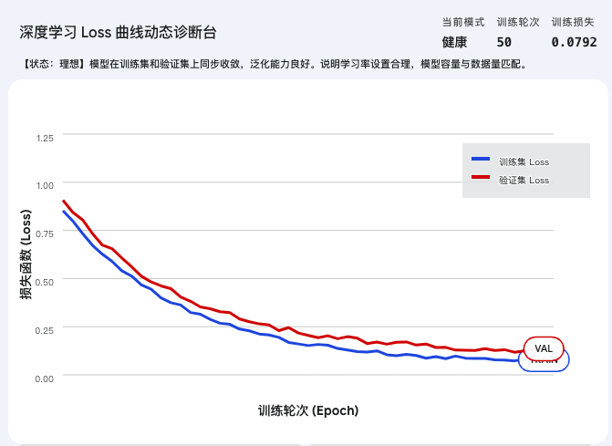
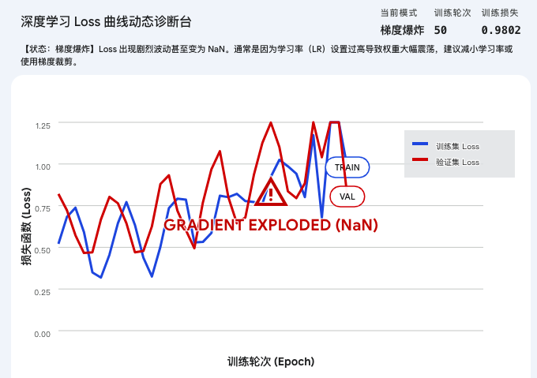
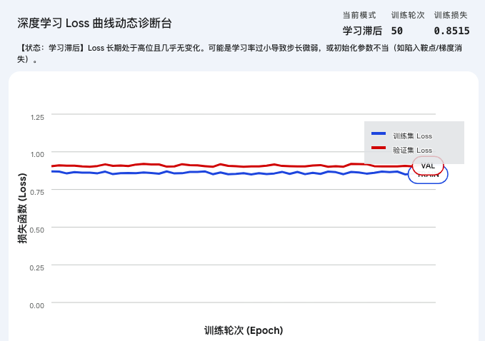

## 第1部分：搞清楚它是什么、为什么需要它（Why & What）

### 🔬 0. 先判断它在解决哪一类真实问题

诊断 Loss 曲线主要解决的是 **深度学习训练内部的黑盒不可观测性问题**。传统机器学习模型（如简单的线性回归）几秒钟就能跑完，跑完直接看准确率就行；但深度学习模型训练动辄几天几夜，你不可能等一个星期后才发现第一天模型就已经崩了。

### ① 还原当时的麻烦：训练在哪一步崩掉了？

想象你正在训练一个有 1000 万参数的卷积神经网络。如果你像对待传统软件那样，只在代码跑完后去看一眼“最终期末成绩（准确率 10%）”，你会彻底陷入绝望的死局。
为什么？因为导致准确率只有 10% 的原因太多了：
* 是第一步学习率给太大，模型瞬间“炸”出外太空了？[cite: 301]
* 是跑到一半掉进了一个马鞍面（鞍点），由于没有加“动量”，它卡死在那里不动了？
* 还是它其实很聪明，把训练集的答案全部“死记硬背”了下来，一到考场全抓瞎？
在没有动态监控的时代，系统设计者被彻底卡死在**“无法归因”**上：你只知道模型病了，却连它是什么时候病的都不知道。

### ② 是什么让人不得不换一种思路？

“只看最终结果”的盲盒炼丹法在深层网络面前极其低效且昂贵。这意味着必须放弃**“把训练过程当黑盒”**的幼稚假设，我们必须像重症监护室一样，**把机器每一轮（Epoch）或者每一步（Step）做题的“失分情况（Loss）”实时记录下来并连成线**，通过动态趋势来评判健康度。

### ③ 新旧方法的核心区别：哪个变量的位置被对调了？

* **旧范式**：黑盒训练几十个小时 $\rightarrow$ 极其不确定的【最终静态准确率】 是输出
* **新范式**：将每一步的实时误差记录成【动态二维折线图】 $\rightarrow$ 实时掌控健康度、决定是否提早拔电源（早停） 是输出

### ④ 得到了什么，又必然失去了什么？

换来了 **对训练生命周期的全局透视能力**（你能一眼看穿过拟合、欠拟合和梯度异常），但必然失去 **“无脑等待结果”的轻松**。架构师从此必须像心内科医生一样，时刻紧盯屏幕上曲线的毛刺、反弹和平台期。这不是缺陷，这是掌控高维机器必须付出的脑力代价。

### ⑤ 什么情况下它会不管用？你来推导

基于以上逻辑，你现在应该能回答：
1.  为什么如果你的屏幕上只有一条“训练集 Loss 曲线”且它一路极其平滑地降到了 0，你不但不能高兴，反而应该感到极度恐慌？
2.  我们在使用 Small Batch（小批次）训练时，Loss 曲线通常会呈现出剧烈的锯齿状上下跳动。你觉得这种“不平滑”是优化器坏了吗？

---

### 🗺️ 1.2 概念地图：它在深度学习知识体系中的位置

```text
深度学习知识体系
│
├─ 模型训练与工程监控
│   │
│   ├─ Loss曲线诊断 ← 你在这里
│   │   ├─ 训练集 Loss (Training Loss) - 测底线（学习能力）
│   │   └─ 验证集 Loss (Validation Loss) - 测上限（泛化能力）
│   │
│   └─ 评估指标 (Accuracy, F1-Score) （容易混淆的静态结果）
```

---

### 📚 1.3 学这个之前，你得先知道这几件事

📚 本节可能会用到的前置概念：
* **代价函数 / Loss**：用来衡量模型当前“猜”得有多错的计分板，越低越好。
* **Epoch / Batch**：机器把所有数据看一遍叫一个 Epoch；每次吃进一小撮数据叫一个 Batch。Loss 曲线的横坐标通常是它们。
* **Train Set / Val Set**：平时用来更新参数的练习题（训练集），和绝对不给机器看答案、只用来模拟考的全新试卷（验证集）。

我可以直接进入当前主题。如果你对上面这三个底层概念的物理运转还不熟，也可以随时打断我为你补充。

---

### 🔩 1.4 一句话说清楚它的本质

「Loss曲线诊断」的本质是：**将高维且不可见的网络参数更新过程，降维映射为时间轴上的二维误差折线，通过比对训练集与验证集曲线的形态差异，精准定位模型底层正在发生的物理灾难。**

后面所有的例子和类比，都是在验证这句话，而不是在解释它。

---

### 💡 1.5 先不管公式，用感觉理解它


**急诊室看心电图的类比**：
想象你是一个急诊室的医生，你的面前躺着一个名叫“神经网络”的病人。

* **训练集 Loss 曲线，就是病人的“基础心率”**：
    * 如果这条线刚开机就像死水一样毫无波澜的一条水平直线，说明病人“脑死亡”了（比如梯度消失，或者学习率设置得小到小数点后 8 位，参数根本没动）。[cite: 300]
    * 如果这条线疯狂上下乱飞，甚至一秒钟就跳出了图表顶端（变成 NaN），说明病人“心脏病突发，血管爆了”（这是典型的学习率过大导致的梯度爆炸）。[cite: 301]
* **验证集 Loss 曲线，则是“心肺负荷测试仪”**：
    * 平时躺在病床上（训练集），心率极其完美地降到了最低点。但只要你让他上跑步机跑两步（丢给他没见过的验证集新数据），他的心率（误差）瞬间掉头飙升。
    * 这说明他是个“虚胖”的病人——这就是深度学习里最臭名昭著的**过拟合（死记硬背，缺乏泛化能力）**。

⚠️ **这个类比在这里开始失效**：
“心电图”的类比暗示了我们追求的是一种“平稳有规律的跳动周期”。但在真实的 Loss 曲线中，我们追求的恰恰是“持续的下降并最终探底”。如果 Loss 曲线从第一秒开始就极度平稳，那反而是最恐怖的静默失效。如果只记住类比，你会误以为曲线平了就是健康的。

---

💡 **本段你已经真正掌握了什么**

* 明白了没有监控的深层训练就是盲人摸象，动态 Loss 曲线是透视高维参数健康的唯一窗口。
* 理解了为什么必须把“练习题成绩（Train Loss）”和“模拟考成绩（Val Loss）”拆开成两条线同时监控。
* 建立了对 Loss “死水一潭”和“瞬间爆炸”的直观物理感受。

---

──────────────────────────────────

📚 前置知识回顾

──────────────────────────────────

本阶段会用到以下概念（已在阶段1学过）：
- **训练集 Loss（Training Loss）**：相当于“平时练习卷”的扣分，用来测底线（模型是不是傻子）。
- **验证集 Loss（Validation Loss）**：相当于“期末模拟考”的扣分，用来测上限（模型能不能举一反三）。

如果不记得了，建议先回顾相关章节。

──────────────────────────────────

## 第2部分：它怎么运转、经典病理图谱（How It Works & How to Use）

### ⚙️ 2.1 经典病理图谱：通过二维曲线透视高维灾难  *💡 核心必学*

在实际工程中，Loss 曲线绝对不是完美的平滑折线，而是充满毛刺的。作为“结构解剖师”，你必须能一眼识别出以下 4 张最经典的“心电图”背后，底层物理引擎到底发生了什么。

#### 图谱 1：完美健康（The Ideal Curve）



* **现象**：两条线紧紧相随，一路平滑下降，最终在底部某个数值保持水平稳定，且验证集 Loss 只比训练集高一点点。
* **物理真相**：这是你做梦都想看到的曲线。模型既具备强大的学习能力（能把练习题吃透），又没有死记硬背（在模拟考上表现同样出色）。
* **你的动作**：保存模型，准备上线。

#### 图谱 2：虚胖/死记硬背（过拟合 Overfitting）


* **现象**：训练集 Loss 还在极度丝滑地下降（甚至贴近于 0），但验证集 Loss 降到某个点后，突然掉头以极其夸张的角度向上飙升！
* **物理真相**：模型脑容量太大，或者看的次数太多。它放弃了寻找“猫有尖耳朵”这种通用物理规律，而是选择了死记硬背“只要背景有这棵树，就是猫”。在这一刻，它对训练集的记忆越深，对真实世界的认知就越扭曲。
* **你的动作**：立刻在“灾难爆发点”断电拔电源（Early Stopping 早停），或者加入 Dropout 和正则化。

#### 图谱 3：步子迈太大扯着蛋（学习率过大 LR Too High）




* **现象**：曲线极度狂野，像锯齿一样上下剧烈横跳，毫无下降趋势，甚至跑着跑着突然报错变成 `NaN`（Not a Number）。
* **物理真相**：优化器在极其高维的峡谷里蒙眼下山，因为“步子（学习率）”给得实在太大了，它一脚从峡谷的左侧半山腰，直接跨越谷底，踩到了右侧更高的山峰上。下一步又以更大的力量弹射回左边。参数正在发生恐怖的“梯度爆炸”。
* **你的动作**：立刻把学习率缩小 10 倍甚至 100 倍。

#### 图谱 4：脑死亡/僵尸漫步（学习率过小 LR Too Low 或 遇到鞍点）




* **现象**：Loss 就像一条死水，跑了 10 个 Epoch，数值几乎在小数点后 4 位徘徊，根本不下降。
* **物理真相**：有两种可能。一是你的步子（学习率）给得比原子直径还小，模型在参数空间里相当于原地踏步；二是模型掉进了一个四面都是平地的“马鞍面（鞍点）”，它感觉不到哪里有坡度，直接停机了。
* **你的动作**：尝试把学习率放大 10 倍，或者换用带有“动量（Momentum/Adam）”的优化器帮它冲出平地。

---

### 💻 2.2 最小MVP：动手写代码，画出你的第一张“心电图”  *💡 核心必学*

如果不亲手把 Loss 存下来画成图，你在 PyTorch 里永远只能盯着命令行里刷屏的数字发呆。下面是用 **30 行极简代码** 实现工业界标准的“双线监控”逻辑。

```python
import torch
import torch.nn as nn
import matplotlib.pyplot as plt

# 1. 准备极简假数据和模型 (B, D) = (批大小:16, 维度:10)
x_train, y_train = torch.randn(16, 10), torch.randn(16, 1)
x_val, y_val = torch.randn(16, 10), torch.randn(16, 1)
model = nn.Linear(10, 1) # 最简单的单层网络
optimizer = torch.optim.SGD(model.parameters(), lr=0.01)
loss_fn = nn.MSELoss()   # 均方误差计分员

# 2. 初始化心电图记录本
history_train_loss = []
history_val_loss = []

# 3. 开始急诊室监控循环
for epoch in range(50):
    # --- 阶段 A：做练习题（训练） ---
    model.train() # 🔴 开启训练模式
    optimizer.zero_grad()
    pred_train = model(x_train)
    loss_train = loss_fn(pred_train, y_train)
    loss_train.backward()
    optimizer.step()
    history_train_loss.append(loss_train.item()) # 记录当前血压
    
    # --- 阶段 B：做模拟考（验证） ---
    model.eval()  # 🔴 开启验证模式 (极其重要！)
    with torch.no_grad(): # 考试时绝对不能翻书看答案（不计算梯度）
        pred_val = model(x_val)
        loss_val = loss_fn(pred_val, y_val)
        history_val_loss.append(loss_val.item())

# 4. 把心电图画出来
plt.plot(history_train_loss, label='Train Loss (Practice)')
plt.plot(history_val_loss, label='Val Loss (Mock Exam)')
plt.legend()
plt.title("Model Health Monitor")
plt.show()
# 运行预期：你会看到蓝线和红线同时下降。如果把 epochs 调到 5000，你会亲眼目睹过拟合发生。
```

---

### ✅ 2.4 工程规范：怎么写才算专业？避开会让你被骂的写法  *🔥 实战必备*

在画 Loss 曲线这件事上，初学者最容易犯以下极其致命的工程错误：

#### 🔴 RED（强制规范）：绝对不能忘记 `model.train()` 和 `model.eval()` 的切换！
* **违反会导致**：你的验证集 Loss（红线）将彻底失去意义，变成毫无参考价值的假数据。
* **物理根因**：深度学习网络里有一些特殊的组件（如 Dropout 随机失活、BatchNorm 批归一化）。在训练时，Dropout 会随机“杀”掉一半的脑细胞来逼迫模型变得强壮；但在推理/测试时，必须把所有脑细胞唤醒（`eval()` 的作用），发挥全部实力。如果在验证阶段忘记写 `model.eval()`，模型将带着一半死掉的脑细胞去参加期末考试，Loss 会异常偏高，让你误判模型是个垃圾。
* **口诀**：**“验证先写 eval，梯度切断 no_grad。”**（参考上方代码 32-33 行）

#### 🟡 YELLOW（强烈建议）：不要盯着单步的毛刺看，要看滑动平均（Moving Average）
* **违反后果**：在使用 Small Batch（小批次）训练时，因为每次看到的数据都不一样，单步的 Loss 会像锯齿一样疯狂跳动，肉眼根本看不出下降趋势，导致你过早误判并终止训练。
* **建议做法**：不要每走一个 Batch 就画一个点，而是**把一个 Epoch 里所有 Batch 的 Loss 加起来求平均值**，用这个平滑的平均值画图。

──────────────────────────────────

💡 **本段你已经真正掌握了什么**

- 把冰冷的 Loss 曲线看成了有血有肉的“病理图”，能一眼分辨出过拟合（U型反弹）、梯度爆炸（剧烈震荡）和停滞（死水）。
- 掌握了在 PyTorch 中通过 `train/eval` 切换来正确抽取 Train Loss 和 Val Loss，并规避了最容易踩的 `eval()` 遗漏陷阱。

---

──────────────────────────────────

📚 前置知识回顾

──────────────────────────────────

本阶段会用到以下概念（已在阶段1和2学过）：
- **训练模式与验证模式**：`model.train()` 与 `model.eval()`。
- **梯度累积**：默认情况下 PyTorch 会把梯度加起来，而不是替换。
- **Logits**：模型最后一层输出的“原始打分”，还没有经过任何概率化处理（如未经过 Softmax）。

如果不记得了，遇到卡点可以直接问我。

──────────────────────────────────

## 第3部分：哪里容易出错、怎么排查（What to Avoid & Beyond）

### ⚠️ 3.1 大多数人在哪里栽了跟头？  *🔥 实战必备*

在盯 Loss 曲线时，初学者极容易被曲线的假象欺骗，或者踩入 PyTorch 底层机制的陷阱。

#### 陷阱 1：Loss 死活降不下去，以为是学习率太小，其实是“双重 Softmax”
**💥 现象**：做一个 10 分类的任务，Loss 一直在 2.3 左右徘徊（恰好是 $-\ln(0.1)$），就像一条死水，但学习率调大调小都没用。
**🔍 根本原因**：PyTorch 的 `nn.CrossEntropyLoss` 非常特殊，它的内部**自带了**一步 Softmax 操作。如果你在模型结构的最后一层“自作聪明”地加了一个 Softmax 输出概率，然后再传给这个 Loss 函数，就相当于对概率又做了一次 Softmax。这会把数值压缩到极其平缓的区域，导致梯度近乎为 0（即梯度消失）。

```python
# ❌ 错误示范：画蛇添足
class MyModel(nn.Module):
    def __init__(self):
        super().__init__()
        self.fc = nn.Linear(128, 10)
        self.softmax = nn.Softmax(dim=1) # 以为输出概率更规范
        
    def forward(self, x):
        x = self.fc(x)
        return self.softmax(x) # ❌ 致命错误：输出给了 CrossEntropyLoss

# 此时用 nn.CrossEntropyLoss() 会导致梯度消失！
```

**✅ 修复方案**：
```python
# ✅ 正确做法：直接输出粗糙的 Logits
    def forward(self, x):
        x = self.fc(x)
        return x # 交给 CrossEntropyLoss 在内部去处理概率
```
**🛡️ 预防建议**：永远记住，在 PyTorch 中，分类网络的最后一层直接输出未经修饰的 Logits（形状为 `(Batch, Class_Num)` 的生猛张量）。

---

#### 陷阱 2：Loss 突然变成 NaN，疯狂调小学习率也没用
**💥 现象**：训练到第 5 个 Epoch，Loss 突然显示为 `NaN`（不是一个数字），模型直接瘫痪。
**🔍 根本原因**：除了学习率过大导致梯度爆炸，最常见的原因其实是**脏数据**或**除以0**。比如，你的 Loss 函数里包含除法，恰好某个 Batch 全是背景（分母为0）；或者你的分类标签超出了范围（比如总共 10 类，数据里混入了一个标签为 `10` 的样本，PyTorch 索引从0开始，最大只能是 9）。

**✅ 修复方案**：引入“梯度裁剪（Gradient Clipping）”强制物理限速。
```python
loss.backward()
# ✅ 在更新参数前，强行把异常巨大的梯度砍掉（物理限速）
torch.nn.utils.clip_grad_norm_(model.parameters(), max_norm=1.0) 
optimizer.step()
```

---

### 🛠️ 3.2 如果训练结果不对，应该怎么排查？  *⭐ 进阶选学*

当 Loss 曲线出现异常（如不下降、震荡极度剧烈、NaN），不要瞎猜，必须按以下**工业级 SOP（标准作业程序）**逐层排查：

```text
🚨 Loss 异常诊断决策树
│
├─ 1. 数据对了吗？
│   ├─ 检查: 输入张量有没有包含 NaN？标签有没有越界？
│   └─ 动作: 打印 x.isnan().any()
│
├─ 2. 形状对了吗？ (最常触发静默 Bug)
│   ├─ 检查: 预测值 (B, 1) 和真实标签 (B,) 做运算时，触发了灾难性的广播机制。
│   └─ 动作: 必须确保 pred.shape == target.shape，如果不等，用 squeeze() 对齐。
│
├─ 3. 梯度存在吗？
│   ├─ 检查: 反向传播后，参数真的拿到了更新方向吗？
│   └─ 动作: 打印 model.fc.weight.grad，如果是 None，说明你的计算图断裂了。
│
└─ 4. 模型有能力学习吗？ (Overfit a single batch 测试)
    ├─ 检查: 模型是不是架构写错了，根本学不会东西？
    └─ 动作: 抽出仅仅 1 个 Batch 的数据，反复训练这 1 个 Batch 几百次。
             如果 Loss 不能降到近乎 0，说明模型代码有严重的底层架构错误。
```

---

### 🚀 3.3 如果要用在真实项目里，该怎么做？  *⭐ 进阶选学*

在真实的工业项目中，我们**绝对不会**像 2.2 节那样自己写 `history.append()` 然后用 `matplotlib` 画图。这种做法如果遇到几千个 Epoch、服务器断电、或者要对比 10 次不同学习率的实验，你会彻底崩溃。

业界标准的做法是使用**专业实验记录面板（如 TensorBoard 或 Weights & Biases）**。

```python
# 真实工程做法：引入 TensorBoard 护士
from torch.utils.tensorboard import SummaryWriter

# 1. 建立病历本档案室
writer = SummaryWriter('runs/my_experiment_lr_0.01')

for epoch in range(50):
    # ... 训练计算 loss_train ...
    
    # 2. 每走一步，向远端病历本写入数据
    # 参数：(图表名称, 具体数值, 当前是第几步)
    writer.add_scalar('Loss/Train', loss_train.item(), epoch)
    
    # ... 验证计算 loss_val ...
    writer.add_scalar('Loss/Val', loss_val.item(), epoch)

# 3. 关闭档案
writer.close()
```
**好处**：你的终端只需执行 `tensorboard --logdir=runs`，就能在一个精美的网页端实时看着曲线跳动，甚至还能随意放大缩小、对比不同实验的走向。

---

### 🎓 3.4 实战挑战：来试试看自己解决一个真实问题  *🔥 实战必备*

这不仅是一道测试题，更是无数 PyTorch 新手经历过的“午夜惨案”。请你扮演高级工程师，找出这段代码里的致命 Bug。

```python
"""
场景：你正在服务器上训练一个图像分类模型，打算把每一步的 Loss 存下来画图。
现象：跑到第 15 个 Epoch 的时候，你的代码突然报错："CUDA out of memory"（显存爆了）。
你百思不得其解：我每次输入的 Batch Size 都是固定的，为什么显存会越跑占用越大？

以下是核心监控代码，请找出引发显存核爆的那一行，并修复它。
"""

history_train_loss = []

for epoch in range(100):
    for batch_x, batch_y in dataloader:
        optimizer.zero_grad()
        
        preds = model(batch_x)
        loss = criterion(preds, batch_y)
        
        loss.backward()
        optimizer.step()
        
        # 将当前 batch 的 loss 记录到列表中用于画图
        history_train_loss.append(loss) 
```

**你的任务：**
看一看这段代码，告诉我：
1. 为什么显存会越积越多？
2. 应该如何修改最后那行记录数据的代码？

（提示：想想 PyTorch 的张量和普通 Python 数字的区别）

──────────────────────────────────

如果你有答案了，或者哪里卡住了，直接回复我，我会为你做代码评审！这也是我们这趟“Loss曲线诊断”解剖之旅的最后一站。