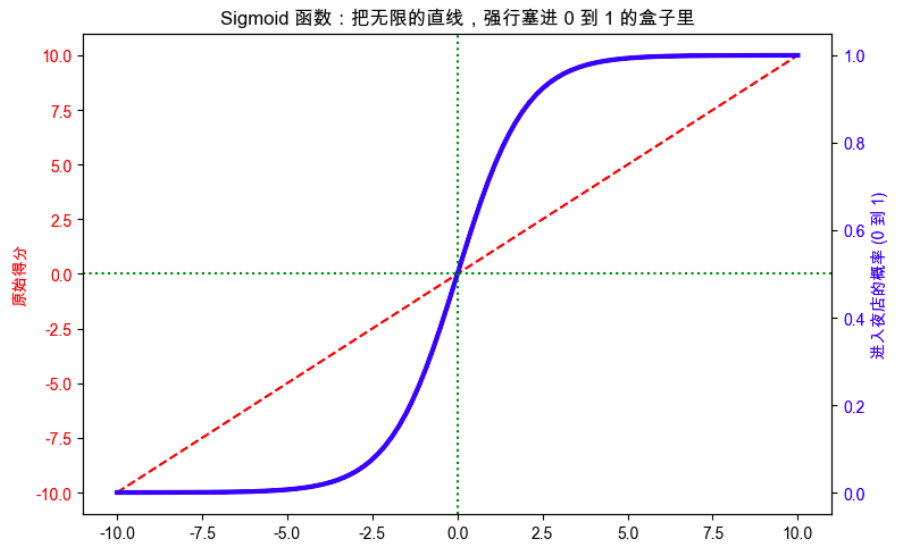
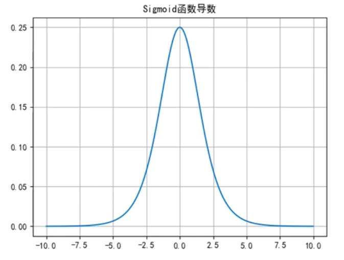

在深度学习里，**sigmoid 函数**是一个很经典的激活函数 😊

它的表达式是：

$
\sigma(z)=\frac{1}{1+e^{-z}}
$

其中 (z) 就是神经元输入的那个线性组合，比如：

$
z=w^Tx+b
$

---

## 1. 它长什么样

sigmoid 会把任意实数压缩到 **0 到 1 之间**：

* 当 $z\to +\infty$ 时，$\sigma(z)\to 1$
* 当 $z\to -\infty$ 时，$\sigma(z)\to 0$
* 当 $z=0$ 时，$\sigma(z)=0.5$

所以它很适合表示一种“**概率感**”：

* 输出接近 1：更像“是”
* 输出接近 0：更像“否”

---

## 2. 为什么它以前很常用

sigmoid 有两个很吸引人的特点：

### （1）连续且可导

这对梯度下降很重要，因为反向传播需要求导。

### （2）输出像概率

特别是在**二分类**里，最后一层常常会用 sigmoid，把结果解释成“属于正类的概率”。

例如：

* 输出 0.9：模型认为有 90% 概率是正类
* 输出 0.1：模型认为只有 10% 概率是正类

这和你学过的**逻辑回归**是直接连起来的：
逻辑回归本质上就是把线性结果丢进 sigmoid。

---

## 3. 它的导数很漂亮

sigmoid 的导数是：

$
\sigma'(z)=\sigma(z)(1-\sigma(z))
$

这个形式非常简洁，所以早期神经网络里特别喜欢它。

比如：

* 若 $\sigma(z)=0.5$，导数是 $0.5(1-0.5)=0.25$
* 若 $\sigma(z)$ 接近 0 或 1，导数就会很小

这个“导数变小”正好引出它的主要缺点。

---

## 4. 它的缺点：梯度消失

当 (z) 很大或很小时，sigmoid 会进入“饱和区”：

* (z) 很大时，输出接近 1
* (z) 很小时，输出接近 0

这时导数：

$
\sigma'(z)=\sigma(z)(1-\sigma(z))
$

会非常接近 0。

### 这会导致什么？

在深层网络中，反向传播要一层层把梯度传回去。
如果很多层都乘上很小的数，梯度会越来越小，前面层几乎学不到东西，这就是**梯度消失**。

所以：

* **浅层网络**里 sigmoid 还能用
* **深层网络隐藏层**里，现在通常不用 sigmoid，而更常用 **ReLU**

---

## 5. 为什么现在隐藏层更少用它

除了梯度消失，还有一个问题：

## 输出不是以 0 为中心

sigmoid 输出总在 ((0,1)) 之间，全是正数。
这样会让优化过程不如某些其他激活函数高效。

相比之下：

* **tanh** 输出在 ((-1,1))，以 0 为中心
* **ReLU** 计算简单，缓解梯度消失，更适合深层网络

所以现代深度学习中通常是：

* **隐藏层**：常用 ReLU
* **输出层（二分类）**：常用 sigmoid

---

## 6. 在哪里还会用 sigmoid

sigmoid 现在最典型的用途是：

### 二分类输出层

比如判断：

* 这是不是垃圾邮件
* 这张图里是不是猫
* 用户会不会点击广告

输出一个数 $p\in(0,1)$，表示正类概率。

然后通常配合 **binary cross-entropy（二元交叉熵）** 损失函数。

---

## 7. 和逻辑回归的关系

你已经学过逻辑回归，所以这一点特别重要：

逻辑回归的预测公式就是：

$
\hat{y}=\sigma(w^Tx+b)
$

而神经网络里，一个神经元做的事本质上也是：

1. 先算线性部分 $w^Tx+b$
2. 再过一个激活函数

如果激活函数选 sigmoid，那么这个神经元就很像逻辑回归里的输出单元。

所以可以把它理解成：

> **sigmoid 是把线性结果变成概率输出的桥梁。**

---

## 8. 一个直观例子

假设某个神经元算出来：

$
z=2
$

那么：

$
\sigma(2)=\frac{1}{1+e^{-2}}\approx 0.88
$

说明这个神经元“激活程度”比较高。

如果：

$
z=-2
$

那么：

$
\sigma(-2)\approx 0.12
$

说明激活程度比较低。

所以 sigmoid 的作用，就是把原本可能很大很小的输入，平滑地压到 0 和 1 之间。

---

## 9. 一句话总结

### sigmoid 是什么？

把任意实数映射到 ((0,1)) 的激活函数。

### 优点是什么？

平滑、可导、输出可解释成概率。

### 缺点是什么？

在深层网络隐藏层里容易造成**梯度消失**，所以现在不常用于隐藏层。

### 主要用在哪？

**二分类任务的输出层**。

---

