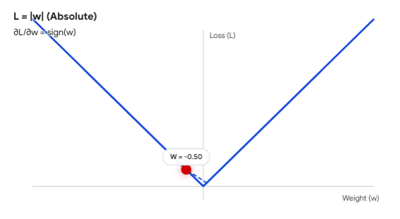

在回归任务（预测连续数值）中，均方误差（MSE）确实是绝对的默认首选，而平均绝对误差（MAE）出场率相对较低。这并不是因为数学家偏爱平方运算，而是因为 **MSE 和底层优化引擎（梯度下降）的物理咬合度极其完美，而 MAE 在工程实现上存在严重的“机械摩擦”。**

我们可以从“优化过程”和“业务惩罚”两个物理视角来拆解这个设计决策。

### 1. 优化视角：自带“自动刹车”的完美平滑山谷

还记得梯度下降的本质吗？它是一个蒙眼找谷底的过程，决定它每一步迈多大的，除了你设置的**学习率**，更核心的是**当前脚底下的坡度（梯度）**。

* **MSE 的物理外壳（抛物线）**：
    MSE 的公式有平方项，它在三维空间中画出来是一个**完美的、圆滑的碗（凸函数）**。      
    根据微积分，MSE 对预测值的导数是 $2(y_{pred} - y_{true})$。     
    **工程红利**：随着模型越来越聪明，预测值越来越接近真实值（误差变小），**这个坡度（梯度）会自然而然地跟着变小**。这相当于给梯度下降装上了一套 **“自动刹车系统”**。当它逼近谷底时，步伐会越来越细微，最终极其平稳地停在最低点。

* **MAE 的物理外壳（V型深沟）**：
    MAE 计算的是绝对值距离，它画出来是一个**底端极其尖锐的 V 型沟壑**。         
    在数学上，MAE 对预测值的导数永远是一个常数：$\pm 1$。           
    **工程灾难**：无论模型离谷底还有 10000 公里，还是只差 0.001 毫米，它脚下的坡度永远是一模一样的陡峭（梯度永远是 1 或 -1）。          
    它就像一辆**没有刹车的汽车**。当它到达谷底最低点时，如果你的学习率没有手动调得极小，它会凭借着永远为 1 的固定步伐，直接跨过最低点，跳到对面的坡上，然后再跳回来。模型会永远在谷底的左右两边**疯狂震荡（Oscillation）**，死活无法收敛到绝对的最优解。此外，MAE 在误差恰好为 0 的那个尖锐折点上，在数学上是**不可导**的，这会让底层引擎瞬间陷入逻辑停滞。

所以，**梯度下降训练模型的时候，MSE是误差越大惩罚越大，Loss曲线是一个完美的“碗”型凸函数，当模型越来越聪明，梯度越来越小，权重更新越来越慢，最终很好地停在最低点；但是MAE无论误差大小，梯度永远都是1，Loss曲线是一个V字型，它模型训练的最后永远在疯狂震荡，而且MAE在Loss为0的位置是不可导的。**

### 2. 业务视角：对“大错”的零容忍态度

除了底层的收敛问题，MSE 和 MAE 在“如何看待错误”的价值观上也完全不同。

* **MSE 的连坐惩罚（错 2 罚 4，错 10 罚 100）**：
    由于有平方操作，如果一个样本预测错了 10 个单位，它对 Loss 的贡献是 100。MSE 极其“记仇”，它对产生巨大误差的样本有**零容忍度**。在训练时，优化器为了把这个巨大的 100 压下来，会倾尽全力去修正这个大错。这使得模型在整体上更加“稳健”，绝不允许出现极其离谱的预测。
* **MAE 的众生平等**：
    预测错 10 个单位，Loss 就是 10；错 1 个单位，Loss 就是 1。MAE 极其冷静客观，错多少算多少，不加倍惩罚。

### 总结：既然 MAE 这么不好，为什么还要学它？

在深度学习的工程规范中，我们 90% 的连续数值预测都会闭着眼睛选 MSE。

但是，**当你的训练数据极其肮脏、充满不可理喻的极端异常值时，MSE 会成为一场灾难**。
假设你要预测 1000 套房子的价格，其中 999 套是正常的，有 1 套因为录入员多打了几个零，变成了 100 亿。
如果你用 MSE：这 100 亿的平方会产生一个恐怖的黑洞拉力，模型为了迁就这 1 个异常点，会把剩下 999 套房子的预测线全部拉歪。     
如果你用 MAE：因为 MAE 的梯度永远是常数 1，这个 100 亿的异常点无论多离谱，它对模型产生的“拉力”也只有 1。模型会极其淡定地**无视**这个异常点，专注于剩下 999 个正常房子的规律。

**工程金科玉律：**      
正常数据找规律，用自带平滑刹车的 **MSE**。      
数据极脏、离群点极多，需要抗干扰时，换上冷酷无情的 **MAE**。