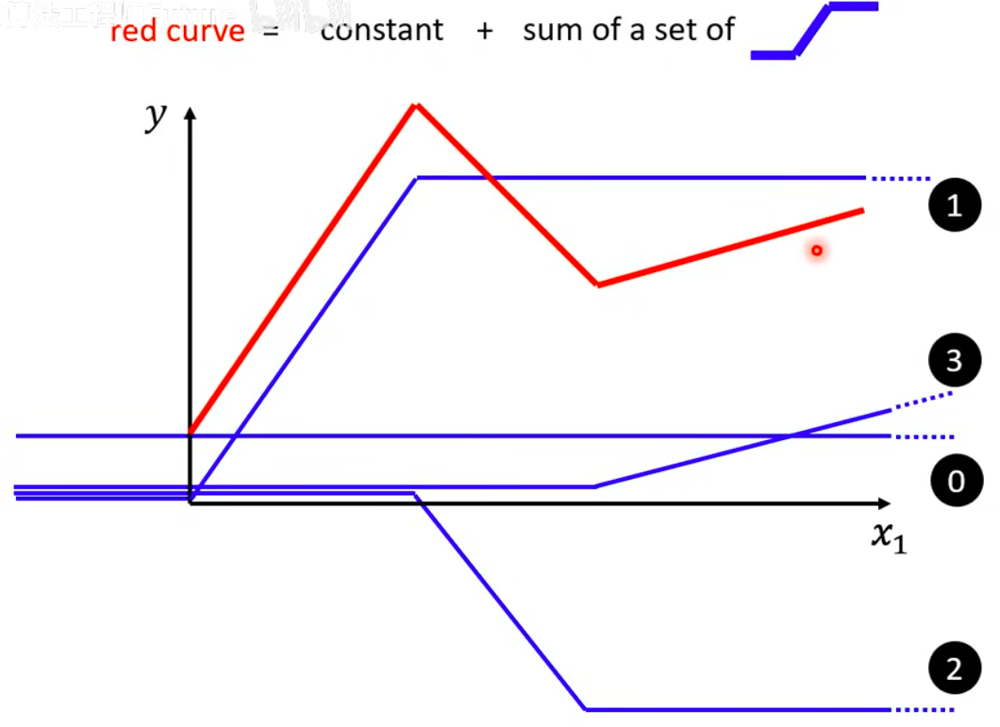
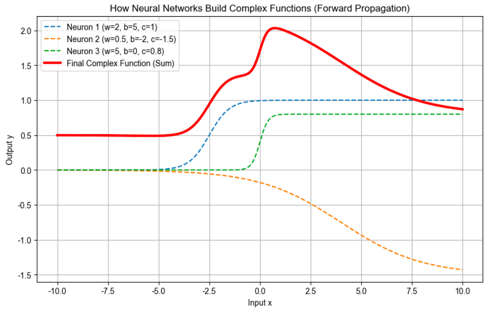

**神经网络为什么能拟合万物？——从“直男”线性模型到“千变万化”的前向传播**

## 一、 第一性原理：被“直男”线性模型逼出的绝境

在机器学习的起点，我们最早接触的是**线性模型（Linear Model）**。它的数学表达非常简单：$$y = w \cdot x + b$$

如果我们把这个模型画在坐标系里，它永远是一条**笔直的线**。你可以改变权重 $w$ 让它变陡峭，或者改变偏置 $b$ 让它上下平移，但**它永远无法弯曲**。

这在现实世界中是个巨大的灾难。现实中的规律——比如预测明天的股票走势、判断一张图片是不是猫、或者评估一句话的情感是积极还是消极——其背后的数学函数是极其崎岖蜿蜒的。如果你用一条直直的钢筋去硬贴一条复杂的波浪线，注定会失败。

这种“模型天生太笨，无论怎么学都学不好”的现象，在机器学习中被称为 **Model Bias（模型偏差）**。

**为了精准拟合现实世界，我们需要设计一种机制，让这根笔直的钢筋能够“弯折”，变成一个具有极高弹性的、能变成任何形状的“超级函数”。**

---

## 二、 破局的关键：化曲为直的“拼图游戏”

怎么凭空捏造出一个复杂的曲线呢？李宏毅老师给出了一个极其天才的工程学视角：**拆解与叠加**。

（拆解包含两种意思：拆解成多层神经网络，将复杂问题拆解成一步一步的推导。同时，每层神经网络拆解成多个神经元，多个神经元曲线叠加成新的特征，几何上就是新的曲线，新的曲线又作为下一层神经网络的特征）

[点击跳转：两层神经网络的拆解与叠加动画演示](1.0.1两层神经网络的拆解与叠加.html)

即使是世界上最复杂、最平滑的曲线，只要我们把它在局部无限放大，它都可以看作是由无数段细小的“直线段”首尾相连拼凑而成的。

那么，怎么拼出这些千奇百怪的转折点和坡度呢？我们需要一种特殊的“数学积木”。在神经网络中，这种积木被称为 **激活函数（Activation Function）**。

激活函数的核心使命只有一个：**引入非线性（Non-linearity）**。它就像是在笔直的钢筋上敲出一个个“关节”，让模型具备了弯折的能力。常见的积木有带硬转角的 ReLU（也就是李老师口中的“蓝方”），以及更加平滑优雅的 **Sigmoid 函数（S 型曲线）**。

---

## 三、 S 型积木的形变魔法：$w$、$b$ 与 $c$ 的物理意义

假设我们现在选用 Sigmoid 作为我们的基础积木。这块积木本身长得像个拉长的字母“S”，最神奇的是，只要赋予它三个未知的“旋钮”（参数），我们就能把它捏成各种形态：

1.  **旋钮 $w$（Weight 权重）：决定“多快爬上面前的那座山”**
    * **直觉：** $w$ 越大，S 型中间的斜坡就越陡峭；$w$ 越小，斜坡就越平缓。它控制着曲线在横轴上的**形变压缩**。
2.  **旋钮 $b$（Bias 偏置）：决定“什么时候开始爬山”**
    * **直觉：** 改变 $b$，这根 S 型曲线就会在 X 轴上**左右平移**。它决定了这个特征“在输入达到什么阈值时被激活”。
3.  **旋钮 $c$（外层权重）：决定“这座山有多高”**
    * **直觉：** 改变 $c$，S 型曲线就会被**上下拉伸或翻转**。它代表了这块特定的积木，在最终的总拼图里占有多大的分量。

---

## 四、 见证奇迹的时刻：通用近似定理与代码实战

当你拥有了成千上万个这样的 S 型积木（也就是**神经元**），并且每一个积木都有自己专属的 $w$、$b$、$c$ 时，奇迹就发生了：

**把它们全部加起来（叠加）！**

第一个积木负责造出第一个波峰，第二个积木负责填平某一个波谷，第三个积木负责拉起一个长长的缓坡…… 当成百上千条被捏成不同形状的 S 型曲线叠加在一起时，它们就能**拟合出宇宙中任何一条复杂的曲线**。这就是著名的 **通用近似定理（Universal Approximation Theorem）**。

你会发现：三条极其规则、毫无波澜的 S 型虚线，仅仅是通过简单的相加，就变成了一条有着奇特波峰和波谷的红色实线。**如果有 1000 个神经元，这根红线就能变成你想要的任何形状！**

---

## 五、 从“摊大饼”到“流水线”：深度学习的“深”究竟指什么？

上面我们展示的“把所有积木一口气加总”，在数学上叫做**单隐层神经网络（Shallow Network）**。这就像是一个扁平的“摊大饼”工厂，一万个工人同时看着原始材料，各自捏一个形状，最后直接堆在一起。虽然理论上可行，但效率极低。

这就引出了我们对网络架构的升级——**深度神经网络（Deep Neural Network）**。

在深度学习中，我们不再是一口气加总，而是让**前一层的输出，作为后一层的输入**。这就像是一条高度精密的现代化流水线：

* **浅层（底层）：** 第一层神经元接收最原始的数据（比如图片的像素）。它们通过自己的 $w$ 和 $b$，提取出最基础的特征（比如**边缘、横线、斜线**）。
* **中层：** 第二层神经元**不再看原始像素了**！它们接收的是第一层提取出来的“线条”，然后将这些线条重新组合、叠加，拼成更复杂的**形状**（如圆形、猫的耳朵轮廓）。
* **深层（高层）：** 更深的层接收“形状”，组合成**高级的概念**（如一张完整的猫脸）。
* **输出层：** 直到最后一层，才将这些高度浓缩的概念“加总”打分，得出最终结果（“这是一只猫的概率是 98%”）。

**为什么需要多层？** 因为特征是可以**复用**的！底层提取的直线和圆弧，既可以用来拼凑一只猫，也可以用来拼凑一辆汽车。这种层级化的特征提取（Hierarchical Feature Extraction），使得深度网络能用更少的参数，拟合出比单层网络复杂千万倍的规律。

---

## 六、 终极总结：前向传播（Forward Propagation）的直觉画面

现在，当你再听到“前向传播”这个极其学术的词汇时，脑海中不应该再是一堆枯燥的矩阵乘法公式，而应该是这样一幅生动的画面：

> **前向传播，就是让输入数据 $x$ 像水流一样，流入这座极其庞大的数学工厂。水流经过一层层设置好特定 $w$ 和 $b$ 的“阀门（激活函数）”，在第一层被提炼成线条，在第二层被汇聚成形状，在第三层被浓缩成概念……不断地变形、组合、抽象，最终从工厂的出口流出，变成一个预测结果 $y$ 的全过程。**
