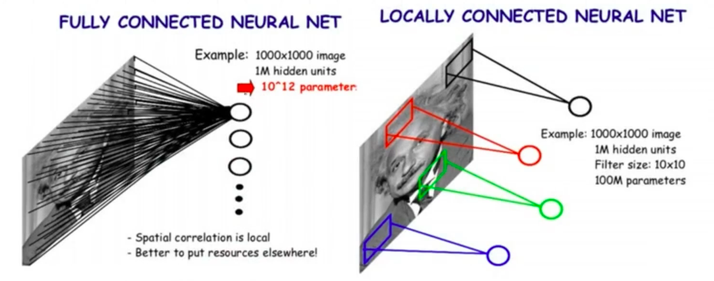

# 卷积神经网络（CNN）完全入门指南

> 写给已经了解梯度下降、正则化、自适应学习率的你。
> 目标：读完这一篇，你能从零理解 CNN 的每一个零件是什么、为什么需要它、它怎么工作。

---

## 第一章：为什么需要 CNN？

### 1.1 用全连接网络处理图片会怎样？

你学过的全连接网络（Fully Connected Network），每个神经元和前一层的**所有**神经元相连。拿它处理图片，第一步是把二维图片"拉直"成一维向量：

```
一张 4×4 灰度图片：                    拉直成向量：

┌────┬────┬────┬────┐
│ 10 │ 20 │ 30 │ 40 │
├────┼────┼────┼────┤        →    [10, 20, 30, 40, 50, 60, 70, 80, ...]
│ 50 │ 60 │ 70 │ 80 │                     共 16 个数字
├────┼────┼────┼────┤
│ 90 │100 │ 110│ 120│
├────┼────┼────┼────┤
│130 │ 140│ 150│ 160│
└────┴────┴────┴────┘
```

4×4 只有 16 个像素，看起来没什么。但真实图片呢？

| 图片尺寸 | 通道数 | 输入维度 | 第一层1000个神经元时的参数量 |
|---------|-------|---------|------------------------|
| 28×28 | 1（灰度） | 784 | 784,000 |
| 224×224 | 3（RGB） | 150,528 | 1.5 亿 |
| 1024×1024 | 3（RGB） | 3,145,728 | 31 亿 |

1.5 亿个参数，光是存储就需要大量内存，训练起来更是噩梦。

### 1.2 参数多只是问题之一

更严重的问题是**空间结构被破坏**了。

```
原始图片中，这三个像素是"邻居"：

    ... 20  30  40 ...
    ... 60 [70] 80 ...      70 的上下左右邻居是 30, 110, 60, 80
    ... 100 110 120 ...

拉直之后：
    [..., 30, 40, 50, 60, 70, 80, 90, 100, 110, ...]

    70 的"邻居"变成了 60 和 80，
    而原本在它正上方的 30 隔了好远。
```

全连接网络并不知道哪些像素在空间上相邻——它把每个像素一视同仁地连接，需要**自己从数据中重新学到**空间关系。这非常浪费。

### 1.3 还有平移不变性的问题

假设网络学会了识别图片左上角的猫脸。现在同一只猫挪到了右下角：

```
场景A：                    场景B：
┌──────────────┐           ┌──────────────┐
│  🐱          │           │              │
│              │           │              │
│              │           │          🐱  │
└──────────────┘           └──────────────┘
```

对全连接网络来说，这两张图拉直后的向量完全不同，需要**分别学习**才能都认出是猫。如果训练数据中猫总是在左上角，模型就可能认不出右下角的猫。

### 1.4 CNN 的回答

CNN 用了两个精妙的简化设计来解决以上问题：

**局部连接**：每个神经元只看图片的一小块区域，不看全图。这大幅减少了参数量。

**权值共享**：同一组权重在图片的每一个位置重复使用。这样，学会在左上角检测猫脸的那组权重，在右下角也同样有效——天然具有平移不变性。

下面我们逐一拆解 CNN 的每个组件。



---

## 第二章：卷积操作——CNN 的核心引擎

### 2.1 什么是卷积核？

卷积核（kernel / filter）就是一个小矩阵，里面的每个数字都是一个**可学习的权重**。最常见的大小是 3×3，也有 5×5、7×7 等。

```
一个 3×3 的卷积核：

┌────┬────┬────┐
│ w1 │ w2 │ w3 │
├────┼────┼────┤
│ w4 │ w5 │ w6 │      共 9 个可学习参数（加上 1 个偏置 b，共 10 个）
├────┼────┼────┤
│ w7 │ w8 │ w9 │
└────┴────┴────┘
```

### 2.2 卷积的完整计算过程（手把手）

我们用一个 5×5 的输入和 3×3 的卷积核，一步一步算。

```
输入 X（5×5）：                卷积核 W（3×3）：

 1   2   3   0   1             1   0  -1
 0   1   2   3   0             0   1   0
 3   0   1   2   1            -1   0   1
 1   2   0   1   3
 0   1   3   2   0            偏置 b = 0
```

**第 1 步：把卷积核放到左上角（位置 0,0）**

```
 [1   2   3]  0   1           对应的卷积核：
 [0   1   2]  3   0                1   0  -1
 [3   0   1]  2   1                0   1   0
  1   2   0   1   3               -1   0   1
  0   1   3   2   0
```

逐元素相乘再相加：

```
1×1 + 2×0 + 3×(-1)        =  1 + 0 - 3 = -2
0×0 + 1×1 + 2×0           =  0 + 1 + 0 =  1
3×(-1) + 0×0 + 1×1        = -3 + 0 + 1 = -2

总和 = -2 + 1 + (-2) + b  = -3 + 0 = -3
```

所以输出特征图的 (0,0) 位置 = **-3**。

**第 2 步：卷积核右移一格（位置 0,1）**

```
  1  [2   3   0]  1           对应的卷积核：
  0  [1   2   3]  0                1   0  -1
  3  [0   1   2]  1                0   1   0
  1   2   0   1   3               -1   0   1
  0   1   3   2   0
```

```
2×1 + 3×0 + 0×(-1)   =  2
1×0 + 2×1 + 3×0      =  2
0×(-1) + 1×0 + 2×1   =  2

总和 = 2 + 2 + 2 = 6
```

输出 (0,1) = **6**。

**继续滑动...**  卷积核依次滑过所有可以放下的位置。5×5 输入配 3×3 卷积核，不补零，一共可以放 3×3 = 9 个位置。

最终得到的输出特征图（3×3）：

```
┌────┬────┬────┐
│ -3 │  6 │ -3 │
├────┼────┼────┤
│  2 │  1 │  4 │
├────┼────┼────┤
│ -1 │  4 │ -3 │
└────┴────┴────┘
```

### 2.3 卷积可以看作"特征检测器"

不同的卷积核权重会检测不同的图像特征。来看几个直观的例子：

```
水平边缘检测器：              垂直边缘检测器：             锐化核：
┌────┬────┬────┐            ┌────┬────┬────┐            ┌────┬────┬────┐
│ -1 │ -1 │ -1 │            │ -1 │  0 │  1 │            │  0 │ -1 │  0 │
├────┼────┼────┤            ├────┼────┼────┤            ├────┼────┼────┤
│  0 │  0 │  0 │            │ -1 │  0 │  1 │            │ -1 │  5 │ -1 │
├────┼────┼────┤            ├────┼────┼────┤            ├────┼────┼────┤
│  1 │  1 │  1 │            │ -1 │  0 │  1 │            │  0 │ -1 │  0 │
└────┴────┴────┘            └────┴────┴────┘            └────┴────┴────┘
```

以水平边缘检测器为例：上面一行权重是 -1，下面一行是 +1。如果把它放在一个"上暗下亮"的区域上，上面的像素乘以 -1 得到小负数，下面的像素乘以 +1 得到大正数，加起来就是一个大正值——说明这里有一条水平边缘。如果区域很平滑（上下一样亮），正负相消，输出接近零。

关键点：在 CNN 中，**我们不手动设计这些卷积核**，而是让网络通过反向传播自动学出需要的卷积核。网络可能学出边缘检测器、色彩检测器、纹理检测器……完全取决于训练数据和任务。

[点击跳转：什么是卷积运算详解](1.1.0什么是卷积运算.md)

---

## 第三章：步幅、填充与输出尺寸

### 3.1 步幅（Stride）

步幅控制卷积核每次移动多少格。

```
Stride = 1（默认）：每次移 1 格      Stride = 2：每次移 2 格

位置：                                位置：
x x x . .    . x x x .               x x x . .    . . x x x
. . . . .    . . . . .               . . . . .    . . . . .
. . . . .    . . . . .               . . . . .    . . . . .
. . . . .    . . . . .               x x x . .    . . x x x
. . . . .    . . . . .               . . . . .    . . . . .

→ 滑 3 次                             → 滑 2 次（跳着走）
```

步幅 = 2 时，输出尺寸大约缩小一半。这是一种**下采样**的手段。

### 3.2 填充（Padding）

不加填充时，每做一次卷积输出都会缩小。如果网络很深，特征图会越来越小，甚至缩到 1×1，丢失大量信息。

**零填充（Zero Padding）**：在输入的四周补一圈零。

```
原始输入（5×5）：                  padding=1 之后（7×7）：

 1  2  3  0  1                    0  0  0  0  0  0  0
 0  1  2  3  0                    0  1  2  3  0  1  0
 3  0  1  2  1                    0  0  1  2  3  0  0
 1  2  0  1  3        →           0  3  0  1  2  1  0
 0  1  3  2  0                    0  1  2  0  1  3  0
                                  0  0  1  3  2  0  0
                                  0  0  0  0  0  0  0
```

**"Same" 填充**：选择合适的 padding 值，使输出和输入尺寸相同。对于 3×3 卷积核、stride=1，padding=1 就能保持尺寸不变。

**"Valid" 填充**：不加任何填充（padding=0），输出会比输入小。

### 3.3 输出尺寸公式

这个公式非常重要，你会在设计网络时反复用到：

```
                 输入大小 - 卷积核大小 + 2 × 填充
输出大小 = ─────────────────────────────────── + 1
                          步幅
```

几个实际算例，帮你建立直觉：

```
例 1：输入 32×32, 核 3×3, padding=1, stride=1
      输出 = (32 - 3 + 2×1) / 1 + 1 = 32       ← 尺寸不变（same padding）

例 2：输入 32×32, 核 5×5, padding=0, stride=1
      输出 = (32 - 5 + 0) / 1 + 1 = 28          ← 每边各缩小 2

例 3：输入 32×32, 核 3×3, padding=1, stride=2
      输出 = (32 - 3 + 2) / 2 + 1 = 16          ← 尺寸减半

例 4：输入 224×224, 核 7×7, padding=3, stride=2
      输出 = (224 - 7 + 6) / 2 + 1 = 112        ← ResNet 第一层就是这个配置
```

**小技巧**：3×3 卷积 + padding=1 + stride=1 是最常见的"保持尺寸"组合。如果想把尺寸减半，改 stride=2 即可。

---

## 第四章：多通道——真实世界的卷积

前面的例子都是单通道（灰度图），但实际的彩色图片有 3 个通道（R, G, B）。这里的逻辑需要仔细理解。

### 4.1 多通道输入的卷积

**关键理解：当输入有 C 个通道时，卷积核也必须有 C 个通道。**

```
彩色输入（3通道，每通道 5×5）：

R 通道：           G 通道：           B 通道：
1  2  3  0  1      0  1  0  1  0      1  0  1  0  1
0  1  2  3  0      1  0  1  0  1      0  1  0  1  0
3  0  1  2  1      0  1  0  1  0      1  0  1  0  1
1  2  0  1  3      1  0  1  0  1      0  1  0  1  0
0  1  3  2  0      0  1  0  1  0      1  0  1  0  1

一个 3×3×3 的卷积核：

W_R：              W_G：              W_B：
1  0 -1            0  1  0            1  1  0
0  1  0            1  0  1            0  1  0
-1  0  1           0  1  0            0  1  1
```

计算过程（以位置 0,0 为例）：

```
第 1 步：R 通道与 W_R 对应区域做逐元素乘法再求和 → 得到一个数 s_R
第 2 步：G 通道与 W_G 对应区域做逐元素乘法再求和 → 得到一个数 s_G
第 3 步：B 通道与 W_B 对应区域做逐元素乘法再求和 → 得到一个数 s_B
第 4 步：输出 = s_R + s_G + s_B + b （三个通道的结果加起来，再加偏置）
```

**核心要点：一个卷积核，不管输入有多少通道，最终输出的是一张单通道的特征图。** 三个通道的信息被"融合"成了一个数字。

### 4.2 多个卷积核 = 多个输出通道

一个卷积核只能提取一种特征。为了提取多种特征，我们用**多个卷积核**：

```
输入：3 通道 × 5×5

            ┌─────────────┐
卷积核 1 ──→│ 特征图 1      │
(3×3×3)     │ (3×3)        │
            ├─────────────┤
卷积核 2 ──→│ 特征图 2      │
(3×3×3)     │ (3×3)        │      →  输出：32 通道 × 3×3
            ├─────────────┤
  ...       │  ...         │
            ├─────────────┤
卷积核 32──→│ 特征图 32     │
(3×3×3)     │ (3×3)        │
            └─────────────┘
```

**所以一个卷积层的参数量 = 卷积核数量 × (核宽 × 核高 × 输入通道数 + 1)**

（那个 +1 是每个卷积核的偏置项）

例如：`Conv2d(in_channels=3, out_channels=32, kernel_size=3)` 的参数量 = 32 × (3×3×3 + 1) = 32 × 28 = **896**。对比全连接网络的数亿参数，这个数字小得惊人。

### 4.3 通道数的维度变化全程追踪

这是初学者最容易困惑的部分，我们来完整跟踪一个例子：

```
输入图片:     3 通道 × 32 × 32        ( 一张 32×32 的 RGB 图 )
                    ↓
Conv2d(3→16, 3×3, padding=1)          ( 16 个 3×3×3 的卷积核 )
                    ↓
特征图:      16 通道 × 32 × 32        ( 16 张 32×32 的特征图 )
                    ↓
Conv2d(16→32, 3×3, padding=1)         ( 32 个 3×3×16 的卷积核 ← 注意这里！)
                    ↓
特征图:      32 通道 × 32 × 32        ( 32 张 32×32 的特征图 )
                    ↓
Conv2d(32→64, 3×3, padding=1)         ( 64 个 3×3×32 的卷积核 )
                    ↓
特征图:      64 通道 × 32 × 32        ( 64 张 32×32 的特征图 )
```

注意第二层的卷积核大小是 3×3×**16**——因为它的输入有 16 个通道。每个卷积核的通道数**总是等于**上一层的输出通道数，这是自动匹配的。

[点击跳转：卷积神经网络各层之间的维度和参数量关系.md](1.2.0卷积神经网络各层之间的数值关系.md)

---

## 第五章：激活函数——给卷积加上非线性

卷积本身是一个线性操作（加权求和）。如果你堆叠 10 层纯卷积，等效于一层卷积——因为多个线性变换的复合还是线性变换。这就失去了深度网络的意义。

所以我们在每次卷积之后，都要接一个**非线性激活函数**。

### 5.1 ReLU：CNN 的默认选择

```
ReLU(x) = max(0, x)

输入：                     输出（ReLU之后）：
┌─────┬─────┬─────┐       ┌─────┬─────┬─────┐
│ -3  │  6  │ -3  │       │  0  │  6  │  0  │
├─────┼─────┼─────┤  →    ├─────┼─────┼─────┤
│  2  │  1  │  4  │       │  2  │  1  │  4  │
├─────┼─────┼─────┤       ├─────┼─────┼─────┤
│ -1  │  4  │ -3  │       │  0  │  4  │  0  │
└─────┴─────┴─────┘       └─────┴─────┴─────┘

负数全部变成 0，正数保持不变。
```

ReLU 之所以成为 CNN 的标配，有三个原因：

**计算简单**：只需要判断正负，比 sigmoid 和 tanh 快得多。在处理百万像素的特征图时，这个效率差异很重要。

**缓解梯度消失**：sigmoid 在两端的梯度接近 0，深层网络容易梯度消失。ReLU 在正半轴梯度恒为 1，梯度可以畅通无阻地传播。

**产生稀疏激活**：大量神经元输出为 0，让网络的每次计算都只有部分神经元"活跃"，这有类似正则化的效果。

### 5.2 ReLU 的变体

ReLU 有一个缺点：如果一个神经元的输出总是负数，它会永远输出 0，梯度也是 0，永远无法更新——这叫"神经元死亡"（dying ReLU）。为此有几个改进版本：

```
Leaky ReLU:    f(x) = x       如果 x > 0
               f(x) = 0.01x   如果 x ≤ 0       ← 负半轴给一个小斜率

ELU:           f(x) = x              如果 x > 0
               f(x) = α(e^x - 1)     如果 x ≤ 0  ← 负半轴更平滑

GELU:          f(x) = x · Φ(x)                     ← Transformer 中常用
```

实践中，**普通 ReLU 在绝大多数 CNN 任务中表现都足够好**，你可以把它作为默认选择。

---

## 第六章：池化——压缩空间信息

### 6.1 最大池化（Max Pooling）详解

最大池化用一个窗口（通常 2×2）滑过特征图，每个窗口只保留最大值。

```
输入特征图（4×4）：

┌─────┬─────╎─────┬─────┐
│  1  │  3  ╎  2  │  8  │       窗口 1 的最大值 = 5
├─────┼─────╎─────┼─────┤       窗口 2 的最大值 = 8
│  5  │  2  ╎  1  │  0  │       窗口 3 的最大值 = 7
╌╌╌╌╌╌╌╌╌╌╌╌╌╌╌╌╌╌╌╌╌╌╌╌       窗口 4 的最大值 = 4
│  1  │  1  ╎  3  │  2  │
├─────┼─────╎─────┼─────┤
│  4  │  7  ╎  1  │  4  │                输出（2×2）：
└─────┴─────╎─────┴─────┘                ┌─────┬─────┐
                                         │  5  │  8  │
   2×2 窗口，stride=2                      ├─────┼─────┤
   （窗口之间不重叠）                         │  7  │  4  │
                                         └─────┴─────┘
```

4×4 → 2×2，长宽各缩小一半，数据量变为原来的 1/4。但**通道数不变**！如果输入是 64 通道的 16×16，输出就是 64 通道的 8×8。

### 6.2 为什么取最大值？

"最大值"可以理解为"这个区域中，某个特征最强烈的响应"。比如，如果某个卷积核在检测"竖线"，那个 2×2 区域里竖线信号最强的那个位置才是最重要的。具体是在左上还是右下的一个像素差异？不重要——这就是池化带来的**平移鲁棒性**。

### 6.3 平均池化（Average Pooling）

与最大池化相对，取窗口内的平均值。

```
窗口：              最大池化结果 = 5
┌─────┬─────┐      平均池化结果 = (1+3+5+2)/4 = 2.75
│  1  │  3  │
├─────┼─────┤
│  5  │  2  │
└─────┴─────┘
```

平均池化保留了更多信息（不像最大池化那样"赢者通吃"），但也没有最大池化那么好的特征选择能力。

### 6.4 全局平均池化（Global Average Pooling, GAP）

在网络最后，把每个通道的整张特征图取平均，变成一个数字。

```
输入：64 通道 × 7 × 7

通道 1：                       通道 2：
┌──────────────┐               ┌──────────────┐
│              │    平均        │              │    平均
│   7×7 矩阵   │ ───────→ 3.2  │   7×7 矩阵   │ ───────→ 1.8   ...共 64 个
│              │               │              │
└──────────────┘               └──────────────┘

输出：一个 64 维向量 [3.2, 1.8, ..., 0.5]
```

GAP 的好处是**不引入任何可学习参数**，直接把空间信息压缩掉，极大减少了后续全连接层的参数量。现代 CNN 几乎都用 GAP 替代了传统的"展平 + 大全连接层"。

### 6.5 池化 vs 步幅卷积

近年来有一种趋势：**用 stride=2 的卷积来替代池化层**。

```
传统做法：Conv(stride=1) → MaxPool(2×2)    特征图从 32×32 → 32×32 → 16×16
现代做法：Conv(stride=2)                    特征图从 32×32 → 16×16（一步完成）
```

步幅卷积的好处是下采样过程中也有可学习的参数，网络可以自己决定怎么"压缩"最好。ResNet 和很多现代网络都采用了这种方式。

---

## 第七章：Batch Normalization——训练的稳定器

### 7.1 问题：内部协变量偏移

训练深度网络时，每一层的输入分布会随着前面层的参数更新而不断变化。就像你在学骑自行车，但自行车的形状每隔几秒就变一次——很难学。

Batch Normalization（BN）的做法很直接：**在每一层，把数据的分布强制拉回均值为 0、方差为 1**。

### 7.2 BN 在 CNN 中的具体操作

对于 CNN，BN 是**按通道**（per-channel）做的：

```
假设一个 batch 有 N 张图，当前层有 C 个通道，每个通道的特征图大小为 H×W

对于第 c 个通道：
    1. 收集 batch 中所有图片的第 c 个通道的所有像素值（共 N×H×W 个数）
    2. 计算均值 μ_c 和方差 σ²_c
    3. 归一化：x̂ = (x - μ_c) / √(σ²_c + ε)
    4. 缩放和平移：y = γ_c · x̂ + β_c

其中 γ_c 和 β_c 是可学习的参数（每个通道两个参数）。
ε 是一个很小的数（如 1e-5），防止除以零。
```

第 4 步很关键：如果网络"觉得"某个通道不应该是均值 0 方差 1 的，它可以通过学习 γ 和 β 来"撤销"归一化。这保证了 BN 不会限制网络的表达能力。

### 7.3 BN 的位置

最常见的顺序是：

```
Conv → BN → ReLU

而不是：

Conv → ReLU → BN
```

先归一化再激活。这让 ReLU 的输入总是以零为中心的，约一半的值被置为 0（保持 ReLU 稀疏性的优点），另一半保持正值。

### 7.4 训练 vs 推理

训练时，BN 使用当前 mini-batch 的统计量（均值和方差）。

推理时，没有 batch 的概念（可能一次只输入一张图），所以 BN 使用**训练过程中累积的全局均值和方差**（指数移动平均）。

这就是为什么在 PyTorch 中推理前要调用 `model.eval()`——它会切换 BN 层的行为。

---

## 第八章：Dropout 在 CNN 中的使用

你已经学过 Dropout。在 CNN 中它的使用方式稍有不同：

```
全连接网络中的 Dropout：随机把某些神经元的输出置为 0
                        ↓
CNN 中的 Dropout：通常用在全连接层部分

CNN 中的 Spatial Dropout（可选）：随机把整个通道置为 0
                                  （而不是单个像素）
```

在现代 CNN 中，由于有了 BN 和数据增强，Dropout 的使用已经减少。很多网络只在最后的全连接层中使用 Dropout（如果有全连接层的话），甚至完全不用。

---

## 第九章：1×1 卷积——一个容易被忽略的利器

### 9.1 1×1 卷积做什么？

1×1 的卷积核看起来似乎没意义——它在空间上只看一个像素。但记住，它**跨通道**操作：

```
输入：256 通道

1×1 卷积核 = 1×1×256 的权重向量

它对每个空间位置上的 256 个通道值做加权求和，
本质上就是一个作用在"通道维度"上的全连接层。
```

### 9.2 用 1×1 卷积做通道数的升降

```
输入：256 通道 × 14 × 14

Conv2d(256→64, kernel_size=1)     ← 把 256 通道压缩到 64 通道
                                     参数量 = 64 × (1×1×256+1) ≈ 16,000

输出：64 通道 × 14 × 14
```

这比直接用 3×3 卷积处理 256 通道要高效得多（3×3 的参数量 = 64 × 3×3×256 ≈ 147,000）。GoogLeNet/Inception 和 ResNet 的 Bottleneck 结构都大量使用了这个技巧。

---

## 第十章：感受野——CNN 如何"看到"全局

### 10.1 逐层计算感受野

```
第 1 层（3×3 卷积）：每个输出像素看到原图上 3×3 = 9 个像素

          原图
    ┌─────────────┐
    │ x x x . . . │
    │ x x x . . . │     → 输出的 1 个像素
    │ x x x . . . │
    │ . . . . . . │
    └─────────────┘
    感受野 = 3×3

第 2 层（再加一层 3×3 卷积）：
    第 2 层的每个像素看到第 1 层输出的 3×3
    第 1 层的每个像素看到原图的 3×3
    → 第 2 层的每个像素"间接"看到原图的 5×5

    感受野 = 5×5

第 3 层（再加一层 3×3 卷积）：
    感受野 = 7×7

规律：每加一层 3×3 卷积，感受野增加 2（每边各多看 1 个像素）。
```

### 10.2 池化如何加速感受野增长

```
2×2 MaxPool 之后，特征图缩小一半。
后续每一层 3×3 卷积，在原图上的感受野增长速度翻倍。

示例：
Conv3×3 → Conv3×3 → MaxPool → Conv3×3 → Conv3×3
感受野：  3      5                10      14

（池化后每层贡献的感受野增量变成原来的 2 倍）
```

这就是 CNN 能从"看边缘"发展到"看整个物体"的根本机制。

### 10.3 不同层学到什么？

这已经被大量可视化实验证实：

```
第 1-2 层：边缘、颜色梯度、简单纹理
             ╱ ─ ╲ │ ── 斜线、横线、竖线

第 3-4 层：纹理、图案、简单形状
             网格、条纹、圆角、角

第 5-8 层：物体的局部
             眼睛、轮子、窗户、文字

更高层：完整物体和语义概念
             猫脸、汽车、建筑
```

---

## 第十一章：一个完整 CNN 的从头到尾

### 11.1 网络结构

以 CIFAR-10（10类彩色小图片分类，图片大小 32×32×3）为例：

```
层号    操作                        输出尺寸         参数量
───────────────────────────────────────────────────────────
 0     输入                         3 × 32 × 32      -
 1     Conv2d(3→32, 3×3, pad=1)    32 × 32 × 32      896
       BatchNorm2d(32)                                128 (64γ + 64β)
       ReLU                                            0
 2     Conv2d(32→32, 3×3, pad=1)   32 × 32 × 32      9,248
       BatchNorm2d(32)                                128
       ReLU                                            0
       MaxPool2d(2×2)              32 × 16 × 16       0
 ─ ─ ─ ─ ─ ─ ─ ─ ─ ─ ─ ─ ─ ─ ─ ─ ─ ─ ─ ─ ─ ─ ─ ─ ─ ─
 3     Conv2d(32→64, 3×3, pad=1)   64 × 16 × 16     18,496
       BatchNorm2d(64)                                256
       ReLU                                            0
 4     Conv2d(64→64, 3×3, pad=1)   64 × 16 × 16     36,928
       BatchNorm2d(64)                                256
       ReLU                                            0
       MaxPool2d(2×2)              64 × 8 × 8          0
 ─ ─ ─ ─ ─ ─ ─ ─ ─ ─ ─ ─ ─ ─ ─ ─ ─ ─ ─ ─ ─ ─ ─ ─ ─ ─
 5     Conv2d(64→128, 3×3, pad=1)  128 × 8 × 8      73,856
       BatchNorm2d(128)                               512
       ReLU                                            0
 6     Conv2d(128→128, 3×3, pad=1) 128 × 8 × 8      147,584
       BatchNorm2d(128)                               512
       ReLU                                            0
       GlobalAvgPool              128 × 1 × 1          0
 ─ ─ ─ ─ ─ ─ ─ ─ ─ ─ ─ ─ ─ ─ ─ ─ ─ ─ ─ ─ ─ ─ ─ ─ ─ ─
 7     Linear(128→10)             10                  1,290
───────────────────────────────────────────────────────────
                               总参数量 ≈ 290,000
```

相比之下，一个全连接网络处理同样的输入：第一层 3072→1000 就有 300 万参数，而且效果会差得多。

### 11.2 数据在网络中的流动（逐层追踪）

```
原始图片 [3, 32, 32]
    │
    │  ← 卷积层看到：红绿蓝三个色彩通道
    ▼
第1-2层后 [32, 16, 16]
    │
    │  ← 32张特征图，每张描述一种低级特征
    │     比如：第3张可能对水平边缘响应强
    │          第17张可能对蓝色区域响应强
    ▼
第3-4层后 [64, 8, 8]
    │
    │  ← 64张特征图，组合了低级特征
    │     比如：某张图对"有纹理的圆形"响应强
    ▼
第5-6层后 [128, 8, 8]
    │
    │  ← 128张特征图，更高级的语义特征
    │     比如：某张图对"轮子"响应强
    ▼
GlobalAvgPool后 [128]
    │
    │  ← 每个通道浓缩为一个数字
    │     = "这张图中，第k种高级特征有多强"
    ▼
全连接层后 [10]
    │
    │  ← 10个分类分数
    ▼
Softmax → [0.01, 0.02, 0.85, 0.01, ...]
              ↑
           "这是第3类（汽车）的概率 85%"
```

### 11.3 训练过程

```
for each epoch:
    for each batch of images:

        1. 前向传播
           predictions = model(images)

        2. 计算损失
           loss = CrossEntropyLoss(predictions, labels)

        3. 反向传播
           loss.backward()
           # PyTorch 自动计算所有参数（包括卷积核）的梯度

        4. 更新参数
           optimizer.step()    # 比如 Adam
           optimizer.zero_grad()
```

和你学过的普通神经网络训练**完全一样**。框架会自动处理卷积层的梯度计算，你不需要手写反向传播公式。

### 11.4 对应的 PyTorch 代码

```python
import torch
import torch.nn as nn

class SimpleCNN(nn.Module):
    def __init__(self):
        super().__init__()

        # 特征提取部分
        self.features = nn.Sequential(
            # Block 1
            nn.Conv2d(3, 32, kernel_size=3, padding=1),
            nn.BatchNorm2d(32),
            nn.ReLU(),
            nn.Conv2d(32, 32, kernel_size=3, padding=1),
            nn.BatchNorm2d(32),
            nn.ReLU(),
            nn.MaxPool2d(2),         # 32×32 → 16×16

            # Block 2
            nn.Conv2d(32, 64, kernel_size=3, padding=1),
            nn.BatchNorm2d(64),
            nn.ReLU(),
            nn.Conv2d(64, 64, kernel_size=3, padding=1),
            nn.BatchNorm2d(64),
            nn.ReLU(),
            nn.MaxPool2d(2),         # 16×16 → 8×8

            # Block 3
            nn.Conv2d(64, 128, kernel_size=3, padding=1),
            nn.BatchNorm2d(128),
            nn.ReLU(),
            nn.Conv2d(128, 128, kernel_size=3, padding=1),
            nn.BatchNorm2d(128),
            nn.ReLU(),
            nn.AdaptiveAvgPool2d(1), # 8×8 → 1×1（全局平均池化）
        )

        # 分类部分
        self.classifier = nn.Linear(128, 10)

    def forward(self, x):
        x = self.features(x)     # [B, 128, 1, 1]
        x = x.view(x.size(0), -1)  # [B, 128]  展平
        x = self.classifier(x)   # [B, 10]
        return x
```

---

## 第十二章：经典 CNN 架构演进

### 12.1 LeNet-5（1998）—— 开山之作

```
输入(1×32×32) → Conv(6) → Pool → Conv(16) → Pool → FC → FC → 输出(10)
```

由 Yann LeCun 设计，用于手写数字识别。结构简单，但证明了 CNN 的基本思路是可行的。

### 12.2 AlexNet（2012）—— 深度学习的 iPhone 时刻

```
输入(3×227×227)
→ Conv(96, 11×11, stride=4)   ← 大卷积核、大步幅快速降维
→ MaxPool
→ Conv(256, 5×5)
→ MaxPool
→ Conv(384, 3×3) → Conv(384, 3×3) → Conv(256, 3×3)
→ MaxPool
→ FC(4096) → Dropout → FC(4096) → Dropout → FC(1000)
```

关键创新：首次用 ReLU 替代 sigmoid，首次用 Dropout 防过拟合，首次用 GPU 训练。它在 ImageNet 比赛上的错误率比第二名低了 10 个百分点，震惊了整个计算机视觉领域。

### 12.3 VGGNet（2014）—— 小卷积核的力量

VGG 的核心发现：**两层 3×3 卷积的感受野等于一层 5×5，三层 3×3 等于一层 7×7，但参数更少、非线性更强**。

```
两层 3×3 vs 一层 5×5（假设通道数为 C）：

两层 3×3：参数 = 2 × (3×3×C×C) = 18C²
一层 5×5：参数 = 1 × (5×5×C×C) = 25C²

两层 3×3 更省参数（18C² < 25C²），而且有两次 ReLU，非线性更强。
```

从此以后，3×3 卷积核成了 CNN 设计的"黄金标准"。

### 12.4 GoogLeNet / Inception（2014）—— 多尺度并行

Inception 的思路是：为什么只用一种卷积核？不同的特征可能在不同尺度上。让 1×1、3×3、5×5 并行计算，然后拼在一起：

```
          输入
     ╱    │    │    ╲
  1×1   3×3   5×5  MaxPool
     ╲    │    │    ╱
     通道维度上拼接
          ↓
         输出
```

用 1×1 卷积先降通道数，再做 3×3 或 5×5 卷积，大幅减少了计算量。

### 12.5 ResNet（2015）—— 残差学习

训练非常深的网络（比如 50 层以上）时，即使用了 BN 和 ReLU，精度反而会变差——这不是过拟合，而是优化困难。

ResNet 的解决方案：**残差连接（skip connection）**。

```
                    ┌─────────────────────────────┐
                    │                             │
输入 x ──→ Conv → BN → ReLU → Conv → BN ──(+)──→ ReLU → 输出
                                           ↑
                                         x（直接跳过来）

输出 = F(x) + x

网络不需要学习完整的映射 H(x)，
只需要学习残差 F(x) = H(x) - x。
```

为什么这很有效？如果某些层其实不需要做什么变换（恒等映射就是最优解），网络只需要让 F(x) = 0，这比让一系列卷积层学出"什么都不做"容易得多。

ResNet 使得训练 100 层甚至 1000 层的网络成为可能，是 CNN 历史上最重要的架构创新之一。

---

## 第十三章：实践锦囊

### 13.1 数据增强（Data Augmentation）

训练时随机变换图片，等于"免费"增加训练数据：

```
原始图片 → 随机水平翻转
         → 随机裁剪（比如从 36×36 随机裁到 32×32）
         → 随机颜色抖动（亮度、对比度、饱和度微调）
         → 随机旋转（±15度）
         → 随机擦除（遮住图片的一小块区域）
```

这是 CNN 最有效的正则化方式，效果往往比 L2 正则化和 Dropout 更显著。

### 13.2 迁移学习（Transfer Learning）

如果你的数据集很小（比如只有几百张图片），从头训练 CNN 几乎不可能成功。正确做法：

```
步骤 1：下载一个在 ImageNet（1400万张图片）上预训练好的模型（如 ResNet-50）
步骤 2：去掉最后的分类层（原本是 1000 类）
步骤 3：换上你自己的分类层（比如 5 类）
步骤 4：用你的小数据集微调

两种策略：
  (a) 冻结卷积层：只训练新加的分类层（数据很少时用这个）
  (b) 全部微调：所有层都用小学习率训练（数据较多时用这个）
```

预训练模型已经学到了"边缘→纹理→形状→物体"的通用视觉特征层次，这些特征对绝大多数视觉任务都有用。

### 13.3 学习率策略

CNN 训练中常用的学习率调度：

```
Warmup + Cosine Decay（目前最流行）：

学习率
  │    ╱╲
  │   ╱  ╲
  │  ╱    ╲
  │ ╱      ╲         余弦曲线缓慢下降
  │╱        ╲
  │          ╲
  │           ╲______
  └──────────────────── epoch
  ↑ warmup    ↑ 正常训练
  (1-5 epoch)

前几个 epoch 用很小的学习率"热身"，避免一开始参数剧烈振荡；
然后按余弦曲线逐渐降低学习率。
```

### 13.4 设计网络时的经验法则

```
✦ 通道数逐层翻倍：32 → 64 → 128 → 256
  特征图空间尺寸逐层减半：32 → 16 → 8 → 4

✦ 3×3 卷积核 + padding=1 是万金油组合

✦ 每两层卷积做一次下采样（池化或 stride=2 卷积）

✦ 每个卷积后都加 BN + ReLU

✦ 如果网络超过 10 层，考虑加残差连接

✦ 网络最后用全局平均池化替代大型全连接层

✦ 如果数据量小，优先用迁移学习而不是从零设计
```

---

## 第十四章：常见疑问解答

**Q: 卷积核的初始权重是怎么设定的？**

和全连接层一样，随机初始化。最常用的是 Kaiming 初始化（也叫 He 初始化），它根据卷积核大小和通道数来设定随机范围，让信号在网络中既不爆炸也不消失。PyTorch 对 Conv2d 默认就使用这种初始化。

**Q: 每个卷积核最终会学成什么样？**

低层的卷积核通常会变成各种方向的边缘检测器和颜色检测器——这在不同网络、不同任务中都高度一致。高层的卷积核就很难直观解释了，它们编码的是高度抽象的特征组合。

**Q: CNN 只能处理图片吗？**

不是。任何**具有"局部相关性"**的数据都适合用卷积处理。一维卷积（Conv1d）常用于时间序列和文本，三维卷积（Conv3d）用于视频和医学影像（如 CT 扫描）。核心思想完全一致，只是卷积核的维度不同。

**Q: CNN 和 Transformer 是什么关系？**

Transformer 来自自然语言处理（NLP），后来被引入视觉领域（Vision Transformer, ViT）。Transformer 用全局注意力机制替代了卷积的局部操作，代价是计算量更大、需要更多数据。目前两者在视觉领域各有优势，很多最新的模型会混合使用两种结构。对于初学者，CNN 仍然是理解视觉深度学习的最佳起点。

**Q: 反向传播在卷积层中是怎么工作的？**

简单说，卷积的反向传播也是一种卷积操作。损失对卷积核权重的梯度 = 输入特征图与输出梯度的互相关；损失对输入的梯度 = 输出梯度与翻转后的卷积核的卷积。数学上完全可以推导出来，但在实践中你不需要自己实现——PyTorch 的 autograd 会自动处理。你只需要知道：梯度下降在卷积层中工作的逻辑和全连接层完全一致，只是具体的矩阵运算形式不同。

---

## 一页纸总结

```
┌─────────────────────────────────────────────────────────────┐
│                    CNN 核心知识地图                          │
├─────────────────────────────────────────────────────────────┤
│                                                             │
│  为什么需要 CNN？                                           │
│    全连接网络处理图片：参数爆炸、丢失空间结构、缺少平移不变性     │
│                                                             │
│  卷积层 = 局部连接 + 权值共享                                │
│    · 卷积核在图片上滑动，做加权求和                           │
│    · 一个卷积核 → 一张特征图                                 │
│    · 多个卷积核 → 多张特征图（多通道输出）                     │
│    · 参数量 = 核数 × (核宽 × 核高 × 输入通道 + 1)            │
│                                                             │
│  超参数：stride（步幅）、padding（填充）                      │
│    · 输出尺寸 = (输入 - 核 + 2×padding) / stride + 1        │
│    · 3×3 卷积 + padding=1 + stride=1 = 保持尺寸             │
│                                                             │
│  池化层：压缩空间分辨率                                      │
│    · MaxPool 2×2：长宽各减半                                 │
│    · GlobalAvgPool：每通道取平均，变成一个数                   │
│    · 现代趋势：用 stride=2 卷积替代池化                      │
│                                                             │
│  辅助模块                                                   │
│    · ReLU：引入非线性，缓解梯度消失                          │
│    · BatchNorm：稳定训练，加速收敛                            │
│    · 1×1 卷积：调整通道数，不改变空间尺寸                     │
│    · 残差连接：使深层网络可训练                               │
│                                                             │
│  经典架构：LeNet → AlexNet → VGG → Inception → ResNet       │
│                                                             │
│  实战要点                                                   │
│    · 数据增强 > Dropout > L2 正则化                          │
│    · 小数据集 → 迁移学习                                     │
│    · 通道数逐层翻倍，空间尺寸逐层减半                        │
│    · Conv → BN → ReLU 是标准三件套                          │
│                                                             │
└─────────────────────────────────────────────────────────────┘
```