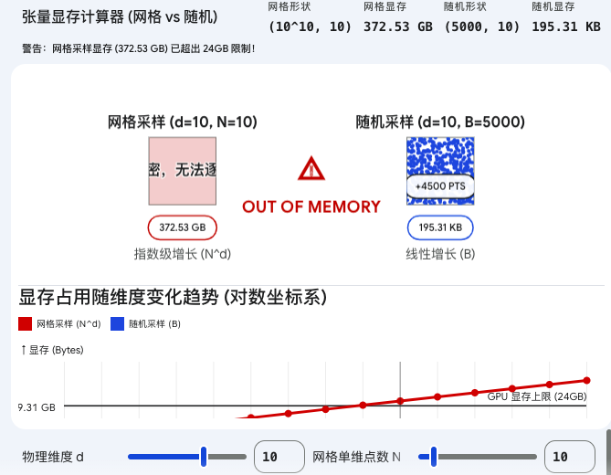

要把这个问题彻底想透，我们必须从抽象的数学概念中抽离出来，直接去算 PyTorch 底层的张量形状（Tensor Shape）和显存字节数（Bytes）。所有的“维度爆炸”最终都只是一道极其直白的乘法题。

假设我们正在处理一个 $d$ 维的物理系统（例如包含空间坐标 $x, y, z$ 和时间 $t$ 的场景，此时 $d=4$）。

如果你采用“均匀网格”策略，你必须在代码里指定每个维度要切分多少个点，我们设这个基数为 $N$。为了覆盖整个定义域，系统会自动生成所有维度的笛卡尔积组合。这就导致输入张量必须包含 $N^d$ 个样本点，每个点拥有 $d$ 个特征数值。因此，在网格采样下，你的输入张量形状被严格数学规则锁定为 `(N^d, d)`。

我们把具体的工程数字代入这个形状。假设你在做一个并不算极端的 10 维问题（$d=10$），为了保证网格有一丁点起码的密度，我们在每个维度仅仅取 10 个点（$N=10$）。此时张量的形状变成了 `(10^10, 10)`，也就是整整一千亿个浮点数。在 PyTorch 的默认设置下，一个单精度浮点数（Float32）在显存中占用 4 个字节。我们把这个张量推入 GPU 时，它占据的显存等于 $10^{10} \times 10 \times 4$ 字节，大约是 372 GB。目前顶配的消费级或工业级单卡 GPU（如 RTX 4090 或 A100）显存通常只有 24GB 到 80GB。这意味着在 `model(x)` 执行的前向传播瞬间，显存会被直接击穿，程序立刻抛出 Out of Memory (OOM) 崩溃。这就是“维度灾难”的工程真面目——内存需求随物理维度呈不可理喻的指数级暴涨。

随机采样之所以能破解这个死局，是因为它从底层机制上切断了“样本总数”与“物理维度”的指数绑定。

在随机采样策略下，我们放弃了一次性铺满整个高维空间的幻想。我们转而在代码中强行写死一个常数：批量大小（Batch Size，设为 $B$）。每次迭代时，我们在多维空间中完全随机地生成 $B$ 个坐标点。此时，不管物理维度 $d$ 是多少，输入张量的前向传播形状永远被固定为 `(B, d)`。

我们可以对比一下后果。如果你设定 Batch Size $B=1000$，同样面对 $d=10$ 的高维难题，这个随机张量的形状仅仅是 `(1000, 10)`。它总共只有一万个元素，占用显存约为 40 KB。在这里，$B$ 和 $d$ 不再是恐怖的指数关系，而是温和的线性乘法关系。只要你把 $B$ 握在手里不乱调，无论物理方程有多复杂，你的计算图内存占用就永远恒定，绝对不会发生显存爆炸。

但是，这种绝对的内存安全是有昂贵代价的。在拥有 $10^{10}$ 个网格交叉点的庞大空间里，单次迭代只随机抽取 1000 个点，这就像在太平洋里撒下了一张洗脸盆大小的网。神经网络在每一次 Epoch 中看到的物理约束空间极其稀疏且碎片化。

因此，随机采样本质上是一种“用训练时间换取显存空间”的工程设计。PINN 被迫将防守的压力转移给了漫长的训练循环。我们需要跑几万甚至几十万个 Epoch，让这 1000 个随机配点在每一次迭代中不断变换位置，像布朗运动一样在训练的漫长岁月里逐渐游走并覆盖整个高维空间。

