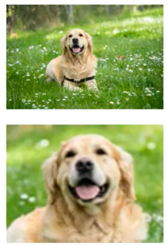

虽然卷积神经网络（CNN）凭借“局部连接”和“权重共享”在图像处理领域大放异彩，但它的底层设计也决定了它存在两个致命的局限性：**难以处理放大/缩小后的图片**和**难以处理翻转/旋转后的图片**。

结合我们刚才的讨论，我们可以从 **过滤器（Filter）的物理本质** 来直观理解为什么它处理不了这两个问题：

### 局限一：难以处理图像的放大与缩小（尺度问题）

核心原因：**过滤器的尺寸是固定的**。

CNN 提取特征的工具是固定尺寸的“过滤器”（如 $3 \times 3$ 的矩阵）。这种固定尺寸的窗口，导致它在面对图像缩放时会遭遇“底层地基坍塌”的问题。 

*   **微观层面（底层特征提取失效）：**
    假设你的第一层网络学会了用 $3 \times 3$ 的过滤器识别“细长边缘”。如果你把图片放大 10 倍，原来的一条细线就变成了一个宽阔的色块。当 $3 \times 3$ 的过滤器扫过这个巨大色块的中间时，它根本看不出这是边缘，什么特征也提取不出来。
*   **宏观层面（大感受野的无力）：**
    虽然随着网络加深，高层神经元的“感受野”变得很大，能覆盖整张图片，但 **CNN 是一层层串联的流水线**。如果第一层（底层）因为图像放大而无法提取出正确的边缘特征，那么传给高层的数据就是一团糟。这就好比建楼，地基（底层特征）全毁了，你在顶楼视野再好（感受野再大），也拼凑不出正确的宏观物体。

很多时候我们会认为，只要网络足够深、感受野（Receptive Field）足够大，CNN 就能统揽全局，从而解决问“图像放大”的题。但这其实是一个错觉。**大感受野只解决了“看得远”的问题，但底层的固定大小过滤器限制了它“看得懂微观变化”的能力。**

### 局限二：难以处理图像的旋转与翻转（方向问题）

核心原因：**过滤器里的权重矩阵具有“绝对的方向性”。**

CNN 学习到的不仅是“形状”，更是“带有绝对方向和绝对位置的形状”。

*   **微观层面（权重矩阵的方向性）：**
    过滤器里的数字（权重）是有绝对方向的。一个专门用来检测“垂直边缘”的过滤器，如果遇到被旋转了 90 度的图片（垂直边缘变成了水平边缘），两者的乘积激活值会非常低，相当于网络突然“变成了瞎子”。
*   **宏观层面（空间组合逻辑的僵化）：**
    即使我们假设高层神经元拥有极大的感受野，把整个旋转后的物体都看在了眼里，它依然会误判。因为高层特征是由底层特征按**绝对位置**组合而成的。当你把图片倒过来（旋转 180 度）时，哪怕高层神经元的感受野足够大，能把整个倒过来的脸都框进去，但此时“嘴巴特征”跑到了上方，“眼睛特征”跑到了下方。这与它学习到的绝对空间位置逻辑（上眼、中鼻、下嘴）发生了严重冲突。因此，高层神经元依然不会被激活。

---

### 总结

概括来说，CNN 的局限性本质在于：**它过度依赖固定尺寸的微观窗口来死记硬背特征，并且极其依赖特征在二维平面上的绝对空间位置。** 

只要这种底层机制不改变，单纯增加网络深度、扩大感受野，都只是“治标不治本”。这也是为什么在实际工程中，我们必须依赖**数据增强**（把放大、缩小、旋转的图片都喂给模型让它重新学一遍），或者**引入全新的网络架构**（如特征金字塔 FPN、空间变换网络 STN，甚至抛弃卷积使用 Vision Transformer）来弥补这些天生缺陷的原因。

#### 现实中怎么解决这个问题？

既然标准 CNN 有这个硬伤，我们在实际的深度学习工程中是怎么弥补的呢？通常有两大招：

1.  **大力出奇迹（数据增强 Data Augmentation）**：
    这是最简单粗暴但也最有效的办法。在训练阶段，我们人为地把训练集里的图片进行随机的放大、缩小、旋转、翻转。
    *原理*：把放大、缩小、旋转的图片都喂给模型让它重新学一遍
2.  **引入新的网络结构**：
    学者们后来对 CNN 进行了改良。比如发明了**空间变换网络（Spatial Transformer Networks, STN）**。这类网络在做卷积之前，会先加入一个特殊模块，判断图片是不是歪的或者缩放过的，先在网络内部把它“摆正”、“拉平”，然后再交给后面的卷积层去处理。或者使用**特征金字塔（Feature Pyramid Networks, FPN）**，在多个不同缩放比例的层级上同时进行特征提取。

> ❓ **提问：即使样本中有不同的大小的特征，如果在验证集上的输入特征比原来的训练的大或者小，就会有模型偏差。现实世界中很难穷举所有大小的某个特定特征，那CNN的局限性是不是太大了，或者说工程作用太低了？**
>
> > 📖 回答：如果在训练集里，模型见过了缩小 $0.5$ 倍的猫，也见过了放大 $2.0$ 倍的猫。那么当验证集中出现一只放大 $1.2$ 倍的猫时，模型是不需要重新死记硬背的。它凭借内部参数的连续性，能够进行 **“插值泛化”。****数据增强（Data Augmentation）的意义不在于“穷举大千世界的所有尺寸”，而在于“画出一个边界”** 。只要现实中的样本落在这个尺寸边界内，CNN 就能靠泛化能力搞定。
