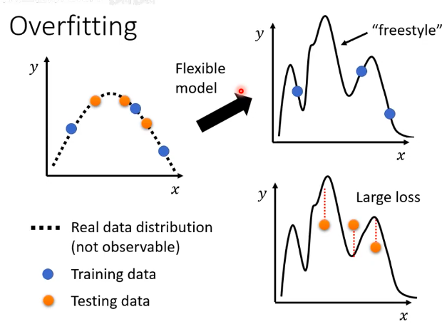
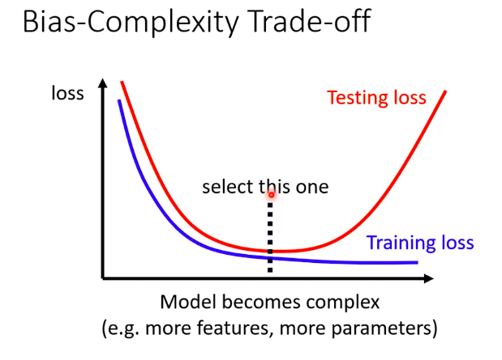

机器学习的终极目标非常明确：**不仅要在见过的数据（训练集）上表现好，更要在没见过的新数据（测试集/真实世界）上表现出色。**

这张图为你清晰地规划了，当模型“不听话”时，作为架构师，你应该按照什么顺序去排查问题。让我们一步步拆解这份攻略：

---

### 第一步：检查“课堂测验”成绩（Loss on training data）

作为架构师，当你把数据喂给模型，并设定好损失函数（Loss）后，你首先要看的是**它在训练数据上的误差（Loss on training data）**。这相当于问：这个学生连平时发给他的复习资料，学明白了吗？

**情况 A：课堂测验成绩很差（Loss is large）**
如果模型连已经给它 **看过无数遍的训练数据** 都预测不准，说明它“上课根本没听懂”。这时有两个嫌疑犯：

1. **模型偏差 (Model Bias)：也就是常说的“欠拟合 (Underfitting)”。**
   * **诊断：** 你给的函数模板太简单了，**通过模版找到的$θ$中有$θ_1$, $θ_2$,$θ_3$,...,$θ_n$，但是最后的$f_θ^*(x)$的到数据也和真实数据有很大的误差，换句话说，现有模型最好的参数也无法得到比较低的Loss**。比如真实世界的数据是复杂的波浪线，你非要让机器用一条直线 $y = wx + b$ 去套，它怎么找都找不对。
   * **解法：** **Make your model complex（增加模型复杂度）**。给它更强大的函数模板，比如引入高次多项式 $x^2, x^3$，或者搭建更深层的神经网络，让它有能力去描绘更复杂的曲线。

2. **优化问题 (Optimization)：**
   * **诊断：** 你的模型其实够复杂，但是寻找最优参数的“引擎”（优化算法）卡住了，它走到半山腰就以为到了谷底（陷入了局部最优解），没法继续降低误差。
   * **解法：** 这需要调整优化器的策略（比如调整学习率，换一种更聪明的下山算法），这是进阶课程的重点。

> **实践：**   
> 当我设计一个简单模型之后，发现没有好的loss，此时为了区分是欠拟合还是优化问题，我先设计一个复杂模型，如果复杂模型的loss比简单模型的高 ，那么就是优化问题。如果loss变低了，如果足够低我用新数据测试进入第二步。如果还不够低，我用前面的方法重复进行，直到找到合适的模型
> > 
> > 作为设计者，当你搭建一个复杂模型时，你其实是在扩大函数 $f$ 的“搜索空间”。简单模型可能只是在找一条直线：$y = w_1x + b$复杂模型可能是在找一条曲线：$y = w_2x^2 + w_1x + b$从数学原理上讲，复杂模型的搜索空间是完全包含简单模型的。如果机器真的绝顶聪明，它大可以把复杂模型中的 $w_2$ 设置为 $0$，这样复杂模型就“退化”成了一个简单模型。因此，在理论上，复杂模型在训练集上的表现，最差也就是和简单模型打个平手，绝不可能比简单模型更差。

---

### 第二步：检查“期末闭卷考试”成绩（Loss on testing data）

如果你的模型在课堂测验中拿了满分（**Loss on training data is small**），千万别急着高兴！作为架构师，你必须拿一批 **它绝对没见过的数据（Testing data）** 来考它。

**情况 B：期末考试成绩满分（Loss is small） -> 😊**
恭喜你！你的模型不仅学会了知识，还掌握了举一反三的能力。你可以直接把它部署上线了。

**情况 C：期末考试彻底考砸（Loss is large）**
这是机器学习中最让架构师头疼、但也最常见的现象：平时考 100 分，一到大考就不及格。这通常是两种原因导致的：

1. **过拟合 (Overfitting)：死记硬背的学霸。**
   * **诊断：** 你的模型太复杂了，复杂到它不仅记住了真正的规律，还把训练数据里的“噪音、偶然误差”全当成真理背了下来。换句话说，复杂模型的参数不同，即弹性很大，代表了直观的几何图形中training data 以外的其他地方千差万别，
   * **解法：**
     * **More training data / Data augmentation（提供更多数据 / 数据增强）：** 给它看海量的题库，freestyle部分就会去总结真正的规律。
     * **Make your model simpler —— less parameters / sharing parameters （让模型变简单/减少参数/共享参数）：** 拿掉一些复杂的参数，限制它的弹性。
     * *注意上图左下角的红色虚线*：**Trade-off（权衡）**。架构师的一生，就是在“模型太简单（Bias）”和“模型太复杂（Overfitting）”之间寻找完美的平衡点。**一边盯着蓝线，一边盯着红线，在“太笨什么都学不会”和“太聪明导致死记硬背”之间，精准地找到那个 select this one 的临界点。**

2. **数据不匹配 (Mismatch)：超纲了！**
   * **诊断：** 你平时让他做的是初中数学题（训练集），期末考试突然考了高中物理题（测试集）。比如，你用全是在晴天拍的照片训练自动驾驶模型，然后把它放到暴风雨的黑夜里去测试。规律根本不一样，它当然会崩溃。

---

### 第三步：架构师的终极防线（图表最下方）

**Split your training data into training set and validation set for model selection（将数据拆分为训练集和验证集，用于模型选择）**。

**实际工程中的标准操作：**

你不能为了让“期末考试（Testing data）”及格，就反复偷看期末试卷来修改模型，这就作弊了，到了真实世界依然会惨败。
所以，架构师会从平时的复习资料（总训练数据）里，偷偷藏起一部分作为**“模拟考卷”（验证集 Validation set）**。我们用训练集教机器，用验证集来调整模型的复杂度（对付过拟合），等到一切都调整完美了，才去迎接最终真正的、只有一次机会的期末考试（测试集）。

### 架构师的模型诊断与选择五步曲（V2.0 完全版）

**第一步：物理隔离，划分“三套考卷”（Data Splitting）**

在你写下第一行模型代码之前，必须先将手头的数据冷酷地切分成三份：

* **训练集 (Training Set) —— 课后练习题：** 供模型反复观看、计算梯度、更新参数。
* **验证集 (Validation Set) —— 考前模拟卷：** 模型在训练时绝对不能用它来更新参数，只能用来“偷偷”测试它当前的泛化水平。
* **测试集 (Testing Set) —— 终极期末大考：** 锁进保险柜，直到项目上线的最后一天才能拿出来做最终评估。

**第二步：打通学习能力，排除“训练障碍”（解决欠拟合与优化问题）**

这一步的目标仅仅是**证明模型有能力把练习题做对**（也就是让蓝线下降）。

* 先上简单模型（基线）。
* 若训练 Loss 降不下来，引入复杂模型试金石。
* 对比判断是“模型太笨（模型偏差）”还是“下山迷路（优化问题）”，通过增加参数或更换优化器，**直到训练集 Loss 呈现稳步下降的趋势**。

**第三步：双线监控，寻找“黄金拐点”（The Sweet Spot）**
当模型展现出学习能力后，真正的博弈开始了。你不能只盯着训练集的蓝线，必须同时绘制验证集的红线。

* 随着你不断增加模型复杂度（或者增加训练的轮数/时长），蓝线（训练 Loss）会一直无脑下降。
* 此时，你要死死盯住红线（验证 Loss）。一开始红线也会跟着降，但**只要红线触及谷底，并开始出现向上反弹的迹象**，警报立刻拉响！这意味着模型的大脑容量已经开始用来“死记硬背”练习题里的无用噪音了。

**第四步：果断“拍板”，锁定最佳模型（Model Selection）**

这是你作为架构师最核心的决策时刻：

* **不要管复杂模型在训练集上的 Loss 有多低！哪怕它能降到 0！**
* **退回到红线（验证 Loss）最低的那个时间点或那个复杂度状态。**
* 将那个处于“谷底”状态的模型（可能是一个中等复杂度的模型），定为你的最终候选人。

**第五步：最终验收，迎接真实世界（The Final Test）**

拿着你在第四步选出的、处于完美平衡点的模型，用锁在保险柜里的“测试集（Testing Set）”跑一次。

* 这时的 Testing Loss，就是你向客户、老板或者学术界报告的最终成绩。它客观反映了你的模型在真实世界中的真实水平。

---