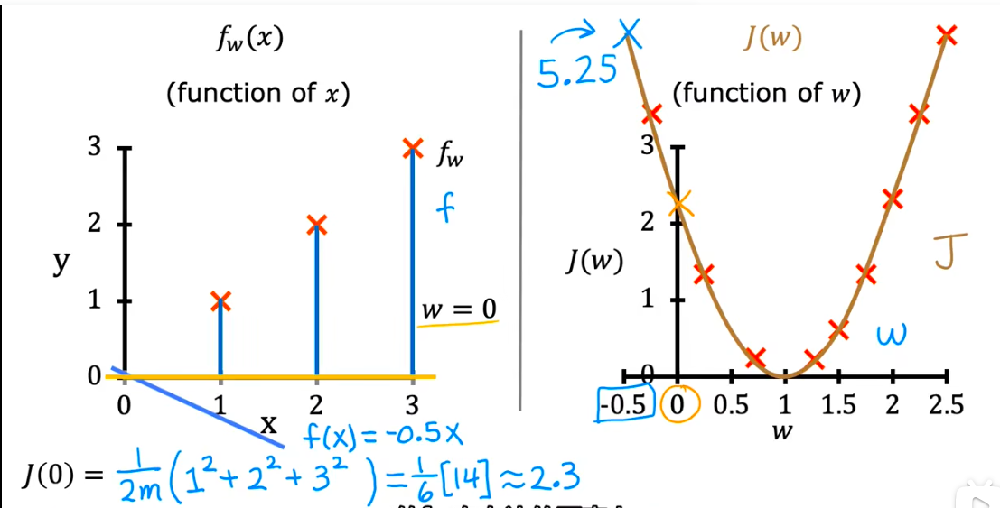
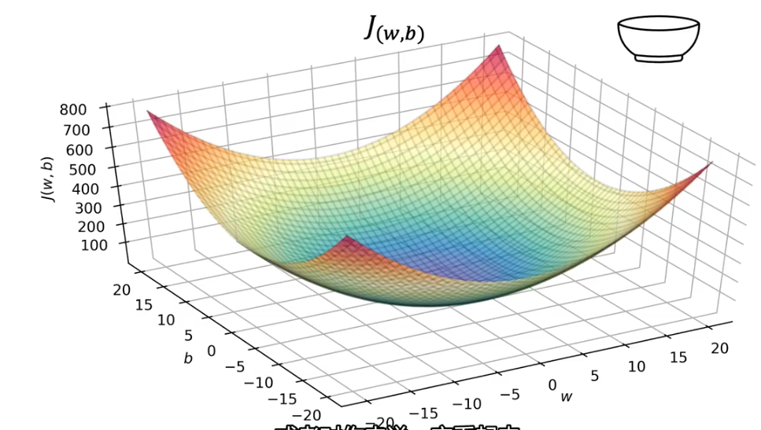

**代价函数** (Cost Function，有时也叫**损失函数** Loss Function)」！

## 第1部分：建立认知（Why & What）

### 🎯 1.1 问题动机：还原发明者面对的困境现场 💡 核心必学

**假设你面临这样一个真实困境：**

你写了一个预测房价的线性回归模型。一开始，为了判断模型好不好，你（人类）把模型画的那条直线显示在屏幕上，用**肉眼去“看”**。
第一天，只有 10 个数据点，你一眼看过去：“嗯，直线穿过了大部分点，挺准的。”
第二天，你的业务做大了，屏幕上有 10 万个房产数据点，密密麻麻像一团乱麻。你的模型给出了 5 条不同的直线候选。你盯着屏幕看了 3 个小时，眼睛都看花了，根本无法肉眼分辨哪条直线总体上“更贴合”这 10 万个点。你试图写一条规则：“如果 80% 的点离直线很近就是好模型”，但电脑问你：“多近算近？误差 1 万和误差 2 万怎么权衡？”

**发明压力（逻辑死路）：**

旧方法必然失败，因为它的根本假设是：**“人类可以通过主观视觉或模糊的业务感觉，来评判一个模型的优劣”**。
现实是，电脑没有视觉，不懂“差不多”，面对高维海量数据，人眼也会瞬间瘫痪。这意味着，我们必须放弃 **“由人类主观评判模型好坏”** 这个前提。

**范式跳跃：**

代价函数让我们从 **“人类用肉眼和直觉看模型准不准”** 变成了 **“定义一个冷酷无情的纯数学公式，算出一个代表‘当前模型有多烂’的绝对数字”**。

---

### 🗺️ 1.2 概念地图：它在 ML 知识体系中的位置 💡 核心必学

它连接着算法和最终的优化，是极其关键的桥梁：

```text
ML 知识体系
│
├─ 算法模型 (如：线性回归，负责产生预测值 y-hat)
│
├─ 代价函数 (Cost Function) ← 你在这里 (负责打分)
│   ├─ MSE (均方误差，专门给"回归"算账)
│   └─ Cross-Entropy (交叉熵，专门给"分类"算账)
│
└─ 优化器 (如：梯度下降，负责根据代价函数的分数去纠正模型)

```

---

### 📚 1.3 前置概念补充：使用前必须知道的基础 💡 核心必学

──────────────────────────────────      
📖 **前置概念回顾：$y$ 与 $\hat{y}$**        
──────────────────────────────────      

- **真实标签 ($y$)**：老天爷/人类给的标准答案（如：房子真卖了 500 万）。       
- **预测值 ($\hat{y}$)**：机器戴着帽子拍脑门猜的答案（如：机器猜能卖 480 万）。   
- **关系**：代价函数的唯一工作，就是对比这两个数字，看看它们差了多远。 

──────────────────────────────────    

---

### 💡 1.4 直觉建立：结构翻转与代价揭示 💡 核心必学

**生活类比：**

代价函数就像是**考卷的“扣分规则”**。学生（模型）交卷后，老师（代价函数）逐题核对预测值 $\hat{y}$ 和标准答案 $y$，然后算出“总扣分数”。**分数越低，说明学得越好。** 分数为 0，说明满分完美。

**结构翻转图：**

```text
旧范式（人工评判）：
[模型画的直线] + [人眼看数据分布] ──▶ [模糊的评价："这条线看起来挺顺眼"]

新范式（代价函数）：
[10万个真实的 y] + [10万个预测的 y-hat] ──▶ [代价函数公式] ──▶ [一个精确的烂度得分：Loss = 1450.2]

翻转的含义：评判权从“人类的主观视觉”彻底移交给了“机器的客观计算”，让自动化自我纠正成为可能。

```

**代价揭示：**

我们换来了 **“机器能够完全脱离人类，进行自动化、量化的自我优化”**，但必然失去的是 **“对具体错误原因的感知”**。  

这不是缺陷，而是数字压缩的必然代价。一个代价函数得分为 100，它可能是因为 100 个样本每个错扣了 1 分，也可能是 99 个样本全对，但第 100 个样本错得极其离谱扣了 100 分。代价函数只给你一个“总烂度”，不解释具体哪里烂，你需要其他诊断工具来排查。

---

### 🔢 1.5 数学解读：公式是直觉的速记符号 ⭐ 进阶选学

我们来看看回归问题中最著名的代价函数——**均方误差 (MSE, Mean Squared Error)**。也就是你上节课完美推理出来的那个“必须加平方”的逻辑！

**核心公式：**


$$J = \frac{1}{n} \sum (y - \hat{y})^2$$

**公式下方翻译对照表：**
- $J$ = 代价 (Cost) 或 损失 (Loss) 的总得分。
- $n$ = 数据点的总数（比如你有 10 个房子，n=10）。
- $\sum$ = 希腊字母西格玛，意思是“把所有东西加起来”（相当于 Excel 里的 SUM）。
- $y$ = 房子的真实成交价。
- $\hat{y}$ = 机器猜的房价。
- $(y - \hat{y})^2$ = 猜错了多少（误差），并**把它平方**（消除正负号，且重罚大错）。
- $\frac{1}{n}$ = 除以数量 $n$，意思是求“平均每个房子的扣分”。

**极端情况直觉验证：**

* **当公式结果为 0 时**：说明机器猜的 $\hat{y}$ 和真实的 $y$ 丝毫不差，每一项都是 0。这是极端的“完美拟合”（甚至可能是严重的过拟合）。
* **当公式结果无穷大时**：说明模型不仅猜错了，而且错得离谱到了外太空，平方之后误差被疯狂放大，此时机器会知道“我现在的参数错得离谱，必须赶紧大幅度调整”。

> **说明：** 采用均方误差而不是总平方误差的目的是，为了保证损失函数的结果不会随着训练集的变大而自动变大

──────────────────────────────────

### 🧠 边界预测测试

基于你刚才建立的逻辑（**代价函数是把所有误差汇总成一个“烂度得分”的阅卷机器**），试着推导：

1. **假设你用均方误差 (MSE) 作为代价函数来预测房价。现在数据里混进了一个录入错误：把一套 500 万的房子多打了一个零，写成了 5000 万（真实值 $y$）。当机器猜这套房子是 500 万 ($\hat{y}$) 时，代价函数算出来的这单笔扣分会是多少？这个庞大的分数会导致模型做出什么“委曲求全”的动作？**
2. **不同的业务可能需要定制不同的“扣分规则（代价函数）”。假设你在预测医疗疾病：机器猜错有两种情况：(A) 没病猜成有病（虚惊一场）；(B) 有病猜成没病（延误治疗致死）。如果用普通的 MSE，它对待这两种错误的扣分是一样的。如果你是代价函数的设计者，为了现实业务，你会怎么魔改这个数学公式？**

> 1. 录入错误（5000万异常值）：由于 MSE 会把误差平方，4500万的误差平方后是一个极其恐怖的天文数字。机器为了把这个天文数字压下来，会委曲求全地把整条直线死死拽向这个异常点，导致剩下的 99999 套正常房子的预测全军覆没！
> 2. 医疗误诊（不对称惩罚）：聪明的工程师会魔改公式！只要碰到“有病猜没病”的情况，就在误差外面乘以 10000 的重罚系数；“没病猜有病”只乘以 1。这逼着机器学会“宁可错杀一千，绝不放过一个”。


---


## 第2部分：理解与实践（How It Works & How to Use）

🔍 **前置知识回顾**
本阶段会用到以下概念（已在阶段1学过）：
- **$y$**：真实标签（人类给的标准答案）
- **$\hat{y}$**：预测值（机器给的答案）
- **均方误差 (MSE)**：把误差平方后求平均的代价函数。

### ⚙️ 2.1 工作原理：它内部是怎么运转的 💡 核心必学

代价函数自己不能改变模型，它是配合着“优化器”一起形成了一个**自动化学习闭环**。

**完整工作流程图：**

```text
[输入：特征数据 X]
    │
    ▼
[模型进行前向计算 (Forward)] ──▶ 算出了一批预测值 y-hat
    │
    ▼
[代价函数进行严厉阅卷] 
对比 y 和 y-hat，经过公式计算 ──▶ 产出烂度得分：Loss = 850.5
    │
    ▼
[优化器登场 (Optimizer)]
根据 Loss 的大小和方向，计算该怎么调整公式里的系数 (w 和 b)
    │
    ├─ 如果 Loss 还在下降 ──▶ [更新系数，重头再算一遍]
    └─ 如果 Loss 降到谷底不动了 ──▶ [训练结束，模型收敛！]

```


（这里代价函数是二维的，是因为假装公式是 $y = w \cdot x$，彻底忽略了偏置参数 $b$。如果考虑 $b$，线性回归模型下的代价函数是三维的，因为有两个特征，如下：）




*注：代价函数只负责“打分”，真正去“改错”的是优化器（比如最著名的梯度下降法，这会是另一个独立话题）。*

---

### 💻 2.2 代码实战：从零跑出第一个结果 💡 核心必学

在真实工程中，我们不需要手写复杂的微积分，Python 的工具库已经帮我们把代价函数封装成了极简的调用。

我们用代码来算一算两套模型（好模型 vs 烂模型）的代价得分对比。

```python
import numpy as np
# 导入 Scikit-learn 里的代价函数评估工具
from sklearn.metrics import mean_squared_error

# ── 第1步：准备阅卷数据 ──────────────────────────────
# 3套房子的真实成交价（标准答案 y，单位：万）
y_true = np.array([300, 450, 600])

# ── 第2步：收集模型的考卷 ───────────────────────
# 模型A（好学生）的预测结果 y-hat
y_pred_A = np.array([290, 460, 595]) 

# 模型B（差学生）的预测结果 y-hat
y_pred_B = np.array([200, 300, 800]) 

# ── 第3步：代价函数（MSE）无情打分 ──────────────────────────────────
# 说明：只需传入真实值和预测值，机器瞬间算完平方误差的平均值
cost_A = mean_squared_error(y_true, y_pred_A)
cost_B = mean_squared_error(y_true, y_pred_B)

print(f"好学生的代价得分 (MSE): {cost_A:.1f}")
print(f"差学生的代价得分 (MSE): {cost_B:.1f}")

# 预期输出：
# 好学生的代价得分 (MSE): 75.0   (误差小，得分低)
# 差学生的代价得分 (MSE): 24166.7 (错得离谱，得分爆炸)

```

---

### ✅ 2.4 工程规范：写出"能过 Code Review"的 ML 代码 🔥 实战必备

在评估模型代价（Loss）时，新手极易犯下自欺欺人的错误。

🔴 **RED（强制规范）：绝对不能只看训练集上的代价得分！**

* **违反会导致**：过拟合未被发现。模型可能只是“死记硬背”了训练集，但在真实世界完全无效。
* **具体后果**：你向老板汇报模型的 Loss 已经降到了 0.01（完美），上线第一天却让公司亏了百万。

```python
# ❌ 错误做法：自欺欺人的阅卷
# 只测训练集，就像让学生做开卷考试，并且拿昨天的作业当期末考卷
training_loss = mean_squared_error(y_train_true, y_train_pred)

# ✅ 正确做法：必须对比训练集与测试集的双重代价
# 如果训练集 Loss 很低，但测试集 Loss 极高，说明模型在“背题”，必须进行干预！
train_cost = mean_squared_error(y_train, model.predict(X_train))
test_cost = mean_squared_error(y_test, model.predict(X_test)) # ← 这才是决定生死的真实得分！

```

---

### 🔄 2.5 工具对比：同类方法的选择指南 ⭐ 进阶选学

刚才我们说，MSE 遇到极端异常值（录入错误）时会崩溃。那现实中遇到脏数据怎么办？

其实，回归问题的代价函数不止 MSE 一种！遇到不同业务，我们需要选不同的“阅卷规则”。

**回归代价函数三剑客对比：**

| 对比维度         | 方案A：MSE (均方误差)    | 方案B：MAE (绝对误差)    | 方案C：Huber Loss        |
| --- | --- | --- | --- |
| 计算逻辑         | 误差的平方求平均         | 误差的绝对值求平均       | 误差小用平方，误差大用绝对值|
| 对异常值敏感度   | 🔴 极度敏感（会被带偏）  | 🟢 不敏感（无视极端值）  | 🟡 比较平衡              |
| 求解容易程度     | 🟢 数学上极其平滑，极快  | 🟡 有个拐角，求解略慢    | 🟡 计算较复杂            |
| 推荐场景         | 数据很干净，惩罚大误差时 | 脏数据极多，无法清理时   | 工业界深度学习通用折中方案|

**决策树选型：**

```text
你的数据里有没有无法剔除的、极端的脏数据/异常值？
    │
    ├─ YES ──▶ 对训练速度要求极高吗？
    │               ├─ YES ──▶ 选 MAE (绝对误差)
    │               └─ NO  ──▶ 选 Huber Loss
    │
    └─ NO  ──▶ 闭着眼睛选 MSE (均方误差)

```

──────────────────────────────────

### 🧠 边界预测测试

基于以上逻辑，试着回答这两个触及灵魂的问题：

1. **假设你在预测送餐骑手的送达时间。平时误差在 1~3 分钟，但偶尔会有极个别骑手出了车祸，迟到了 120 分钟。如果用 MSE 作为代价函数，模型为了迎合这几个 120 分钟的特例，会不会导致它对全城所有正常订单的预测时间都普遍偏长？**
2. **基于第 1 题的现象，对照上面的表格，如果由你来重新设定代价函数，你会把 MSE 换成哪一个？为什么？**

> 1. **会被拉偏**：由于 MSE 的“平方”特性，120分钟误差的惩罚是 14400！为了把这个巨大的惩罚降下来，机器会“委曲求全”，把全城所有正常订单的预测时间都偷偷加上几分钟。结果就是，正常订单的预测全废了。
> 2. **换成 MAE**：绝对正确！看我们上节课的决策树，面对无法剔除的极端异常值（车祸迟到），换成 **MAE（绝对误差）** 是最完美的。它只算绝对值（120），不再把大错放大，从而保全了 99% 的正常订单。

──────────────────────────────────

## 第3部分：避坑与进阶（What to Avoid & Beyond）

🔍 **前置知识检查**
本阶段会用到：
- **MSE (均方误差)**：回归最常用的代价函数。
- **分类问题**：预测“是”或“否”（0 或 1），而不是具体数字。

### ⚠️ 3.1 常见陷阱：高频故障排查 🔥 实战必备

**陷阱 1：Loss 爆炸成 NaN (Not a Number)**

💥 **现象**：

模型刚开始训练，屏幕上打印的 Loss（代价得分）是 `1450`，下一轮变成了 `9999999`，第三轮直接变成了 `NaN`。模型彻底死机，静默失效。

🔍 **根本原因**：

**计算机的内存被“撑爆”了（数值溢出）。**
如果你预测的房价是原价（如 5,000,000 元），初始模型稍微猜错了一点（猜成 3,000,000 元）。误差是 200 万。当你用 MSE 把 200 万**平方**时，得出的数字是 4,000,000,000,000！这个数字超出了 Python 浮点数能记录的最大上限，直接崩溃变成 `NaN`。

❌ **错误代码**：

```python
# ❌ 错误示范：直接用极其巨大的原始数字算 MSE
y_true = [5000000.0, 8000000.0]
y_pred = [2000000.0, 9000000.0]

# 这一步内部的平方运算极易在复杂网络中导致内存溢出
loss = mean_squared_error(y_true, y_pred) 

```

✅ **修复方案**：

必须先对目标值 $y$ 进行**降维打击（缩放或取对数）**。

```python
# ✅ 修复版本：把“元”换算成“百万”，或者取对数
import numpy as np
from sklearn.metrics import mean_squared_error

y_true_millions = np.array([5.0, 8.0]) # 500万变成5
y_pred_millions = np.array([2.0, 9.0]) # 200万变成2

# 现在平方后的误差只是个位数，绝对安全！
safe_loss = mean_squared_error(y_true_millions, y_pred_millions)

```

🛡️ **如何从源头预防**：
只要你的目标值 $y$ 超过了万级别（房价、大盘交易量等），永远记得先除以一个大数，或者用 `np.log1p()` 取对数。

---

**陷阱 2：张冠李戴（用 MSE 做分类任务的代价函数）**

💥 **现象**：
你在做一个预测“是否是垃圾邮件（0或1）”的分类模型。训练了很久，Loss 降不下去，准确率卡在 50%（和抛硬币一样）。

🔍 **根本原因**：
MSE 的数学几何形状像一个“平滑的大铁锅”，它假设世界是连续的。如果你硬拿它去评估“非黑即白”的 0 和 1（分类问题），这个“大铁锅”就会变得坑坑洼洼，充满无数个“局部深坑”。机器（优化器）在找最低点时，会被困在半山腰的浅坑里出不来。
**回归任务用 MSE，分类任务必须用交叉熵 (Cross-Entropy)！** 这是机器学习界的铁律。

❌ **错误代码**：

```python
# ❌ 错误示范：给分类问题用了回归的阅卷规则
from sklearn.metrics import mean_squared_error

y_true_spam = [1, 0, 1]           # 标签是离散的类别
y_pred_prob = [0.9, 0.1, 0.8]     # 机器猜的概率

# 错误！MSE 不能用来给概率打分！
wrong_loss = mean_squared_error(y_true_spam, y_pred_prob) 

```

✅ **修复方案**：

```python
# ✅ 修复版本：使用针对分类量身定制的"对数损失/交叉熵" (Log Loss)
from sklearn.metrics import log_loss

y_true_spam = [1, 0, 1]
y_pred_prob = [0.9, 0.1, 0.8]

# 正确！这是专门为 0/1 概率预测设计的阅卷规则
correct_loss = log_loss(y_true_spam, y_pred_prob) 

```

---

### 🧪 3.2 调试手册：模型不工作时怎么排查 🔥 实战必备

当你盯着屏幕上的代价得分（Loss）变化时，请对照这张“心电图诊断表”：

```text
监控训练集 Loss 的变化趋势：
    │
    ├─ Loss 一直降不下来，数值很大？
    │       │
    │       ├─ 检查你是不是选错代价函数了？（比如分类用了 MSE）
    │       └─ 检查特征是不是太弱了？（机器实在找不到规律）
    │
    ├─ Loss 突然变成了 NaN？
    │       │
    │       └─ 数据溢出：目标值 y 绝对数值太大，忘了做缩放。
    │
    └─ 训练集 Loss 降到接近 0，但测试集 Loss 突然暴涨？
            │
            └─ 严重过拟合：模型在“死记硬背”标准答案！
               解决：减少特征、换更简单的模型、收集更多数据。

```

──────────────────────────────────

### 🎓 实战挑战（代价函数结业考核）

恭喜你！你已经打通了关于“代价函数”的所有底层逻辑！
现在，请接受最后一次考验。如果能找出下面代码的破绽，你就能在一众初级工程师里脱颖而出。

**场景**：
你们公司在做一个“二手名表估价”系统。数据库里有 1000 块普通二手表（均价 1~5万），但昨晚录入员不小心混进了一块全球限量版百达翡丽，真实成交价写着 **2000 万**。
实习生写了下面这段代码来评估他的估价模型：

```python
import numpy as np
from sklearn.metrics import mean_squared_error

# 1000个普通表 + 1个极端的限量版百达翡丽
# 注意：没有做任何数据缩放处理
y_true_prices = np.array([12000, 15000, 45000, ..., 20000000]) # 真实价格
y_pred_prices = np.array([11000, 16000, 40000, ..., 1000000])  # 模型预测价格

# 实习生选择了 MSE 作为代价函数
total_loss = mean_squared_error(y_true_prices, y_pred_prices)

print(f"当前模型的代价得分是: {total_loss}")
# 实习生抱怨："师傅，我调了一晚上了，这个 Loss 一直降不下来，普通表的预测也越来越离谱了！"

```

📝 **提交你的答案，我会进行代码评审**：

作为导师，请指出实习生的做法面临哪 **2 个巨大的雷区**？（提示：结合 3.1 节的 `NaN` 爆炸风险，以及上一节讲过的“被异常值带偏”的直觉）。你会建议他用哪两行代码或思路来修复这个问题？

（提交你的诊断，我将为你进行结业点评并颁发最优解方案！🏆）