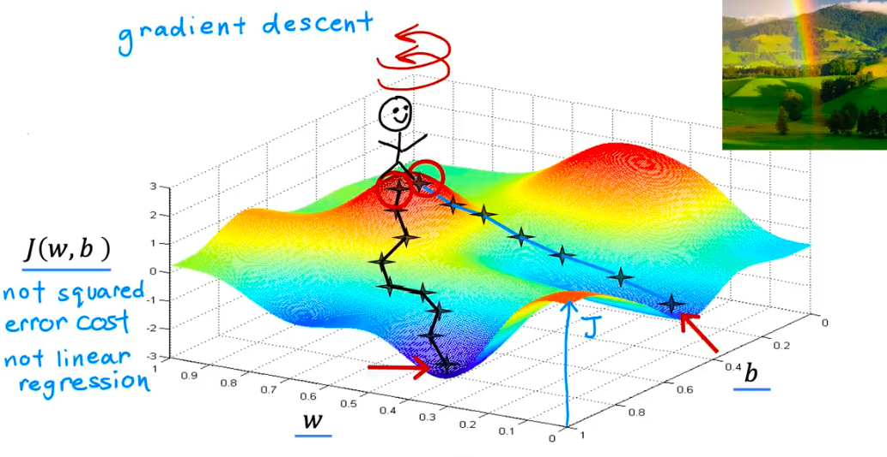

## 第1部分：维度大爆炸（从 3D 铁锅到千亿维宇宙）

### 🎯 1.1 问题动机：还原发明者面对的困境现场 💡 核心必学

**困境重建：**
上一节课，我们用 1 个特征（面积），得到了 $w$ 和 $b$ 两个旋钮，加上代价得分 $J$，画出了一个 3D 的大铁锅。    

现在，假设你要预测北京的房价。你不可能只看面积，你必须引入：面积、房龄、距离地铁的米数、楼层、周边学校数量…… 假设你有 **10 个特征**。        

此时，你的公式变成了：$y = w_1x_1 + w_2x_2 + ... + w_{10}x_{10} + b$   

现在你手里有 **11 个旋钮**需要调！加上代表高度的代价 $J$，这个“铁锅”存在于一个 **12 维的宇宙**中。   

如果你去做现在最火的大语言模型（比如我，Gemini），我的脑子里有**上千亿个参数（旋钮）**。       

**发明压力：**

人类的肉眼和三维空间想象力在这里彻底失效。这逼迫科学家必须放弃 **“试图把模型可视化出来去寻找规律”** 这个妄念。

**范式跳跃：**

维度大爆炸让我们从 **“依靠人眼看图找谷底”** 变成了 **“完全信仰并依赖微积分的数学触觉”**。

---

### 💡 1.4 直觉建立：结构翻转与代价揭示 💡 核心必学

**维度升级地图：**

```text
特征数量      旋钮数量 (参数)     代价函数的宇宙维度    人类感受
│             │                   │                    │
├─ 1个特征 ──▶ w, b (2个)   ──▶   3 维大铁锅 🍲    ──▶ "哇，好直观，像个碗"
│
├─ 2个特征 ──▶ w1,w2, b(3个) ──▶  4 维空间 🌌      ──▶ "脑子开始发热，无法想象"
│
├─ 10个特征 ─▶ 11 个参数    ──▶   12 维超空间 😵‍💫   ──▶ "人类视觉彻底死机"
│
└─ 深度学习 ─▶ 1000亿个参数 ──▶   1000亿+1维深渊 🕳️ ──▶ "只有微积分能在这里存活"

```

**代价揭示：**
我们用高维模型换来了**“逼近现实世界无限复杂规律的能力”**，但必然失去的是 **“大铁锅的光滑与美好”**。
这不是危言耸听。在 3 维大铁锅里，只有一个绝对的谷底（全局最优解）。但在 1000 亿维的宇宙里，代价函数的表面像月球坑一样，布满了无数个假谷底（局部最优解，Local Minima）和极其诡异的马鞍面（Saddle Points）。机器在下山时，极容易掉进一个小坑里以为自己到了终点，从而导致模型训练失败。

---

### 🌍 为什么要信仰“梯度下降”？

现在你彻底明白吴恩达教授画那张图的良苦用心了吧？
因为无论维度是 3 维还是 1000 亿维，**微积分求导数（算梯度/算斜率）的法则永远成立！**

蒙眼下山的机器虽然看不见 1000 亿维的世界长什么样，但它只要在脚下算一下梯度，微积分就会极其冷酷地告诉它：“往左前方 35 度、加上第 8 万个维度的右侧 12 度方向……那个方向最陡。”
然后，机器只管**闭着眼睛，迈出一步（乘以学习率 $\alpha$）** 即可。但是步子大小究竟会引发什么致命血案。这也是全世界所有算法工程师每天都在与之搏斗的终极怪物：

1. 跨栏陷阱（步子太大，$\alpha = 1.0$）：蒙眼的人站在 $U$ 型谷底的左侧半山腰，顺着斜率猛跨一大步，结果直接飞跃了谷底，落在了右侧更高的山坡上！到了右侧，斜率更陡了，他又往左猛跨一步，飞得更高…… 最终，他像一颗弹珠一样在锅里左右横跳，最后直接飞出了大铁锅！
   - **工程后果：** 模型的代价得分（Loss）不仅没降，反而一轮比一轮高，最后直接爆炸变成 NaN。这叫模型发散 (Divergence)。
2. 蚂蚁陷阱（步子太小，$\alpha = 0.0000001$）：蒙眼的人顺着斜率，每次只挪动一毫米。
   - **工程后果：** 本来 10 分钟能训练完的模型，现在需要在昂贵的 AWS 云服务器上跑整整 3 个月。老板看着燃烧的几十万账单会直接把你开除。而且，如果在下坡路上遇到一个小水坑（局部最优解），因为步子太小，他一脚踏进去就再也出不来了。

不过在 1000 亿维的宇宙里，**代价函数的表面像月球坑一样，布满了无数个假谷底（局部最优解，Local Minima）和极其诡异的马鞍面（Saddle Points）**。机器在下山时，极容易掉进一个小坑里以为自己到了终点，从而导致模型训练失败。

