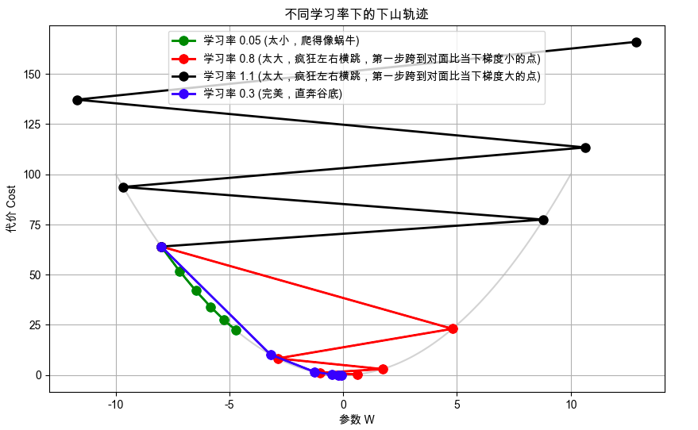
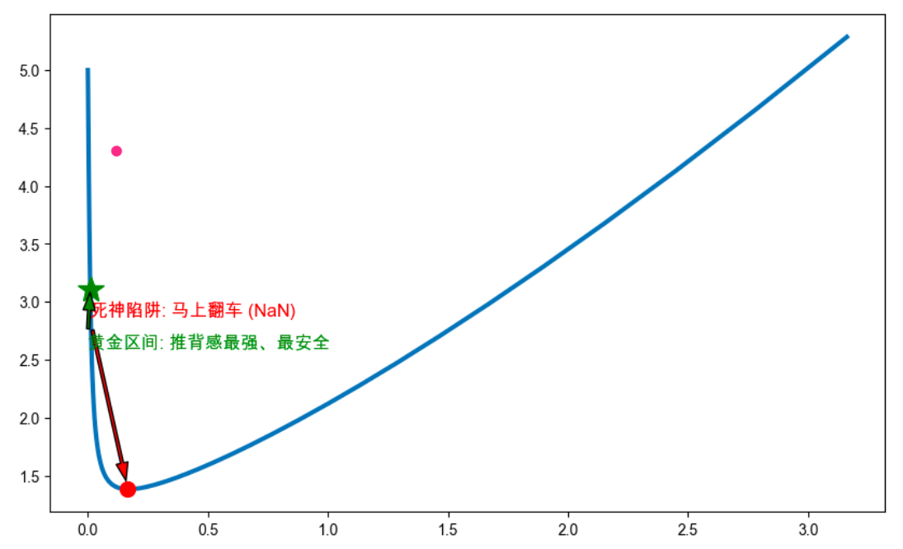

## 第1部分：搞清楚它是什么、为什么需要它（Why & What）

### 🎯 1.1 没有它之前，人们是怎么挣扎的？ _💡 核心必学_

**① 还原当时的麻烦：人们在哪一步被卡死了？**        
在刚发明梯度下降时，工程师遇到过一个致命麻烦：微积分算出来的“坡度（梯度）”是一个绝对的数学数值。比如在某座陡峭的山上，算出来的梯度是 `1000`。       
如果不加任何限制，公式就是：`新位置 = 旧位置 - 1000`。      
但问题是，这个参数的最优值可能只在 `0` 到 `1` 之间！机器因为感受到了极大的坡度，一脚迈出去了 `1000` 这么远的距离，直接跨越了整个山谷，飞到了另一座山上。在这一步，系统设计者被卡死了：**原生态的数学导数（坡度）往往大得离谱，直接拿来用会瞬间摧毁模型。**

**② 是什么让人不得不换一种思路？**      
“纯粹的数学坡度”在遇到陡峭地形时会导致毁灭性的步子。这意味着必须放弃 **“直接把坡度等同于步长”** 的幼稚假设，转而引入一个**人为设定的比例**，就是学习率，来强行缩放机器的步伐大小，**避免过度反应**

**③ 新旧方法的核心区别：哪个变量的位置被对调了？**      
学习率的出现，对调了机器行动的控制权：

* 旧方法：**直接把坡度当作步长**，机器完全按照这个数值走
* 新方法：**人类工程师设定的比例（如 1%）**来缩放坡度，机器按照这个缩放后的数值走

**④ 得到了什么，又必然失去了什么？**          
引入学习率后，机器的每一步都被人为设定的比例限制住了。它不能再因为感受到一个巨大的坡度而一脚跨出宇宙了。**这换来了对模型训练过程的绝对控制权和稳定性**，但必然失去**机器“全自动”寻找答案的便利性**，因为学习率是人为设定的超参数，**机器自己学不会它，你必须在训练前先拍脑袋定死一个数值**。当然，如果定错了，机器就会跟着遭殃。

**⑤ 什么情况下它会不管用？你来推导**        
基于以上逻辑，你现在应该能回答：
1. 如果我们身处一个极其平缓的“大平原”（原生态坡度只有 `0.0001`），而你又人为设定了一个极其保守的学习率（比如 `0.001`），这两个极小的数相乘，会导致机器的表现出现什么灾难？
    - 回答：机器每一步都非常小，训练时间无限长，Loss几乎不下降，模型永远学不会东西，也就是**训练停滞**
2. 为什么说“没有任何一个学习率能在所有数据面前都完美管用”？
    - 回答：因为不同的数据集、不同的模型架构、不同的训练阶段，都会导致原生态坡度的大小发生剧烈变化，更通俗的说，Loss地形一直在变。一个固定的学习率可能在某些阶段过大，导致震荡；在另一些阶段又过小，导致停滞。**没有万能的学习率**，必须根据具体情况调整

---

### 🗺️ 1.2 概念地图：它在 ML 知识体系中的位置 _💡 核心必学_

```text
ML 知识体系
│
├─ 模型训练核心要素
│   │
│   ├─ 代价函数 (Cost Function) （计分员）
│   │
│   ├─ 梯度下降 (Gradient Descent) （导航仪）
│   │   │
│   │   └─ 学习率 (Learning Rate, α) ← 你在这里！（导航仪上的速度调节旋钮）
│   │
│   └─ 优化器算法 (如 Adam) （自带智能变速箱的高级导航仪，能自动调学习率）
```

---

### 📚 1.3 学这个之前，你得先知道这几件事 _💡 核心必学_

──────────────────────────────────

📖 **前置概念：超参数 (Hyperparameter)**

- **是什么**：模型内部自己学不会，必须由程序员在点下“运行”按钮之前**手动输入**的死规定。
- **最小示例**：你要烤个蛋糕（训练模型）。面粉和糖的比例是模型自己通过试错找到的最佳配方（普通参数）；但烤箱的温度设为 180°C，是你人为拧的旋钮（超参数）。学习率就是那个温度旋钮。
- **为什么需要它**：区分了“机器的工作”和“人的工作”。调参工程师日常调的就是超参数。

──────────────────────────────────

---

### 🔩 1.4 一句话说清楚它的本质 _💡 核心必学_

「学习率」的本质是：**一个人为设定的比例，用来缩放机器感受到的原始坡度（梯度），来控制它每一步的迈出距离，防止它因为反应过激而错失正确答案**

后面所有的例子和公式，都是在验证这句话，而不是在解释它。

---

### 💡 1.5 先不管公式，用感觉理解它 _💡 核心必学_

**调节淋浴水温的类比**：        
想象你在酒店洗澡，水龙头往左是烫水，往右是冰水。你的目标是调到完美的 38°C（谷底）。

- 此时水极冷（原生态梯度告诉你：偏离极远！必须往左拧！）。
- **学习率极大（比如 1.0）**：你猛地一下把水龙头砸到最左边。结果水瞬间变成 100°C 沸水（烫伤）。你疼得大叫，又猛地砸向最右边，水又变成 0°C（冻僵）。你在这两个极端疯狂横跳，永远洗不成澡。
- **学习率极小（比如 0.00001）**：你极其小心，每次只把水龙头挪动 1 毫米。结果你在冷水下站了半个小时，水温才上升了 1°C。你冻感冒了还没洗上澡。
- **完美的学习率（比如 0.1）**：你每次拧一点点，试一下水温，再拧一点点。三五次之后，水温完美。


**⚠️ 这个类比在这里开始失效**：     
淋浴类比暗示了你每次拧水龙头时，可以根据感觉“动态调整”你用的力气。但在最基础的梯度下降算法里，学习率是一个**死板的固定常量**。如果你一开始设定了每次拧 5 度，那么不管是刚开始水极冷的时候，还是快要接近 38°C 的时候，机器都会死板地乘上这个“5度”的比例。这会导致接近目标时容易来回晃荡。

#### 🎨 自己动手画出学习率造成的灾难

直观来看大、中、小三个学习率的下山轨迹：



**📌 图像解读指南：**
- 当你运行后，**绿线**因为步子太小，5 步之后还在半山腰磨蹭。
- **红线**极其夸张，它第一步就直接跨过了最低点，弹到了右边（相对原位置梯度小），接着又弹回左边，来回震荡！
- **黑线**更夸张，它第一步就直接跨过了最低点，弹到了右边（相对原位置梯度大），接着飞出图表范围，这就是传说中的**梯度爆炸**
- **蓝线**则是一条完美的弧线，稳稳当当落在最底部。

---

#### 梯度爆炸究竟是什么？
在训练神经网络时，如果学习率过大，模型的参数更新会变得非常剧烈，导致损失函数（Cost）突然变成一个极大的数值，甚至变成无穷大（Infinity）或非数（NaN），这就是所谓的梯度爆炸。它会导致模型完全崩溃，无法继续训练。

**❓ 到底在“爆炸”什么**：  
严格来说，**爆炸的是梯度本身**，也就是这些量异常大:
- **单个参数的梯度值很大**
- **梯度向量的范数很大**
- **某一层的梯度整体很大**
- **反向传播越往前，梯度越大**
“梯度爆炸”这个词，不是说：“loss 爆炸了”，也不是说“参数爆炸了”，更不是说“显存爆炸了”。而是说，梯度异常大，导致后续其他问题。

它的**核心定义只有一个：梯度本身异常大。** 之所以危险，是因为它会让**参数更新幅度失控，进而把参数、激活值、logits 和 loss 一路推向数值溢出，最终训练发散。**

把“梯度爆炸”理解成下面这个链条最合适：

$梯度异常大→参数更新过大→训练不稳定→Loss剧烈上升/震荡/发散$

**只要这个链条成立，就可以说是梯度爆炸**，哪怕：
- Loss 只是突然变大
- Loss 来回震荡
- 训练发散
- 还没到 inf / nan

---

### 🔢 1.6 公式在说什么？逐字翻译给你看 _⭐ 进阶选学_

我们再次请出上一节的核心公式，这次聚光灯打在 $\alpha$ 上：

$$\theta_{new} = \theta_{old} - \alpha \times \nabla J(\theta_{old})$$

**翻译拆解：**
- $\nabla J(\theta_{old})$ = 机器探测到的原始坡度（比如值为 100）。
- $\alpha$ (Alpha) = **学习率**（比如你设置为 0.01）。
- $\alpha \times \nabla J$ = `0.01 * 100 = 1`。这才是机器真正迈出去的物理距离！学习率硬生生把一个狂暴的 100 压制成了温顺的 1。

**直觉验证：**
如果 $\alpha = 0$，新位置 = 旧位置。机器彻底被锁死，原地罚站。
如果 $\alpha = 1$，机器完全不踩刹车，100% 信任原始坡度，极其容易飞出宇宙。

---

──────────────────────────────────

📚 **前置知识回顾**

──────────────────────────────────

本阶段会用到以下概念（已在前面的章节学过）：
- **梯度下降**：机器蒙眼下山的步伐。
- **Epoch（轮次）**：把所有训练数据完整地看一遍，叫做一个 Epoch。
- **局部最优解 vs 全局最优解**：半山腰的小坑 vs 真正的谷底。

准备好了吗？我们将揭开工业界调参大师们“炼丹”的核心秘密。

──────────────────────────────────

## 第2部分：它怎么运转、怎么选、怎么写代码（How It Works & How to Use）

### ⚙️ 2.1 工作原理：怎么科学地“猜”出最佳学习率？ _💡 核心必学_

我们在第 1 部分说了，学习率 $\alpha$ 必须由人类来猜。但工程师绝不靠瞎蒙，我们有一套系统性的作弊方法，叫做 **学习率探测法（Learning Rate Finder）**。

**它的核心思想是：作死边缘疯狂试探。**

系统设计者是这么想的：“既然我不知道哪个速度最好，那我就让机器从极其龟速（如 `0.00001`）开始起步，每走一步，我就把油门踩深一点（比如乘以 1.1），直到机器的车速快到当场翻车（Cost 突然爆炸变成 NaN）为止！”

**完整探测流程：**
```text
[初始状态：设定极小学习率 lr = 1e-5]
       │
       ▼
[跑一个 Batch 的数据，算 Cost] ──▶ 记录当前的 (lr, Cost)
       │
       ▼
[把 lr 调大一点点 (如 lr = lr * 1.1)]
       │
       ├─ 检查：Cost 是不是突然爆炸（比最低点高了好多倍）？
       │     ├─ YES ──▶ [翻车！立刻停止探测]
       │     │
       └─────└─ NO  ──▶ [回到第一步，继续加速跑]
```

探测结束后，你会画出一张图。你**绝对不能选 Cost 最低的那个点**（因为那时候已经快要翻车了），你必须选**曲线下降最陡峭、降得最快的那个区间中间的值**。



---

### 💻 2.2 最小MVP：动手写代码，让机器学会“自动刹车” _💡 核心必学_

找到了最佳初始学习率后，另一个工程难题来了：                
**开车逻辑**：在高速公路上（离谷底很远），你需要大脚踩油门（大学习率）；但当你开进狭窄的地下车库准备倒车入库时（逼近谷底），如果你还敢把油门踩到底，你一定会在墙壁之间来回撞车（震荡）。

这就是为什么我们必须引入 **学习率衰减（Learning Rate Decay）**的概念。它的核心思想是：**随着训练的进行，逐渐降低学习率，让机器在接近谷底时变得越来越谨慎，稳稳地停在谷底。**

我们用最底层的纯 Python 代码，演示这个“自动刹车”的逻辑：

```python
# ── 第1步：初始化参数 ──────────────────────────────
# 假设我们通过探测法，发现 0.1 是个不错的高速起步油门
initial_lr = 0.1      
epochs = 5            # 总共训练 5 轮
decay_rate = 0.5      # 衰减率：每过一轮，油门砍掉一半！

print(f"🚗 汽车启动！初始学习率: {initial_lr}")

# ── 第2步：模拟训练死循环 ─────────────────────────
current_lr = initial_lr

for epoch in range(1, epochs + 1):
    # 【假装这里有模型前向传播、算梯度、更新参数的代码】
    # theta = theta - current_lr * gradient
    print(f"▶ 第 {epoch} 轮训练中... 使用的学习率是: {current_lr:.5f}")
    
    # ── 第3步：核心！每轮结束后，踩一脚刹车 ─────────
    # 公式：新的学习率 = 现在的学习率 × 衰减率
    # 随着 Epoch 增加，这个数字会越来越小
    current_lr = current_lr * decay_rate

# ── 第4步：观察输出结果 ──────────────────────────
# 预期输出：
# 第 1 轮: 0.10000 (大步流星，快速下山)
# 第 2 轮: 0.05000 
# 第 3 轮: 0.02500
# 第 4 轮: 0.01250
# 第 5 轮: 0.00625 (极其谨慎，稳稳落入谷底)
```

👉 **结论**：这就是工业界最常用的 `StepLR`（阶跃衰减）的底层逻辑。一开始步子大保证速度，后来步子小保证精度。

---

### 🌍 2.3 真实世界里，它被用在什么地方？ _💡 核心必学_

**场景：微调别人的神级模型（Transfer Learning / Fine-tuning）**

想象一下，你下载了 Google 花了几百万美元电费、用了 100 亿张图片训练出来的开源图像识别模型。它已经是个绝顶聪明的博士了。现在你想把它招进你的小公司，教它识别你们公司特有的零件缺陷。

这个时候，学习率该怎么设置？

**四象限决策指南**：

```text
                    任务难度大 (从头开始学)
                       │
        [重头训练]      │   [重头训练]
        需要大学习率     │   需要大学习率
        (如 0.01)      │   (如 0.01)
                       │
  模型完全没经验 ────────┼──────── 模型是个绝顶聪明的博士
  (随机初始化的权重)     │   (预训练模型权重)
                       │
        [几乎不可能]     │   [微调 (Fine-tuning)] ⭐ 真实场景
                       │   必须用极小的学习率！
                       │   (如 0.00001)
                       │
                    任务难度小 (只需稍微变通)
```

**为什么微调必须用极小的学习率？**      
因为那个预训练模型里的参数（脑神经）已经是高度完美的组合了。如果你用原始的大学习率（比如 `0.1`）去微调它，第一步的巨大梯度就会像一颗炸弹一样，**瞬间炸毁它原本已经学好的知识**（这在学术界叫“灾难性遗忘”）。你需要用极其微小的学习率，让它在原有的记忆上做极其轻微的“按摩微调”。

---

### ✅ 2.4 工程规范：怎么写才算专业？避开会让你被骂的写法 _🔥 实战必备_

**🔴 RED（强制规范）：永远不要用一个固定不变的学习率跑完几百个 Epoch！**
- **违反会导致**：训练初期，因为步子小，几天下不去；训练后期，因为步子大，死活踩不到最底部的精准点，一直在谷底边缘反复震荡。
- **后果**：白白浪费几千块钱的 GPU 算力费，且模型准确率永远卡在 85% 上不去。
- **正确做法**：强制引入 Learning Rate Scheduler（学习率调度器）。

**🟢 GREEN（推荐风格）：使用“预热（Warmup）”机制防猝死**
- **现象**：神经网络刚初始化的那一刻，所有的参数都是瞎猜的乱码。如果第一步就用最大速度冲刺，极其容易立刻梯度爆炸。
- **好习惯**：先用极其微小的学习率跑前几个 Epoch（就像冬天开车先怠速热车），等模型找到了大致的安全方向，再把学习率拉高，最后再慢慢衰减。


---

### 🔄 2.5 有好几种自动调速策略，怎么选？ _⭐ 进阶选学_

在 PyTorch 等工业框架中，调度器（Scheduler）有几十种。这里是最核心的三大流派：

| 调度策略名称 | 它是怎么调速的？ | 适用场景 |
| :--- | :--- | :--- |
| **StepLR (阶梯衰减)** | 每隔固定的 N 轮，就直接把速度砍半。 | 传统经典做法，简单粗暴。但容易在降速的那一瞬间引发数据波动。 |
| **CosineAnnealingLR (余弦退火)** | 按照余弦曲线的形状，极其平滑地从快降到慢。 | **目前工业界图像识别/大模型最爱！** 极其平滑，且最后降到极小值时能完美收敛。 |
| **Adam / AdamW (自适应优化器)** | 彻底改变游戏规则！它为模型的**每一个独立参数**分配一个专属的学习率，并根据历史表现自动调速。 | **99% 的 NLP (自然语言处理) 任务首选。** 懒人福音，通常配一个很小的恒定全局学习率就能起飞。 |

**🌳 怎么做决策：**
```text
你要训练什么类型的模型？
    │
    ├─ 图像模型 (ResNet, YOLO等) ──▶ 选 SGD优化器 + CosineAnnealingLR (余弦退火调度器)
    │                                (这种组合前期难调，但最终准确率上限极高)
    │
    └─ 文本/大语言模型 (Transformer, BERT) ──▶ 选 AdamW 优化器 + 线性衰减调度器
                                               (因为文本数据太复杂，必须给每个字赋予不同的学习速度)
```

──────────────────────────────────

💡 **下一部分预告**

──────────────────────────────────

到了这一步，其实你已经比 60% 的调参“调包侠”更懂底层运作原理了。
但是，面试官和真实的高危项目里，往往藏着几个终极陷阱：
- **Batch Size（每次看多少数据）和 学习率 之间，有一个神秘的联动诅咒，如果不打破它，你的模型必定崩溃。**
- **如果我在跑 Adam 优化器，我还需要自己手动做衰减吗？**

👉 回复「**继续**」进入最后最精彩的第 3 部分：高阶陷阱与实战挑战！