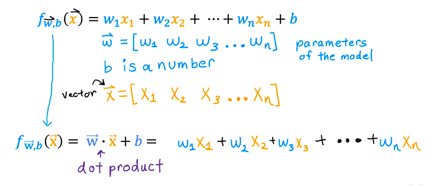
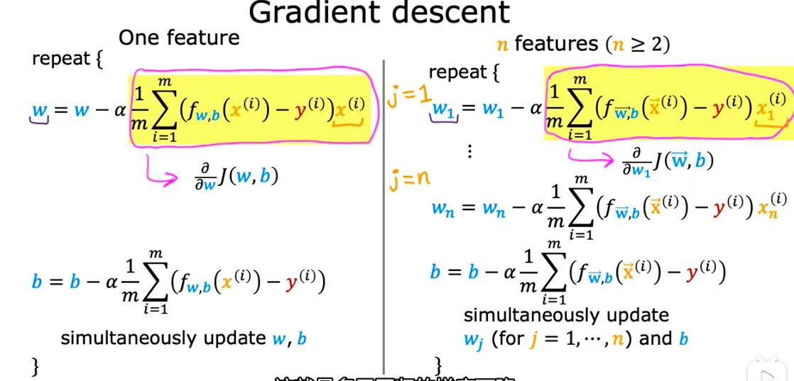

这张图不再解释“特征是什么”，它解释的是一个极其核心的工程数学操作：**「向量化 (Vectorization) 与 点积 (Dot Product)」**，从“单个变量”突然跳跃到“一堆带箭头的向量符号”

把一个个独立的特征打包成向量，本质上是为了**让计算机能一次性算完所有账，而不是傻傻地一行行去数**。

## 第1部分：建立认知（Why & What）

### 🎯 1.1 问题动机：还原发明者面对的困境现场 💡 核心必学

假设你面临一个真实的房产估价任务。
起初，你只用“房屋面积”预测价格，模型很简单：`价格 = 权重 × 面积 + 基础价`。这很好懂。

但后来，业务部门要求更精准。一栋房子的价格不仅和面积有关，还和卧室数、楼层、房龄、距离地铁的米数等有关。如果你有 100 个特征，用传统方法写代码，程序员会遭遇**极其痛苦的困境**：

**困境重建：**
程序员必须在代码里手写 100 次乘法和加法：

`预测价格 = w1*特征1 + w2*特征2 + w3*特征3 + ... + w100*特征100 + b`

为了更新这 100 个权重（梯度下降），程序员必须写一个 `for` 循环，让计算机循环 100 次去挨个计算。当你有 100 万套房子的数据时，这个嵌套的 `for` 循环在 Python 中执行极其缓慢，**原本只需要几秒钟的训练，用循环去跑可能需要几个小时甚至几天**。

**发明压力：**
手写公式和 `for` 循环在处理多维特征时必然失败，因为它的根本假设是**“计算机必须像人一样，一口一口地吃饭（串行计算）”**。而现实是，几十万次循环带来的时间成本是工程上无法接受的。这意味着我们**必须放弃“让计算机逐个处理变量”这个看似理所当然的前提**。

**范式跳跃：**
「向量化表示」让我们从 **“逐个指令计算”** 变成了 **“打包批量计算”**。

### 🗺️ 1.2 概念地图：它在 ML 知识体系中的位置 💡 核心必学

```text
ML 知识体系
│
├─ 线性回归模型 (Linear Regression)
│   │
│   ├─ 单变量线性回归 (只有面积)
│   │
│   └─ 多变量线性回归 (面积、房龄、地段...)
│       │
│       ├─ 向量化表示 (Vectorization) ← 你在这里
│       │
│       └─ 传统 for 循环计算 (被淘汰的做法)

```

### 📚 1.3 前置概念补充：使用前必须知道的基础 💡 核心必学

在理解吴恩达老师的推导前，我们需要扫清两个简单的概念：

──────────────────────────────────      
📖 前置概念：向量 (Vector) 与 点乘 (Dot Product)   
──────────────────────────────────      

- **向量是什么**：把它想象成一列**货运火车**。数字 $5$ 是一辆单独的汽车（标量）；而 $[5, 3, 10]$ 是一列有三节车厢的火车（向量），它把多个数字按照严格的顺序打包在一起。
- **点乘是什么**：就是**算超市购物小票的总价**。
- **最小示例**：
你买了：苹果 2斤，香蕉 3把。 （特征向量 $\vec{x} = [2, 3]$）     
单价是：苹果 5元，香蕉 4元。 （权重向量 $\vec{w} = [5, 4]$）    
点乘计算：$(2 \times 5) + (3 \times 4) = 10 + 12 = 22$ 元。    
- **为什么需要它**：有了点乘，计算机就不需要知道苹果和香蕉的具体名字了，它只需要把两个“火车（向量）”对撞，瞬间就能得出总价 $22$。

──────────────────────────────────

### 💡 1.4 直觉建立：结构翻转与代价揭示 💡 核心必学

为什么吴老师要在代价函数和梯度下降中，全部换成向量符号？我们来看它的核心结构翻转。

**旧范式**：零散的数字 (一斤斤水果) 是输入 ──▶  CPU用 `for` 循环逐个计算 是输出
**新范式**：打包好的向量 (购物小票) 是输入 ──▶  底层硬件瞬间“点乘”并行计算 是输出

**翻转的含义**：我们把组织数据的责任交给了“数学结构（向量）”，从而唤醒了现代计算机硬件（特别是 GPU）的“分身术”——**并行计算能力**。计算机可以同时算出 100 个特征的乘积，再瞬间求和，耗时和算 1 个特征几乎一样！

**代价揭示**：
换来了**极其恐怖的计算速度和极其简短的数学表达**，但必然失去**“变量在代码和公式中的直观可读性”**。这不是缺陷，是因为你要批量处理，就不能给每个数据都起个名字。你看到的不再是亲切的 $w_1, w_2$，而是一个冷冰冰的整体符号 $\vec{W}$。你必须时刻在脑海中追踪这列火车“有几节车厢”（维度），这导致了新手最头疼的“形状不匹配 (Shape Mismatch)”报错。

### 🔢 1.5 数学解读：公式是直觉的速记符号 ⭐ 进阶选学

现在，我们再回来看吴恩达老师课件上的变化，你会发现它只是对“超市算账”的速记：

**以前的公式（长篇大论）：**


$$f_{w,b}(x) = w_1x_1 + w_2x_2 + w_3x_3 + \dots + w_nx_n + b$$

**现在的公式（干净利落）：**


$$f_{\vec{w},b}(\vec{x}) = \vec{w} \cdot \vec{x} + b$$

**翻译拆解：**
- $\vec{w}$ = 所有单价的清单（权重向量，如 $[5元, 4元]$）
  - **翻译**：定义一个变量 $\vec{w}$（注意头上的小箭头，它提醒你这不是一个数字，而是一辆装满数字的购物车）。把所有的权重 $w$ 按顺序塞进去。
- $\vec{x}$ = 你购买数量的清单（特征向量，如 $[2斤, 3把]$）
  - **翻译**：同样的，定义一个购物车 $\vec{x}$，把所有的特征数据按顺序塞进去。
- $\cdot$ = 核心魔法“点乘”（对应的车厢相乘，然后全部加起来）
- $b$ = 基础费用（比如超市的塑料袋费用 0.5 元）
  - **翻译**：$b$ 只是一个孤零零的数字（标量），不需要打包。
- $f_{\vec{w},b}(\vec{x})$ = 最终预测出的总花费

同理，吴老师课上的**代价函数 (Cost Function)** 和 **梯度下降 (Gradient Descent)**，只是把里面原来带有 $\sum$ 和脚标 $i, j$ 的复杂部分，全部替换成了这种“火车对撞”的向量写法，逻辑一点都没有变，只是换了一种高级的“速写符号”。



- **说明1**:这里的 $w_1$ ... $w_n$ 都是指某一个权重，而不是权重的集合，所有后面的导数是偏导数，是 **标量** 而不是方向向量（向量是数组）。矢量的 $\vec{w}$ 即梯度，在数学上也是按一个一个的导数求出来的，python中是异步计算组合的
  - **梯度的本质**：梯度根本不是什么神秘的新物种，它就是一个 **“打包好的偏导数列表”**，$[偏导数_1, 偏导数_2, 偏导数_3]$，这个数组就叫作梯度向量（Gradient Vector）。
  - 当你用这个“梯度向量”去更新权重时，实际上就是让每个权重各自根据自己的“责任大小”，同时向前走一步
  - 最终的数学本质就是 $\frac{\partial J}{\partial\vec{w}}$ (标量J对矢量 $vec{w}$(这里的 $w$ 我指的是 $w1,w2,...,b 的集合$))
- 说明2:这里的 **$b$在损失函数中也是未知变量，也是需要求导的，是权重之一**

──────────────────────────────────

## 第2部分：工程映射

### 💻 工程实战：为什么这张图对写代码极其重要？

在真实的 Python 工程中，这张图决定了你的代码能不能跑起来。我们用 Numpy （Python 的核心计算库）来演示这张图的威力：

```python
import numpy as np

# 假设我们在处理一个有 100 万个特征的图片
w = np.random.rand(1000000) # 生成包含 100万个 权重的向量
x = np.random.rand(1000000) # 生成包含 100万个 特征的向量
b = 0.5

# ❌ 图里的第一行（散落计算，如果你用 for 循环写）
# 极度缓慢！在 Python 里跑完可能需要 0.5 秒
prediction = 0
for i in range(1000000):
    prediction += w[i] * x[i]
prediction += b

# ✅ 图里的最后一行（点积 np.dot）
# 极度恐怖的速度！底层自动调用 C 语言和硬件并行，几乎是 0.001 秒完成
prediction = np.dot(w, x) + b 

```

**总结：**
你上传的这张图，本质上是告诉你：**以后不要再写 $w_1x_1 + w_2x_2$ 这种啰嗦的公式了。直接用点积 $\vec{w} \cdot \vec{x}$，既让公式变短，又让代码快了成百上千倍！**

──────────────────────────────────    

### 🧠 边界预测测试

──────────────────────────────────    
基于刚才的“点积”逻辑，试着回答这个在工程排查中必定会遇到的报错：

- 如果你打包好的权重购物车 $\vec{w}$ 里面装了 **3** 个数字，而你的特征购物车 $\vec{x}$ 里面装了 **4** 个数字。此时你命令计算机执行图中的最后一步操作：$\vec{w} \cdot \vec{x}$。
你觉得在数学逻辑上，计算机遇到了什么无法解决的死局？

回答：报错维度不匹配