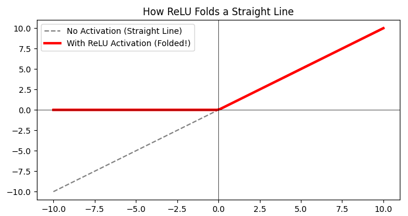

它打破了数学上“直来直去”的死板规则，让神经网络拥有了理解真实世界复杂弯绕的能力。

---

## 第一步：搞清楚它是什么、为什么需要它（Why & What）

### 🎯 1.1 没有它之前，人们是怎么挣扎的？ _💡 核心必学_

**① 还原当时的麻烦：人们在哪一步被卡死了？**   
想象你要开发一个“识别图片是不是猫”的系统。猫的形状是千变万化的：卷成一团的、拉伸的、只露个头的。   
在没有激活函数之前，工程师们只能用简单的算术题（比如加权求和，计算像素点的总得分）来做判断。如果一层算术题不够聪明，人们就蠢笨地把好多层算术题叠在一起，以为“多加几层”就能变得更聪明。结果发现：无论你叠加多少层，系统依然像个死脑筋，只能画出一条“笔直的直线”来区分猫和狗，根本无法描绘猫耳朵那样的优美弧线。

**② 是什么让人不得不换一种思路？**      
纯粹的加权求和在数学上叫“线性操作”。这里的逻辑不可能性在于：**不管你把多少个线性操作嵌套在一起，它的最终结果依然只是一个单调的线性操作。**      
这就像你把水倒进另一个杯子，再倒进下一个杯子，不管倒多少次，水还是水，变不成酒。这意味着必须放弃“只用简单的加减乘除就能拟合万物”的幻想。

**③ 新旧方法的核心区别：哪个环节被改造了？**

* **旧范式**：[输入特征] ──▶ [加权求和 (线性)] ──▶ [直接作为下一层输入 (还是线性)]
* **新范式**：[输入特征] ──▶ [加权求和 (线性)] ──▶ **[人为折断/扭曲 (非线性)]** ──▶ [作为下一层输入]

**④ 得到了什么，又必然失去了什么？**   
换来了**拟合任意复杂曲线的能力**（所谓的“万能近似定理”），但必然失去了**数学上的完美可解释性**。一旦加入扭曲，整个网络就成了一个“黑盒”，你很难再用一个简单的方程去完美倒推它的每一步计算，这不是缺陷，这是为了处理真实世界复杂性必须付出的代价。

**⑤ 什么情况下它会不管用？你来推导**     
基于以上逻辑，你现在应该能回答：
* 如果我们面对的问题本身就是极其简单的“直来直去”的规则（比如：预测总价 = 苹果单价 × 数量），这时候如果在中间强行加入复杂的扭曲（激活函数），会发生什么？
* 如果每一层的扭曲力度太小，小到几乎等同于没扭曲，整个网络会退化成什么样？

---

### 🗺️ 1.2 概念地图：它在 ML 知识体系中的位置 _💡 核心必学_

```text
ML 知识体系
│
├─ 神经网络架构 (Neural Networks)
│   │
│   ├─ [激活函数] ← 你在这里
│   │   ├─ Sigmoid (早期的“S型”门卫)
│   │   ├─ ReLU (现代的“折纸”主力)
│   │   └─ Softmax (输出层的“概率”裁判)
│   │
│   └─ 权重与偏置 (负责直来直去的线性部分)
```

---

### 📚 1.3 学这个之前，你得先知道这几件事 _💡 核心必学_

──────────────────────────────────
📖 **前置概念：加权求和（线性变换）**

* **是什么**：就像按配方调鸡尾酒，每种果汁加多少比例，最后混在一起。
* **最小示例**：房子得分 = (面积 × 2) + (房间数 × 1) + 基础分5。
* **为什么需要它**：这是神经网络收集信息的基础方式，激活函数就是处理这个“汇总得分”的下一步。
  ──────────────────────────────────

---

### 🔩 1.4 一句话说清楚它的本质 _💡 核心必学_

「激活函数」的本质是：**在神经网络的数据传递中强行加入的一种规则（对直线进行截断或扭曲），阻止多层网络退化成一条单调的直线。**

后面所有的例子和类比，都是在验证这句话，而不是在解释它。

---

### 💡 1.5 先不管公式，用感觉理解它 _💡 核心必学_

让我们用 **“折纸”** 来建立直觉。    

把数据空间想象成一张平整的A4纸。   
那些没有激活函数的“加权求和”操作，就像是在拉伸、旋转、平移这张纸。你随便怎么拉扯，纸面依然是平的（线性的）。如果你想用这张平展的纸去包住一个立体的苹果，是包不贴合的。    

激活函数是什么？**激活函数就是“折痕”。**     

它蛮横地在纸上折出一条线。一次激活，就是一个折角；神经网络有成千上万个神经元（激活函数），就像在这张纸上折了成千上万次。最终，这张原本平整的A4纸，被折成了一个无比复杂的立体纸鹤，完美地贴合了现实世界中极其复杂的数据边界。

**极端情况直觉（以最常用的 ReLU 激活函数为例）：**
* 当输入的“加权得分”是负数时：它一刀切，直接把结果变成 0（不激活，这张纸在这里被彻底压平）。
* 当输入的“加权得分”是正数时：它原样输出（保留这条线的原始走势）。

⚠️ **这个类比在这里开始失效:** 折纸暗示了纸张的物理面积是有限的，且折痕是永久的；但真实概念里，激活函数是对流经它的每一个数字进行实时的数学映射，它不消耗任何“物理空间”，且对不同的输入会有不同的动态响应。如果只记住折纸，你会在理解“数据是如何流过网络”时感到困惑。

---



**📌 图像解读指南：**
* **图中的灰线代表**：如果没有激活函数，数据就是一条死板的、永远直来直去的线。
* **图中的红线代表**：经过 ReLU 激活函数后，直线在 $0$ 的位置被生生“折断”了。左边全变成了 $0$，右边继续攀升。
* **🔍 重点看这里**：也就是原点 $(0,0)$ 那个拐角。正是因为千千万万个这样的“拐角”组合在一起，神经网络才能拼凑出圆圈、波浪线等任何形状！
* **💡 动手试一试**：想象一下，如果是多个这样不同位置、不同倾斜度的红线叠加在一起，是不是就能拼出一个类似于“碗”的形状？

---

### 🔢 1.6 公式在说什么？逐字翻译给你看 _⭐ 进阶选学_

我们来看看目前世界上最流行、统治了深度学习的激活函数——**ReLU (Rectified Linear Unit，线性整流函数)** 的公式。它简单到让人不敢相信。

公式：$f(x) = \max(0, x)$

翻译拆解：
* $x$       = 上一步算出来的“加权汇总得分”
* $0$       = 设定的底线
* $\max()$  = 选括号里比较大的那个数字
* $f(x)$    = 最终送给下一层的输出信号

**直觉验证：**
* **假设得分为 -5**：代入公式，$\max(0, -5)$。0 大于 -5，所以输出 **0**。这相当于神经元说：“这个特征太弱了，我不传递信号，闭嘴。”
* **假设得分为 8**：代入公式，$\max(0, 8)$。8 大于 0，所以输出 **8**。这相当于神经元说：“信号很强！按原强度 8 传递给下一层！”

就这么一个简单的 $\max(0, x)$，取代了以前极其复杂的数学公式，推动了整个 AI 时代的爆发。至于为什么越简单反而越好？我们下一阶段揭晓。

---

──────────────────────────────────

📚 **前置知识回顾**

──────────────────────────────────

本阶段会用到以下概念：
- **加权求和（线性操作）**（在1.3节学过）：把输入特征乘以权重后相加，结果是一条死板的直线。

如果不记得了，建议先回顾第一部分。

──────────────────────────────────

## 第2部分：它怎么运转、怎么动手用

### ⚙️ 2.1 工作原理：它内部是怎么运转的 _💡 核心必学_


在一个真正的神经网络中，激活函数就像是一个个设立在收费站的 **“门卫”**。数据（特征）流经网络时，必须经过这些门卫的审核和扭曲。

让我们用 ASCII 流程图看看一个神经元内部完整的数据流转：

```text
[输入数据 X] (比如：房屋面积 100平，房龄 5年)
    │
    ▼
[步骤1：加权求和 (Linear)] 
- 做什么：面积×权重1 + 房龄×权重2 + 基础偏置
- 为什么：把多维度的特征融合打分，得出一个综合的“原始得分”。
- 状态：此时的数据依然是一条单调的直线（线性）。
    │
    ├─ 假设算出的原始得分 = -2.5
    │
    ▼
[步骤2：激活函数 (Activation) —— 门卫登场]
- 做什么：用一个非线性规则（如 ReLU）处理这个得分。
- 为什么：强行折断直线，赋予网络处理复杂弯曲边界的能力。
    │
    ├─ ReLU规则：得分 < 0，直接输出 0。得分 > 0，原样输出。
    │  因此，-2.5 被强行变成了 0。
    │
    ▼
[输出结果] 0 (作为下一层神经元的输入)
```

**关键区别：训练 vs 推理**
- **推理阶段（预测时）**：激活函数就是忠实地执行上述规则，该砍成 $0$ 的砍成 $0$，该压缩的压缩。
- **训练阶段（学习时）**：激活函数不仅要正向传递数据，还要能**计算坡度（导数）**，告诉网络“刚才错得多离谱，权重该怎么调”。（这就是为什么数学家不能随便乱编一个规则，激活函数必须是可以通过公式求导的）。

---

### 💻 2.2 最小MVP：动手写代码，跑出你的第一个结果 _💡 核心必学_

我们将使用深度学习的行业标准库 **PyTorch**。我们要解决一个经典的“异或问题”（XOR）：如果两个输入相同则为 0，不同则为 1。**这个问题在数学上被证明过：如果不加激活函数，任何纯线性的模型都绝对无法解决它！**

```python
# ── 第1步：准备数据 ──────────────────────────────
import torch
import torch.nn as nn

# 异或问题的数据：[0,0]->0, [0,1]->1, [1,0]->1, [1,1]->0
# 这就像平面上四个角的点，用一条直线绝对无法把1和0分开
X = torch.tensor([[0., 0.], [0., 1.], [1., 0.], [1., 1.]])
y = torch.tensor([[0.], [1.], [1.], [0.]]) 

# ── 第2步：创建包含激活函数的神经网络 ─────────────
class FoldingNet(nn.Module):
    def __init__(self):
        super().__init__()
        self.linear1 = nn.Linear(2, 4)  # 线性层：负责拉伸和平移
        self.relu = nn.ReLU()           # 激活层：负责"折纸"（打破线性诅咒）
        self.linear2 = nn.Linear(4, 1)  # 线性层：把折好的形状重新组合
        self.sigmoid = nn.Sigmoid()     # 激活层：输出层专用，把得分压成0到1的概率

    def forward(self, x):
        # 核心：注意这里的嵌套！
        x = self.linear1(x)
        x = self.relu(x)    # ← 如果注释掉这行，整个网络就会退化成一个单层线性模型！
        x = self.linear2(x)
        x = self.sigmoid(x)
        return x

model = FoldingNet()

# ── 第3步：训练与预测 (此处省略数百次训练循环的代码，直接看结构) ──
# 假设模型已经训练好 (fit)，我们输入原始数据看它的预测形态
predictions = model(X)
print("模型预测的概率值（越接近y越好）：\n", predictions.detach().numpy())
```

**输出结果预期**（训练后的理想状态）：
```text
模型预测的概率值（越接近y越好）：
 [[0.02]   # 对应真实标签 0
  [0.98]   # 对应真实标签 1
  [0.97]   # 对应真实标签 1
  [0.05]]  # 对应真实标签 0
```
如果没有 `self.relu(x)` 这一步，无论你训练多久，上面的预测值永远会在 $0.5$ 左右徘徊，模型彻底失效。

---

### 🌍 2.3 真实世界里，它被用在什么地方？ _💡 核心必学_

激活函数不是“要不要用”的问题，而是**“只要是深度神经网络，就必须用”**。

但在真实的工程场景中，一个神经网络分为**“中间的隐藏层”**和**“最后的输出层”**。激活函数在这两个位置扮演着完全不同的角色：

1. **在隐藏层（提炼特征时）**：
  - 目标：快速、高效地“折纸”，提炼出诸如“猫耳朵纹理”、“汽车轮胎边缘”的复杂特征。
  - 现状：这里几乎被 **ReLU**（及其变种）一统天下。因为它计算极快（只是比对一下是否大于0），且不容易让信号在多层传递中消失。

2. **在输出层（做最后决定时）**：
  - 目标：把内部乱七八糟的“折纸”得分，翻译成人类能看懂的业务指标（如概率、房价）。
  - 现状：根据**业务目标**严格选择，绝对不能乱填（见2.5节的决策树）。

---

### ✅ 2.4 工程规范：怎么写才算专业？避开会让你被骂的写法 _🔥 实战必备_

**🔴 RED（强制规范）：绝对不要把多个线性层裸接在一起！**
- **后果**：无论你写了多少层 `nn.Linear`，只要中间没有激活函数，数学上它们会等价合并成一个 `nn.Linear`。你浪费了大量的计算资源，却只得到了一个最弱的单层模型（网络坍缩）。

```python
# ❌ 错误示范：毫无意义的"深"度网络
bad_model = nn.Sequential(
    nn.Linear(10, 50),
    nn.Linear(50, 100),
    nn.Linear(100, 2)
) # ← 灾难！这三层乘起来，等价于直接写一个 nn.Linear(10, 2)

# ✅ 正确做法：层与层之间必须用激活函数隔开
good_model = nn.Sequential(
    nn.Linear(10, 50),
    nn.ReLU(),          # ← 打断线性
    nn.Linear(50, 100),
    nn.ReLU(),          # ← 再次打断线性
    nn.Linear(100, 2)
)
```

**🔴 RED（强制规范）：不要在预测房价（连续回归问题）的输出层乱加激活函数！**
- **后果**：假如你预测房价（可能是 500 万），但你在输出层加了一个 `Sigmoid`（它会把任何数字强行压缩到 0 到 1 之间）。你的模型拼了命也只能预测出 0.99 万的房价，模型彻底报废。
- **正确做法**：回归问题的最后一层，**什么激活函数都不要加**，直接让 `Linear` 输出真实数值。

---

### 🔄 2.5 有好几种方法能做这件事，怎么选？ _⭐ 进阶选学_


面对几十种激活函数，其实只需要掌握这四剑客：

| 对比维度 | ReLU (整流线性) | Sigmoid (S型) | Tanh (双曲正切) | Softmax (归一化指数) |
| --- | --- | --- | --- | --- |
| **公式直觉** | 小于0归零，大于0原样 | 把任意实数挤压到 0~1 之间 | 把任意实数挤压到 -1~1 之间 | 把一排得分变成总和为 1 的概率分布 |
| **计算速度** | ⚡ 极快 (只有比对操作) | 🐌 慢 (涉及指数计算) | 🐌 慢 (涉及指数计算) | 🐌 慢 (涉及指数运算求和) |
| **输出范围** | $[0, +\infty)$ | $(0, 1)$ | $(-1, 1)$ | $(0, 1)$，且多项相加为1 |
| **推荐场景** | **所有隐藏层的默认首选** | **二分类的输出层** (如判断是不是垃圾邮件) | 早期RNN的隐藏层 (现在少用) | **多分类的输出层** (如判断是猫、狗还是猪) |

**🌳 工业界真实激活函数决策树：**

```text
你需要这个激活函数放在网络的哪一层？
    │
    ├─ 放在【隐藏层】(中间提取特征的过程)
    │       │
    │       └─ 默认闭眼选 ──▶ ReLU (或其变种 LeakyReLU)
    │
    └─ 放在【输出层】(最后做决定的环节)
            │
            ├─ 任务是预测具体连续数值？（如预测房价、温度）
            │      └─ ──▶ 不加任何激活函数 (保持 Linear 原样输出)
            │
            ├─ 任务是做非黑即白的二分类？（如是/否，猫/不是猫）
            │      └─ ──▶ Sigmoid 函数 (解释为 0~100% 的概率)
            │
            └─ 任务是在多个互斥类别中选一个？（如是猫、狗、还是猪）
                   └─ ──▶ Softmax 函数 (确保三者的概率加起来等于 100%)
```

👉 **我现在的问题该用哪个？**
不要标新立异。**中间全用 ReLU，最后根据任务形态从（无/Sigmoid/Softmax）里挑一个。** 这样能解决世界上 95% 的深度学习问题。

---

──────────────────────────────────

📚 **前置知识回顾**

──────────────────────────────────

本阶段会用到以下概念（已在第1、2部分学过）：
- **ReLU**：把负数一刀切变成 $0$ 的“折纸”门卫（在 1.6 节）。
- **输出层规则**：回归问题不加激活，二分类用 Sigmoid（在 2.5 节）。

如果不记得了，建议先快速回顾。

──────────────────────────────────

## 第3部分：哪里容易出错、怎么做得更好（What to Avoid & Beyond）

### ⚠️ 3.1 大多数人在哪里栽了跟头？ _🔥 实战必备_

在深度学习中，因为激活函数用错导致模型彻底瘫痪，是新手最容易踩的坑。我们来看两大绝命陷阱。

#### 陷阱 1：神经元大面积坏死（Dying ReLU）

**💥 现象**：
模型刚开始训练时，误差（Loss）还在下降，但突然有一天，Loss 卡死在一个固定值一动不动。无论你再训练几百个 epoch，模型的预测结果全是一模一样的数字。

**🔍 根本原因**：
回想一下 ReLU 的规则：输入 $< 0$ 时，输出 $0$。
如果在某次权重更新时，步伐迈得太大（学习率太高），导致算出的“加权得分”变成了一个巨大的负数（比如 $-1000$）。ReLU 门卫一看，直接输出 $0$。
更可怕的是，**数学上 $0$ 的导数是 $0$**。这意味着这个神经元再也接收不到任何“你需要调整”的反馈信号了。它的权重被永久锁死，无论以后输入什么，它都输出 $0$。它“死”了。如果网络中有一半的神经元都死了，模型自然就变成了智障。

**什么情况下会踩坑**：
- 学习率（Learning Rate）设置得过大。
- 数据中存在极其夸张的异常值（比如大部分数据是 $10$，突然来了一个 $-10000$）。

**✅ 修复方案**：
```python
import torch.nn as nn

# ❌ 错误做法：遇到大梯度时，普通 ReLU 容易大面积坏死
layer = nn.ReLU()

# ✅ 修复方案 1：调小学习率（最治本的方法，在优化器里设置）
# optimizer = torch.optim.Adam(model.parameters(), lr=0.001) # 不要用 0.1 这种大数值

# ✅ 修复方案 2：换用 LeakyReLU（给死去的神经元留一口气）
# LeakyReLU 的规则：如果 < 0，不变成绝对的 0，而是变成一个很小的负数（如 -0.01 * x）
layer_fixed = nn.LeakyReLU(negative_slope=0.01) 
```

#### 陷阱 2：在输出层强行“画蛇添足”

**💥 现象**：
用神经网络预测房价（真实价格在 $100$ 万到 $1000$ 万之间），但模型输出的预测值全都是 $0.99$ 万，死活上不去。

**🔍 根本原因**：
盲目套用网上的代码，在连续值预测（回归问题）的最后一层加上了 `Sigmoid` 或 `Tanh`。`Sigmoid` 的物理意义是把任何数字“挤压”到 $0$ 到 $1$ 之间。你逼着模型在 $0$ 到 $1$ 之间猜出一个 $500$ 万的价格，它只能委屈地给你输出它的极限值 $0.9999$。

**❌ 错误代码**：
```python
# ❌ 错误示范：预测房价的输出层
self.output = nn.Sequential(
    nn.Linear(64, 1),
    nn.Sigmoid()  # ← 灾难！把最高房价锁死在了 1 万元
)
```

**✅ 修复方案**：
```python
# ✅ 修复版本：直接让 Linear 层输出无拘无束的真实数字
self.output = nn.Linear(64, 1) # 什么激活函数都不加！
```

---

### 🧪 3.2 模型出问题了，怎么一步步找原因？ _🔥 实战必备_

当你发现神经网络“变笨”时，按这个决策树排查激活函数问题：

```text
模型 Loss 不下降 / 准确率卡死
    │
    ├─ 检查最后一步：输出层激活函数对吗？
    │       ├─ 是预测连续数值（回归）？ ──▶ 必须没有激活函数
    │       ├─ 是二分类（如欺诈检测）？ ──▶ 必须是 Sigmoid
    │       └─ 是多分类（如识别猫狗猪）？ ──▶ 必须是 Softmax
    │
    └─ 输出层没错 ──▶ 检查中间隐藏层：
            │
            ├─ 层与层之间有激活函数吗？
            │       └─ NO ──▶ 加上 ReLU！（否则网络坍缩成单层）
            │
            └─ 都有 ReLU ──▶ 打印中间层的输出看看是不是全是 0？
                    │
                    ├─ YES（神经元坏死） ──▶ 调小学习率，或换成 LeakyReLU
                    └─ NO ──▶ 激活函数没问题，去排查数据质量或模型结构
```

---

### 🚀 3.3 如果要用在真实项目里，该怎么做？ _⭐ 进阶选学_

如果你要部署一个生产级别的深度学习模型（比如像 ChatGPT 这样的复杂网络），业界通常会采用更前沿的激活函数组合。

1. **大模型时代的首选：GELU (Gaussian Error Linear Unit)**
   在早期的简单网络中，ReLU 是王者。但在如今的 Transformer 架构（GPT 的底层技术）中，你会发现大家都换成了 `GELU`。
  * **为什么？** ReLU 的那个“折角”太尖锐了（在 $0$ 点不可导）。GELU 在 $0$ 附近做了一个平滑的“弧线”过渡。这种数学上的平滑性，能让极其深的网络在训练时更加稳定。

2. **配套的初始化魔法：He Initialization（Kaiming 初始化）**
   当你决定在隐藏层使用 ReLU 时，由于 ReLU 会直接砍掉一半的信号（负数部分变 $0$），信号传到深层会变得极其微弱。
  * **工程规范**：使用 ReLU 时，必须搭配 `Kaiming 初始化`（这是何恺明大神发明的）。它会在一开始把权重的方差放大一倍，正好抵消掉 ReLU 砍掉的那一半信号，防止网络在第一步就“窒息”。

---

### 🎓 3.4 实战挑战：来试试看自己解决一个真实问题 _🔥 实战必备_

恭喜你学完了激活函数的核心奥秘！现在，让我们用一个真实的场景来检验你的直觉。

──────────────────────────────────

🎓 **实战挑战**

──────────────────────────────────

**场景：信用卡欺诈检测系统**

**数据描述**：
- 特征：用户的 $10$ 个交易行为数据（如金额、异地登录次数等）。
- 任务类型：**二分类**（判断这笔交易是正常 `0`，还是欺诈 `1`）。

以下是一位新手工程师写的 PyTorch 模型代码，跑起来后准确率只有 50%（和抛硬币一样）。这里面藏着 **2 个致命的激活函数错误**。

请找出它们，并写出你的修复方案。

```python
import torch.nn as nn

class FraudDetector(nn.Module):
    def __init__(self):
        super().__init__()
        self.network = nn.Sequential(
            # 输入 10 个特征，输出预测结果
            nn.Linear(10, 32),
            nn.Linear(32, 16),      # ← 仔细看这两层之间
            nn.ReLU(),
            nn.Linear(16, 1),
            nn.ReLU()               # ← 仔细看输出层的处理
        )

    def forward(self, x):
        return self.network(x)
```

📝 **将你的诊断和修改后的代码发送给我，我会进行代码评审：**
- ✅ 指出你做得好的地方
- ⚠️ 纠正遗漏的细节
- 🌟 给出符合工业标准的最终版代码