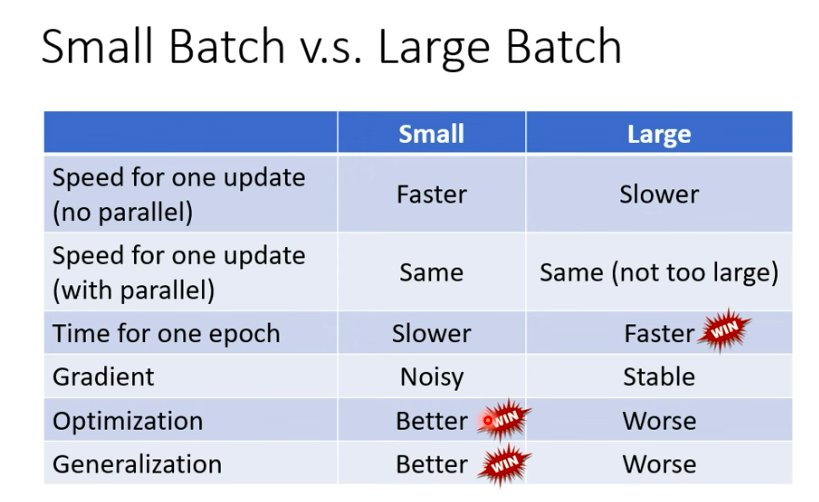

Large Batch 和 Small Batch各有利弊，能不能结合两者的优点训练模型呢？

这是全世界顶级 AI 工程师每天在实验室里掉头发琢磨的终极困境：**“速度（算力）与 质量（泛化）的极致拉扯”**。

在真实的工业界，标准做法是：**先向硬件（GPU）妥协追求速度，然后再用算法（其他参数）去把丢掉的质量“偷”回来。**

我们就来拆解一下，业界大佬们是怎么玩这手“平衡术”的：

### 1. 工业界的真实操作流：先喂饱 GPU

在真实的项目中，时间就是金钱（跑一次大模型可能要几百万电费）。所以我们通常会：

*   **第一步：寻找“黄金拐点”**。就像我们之前聊的，我们会把 Batch Size 设为 32, 64, 128, 256…… 一路往上加，直到到达左图那个“单次更新时间开始显著增加”的拐点，或者显存刚好快塞满（比如利用率 80%-90%）。
*   **第二步：锁定这个值**。假设我们锁定在 Batch Size = 256。此时，GPU 跑得最爽，训练速度最快。

### 2. 设计者的“偷天换日”：把噪声加回来

现在问题来了：Batch Size = 256 虽然快，但它可能偏向“Large Batch”，走得太稳了，容易掉进狭窄的深坑（Sharp Minima），导致测试集效果变差。怎么办？

**既然大 Batch 缺乏“随机乱跳的噪声”，那我们就从别的地方把“冲力”给强行补回来！**

这时候，我们需要请出两个极其关键的“救场嘉宾”：

*   **救兵 A：加大步伐（Learning Rate / 学习率）**
    既然大 Batch 算出来的方向非常“准”、非常“稳”，那我们就没必要像小脚老太太那样一步步挪了。**方向既然是对的，我们就把步子迈大！**      
    业界有一个著名的“线性缩放法则（Linear Scaling Rule）”：Batch Size 扩大几倍，学习率通常也要跟着扩大几倍。步伐大了，一脚跨过去，就不容易掉进小坑里了。

*   **救兵 B：加上惯性（Momentum / 动量）**
    这是最绝妙的设计。大 Batch 就像一辆沉重平稳的大卡车，遇到一个小坑可能会卡住。但如果我们给这辆卡车加上“物理学上的惯性”，当它下坡冲向小坑时，凭借着之前积攒的速度和重量，它能**直接冲破小坑的阻力，飞跃过去！**

---

### 📌 总结：终极平衡法则

所以，面对“怎么平衡”的问题，现在的标准答案是：

> **“用最大的硬件性价比（大 Batch）换取时间，然后用更聪明的优化算法（学习率调度 + 动量 Momentum）来弥补质量，以此实现双赢。”**
