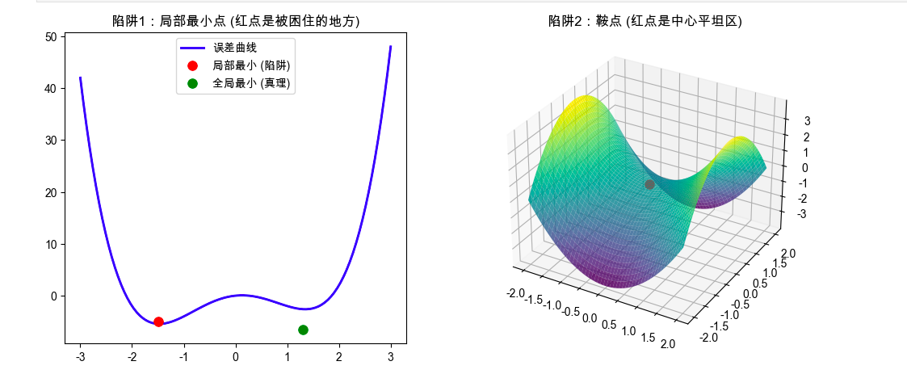

## 第1部分：搞清楚它是什么、为什么需要它

### 🎯 1.1 没有它之前，人们是怎么挣扎的？ _💡 核心必学_

#### ① 还原当时的麻烦：人们在哪一步被卡死了？
想象一个场景：你是盲人登山者，任务是走到整个山脉的**绝对最低谷**（在机器学习里，谷底代表“误差最小，模型最聪明”）。因为看不见，你只能用脚探路，哪里往下倾斜，就往哪边走一步（这就是“梯度下降”法）。
以前的人们做简单的机器学习（比如线性回归），整个山脉就是一个完美的平底锅，只要一直往下走，必定能走到唯一的锅底。
但是，当人们开始搞**深度神经网络**时，地形变成了连绵起伏的喜马拉雅山。人们发现，盲人经常走到一个地方停下来了——因为他感觉四面八方都是平的，或者都在往上走。他高兴地宣布：“我到谷底了！”结果摘下眼罩一看，自己居然卡在半山腰的一个小水坑里，离真正的谷底还差十万八千里。模型准确率卡在 60% 死活上不去。

#### ② 是什么让人不得不换一种思路？
人们发现，**“脚下没坡度（坡度为0）”绝对不等于“到了真正的最底部”**。在复杂的山脉中，坡度为 0 的情况太多了。这意味着我们必须放弃一个美好的假设：放弃“只要按着下坡路走，就一定能找到最优解”的天真想法。

#### ③ 新旧方法的核心区别：哪个变量的位置被对调了？
为了解决这个问题，优化算法的设计逻辑发生了根本转变：

```text
旧范式（简单地形）：
[探测到脚下坡度为0] 是输入 ──▶ [宣告找到了全局最优解] 是输出

新范式（复杂地形）：
[探测到脚下坡度为0] 是输入 ──▶ [触发甄别机制：我是不是掉进局部最小或鞍点了？] 是输出
```

#### ④ 得到了什么，又必然失去了什么？
承认局部最小点和鞍点的存在，换来了**训练极度复杂的深度神经网络的能力**（容忍地形复杂），但必然失去了**对结果绝对完美的确定性**（我们永远无法100%保证现在找到的解就是全宇宙最好的，只能保证“它足够好用”）。这不是缺陷，是面对复杂真实世界的一种妥协。

#### ⑤ 什么情况下它会不管用？你来推导
基于以上逻辑，你现在应该能推导出：
1. 为什么当模型非常简单（比如只有一两个参数）时，我们通常不需要担心局部最小点？
2. 为什么如果我们一开始跳伞降落的位置不同（初始化权重不同），最终模型训练出来的效果可能会千差万别？

---

### 🗺️ 1.2 概念地图：它在 ML 知识体系中的位置 _💡 核心必学_

```text
ML 知识体系
│
├─ 神经网络优化 (寻找最小误差的过程)
│   │
│   ├─ 理想终点：全局最小点 (真正的绝对谷底)
│   │
│   ├─ 现实地形陷阱 ← 你在这里
│   │   ├─ 局部最小点 (Local Minima：半山腰的坑)
│   │   └─ 鞍点 (Saddle Points：马鞍一样的平缓通道)
│   │
│   └─ 逃脱工具 (解决陷阱的算法，如 Momentum, Adam)
```

---

### 📚 1.3 学这个之前，你得先知道这几件事 _💡 核心必学_

──────────────────────────────────

📖 前置概念：**损失函数曲面 (Loss Surface)**
- 是什么：把模型所有的“错误率”画成连绵起伏的山脉。山越高，模型越笨；山越低，模型越聪明。
- 最小示例：如果模型只有两个参数，这个曲面就是一个 3D 的地形图。
- 为什么需要它：局部最小点和鞍点，就是这座山上特定的“地形地貌”。

📖 前置概念：**梯度 (Gradient)**
- 是什么：就是你脚下的“坡度和方向”。
- 最小示例：如果在某一点，梯度是 0，说明你脚下的地是平的。
- 为什么需要它：我们的算法遇到梯度为 0 就会停下，而陷阱正好就是梯度为 0 的地方。

──────────────────────────────────

### 🔩 1.4 一句话说清楚它的本质 _💡 核心必学_

「局部最小点和鞍点」的本质是：**在高维空间的盲人摸象中，那些把你骗停下来的伪终点——它们周围的坡度全为零，让你误以为已经走到了真正的谷底。**

后面所有的例子和类比，都是在验证这句话，而不是在解释它。

---

### 💡 1.5 先不管公式，用感觉理解它 _💡 核心必学_

让我们直接来看看这两个陷阱长什么样。

#### 1. 局部最小点 (Local Minimum)
- **生活类比**：你在一座大山上找最低的峡谷。你顺着下坡走，掉进了一个**火山口**。你在火山口底往四周看，四面八方都是上坡。你的算法告诉你：“坡度为0，且四周都比我高，我到谷底了！” 但实际上，真正的峡谷（全局最小点）还在山脉的另一头。

#### 2. 鞍点 (Saddle Point)
- **生活类比**：想象一个真实的**马鞍**放在地上。 你站在马鞍的最中心。
    - 如果你往马头或马尾的方向看（前后），地势是**往上**走的。
    - 如果你往马的左侧或右侧看（左右），地势是**往下**走的。
    - 但就在正中心那一个点，地是**完全平的**（坡度为0）。
      盲人走到这里，脚踩着平地，如果他恰好探测的是前后方向，他会觉得“走到底了”，于是卡在这里不动。

🎨 **两个陷阱的直观图像：**



**📌 图像解读指南：**
- **当你运行后，左图的红点代表** 局部最小点。它确实是一个坑底，但不是最深的坑（绿点才是）。
- **右图的红点代表** 鞍点。🔍 **重点看这里**：在红点处，你明明还可以顺着深蓝色的区域继续往下滑，但因为红点本身是平的，传统的笨算法一旦走到这里，就会以为任务完成而停机。

⚠️ **这个类比在这里开始失效：**
以上二维和三维的图像暗示了“局部最小点和鞍点一样常见”。但在真实的深度学习（可能有几千万个维度的参数）中，并不是这样——实际上，**高维空间里几乎没有局部最小点，全是鞍点**。如果只记住 3D 的图像，你会在思考深度学习为何难训练时找错方向（这点我们会在第3部分详细展开）。

---

### 🔢 1.6 公式在说什么？逐字翻译给你看 _⭐ 进阶选学（可先跳过）_

不用怕，我们只用初中数学来拆解它。在数学上，怎么判断我们踩到了陷阱？

**条件1：一阶导数（梯度）为 0**
$\nabla f(x) = 0$
- 翻译：你脚下的地是平的。这是局部最小、全局最小、鞍点的**共同特征**。

**条件2：二阶导数（Hessian矩阵）决定形状**
一阶导数看坡度，二阶导数看“弯曲方向”。

- 如果所有方向的二阶导数都是**正数** $(>0)$ ➡️ 形状像个碗 ➡️ 你在**局部/全局最小点**。
- 如果有的是正数，有的是负数 ➡️ 一半往上弯，一半往下弯 ➡️ 你在**鞍点**。


---

──────────────────────────────────

📚 **前置知识回顾**

──────────────────────────────────

本阶段会用到以下概念（已在阶段 1 学过）：
- **梯度**：你脚下的“坡度和方向”。
- **局部最小点**：四周都比你高的“坑底”，伪终点。
- **鞍点**：某个方向看是谷底，另一个方向看是山顶的“平坦区”，最危险的伪终点。

如果不记得了，建议先回顾阶段 1 的直觉部分。

──────────────────────────────────

对于局部最小点来说周围都是比较高，而对于鞍点来收还是有路可以走的，那么该怎么判断所处的位置到底是全局最小点、局部最小点、还是鞍点呢？      
如果是局部最小点或者是鞍点，又该怎么走出去呢？

## 第2部分：它怎么运转、怎么动手用

### ⚙️ 2.1 工作原理：我们是怎么逃离这些陷阱的？ _💡 核心必学_

既然单纯依靠“脚下有没有坡度”会让我们卡死在局部最小点或鞍点，工程师们是怎么解决的呢？

答案是从物理学借来了一个概念：**动量（Momentum，即惯性）**。

传统的算法像是一个**没有质量的盲人**，每走一步都要重新摸一下坡度，坡度为 0 他就立刻立正站好。      
带“动量”的算法像是一个**沉重的铁球**。当铁球从高处滚落时，它会积累速度。即使它突然滚到了一个完全平坦的鞍点中心（此时坡度产生的推力为 0），或者掉进了一个很浅的局部最小坑里，它也会**凭借之前积累的惯性，直接冲过去！**

**核心决策流程（ASCII 图示）**：

```text
[当前位置的梯度 (坡度)]
    │
    ▼
[传统算法] ────────────────────────┐
    │                             │
    ├─ 坡度很大 ──▶ 走一大步         │
    ├─ 坡度很小 ──▶ 走一小步         │
    └─ 坡度为0  ──▶ 🛑 永远停机     │
                                  │
[带动量的算法]  ◄───────────────────┘
    │
    ▼
[结合之前的“速度”]
    │
    ├─ 坡度为0，但之前速度很快 ──▶ 🚀 靠惯性继续往前冲（逃离鞍点/小坑）
    └─ 坡度反向，且速度被耗尽  ──▶ 🛑 在真正的谷底来回震荡后停下
    │
    ▼
[更新当前位置]
```

---

### 💻 2.2 最小MVP：动手写代码，跑出你的第一个“逃脱”结果 _💡 核心必学_

我们用 Python 模拟一个极其简单的鞍点地形（比如函数 $y = x^3$，在 $x=0$ 处完全平坦，梯度为 0）。看看纯纯的笨办法是怎么卡死的，而“动量”魔法是怎么冲过去的。

```python
# ── 第1步：准备地形和工具 ──────────────────────────────
# 说明：我们要在这个地形上找最低点。在 x=0 的地方是一个“平坦的鞍点”
def get_gradient(x):
    return 3 * (x ** 2)  # 这是 x^3 的导数（代表坡度）

# ── 第2步：定义两个不同的探险者 ───────────────────────
# 探险者A：传统的笨办法（纯梯度下降）
x_traditional = 0.5      # 大家一开始都站在稍微有点坡度的半山腰
learning_rate = 0.1

# 探险者B：带惯性的聪明人（动量法）
x_momentum = 0.5
velocity = 0             # 初始速度为 0
momentum_factor = 0.9    # 惯性有多大（保留 90% 的历史速度）

# ── 第3步：开始模拟下山（迭代训练） ───────────────────
print("开始下山...")
for step in range(10):
    # 1. 传统方法更新：只看脚下
    grad_A = get_gradient(x_traditional)
    x_traditional = x_traditional - learning_rate * grad_A
    
    # 2. 动量方法更新：看脚下 + 记着历史速度
    grad_B = get_gradient(x_momentum)
    # ← 核心：现在的速度 = 历史惯性 + 现在的下坡推力
    velocity = momentum_factor * velocity - learning_rate * grad_B 
    x_momentum = x_momentum + velocity
    
    print(f"第 {step+1} 步 | 传统位置: {x_traditional:.4f} | 动量位置: {x_momentum:.4f}")

# 预期输出：你会看到传统方法在靠近 0 的时候步子越来越小，几乎停滞（被鞍点困住）。
# 而动量方法则大步流星，直接冲过了 0，甚至冲到了负数区域（成功逃离平坦区）！
```

---

### 🌍 2.3 真实世界里，它被用在什么地方？ _💡 核心必学_

在真实的机器学习工程中，你**几乎不需要**自己手写上面的动量公式。各大框架（如 PyTorch, TensorFlow）已经把它封装成了被称为 **“优化器（Optimizer）”** 的工具。

当你面临“我的模型好像卡住了，准确率死活提不上去”的时候，选择正确的优化器来对付局部最小点和鞍点就是你的首要任务。

**四象限决策指南**：

```text
                    数据规律极其复杂（如图像、文本）
                               │
        适合带自适应学习率的优化器 │   
        （如 Adam，自带动量）    │   适合深度学习
                               │
       模型极其简单 ─────────────┼─────────────── 模型极度深/复杂
       （如线性回归）            │               （如百层神经网络）
                               │
                  适合纯梯度下降 │   必须用带强动量的优化器
                  （不需要动量） │   （如 SGD + Momentum）
                               │
                        数据规律简单（如房价预测）
```

**必须明确说明**：
1. ✅ **什么时候需要对付局部最小/鞍点**：只要你使用的是**深度神经网络（Deep Learning）**，你就必须默认地形充满鞍点，必须使用带动量（Momentum）的优化器，如 Adam 或 SGD+Momentum。
2. ❌ **什么时候不用管它们**：当你做**传统机器学习**（比如用 Scikit-learn 跑线性回归、逻辑回归）时，背后的数学已经保证了地形是“完美的单底锅（凸函数）”，根本没有局部最小点和鞍点。此时用纯梯度下降（SGD）或直接套公式就能得到最优解。

---

### ✅ 2.4 工程规范：怎么写才算专业？避开会让你被骂的写法 _🔥 实战必备_

在实际写 PyTorch 模型训练代码时，对付这些陷阱的规范写法如下：

**🔴 RED（强制规范）：在深度网络中裸奔（不用动量）**
- **违反会导致**：模型训练在初期就早早停滞，损失函数（Loss）不再下降，你以为模型学到极限了，其实它是掉坑里了。
- **错误写法**：
  ```python
  # ❌ 错误示范：在复杂的神经网络上使用纯纯的 SGD
  optimizer = torch.optim.SGD(model.parameters(), lr=0.01) 
  ```
- **✅ 正确做法**：
  ```python
  # ✅ 必须加上 momentum 参数，给它装上“马达”
  optimizer = torch.optim.SGD(model.parameters(), lr=0.01, momentum=0.9)
  ```

**🟡 YELLOW（强烈建议）：不管三七二十一，永远只用 Adam**
- Adam 是一个集成了动量和自适应学习率的“傻瓜式”优化器。但有时候在图像识别（如 ResNet）的最终刷榜阶段，Adam 会陷入某种奇怪的局部最优。建议在打比赛或极致调优时，尝试切换回带有手动学习率衰减的 `SGD + Momentum`。

**🟢 GREEN（推荐风格）：记录 Loss 曲线**
- 想要知道自己是不是掉进坑里了，必须通过可视化。如果 Loss 曲线呈现阶梯状（平了一段时间又突然下降），通常意味着模型刚刚痛苦地“爬出了一个鞍点”。

---

### 🔄 2.5 有好几种方法能逃离陷阱，怎么选？ _⭐ 进阶选学_

当我们在 PyTorch 里打出 `torch.optim.` 时，会看到一堆选项。它们都是为了对付局部最小点和鞍点而发明的：

| 对比维度 | 纯 SGD (传统方法) | SGD + Momentum (铁球法) | Adam (智能跑车法) |
| :--- | :--- | :--- | :--- |
| **逃离陷阱能力** | 极弱 | 较强 | 极强 |
| **超参数复杂度** | 低（只需调 1 个 lr） | 中（调 lr 和动量） | 低（通常用默认参数即可） |
| **计算速度** | 最快 | 快 | 稍慢（需要算更多东西） |
| **推荐场景** | 极其简单的模型 | 图像识别刷最高精度 | **90%的日常深度学习任务** |

**工程师决策树**：
```text
你在训练深度神经网络吗？
    │
    ├─ NO ──▶ 使用传统机器学习库，无需关心优化器选择。
    │
    └─ YES ──▶ 你是新手，想快速跑通看效果吗？
                 │
                 ├─ YES ──▶ 闭眼用 **Adam** (lr=0.001)
                 │
                 └─ NO  ──▶ 你在极致压榨计算机视觉模型（如CNN）的性能吗？
                              ├─ YES ──▶ 用 **SGD + Momentum** (配合学习率衰减)
                              └─ NO  ──▶ 用 **AdamW**
```


---

──────────────────────────────────

📚 **前置知识回顾**

──────────────────────────────────

本阶段会用到以下概念（已在阶段1和2学过）：
- **局部最小点（Local Minima）**：四周都比你高的“坑底”，伪终点。
- **鞍点（Saddle Points）**：某个方向看是谷底，另一个方向看是山顶的“平坦区”。
- **动量（Momentum）**：帮模型冲出平坦区和浅坑的“物理惯性”。
- **Loss 曲线**：记录模型预测错误率的折线图。Loss 越低越好。

如果不记得了，建议先回顾之前的章节。

──────────────────────────────────

## 第3部分：哪里容易出错、怎么做得更好

### ⚠️ 3.1 大多数人在哪里栽了跟头？ _🔥 实战必备_

#### 陷阱 1：高维空间的直觉骗局（以为“坑”到处都是）

**💥 现象**：
当你在训练一个复杂的神经网络（比如有上百万个参数的图像识别模型）时，Loss 曲线突然平得像一条直线，好几个小时都不往下降了。     
很多初学者立刻会慌张地说：“完蛋了，我的模型掉进**局部最小点（坑里）**了，出不来了！”

**🔍 根本原因**：
你的三维直观感受，在高维空间里彻底失效了！       
**在深度学习里，几乎不存在真正的局部最小点，把你卡住的 99.9% 都是鞍点。**

我们可以用抛硬币来推导这个反直觉的真相：
- 想象你在一个只有 2 个参数（2维）的模型里。要形成一个“四周都比我高”的局部最小坑，要求 X 轴方向是往上弯的（概率算作 1/2），Y 轴方向也是往上弯的（概率 1/2）。你掉进坑的概率是 $1/2 \times 1/2 = 1/4$。
- 现在，你有一个 1,000,000 个参数的神经网络（100万维空间）。你要掉进一个“四周全比我高”的绝对坑底，要求这 **一百万个方向全部都是往上弯的**！概率是 $(1/2)^{1000000}$，这个数字小到宇宙毁灭都不会发生。
- 只要这一百万个方向里，有**哪怕一个方向**是往下弯的（有一条漏水的通道），这个点就是**鞍点**。

**什么情况下会踩坑**：
当你看到 Loss 不降时，误以为模型已经彻底死胡同了，于是你按下了停止键（Ctrl+C），放弃了训练。

**✅ 修复方案**：
**给模型一点耐心，并确保你的“车”有马达。** 鞍点只是一个非常广阔的平原，由于大部分方向极其平坦，梯度接近 0，模型走得非常慢。只要你的优化器（如 Adam 或带 Momentum 的 SGD）有惯性，多等几个 Epoch，它总能找到那条通往更低处的狭窄通道。

---

#### 陷阱 2：在悬崖边迈大步（学习率设置不当）

**💥 现象**：       
你的 Loss 曲线没有停滞，而是像疯了一样，一会 0.5，一会 5.0，一会 10.0，甚至直接报错变成 `NaN`（Not a Number）。

**🔍 根本原因**：     
如果你在峡谷的边缘迈出的步子（学习率 Learning Rate）太大，由于两边非常陡峭，你不仅下不到谷底，还会从左边悬崖直接跳到右边更高的悬崖，最后飞出外太空（梯度爆炸）。

**❌ 错误代码**：     
```python
# ❌ 错误示范：在极其陡峭的地形使用过大的学习率
import torch
import torch.nn as nn

model = nn.Linear(10, 2)
# 这里的 1.0 (100%) 对于复杂的网络来说步子扯得太大了！
optimizer = torch.optim.SGD(model.parameters(), lr=1.0, momentum=0.9) 
```

**✅ 修复方案**：
```python
# ✅ 修复版本：遵循业界公认的“试探性”默认值
# 深度学习中，通常从 0.001 或 0.0001 开始尝试
optimizer = torch.optim.Adam(model.parameters(), lr=0.001) 
```

---

### 🧪 3.2 模型出问题了，怎么一步步找原因？ _🔥 实战必备_

当你发现模型的误差（Loss）下不去，像无头苍蝇一样乱撞时，按这个排查树来：

```text
Loss 停滞或异常了！
    │
    ├─ 刚开始训练就变成 NaN 或飙升到天上？
    │       │
    │       ├─ 检查学习率 ──▶ 太大了！赶紧调小（如从 0.1 降到 0.001）。
    │       └─ 检查数据 ──▶ 是不是忘了做归一化（Normalization），特征差异太大把模型扯碎了？
    │
    └─ 训练了一段时间后，Loss 平稳得像一条死线？
            │
            ├─ 训练集和测试集的 Loss 都不降？ ──▶ 你被困在广阔的鞍点平原了
            │           ├─ 方案A：多等一会，让动量积攒力量。
            │           └─ 方案B：使用接下来要讲的「学习率调度器」。
            │
            └─ 训练集 Loss 还在降，测试集却反弹了？ ──▶ ❌ 这不是鞍点问题，是过拟合（Overfitting）！
                        （模型在死记硬背训练题。此时必须立刻早停，不需要再往下走了）
```

---

### 🚀 3.3 如果要用在真实项目里，该怎么做？ _⭐ 进阶选学_

真实项目里，仅仅给模型装上“动量”还不够。           
工程师们发现了一个应对鞍点和局部最小点的绝佳策略：**学习率调度（Learning Rate Scheduler）**。

- **直觉**：刚开始寻宝时，地形非常复杂。我们故意把步子迈得**忽大忽小**。步子大的时候，一脚踹飞模型，让它越过那些危险的坑和长长的马鞍；到了训练后期，我们确信它已经在一个“真正的好峡谷”里了，就把步子**慢慢变小**，让它稳稳地走到谷底，而不是在谷底来回跳跃。

在 PyTorch 中，最流行的方法叫 **余弦退火（Cosine Annealing）**，代码非常优雅：

```python
import torch
import torch.nn as nn
from torch.optim.lr_scheduler import CosineAnnealingLR

model = nn.Linear(10, 2)
optimizer = torch.optim.SGD(model.parameters(), lr=0.1, momentum=0.9)

# 🚀 工程高级写法：加入调度器
# T_max=100 表示每 100 步，学习率会像余弦波浪一样从大变小
scheduler = CosineAnnealingLR(optimizer, T_max=100)

for epoch in range(100):
    # 1. 正常训练，看数据，算梯度
    # ... (省略 forward 和 backward 代码)
    
    # 2. 走一步
    optimizer.step()
    
    # 3. 走完之后，根据调度器调整下一步的步幅（学习率）
    scheduler.step() 
```

这让模型具备了“狂暴冲刺”和“精雕细琢”两套模式，几乎是现代大型 AI 模型（如 ChatGPT、ResNet）训练的标配。

---

──────────────────────────────────

🎓 **实战挑战**

──────────────────────────────────

场景：你入职了一家医疗 AI 公司，同事写了一段用深度神经网络预测肿瘤恶性程度的代码。
数据描述：
- 特征：200个维度的基因表达数据（极其复杂的高维空间）。
- 任务类型：二分类。

同事抱怨说：“跑了 50 个 Epoch，Loss 停在 0.69 几乎不动了。我们的模型肯定掉进局部最小点了，这个网络架构没救了！”

以下是他写的核心训练逻辑，存在 **两个致命错误**（导致模型卡死在平坦区），请找出并修复：

```python
import torch
import torch.nn as nn

# 定义了一个很深很复杂的网络
model = nn.Sequential(
    nn.Linear(200, 512),
    nn.ReLU(),
    nn.Linear(512, 128),
    nn.ReLU(),
    nn.Linear(128, 1)
)

# 同事写的优化器配置
# 他听说学习率越小越稳定，于是设了一个极小的值
optimizer = torch.optim.SGD(model.parameters(), lr=0.0000001)

# 开始训练
for epoch in range(50):
    # 模拟数据输入
    inputs = torch.randn(32, 200)
    labels = torch.randn(32, 1)
    
    # 清空过去的梯度
    optimizer.zero_grad()
    
    # 计算误差
    outputs = model(inputs)
    loss = nn.MSELoss()(outputs, labels)
    
    # 反向传播算梯度
    loss.backward()
    
    # 更新参数
    optimizer.step()
```

📝 **提交你的答案（指出哪两行有问题，为什么，并给出修改后的代码），我会进行代码评审：**
- ✅ 指出做得好的地方
- ⚠️ 指出需要改进的地方
- 🌟 给出业界最优解

