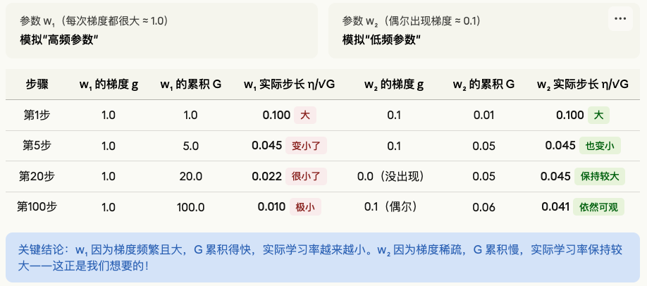
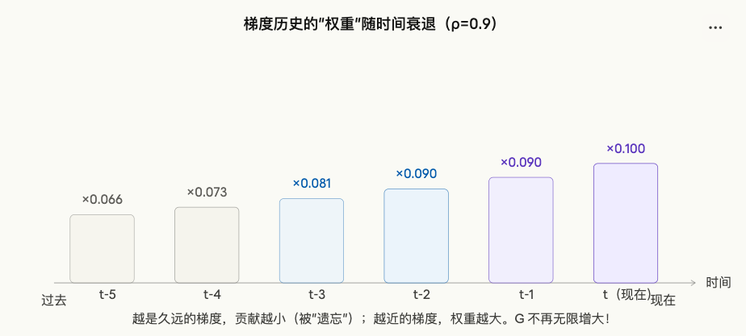
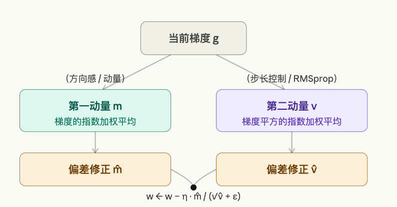
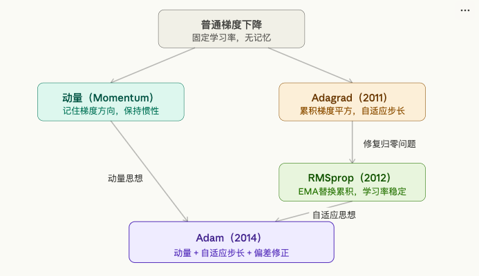

# 自动调整学习率：从 Adagrad 到 Adam 的完整旅程

## 第一章：先把问题搞清楚

在理解这三个算法之前，你必须先理解**它们要解决的问题是什么**。

想象你在训练一个神经网络来识别猫的图片。这个网络里有成千上万个参数（权重），我们把它们简化一下，假设只有两个参数：$w_1$ 和 $w_2$。

训练的目标是：找到让"错误（损失函数）"最小的 $w_1$ 和 $w_2$ 的组合。

这就像你站在一片丘陵地带，想找到最低谷。你每次迈一步，方向是"当前位置最陡的下坡方向"——这就是**梯度下降**。

而**学习率**（learning rate，常写作 $\eta$ 或 lr）决定你每一步迈多大。但问题比"步子大小"更复杂。真实的神经网络里，有这样一个让人头疼的情况：

**不同参数需要完全不同的学习率。**

举个例子：假设你的网络里有两个特征——"图片的亮度"和"图片中是否有胡须"。"亮度"这个特征在每一张图里都有，所以对应参数的梯度每次都很大、很稳定。而"胡须"这个特征只在少数猫的图片中出现，所以对应参数的梯度大部分时候都是 0，偶尔才冒出来一个大值。

如果你用同一个学习率：
- 对"亮度"参数来说，学习率太大 → 震荡
- 对"胡须"参数来说，学习率太小 → 根本学不到东西

这就是"固定学习率"的根本困境。**Adagrad、RMSprop、Adam 这三个算法，本质上都是在解决这同一个问题：让每个参数拥有自己专属的、动态调整的学习率。**

---

## 第二章：Adagrad——最朴素的想法

### 核心直觉："谁跑得多，谁就慢下来"

Adagrad 的设计思路极其简单，用一句话就能说清楚：

> **一个参数历史上更新越多（梯度越大），以后就更新越少（学习率越小）；历史上更新越少，以后就更新越多。**

这就像一群运动员长跑：跑得快的人要让一让，跑得慢的人要追上来，最后大家齐头并进。

### 它是怎么做到的？

Adagrad 给**每个参数**维护一个"历史梯度的累积平方和"，我们叫它 $G$。

每次训练（每一步），对于参数 $w$：

1. 先算出这一步的梯度 $g$（梯度就是损失函数对这个参数的偏导数，告诉我们这个参数应该往哪个方向、以多大力度更新）
2. 把这个梯度的平方加到 $G$ 里：$G \leftarrow G + g^2$
3. 更新参数时，用 $G$ 来压缩学习率：$w \leftarrow w - \dfrac{\eta}{\sqrt{G + \epsilon}} \cdot g$

其中 $\eta$ 是你设置的初始学习率，$\epsilon$ 是一个很小的数（比如 $10^{-8}$），防止分母为零。

### 为什么这样就能自动调整学习率？

来看一个具体例子。假设初始学习率 $\eta = 0.1$：




### Adagrad 的致命缺陷：学习率单调递减，永不回头

Adagrad 有一个根本性的问题：$G$ 是**只增不减**的——每次都往里面加平方值，永远不会减小。

这意味着：随着训练进行，所有参数的实际学习率都会趋近于零，最终**网络停止学习**。

不管这个参数现在的梯度是大是小、需不需要继续更新，它都会被日积月累的历史梯度拖死。

这就好比一个人年轻时犯过错，然后这个错误被永久记录在档案里，无论他后来表现多好，都永远背着这份沉重的历史。

**Adagrad 适用的场景：** 凸优化问题（损失面像碗一样，只有一个最低点），或者训练步骤不太多的情况。对于深度神经网络的长期训练，它几乎不用了。

---

## 第三章：RMSprop——用"遗忘"修复 Adagrad

Hinton（深度学习三巨头之一）在 2012 年的课程中提出了 RMSprop，它的解法非常优雅：

> **不要记住所有历史梯度，让旧的梯度慢慢被遗忘。**

### 核心改动：把"累加"变成"指数加权移动平均"

Adagrad 是这样更新 $G$ 的：$G \leftarrow G + g^2$（直接加）

RMSprop 换了一种方式：$G \leftarrow \rho \cdot G + (1-\rho) \cdot g^2$

这里 $\rho$（读作"肉"，rho）通常取 0.9 左右，叫做**衰减率**（decay rate）。

然后参数更新方式不变：$w \leftarrow w - \dfrac{\eta}{\sqrt{G + \epsilon}} \cdot g$



### $\rho \cdot G + (1-\rho) \cdot g^2$ 到底是什么意思？

这个公式是"指数加权移动平均"（Exponential Moving Average，EMA）。来用一个生活例子理解：

你每天记录自己的体重。但你不想让一次暴饮暴食的数据毁掉整个统计，所以你用这个方式算"平均体重"：

今天的平均体重 = 0.9 × 昨天的平均体重 + 0.1 × 今天的实测体重

这样，昨天的数据在今天权重是 0.9，前天是 $0.9^2=0.81$，大前天是 $0.9^3=0.729$……越久远的数据影响越小，会慢慢被"遗忘"。

对 RMSprop 来说，$G$ 就是"最近梯度平方的加权平均"，它会保持在一个合理的范围内，不会无限增大，也不会因为当前某步梯度突然变小就崩塌。

### RMSprop 解决了什么，还剩什么问题？

RMSprop 修复了 Adagrad 的"学习率归零"问题——$G$ 现在是稳定的移动平均，学习率可以在整个训练过程中保持有效。

但它还有两个遗留问题：
1. **没有"动量"** ——RMSprop 仍然只根据当前梯度方向更新，容易在狭窄的峡谷地形中左右震荡，而不是顺着谷底直冲
2. **初始化偏差** ——训练刚开始时，$G$ 被初始化为 0，前几步的估计不准确

这就引出了 Adam。

---

## 第四章：Adam——把两种思想合为一

Adam 的全名是 **Adaptive Moment Estimation**（自适应矩估计），由 Kingma 和 Ba 在 2014 年提出。

它的天才之处在于把**两个独立的想法**合并在一起：

- **想法一：动量（Momentum）**——记住过去的梯度方向，保持惯性，不要在小坡上频繁改变方向
- **想法二：自适应学习率（来自 RMSprop）**——根据每个参数的历史梯度，动态调整步长



### Adam 的四个步骤（逐步拆解）

**步骤一：计算第一动量 $m$（梯度的移动平均）**

$$m \leftarrow \beta_1 \cdot m + (1 - \beta_1) \cdot g$$

这是梯度本身的 EMA，默认 $\beta_1 = 0.9$。

直觉：$m$ 记录了梯度的"平均方向"。如果连续很多步梯度都指向同一方向，$m$ 就会在那个方向上积累很大的值，像一个滚动的球积累了动量——即使某一步梯度突然反向，也不会立刻把它拉回去。这能让优化路径更平滑，不会在小坑里反复横跳。

**步骤二：计算第二动量 $v$（梯度平方的移动平均）**

$$v \leftarrow \beta_2 \cdot v + (1 - \beta_2) \cdot g^2$$

这和 RMSprop 完全一样，默认 $\beta_2 = 0.999$。

直觉：$v$ 记录了梯度的"平均大小"（准确说是方差）。$v$ 大的参数，说明它的梯度历来较大，应该给它小一点的学习率；$v$ 小的参数，说明梯度一直很小，应该给它大一点的学习率。

**步骤三：偏差修正**

$$\hat{m} = \frac{m}{1 - \beta_1^t}, \quad \hat{v} = \frac{v}{1 - \beta_2^t}$$

这是 Adam 独有的、修复 RMSprop 那个"初始化偏差"问题的设计。来解释一下为什么需要它：

训练开始时，$m$ 和 $v$ 都被初始化为 0。在第一步，即使梯度 $g$ 很大，算出来的 $m = 0.9 \times 0 + 0.1 \times g = 0.1g$，只有真实梯度的 10%！这导致前几步的更新量极小，完全失真。

偏差修正用当前步数 $t$ 来补偿这个偏差。比如第一步时，$1 - \beta_1^1 = 1 - 0.9 = 0.1$，所以 $\hat{m} = m / 0.1 = 10m = g$——完美修正回来了。随着 $t$ 增大，$\beta_1^t \to 0$，修正因子趋近于 1，不再有影响，自然消失。

**步骤四：参数更新**

$$w \leftarrow w - \frac{\eta}{\sqrt{\hat{v}} + \epsilon} \cdot \hat{m}$$

用修正后的第一动量（方向）除以修正后第二动量的平方根（步长控制），再乘以全局学习率 $\eta$。

### 用一个比喻把 Adam 彻底理解

想象你在大雾中的山上下山，要找到最低点：

**普通梯度下降**：每次重新看脚下的坡度，完全按当前坡度的方向和陡度走，没有记忆。

**加了动量（Momentum）的梯度下降**：你带着一个购物车，车有惯性。即使遇到小的坑洼（局部噪声），惯性会让你继续沿着大方向走，不会被每一个小颠簸搞乱。

**RMSprop**：你有一张特殊的地图，告诉你不同方向的"平均坡度有多陡"。很陡的方向你走小步，很平缓的方向你走大步。

**Adam**：你既有购物车（动量，让你方向稳定），也有那张特殊地图（自适应步长，让你在平坦处加速，在陡峭处减速），还有偏差修正（保证一开始就校准好，不走冤枉路）。这就是为什么 Adam 是目前最常用的优化器。

---

## 第五章：一个可以亲手玩的演示

下面这个交互演示让你直观地看到三种算法在同一个损失函数地形上的轨迹差异：你可以调节"全局学习率"和"训练步数"，观察四种算法的路径差异。红星是全局最优点。试着把学习率调大，看哪些算法开始震荡？再试着把步数调多，看哪个算法最先逼近最优点。

[动画演示：Adam/RMSprop/普通梯度下降/Adagrad在同一个损失函数底向上的轨迹差异](8.1.10根据状态自动调整学习率的方式对比动画.html)

---

## 第六章：三者的完整对比

| 维度 | Adagrad | RMSprop | Adam |
|------|---------|---------|------|
| **发明时间** | 2011年 | 2012年（Hinton课程） | 2014年（Kingma & Ba） |
| **关键变量** | G（梯度平方累积和） | v（梯度平方EMA） | m（梯度EMA）+ v（梯度平方EMA） |
| **有动量？** | ❌ 没有 | ❌ 没有 | ✅ 有（第一动量） |
| **自适应学习率？** | ✅ 有 | ✅ 有 | ✅ 有（第二动量） |
| **学习率会归零？** | ⚠️ 会（G只增不减） | ✅ 不会（EMA稳定） | ✅ 不会 |
| **偏差修正？** | ❌ 没有 | ❌ 没有 | ✅ 有 |
| **默认超参数** | η=0.01 | ρ=0.9, η=0.001 | β₁=0.9, β₂=0.999, ε=1e-8, η=0.001 |
| **优点** | 稀疏数据效果好；实现简单 | 解决Adagrad归零问题；训练稳定 | 综合性能最强；对超参数不敏感；初始阶段收敛快 |
| **缺点** | 学习率单调递减；不适合长期训练 | 没有动量，可能震荡 | 有时泛化性能略差于SGD+动量；超参数稍多 |
| **适用场景** | NLP词向量训练、稀疏特征场景 | RNN、循环网络训练 | 绝大多数深度学习任务（默认首选） |

## 第七章：用最简单的 Python 代码把公式变成现实

有时候，把公式手写一遍是最好的理解方式。下面是三个算法最核心的实现（不依赖任何框架，纯 Python）：

```python
import numpy as np

# 假设我们有一个简单的损失函数：f(w) = (w - 3)^2
# 最优解是 w = 3，我们从 w = 0 开始，用梯度下降找到它
# 梯度是：df/dw = 2*(w - 3)

def gradient(w):
    return 2 * (w - 3)

# ========================
# Adagrad
# ========================
w = 0.0          # 初始值
lr = 0.5         # 学习率
G = 0.0          # 历史梯度平方累积和
eps = 1e-8

print("=== Adagrad ===")
for step in range(1, 11):
    g = gradient(w)       # 计算梯度
    G = G + g**2          # 更新 G（只增不减！）
    w = w - lr / (G**0.5 + eps) * g  # 更新参数
    print(f"步骤{step}: w={w:.4f}, G={G:.4f}, 实际lr={lr/(G**0.5+eps):.4f}")

# ========================
# RMSprop
# ========================
w = 0.0
lr = 0.1
v = 0.0          # 梯度平方的移动平均（不是累积！）
rho = 0.9        # 衰减率

print("\n=== RMSprop ===")
for step in range(1, 11):
    g = gradient(w)
    v = rho * v + (1 - rho) * g**2   # EMA，v 不会无限增大
    w = w - lr / (v**0.5 + eps) * g
    print(f"步骤{step}: w={w:.4f}, v={v:.4f}, 实际lr={lr/(v**0.5+eps):.4f}")

# ========================
# Adam
# ========================
w = 0.0
lr = 0.1
m = 0.0          # 第一动量（梯度的EMA）
v = 0.0          # 第二动量（梯度平方的EMA）
beta1 = 0.9
beta2 = 0.999

print("\n=== Adam ===")
for step in range(1, 11):
    g = gradient(w)
    m = beta1 * m + (1 - beta1) * g          # 更新第一动量
    v = beta2 * v + (1 - beta2) * g**2        # 更新第二动量
    m_hat = m / (1 - beta1**step)             # 偏差修正
    v_hat = v / (1 - beta2**step)             # 偏差修正
    w = w - lr / (v_hat**0.5 + eps) * m_hat  # 更新参数
    print(f"步骤{step}: w={w:.4f}, m̂={m_hat:.4f}, v̂={v_hat:.4f}")
```

运行这段代码，你会看到三件事：
- Adagrad 的 G 越来越大，实际学习率越来越小，最终会停
- RMSprop 的 v 保持稳定
- Adam 的偏差修正在第一步显著放大了 m 和 v（从几乎为 0 纠正到合理范围）

---

## 第八章：一张图，看清整个"家族树"



## 第九章：学完这些，你需要记住的几件事

**1. 为什么需要自适应学习率？** 不同参数的梯度差异极大（有的频繁且大，有的稀疏且小），用一个固定学习率对所有参数一视同仁，必然顾此失彼。

**2. Adagrad 做了什么？** 给每个参数单独维护一个"梯度平方的历史累积和 G"，用它来压缩学习率。梯度越大的参数，学习率被压缩得越厉害。但 G 只会增大，导致学习率最终归零。

**3. RMSprop 修复了什么？** 把 Adagrad 的"无限累积"改成"指数加权移动平均"——旧的梯度会慢慢被遗忘，G 保持在稳定范围，学习率不再归零。

**4. Adam 加了什么？** 在 RMSprop 的基础上，额外引入了第一动量（梯度本身的 EMA），让更新方向带有惯性，同时加入了偏差修正让训练一开始就准确。Adam = 动量 + RMSprop + 偏差修正。

**5. 实际用哪个？** 绝大多数情况直接用 Adam，超参数用默认值（`lr=0.001, β₁=0.9, β₂=0.999`）就够了。在 PyTorch 里写一行：`optimizer = torch.optim.Adam(model.parameters(), lr=1e-3)`。

---

这三个算法的演化路径其实体现了科学研究中最常见的模式：先提出一个朴素有效的想法（Adagrad），发现它的局限性，针对性修复（RMSprop），然后把两个独立方向的精华融合在一起，加上工程上的小修正（Adam）。你现在理解的，不只是三个公式，而是一段思想演进的历史。